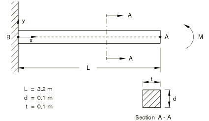
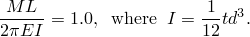
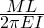
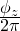

# 4.6.5 NL5: Straight cantilever with end moment

**Product: **Abaqus/Standard  

### Element tested

B22

### Problem description

**Material: **

Linear elastic, Young's modulus = 210 GPa, Poisson's ratio = 0.0.

**Boundary conditions: **

 = 0 at point B.

**Loading: **

A concentrated moment at point A applied in increments up to a maximum value of 

### Reference solution

This is a test recommended by the National Agency for Finite Element Methods and Standards (U.K.): Test NL5 from NAFEMS Publication NNB, Rev. 1, “NAFEMS Non-Linear Benchmarks,” October 1989.

|  | Deformation at A |
| --- | --- |
|  |  |  |
| 0.5 | 1.000 | 0.637 | 0.500 |
| 1.0 | 1.000 | 0.000 | 1.000 |

### Results and discussion

The results are shown in the following table. The values enclosed in parentheses are percentage differences with respect to the reference solution.

|  | Deformation at A |
| --- | --- |
|  |  |  |
| 0.5 | 1.000 (0.0%) | 0.637 (0.0%) | 0.500 (0.0%) |
| 1.0 | 1.000 (0.0%) | 2.0 107 | 1.000 (0.0%) |

### Input file

[nnl5x22x.inp](../eif/nnl5x22x.inp)

B22 elements.

