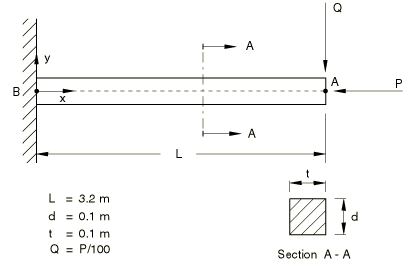
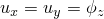
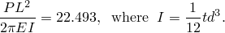
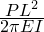
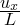
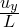
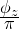
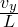

# 4.6.6 NL6: Straight cantilever with axial end point load

**Product: **Abaqus/Standard  

### Element tested

B22

### Problem description

**Material: **

Linear elastic, Young's modulus = 210 GPa, Poisson's ratio = 0.0.

**Boundary conditions: **

 = 0 at point B.

**Loading: **

A concentrated load at point A applied in increments up to a maximum value of 

### Reference solution

This is a test recommended by the National Agency for Finite Element Methods and Standards (U.K.): Test NL6 from NAFEMS Publication NNB, Rev. 1, “NAFEMS Non-Linear Benchmarks,” October 1989.

|  | Deformation at A |
| --- | --- |
|  |  |  |
| 3.190 | 0.440 | 0.719 | 0.444 |
| 22.493 | 1.577 | 0.421 | 0.978 |

### Results and discussion

The results are shown in the following table. The values enclosed in parentheses are percentage differences with respect to the reference solution.

|  | Deformation at A |
| --- | --- |
|  |  |  |
| 3.190 | 0.447 (+1.59%) | 0.723 (+0.56%) | 0.448 (+0.90%) |
| 22.493 | 1.577 (0.0%) | 0.427 (+1.43%) | 0.975 (0.31%) |

### Input file

[nnl6x22x.inp](../eif/nnl6x22x.inp)

B22 elements.

