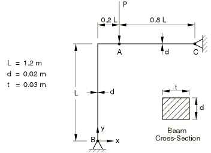
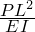

# 4.6.7 NL7: Lee's frame buckling problem

**Product: **Abaqus/Standard  

### Element tested

B22

### Problem description

**Material: **

Linear elastic, Young's modulus = 71.74 GPa, Poisson's ratio = 0.0.

**Boundary conditions: **

 0 at points B and C.

**Loading: **

A concentrated load is applied incrementally at point A using the RIKS algorithm.

### Reference solution

This is a test recommended by the National Agency for Finite Element Methods and Standards (U.K.): Test NL7 from NAFEMS Publication NNB, Rev. 1, “NAFEMS Non-Linear Benchmarks,” October 1989.

|  | Deformation at A |
| --- | --- |
|  |
| 18.552 | 0.407 |
| 31.887 | 0.784 |

### Results and discussion

The RIKS algorithm was used for this problem. In this case it is not possible to obtain the solution at particular values of load or displacement. The values shown below were interpolated from the two nearest points available. There may be some error associated with the interpolation procedure. The values enclosed in parentheses are percentage differences with respect to the reference solution.

|  | Deformation at A |
| --- | --- |
|  |
| 18.542 (0.05%) | 0.407 (0.0%) |
| 31.887 | 0.781 (0.38%) |

### Input file

[nnl7x22x.inp](../eif/nnl7x22x.inp)

B22 elements.

