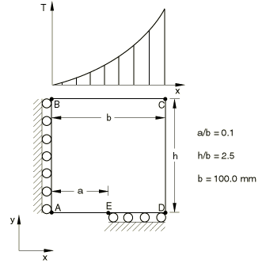
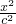
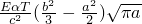
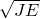

# 4.7.2 Test 1.2: Center cracked plate with thermal load

**Product: **Abaqus/Standard  

### Elements tested

CPS8    CPS8R    

### Problem description

**Mesh: **

Collapsed elements with 1/4 point midside nodes are used at the crack tip. One-quarter of the test geometry is modeled.

**Material: **

Young's modulus = 207 GPa, Poisson's ratio = 0.3, thermal expansion coefficent = 1.35E5.

**Boundary conditions: **

 along edge AB,  along edge DE.

**Loading: **

Quadratic thermal distribution T = T0 = 0.01*x*2, where T0 = 100, c = 100.

### Reference solution

This is a test recommended by the National Agency for Finite Element Methods and Standards (U.K.): Test 1.2 from NAFEMS publication “2D Test Cases in Linear Elastic Fracture Mechanics,” R0020.

Target solution: K/K = 1.000, K = 

### Results and discussion

The results are shown in the following table. The values enclosed in parentheses are percentage differences with respect to the reference solution.

| Element Type | K/K |
| --- | --- |
| CPS8 | 1.003 (+0.3%) |
| CPS8R | 1.005 (+0.5%) |

### Remarks

K = . An average of the *J* values calculated by Abaqus, excluding the first contour, is used in reporting the results. Experience has shown that the crack-tip elements do not give sufficiently accurate results to give good estimates of the *J*-integral for the first contour. The thermal loading is applied with user subroutine [`UTEMP`](../sub/sub-link.md#sub-xsl-utemp). 

### Input files

[nlf12f8x.inp](../eif/nlf12f8x.inp)

CPS8 elements.

[nlf12f8x.f](../eif/nlf12f8x.f)

User subroutine [`UTEMP`](../sub/sub-link.md#sub-xsl-utemp) used in nlf12f8x.inp.

[nlf12r8x.inp](../eif/nlf12r8x.inp)

CPS8R elements.

[nlf12r8x.f](../eif/nlf12r8x.f)

User subroutine [`UTEMP`](../sub/sub-link.md#sub-xsl-utemp) used in nlf12r8x.inp.

