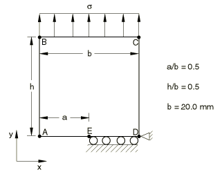

# 4.7.3 Test 2.1: Single edge cracked plate in tension

**Product: **Abaqus/Standard  

### Elements tested

CPE8    CPE8R    

### Problem description

**Mesh: **

Collapsed elements with 1/4 point midside nodes are used at the crack tip. Half of the test geometry is modeled. A coarse and a fine mesh are tested.

**Material: **

Young's modulus = 207 GPa, Poisson's ratio = 0.3.

**Boundary conditions: **

 along edge ED,  at point D.

**Loading: **

Uniform stress,  = 100 N/mm2.

### Reference solution

This is a test recommended by the National Agency for Finite Element Methods and Standards (U.K.): Test 2.1 from NAFEMS publication “2D Test Cases in Linear Elastic Fracture Mechanics,” R0020. 

Target solution: K/K = 3.0, K = 

### Results and discussion

The results are shown in the following table. The values enclosed in parentheses are percentage differences with respect to the reference solution.

| Element Type | Coarse Mesh | Fine Mesh |
| --- | --- | --- |
| CPE8 | 2.911 (2.95%) | 3.007 (+0.25%) |
| CPE8R | 2.938 (2.08%) | 3.008 (+0.26%) |

### Remarks

K = . An average of the *J* values calculated by Abaqus, excluding the first contour, is used in reporting the results. Experience has shown that the crack-tip elements do not give sufficiently accurate results to give good estimates of the *J*-integral for the first contour.

### Input files

[nlf21f8c.inp](../eif/nlf21f8c.inp)

CPE8 elements, coarse mesh.

[nlf21f8f.inp](../eif/nlf21f8f.inp)

CPE8 elements, fine mesh.

[nlf21r8c.inp](../eif/nlf21r8c.inp)

CPE8R elements, coarse mesh.

[nlf21r8f.inp](../eif/nlf21r8f.inp)

CPE8R elements, fine mesh.

