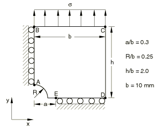
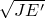
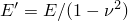

# 4.7.5 Test 4: Cracks at a hole in a plate

**Product: **Abaqus/Standard  

### Elements tested

CPE8    CPE8R    CPS8    CPS8R    

### Problem description

**Mesh: **

Collapsed elements with 1/4 point midside nodes are used at the crack tip. One-quarter of the test geometry is modeled.

**Material: **

Young's modulus = 207 GPa, Poisson's ratio = 0.3

**Boundary conditions: **

 along edge AB,  along edge ED.

**Loading: **

Uniform stress,  = 100 N/mm2.

### Reference solution

This is a test recommended by the National Agency for Finite Element Methods and Standards (U.K.): Test 4.1 and 4.2 from NAFEMS publication “2D Test Cases in Linear Elastic Fracture Mechanics,” R0020.

Target solution: K/K = 1.050, K = 

### Results and discussion

The results are shown in the following table. The values enclosed in parentheses are percentage differences with respect to the reference solution.

| Element Type | K/K |
| --- | --- |
| CPE8 | 1.060 (+0.9%) |
| CPE8R | 1.059 (+0.8%) |
| CPS8 | 1.060 (+1.0%) |
| CPS8R | 1.059 (+0.8%) |

### Remarks

K = .  for plane stress,  for plane strain. An average of the *J* values calculated by Abaqus, excluding the first contour, is used in reporting the results. Experience has shown that the crack-tip elements do not give sufficiently accurate results to give good estimates of the *J*-integral for the first contour.

### Input files

[nlf41f8x.inp](../eif/nlf41f8x.inp)

CPE8 elements.

[nlf41r8x.inp](../eif/nlf41r8x.inp)

CPE8R elements.

[nlf42f8x.inp](../eif/nlf42f8x.inp)

CPS8 elements.

[nlf42r8x.inp](../eif/nlf42r8x.inp)

CPS8R elements.

