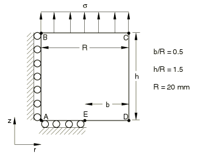
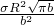

# 4.7.6 Test 5: Axisymmetric crack in a bar

**Product: **Abaqus/Standard  

### Elements tested

CAX8    CAX8R    

### Problem description

**Mesh: **

Collapsed elements with 1/4 point midside nodes are used at the crack tip. Half of the axisymmetric test geometry is modeled.

**Material: **

Young's modulus = 207 GPa, Poisson's ratio = 0.3.

**Boundary conditions: **

 along edge AB,  along edge AE.

**Loading: **

Uniform stress,  = 100 N/mm2.

### Reference solution

This is a test recommended by the National Agency for Finite Element Methods and Standards (U.K.): Test 5 from NAFEMS publication “2D Test Cases in Linear Elastic Fracture Mechanics,” R0020.

Target solution: K/K = 0.475, K = 

### Results and discussion

The results are shown in the following table. The values enclosed in parentheses are percentage differences with respect to the reference solution.

| Element Type | K/K |
| --- | --- |
| CAX8 | 0.484 (+1.87%) |
| CAX8R | 0.485 (+2.06%) |

### Remarks

K = . An average of the *J* values calculated by Abaqus, excluding the first contour, is used in reporting the results. Experience has shown that the crack-tip elements do not give sufficiently accurate results to give good estimates of the *J*-integral for the first contour.

### Input files

[nlf5xf8x.inp](../eif/nlf5xf8x.inp)

CAX8 elements.

[nlf5xr8x.inp](../eif/nlf5xr8x.inp)

CAX8R elements.

