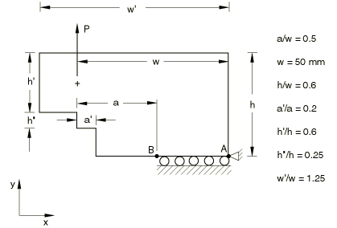
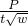

# 4.7.7 Test 6: Compact tension specimen

**Product: **Abaqus/Standard  

### Elements tested

CPE8    CPE8R    

### Problem description

**Mesh: **

Collapsed elements with 1/4 point midside nodes are used at the crack tip. Half of the test geometry is modeled.

**Material: **

Young's modulus = 207 GPa, Poisson's ratio = 0.3.

**Boundary conditions: **

 at point A,  along edge BA.

**Loading: **

Concentrated force, P = 1000 N.

### Reference solution

This is a test recommended by the National Agency for Finite Element Methods and Standards (U.K.): Test 6 from NAFEMS publication “2D Test Cases in Linear Elastic Fracture Mechanics,” R0020.

Target solution: K/K = 9.659, K0 = 

### Results and discussion

The results are shown in the following table. The values enclosed in parentheses are percentage differences with respect to the reference solution.

| Element Type | K/K |
| --- | --- |
| CPE8 | 9.572 (0.9%) |
| CPE8R | 9.639 (0.2%) |

### Remarks

K = . An average of the *J* values calculated by Abaqus, excluding the first contour, is used in reporting the results. Experience has shown that the crack-tip elements do not give sufficiently accurate results to give good estimates of the *J*-integral for the first contour.

### Input files

[nlf6xf8x.inp](../eif/nlf6xf8x.inp)

CPE8 elements.

[nlf6xr8x.inp](../eif/nlf6xr8x.inp)

CPE8R elements.

