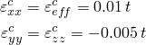
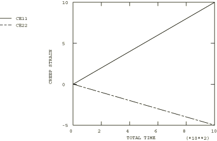

# 4.8.1 Test 1A: 2D plane stress – uniaxial load, secondary creep

### 4.8.1 Test 1A: 2D plane stress -- uniaxial load, secondary creep

**Product: **Abaqus/Standard  

### Elements tested

CPS8R    CPS6    CPS6M    

### Problem description

**Material: **

Young's modulus = 200  103 N/mm2, Poisson's ratio = 0.3, Creep law:  = A, A = 3.125  1014 per hour ( in N/mm2), *n* = 5.

**Boundary conditions: **

 on line AD and  at midpoint of line AD.

**Loading: **

Prescribed tensile stress  = 200 N/mm2 on line BC.

### Reference solution

This is a test recommended by the National Agency for Finite Element Methods and Standards (U.K.): Test 1(a) from NAFEMS Publication Ref: R0027, “NAFEMS Fundamental Tests of Creep Behaviour,” June 1993.

### Results and discussion

The results are shown in the following table. The values enclosed in parentheses are percentage differences with respect to the reference solution.

| Abaqus Results |
| --- |
| *t* |  |  |
| 0.00 | 0.000 (0.00%) | 0.000 (0.00%) |
| 0.52 | 0.005 (0.00%) | 0.003 (0.00%) |
| 8.39 | 0.084 (0.00%) | 0.042 (0.00%) |
| 33.55 | 0.336 (0.00%) | 0.168 (0.00%) |
| 134.22 | 1.342 (0.00% ) | 0.671 (0.00%) |
| 536.87 | 5.369 (0.00%) | 2.684 (0.00%) |
| 1000.00 | 10.000 (0.00%) | 5.000 (0.00%) |

### Remarks

The total creep time for this test is 1000 hours. The times listed in the above table are the times calculated by the Abaqus automatic time stepping algorithm with CETOL = 5.  103.

### Input files

[ncr1ar8x.inp](../eif/ncr1ar8x.inp)

CPS8R elements.

[ncr1ar6x.inp](../eif/ncr1ar6x.inp)

CPS6 elements.

[ncr1ar6m.inp](../eif/ncr1ar6m.inp)

CPS6M elements.

