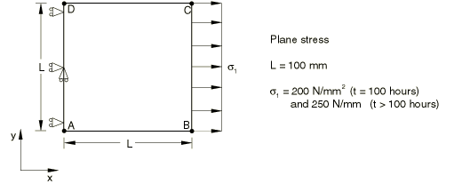
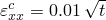
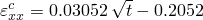
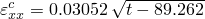
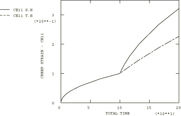

# 4.8.17 Test 8C: 2D plane stress – stepped load, primary creep

### 4.8.17 Test 8C: 2D plane stress -- stepped load, primary creep

**Product: **Abaqus/Standard  

### Element tested

CPS8R

### Problem description

**Material: **

Young's modulus = 200  103 N/mm2, Poisson's ratio = 0.3, Creep law:  = A, A = 3.125  1014 per hour ( in N/mm2), *n* = 5, *m* = 0.5.

**Boundary conditions: **

 on line AD and  at mid-point of line AD.

**Loading: **

 = 200 N/mm2 for  100 hours and  = 250 N/mm2 for  100 hours.

### Reference solution

This is a test recommended by the National Agency for Finite Element Methods and Standards (U.K.): Test 8(c) from NAFEMS Publication Ref: R0027, “NAFEMS Fundamental Tests of Creep Behaviour,” June 1993.

|  |  | for  100 hours |
| --- | --- | --- |
| Time hardening: |  | for  100 hours |
| Strain hardening: |  | for  100 hours |

### Results and discussion

The results are shown in the following table. The values enclosed in parentheses are percentage differences with respect to the reference solution.

| Abaqus Results |
| --- |
| Time Hardening | Strain Hardening |
| *t* |  | *t* |  |
| 0.00 | 0.0000 (0.00%) | 0.00 | 0.0000 (0.00%) |
| 0.54 | 0.0073 (0.14%) | 0.54 | 0.0073 (0.01%) |
| 8.22 | 0.0287 (0.03%) | 8.22 | 0.0287 (0.00%) |
| 65.57 | 0.0810 (0.01%) | 65.56 | 0.0810 (0.00%) |
| 116.39 | 0.1240 (0.02%) | 116.45 | 0.1591 (0.01%) |
| 165.54 | 0.1875 (0.01%) | 165.60 | 0.2666 (0.01%) |
| 200.00 | 0.2264 (0.00%) | 200.00 | 0.3211 (0.01%) |

### Remarks

The total creep time for this test is 200 hours. The times listed in the above table are the times calculated by the Abaqus automatic time stepping algorithm with CETOL = 5.  103.

### Input files

[ncr8cr8t.inp](../eif/ncr8cr8t.inp)

Time hardening.

[ncr8cr8s.inp](../eif/ncr8cr8s.inp)

Strain hardening.

