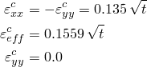
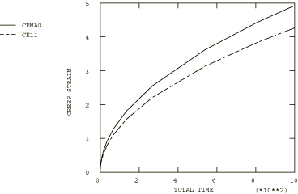

# 4.8.21 Test 10A: 2D plane stress – biaxial (negative) load, primary creep

### 4.8.21 Test 10A: 2D plane stress -- biaxial (negative) load, primary creep

**Product: **Abaqus/Standard  

### Element tested

CPS8R

### Problem description

**Material: **

Young's modulus = 200  103 N/mm2, Poisson's ratio = 0.3, Creep law:  = A, A = 3.125  1014 per hour ( in N/mm2), *n* = 5, *m* = 0.5.

**Boundary conditions: **

 on line AD and  on line AB.

**Loading: **

Prescribed tensile stress  = 200 N/mm2 on line BC and  200 N/mm2 on line CD.

### Reference solution

This is a test recommended by the National Agency for Finite Element Methods and Standards (U.K.): Test 10(a) from NAFEMS Publication Ref: R0027, “NAFEMS Fundamental Tests of Creep Behaviour,” June 1993.

### Results and discussion

The results are shown in the following table. The values enclosed in parentheses are percentage differences with respect to the reference solution.

| Abaqus Results |
| --- |
| *t* |  |  |
| 0.00 | 0.0000 (0.00%) | 0.0000 (0.00%) |
| 1.05 | 0.1381 (0.07%) | 0.1595 (0.08%) |
| 16.78 | 0.5528(0.03%) | 0.6384 (0.04%) |
| 134.22 | 1.5639 (0.01%) | 1.8058 (0.02%) |
| 268.44 | 2.2117 (0.01%) | 2.5539 (0.02%) |
| 536.87 | 3.1279 (0.00%) | 3.612 (0.01%) |
| 1000.00 | 4.2689 (0.00%) | 4.9293 (0.01%) |

### Remarks

The total creep time for this test is 1000 hours. The times listed in the above table are the times calculated by the Abaqus automatic time stepping algorithm with CETOL = 5.  103.

### Input file

[ncraar8x.inp](../eif/ncraar8x.inp)

CPS8R elements.

