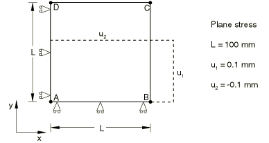
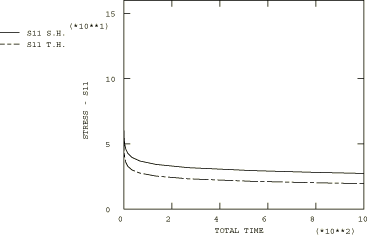

# 4.8.22 Test 10B: 2D plane stress – biaxial (negative) displacement, primary creep

### 4.8.22 Test 10B: 2D plane stress -- biaxial (negative) displacement, primary creep

**Product: **Abaqus/Standard  

### Element tested

CPS8R

### Problem description

**Material: **

Young's modulus = 200  103 N/mm2, Poisson's ratio = 0.3, Creep law:  = A, A = 3.125  1014 per hour ( in N/mm2), *n* = 5, *m* = 0.5.

**Boundary conditions: **

 on line AD,  on line AB,  on line BC and  on line CD. 

### Reference solution

This is a test recommended by the National Agency for Finite Element Methods and Standards (U.K.): Test 10(b) from NAFEMS Publication Ref: R0027, “NAFEMS Fundamental Tests of Creep Behaviour,” June 1993.

The time marching program provided in Appendix B of the NAFEMS Publication can be used to obtain the stress variation with time.

### Results and discussion

The results are shown in the following table. The values enclosed in parentheses are percentage differences with respect to the reference solution.

| Abaqus Results |
| --- |
| Time Hardening | Strain Hardening |
| *t* |  | *t* |  |
| 0.00 | 153.80 (0.00%) | 0.00 | 153.80 (0.00%) |
| 0.52 | 50.23 (1.34%) | 0.52 | 61.08 (1.60%) |
| 8.39 | 35.71 (6.45%) | 8.39 | 45.89 (4.80%) |
| 33.55 | 30.07 (3.21%) | 33.55 | 39.65 (2.30%) |
| 268.44 | 23.20 (2.80%) | 268.44 | 31.77 (1.85%) |
| 536.87 | 21.28 (6.99%) | 536.87 | 28.10 (5.61%) |
| 1000.00 | 19.55 (6.60%) | 1000.00 | 27.34 (4.75%) |

### Remarks

The total creep time for this test is 1000 hours. The times listed in the above table are the times calculated by the Abaqus automatic time stepping algorithm with CETOL = 5.  103.

### Input files

[ncrabr8t.inp](../eif/ncrabr8t.inp)

Time hardening.

[ncrabr8s.inp](../eif/ncrabr8s.inp)

Strain hardening.

