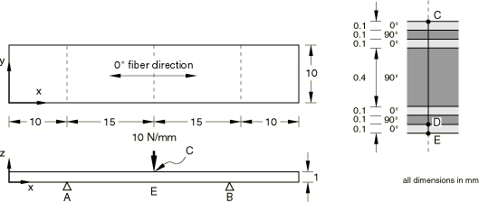
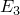
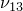
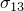

# 4.9.1 R0031(1): Laminated strip under three-point bending

**Products: **Abaqus/Standard  Abaqus/Explicit  

### Elements tested

C3D8R    C3D20    S4R    S8R    SC6R    SC8R    

### Problem description

**Mesh: **

One-quarter of the laminated strip is modeled. The same problem is analyzed with different meshes. Meshes using linear solids and shells consist of ten elements along the length and two elements along the breadth. Meshes using quadratic solids and general-purpose shells consist of five elements along the length and one element along the breadth.

Various modeling options are used to model the laminated strip through the thickness. In Abaqus/Standard the laminated solid model (using C3D20 elements) consists of two four-layer elements through the thickness, and the stacked solid model consists of seven single-layer elements through the thickness.  In Abaqus/Explicit the solid model (using C3D8R elements) consists of fourteen elements through the thickness. The models using S4R and S8R shells use a composite section definition. The models using SC6R and SC8R continuum shells employ three different techniques: (1) a single element using a composite section, (2) seven single-layer elements stacked through the thickness, and (3) two composite elements representing the skin and one single-layer element representing the core stacked through the thickness.

**Material: **

 = 100 GPa,  = 5 GPa,  = 5 GPa,  = 0.4,  = 0.3,  = 0.3,  = 3 GPa,  = 2 GPa,  = 2 GPa

**Boundary conditions: **

Simply supported at A and B. The continuum shell meshes use an equation constraint to provide an equivalent kinematic constraint at the midsurface along A and B.

**Loading: **

Line load of 10 N/mm at C (*x* = 25, *z* = 1).

### Reference solution

This is a test recommended by the National Agency for Finite Element Methods and Standards (U.K.): Test R0031/1 from NAFEMS publication R0031, “Composites Benchmarks,” February 1995.

### Results and discussion

The results are given in [Table 4.9.1--1](ch04s09anf81.md#table-r00311-std) and [Table 4.9.1--2](ch04s09anf81.md#table-r00311-exp). The values enclosed in parentheses are percentage differences with respect to the reference solution. Two values for transverse shear stress ( at point D) are reported for the layered and stacked Abaqus/Standard solid models and for the Abaqus/Explicit solid model. The values are for stresses at the two coincident section points in the layers adjacent to point D.

**Table 4.9.1–1** Abaqus/Standard analysis.
| Model |  at E |  at D |  at E |
| --- | --- | --- | --- |
| NAFEMS | 684 | 4.1 | 1.06 |
| Composite S8R | 681 (0.4%) | 4.08 (+0.5%) | 1.06 (0%) |
| Composite C3D20 | 708 (+3.5%) | 7.10 (73%) | 1.157 (+9.2%) |
|  |  | at sect. pt. 3 |  |
|  |  | 0.44 (+111%) |  |
|  |  | at sect. pt. 4 |  |
| Stacked C3D20 | 707 (+3.4%) | 4.42 (7.8%) | 1.10 (+3.7%) |
|  |  | at elem. 9 |  |
|  |  | 0.56 (+86%) |  |
|  |  | at elem. 2009 |  |
| Composite SC6R | 630 (--7.9%) | --4.28 (4.4%) | --1.05 (0.9%) |
| Stacked SC6R | 630 (7.9%) | not available | --1.04 (1.9%) |
| Stacked-composite SC6R | 628 (8.2%) | --5.58 (36.1%) | --1.07 (+0.9%) |
| Composite SC8R | 627 (8.3%) | --4.33 (5.5%) | --1.05 (0.9%) |
| Stacked SC8R | 635 (7.2%) | not available | --1.04 (1.9%) |
| Stacked-composite SC8R | 632 (7.6%) | --5.15 (25.6%) | --1.07 (+0.9%) |

**Table 4.9.1–2** Abaqus/Explicit analysis.
| Model |  at E |  at D |  at E |
| --- | --- | --- | --- |
| NAFEMS | 684 | --4.1 | --1.06 |
| Composite S4R | 623.5 (8.8%) | 4.02 (2.0%) | 1.11 (4.7%) |
| Stacked C3D8R | 596.7 (12.7%) | 2.39 (+41.7%) | 1.04 (+1.6%) |
|  |  | at elem. 1019 |  |
|  |  | .57 (+86.2%) |  |
|  |  | at elem. 2019 |  |
| Composite SC8R | 637.5 (6.8%) | not available | --1.05 (1.0%) |

### Remarks

The results show that the transverse shear stress obtained with the three solid element models is discontinuous at point D. In addition, the transverse shear stresses for the solid elements do not vanish at the free surfaces of the structure because they are obtained directly from the displacement field; in the shell element models the transverse shear stresses are obtained from an equilibrium calculation (see ["Transverse shear stiffness in composite shells and offsets from the midsurface," Section 3.6.8 of the Abaqus Theory Guide](../stm/stm-link.md#stm-elm-transshearshells)). As the number of solid elements used in the discretization through the section thickness is increased, the transverse shear stresses become more accurate.

The displacement field and components of stress in the plane of the layer are in good agreement with the reference result.

### Input files

##### **Abaqus/Standard input files**

[nco1s8rx.inp](../eif/nco1s8rx.inp)

Composite model using S8R elements.

[nco1clay.inp](../eif/nco1clay.inp)

Composite model using C3D20 elements.

[nco1csta.inp](../eif/nco1csta.inp)

Stacked model using C3D20 elements.

[r311_std_sc6r_composite.inp](../eif/r311_std_sc6r_composite.inp)

Composite model using SC6R elements.

[r311_std_sc6r_stacked.inp](../eif/r311_std_sc6r_stacked.inp)

Stacked model using SC6R elements.

[r311_std_sc6r_stacked_composite.inp](../eif/r311_std_sc6r_stacked_composite.inp)

Stacked-composite model using SC6R elements.

[r311_std_sc8r_composite.inp](../eif/r311_std_sc8r_composite.inp)

Composite model using SC8R elements.

[r311_std_sc8r_stacked.inp](../eif/r311_std_sc8r_stacked.inp)

Stacked model using SC8R elements.

[r311_std_sc8r_stacked_composite.inp](../eif/r311_std_sc8r_stacked_composite.inp)

Stacked-composite model using SC8R elements.

##### **Abaqus/Explicit input files**

[r311shl.inp](../eif/r311shl.inp)

Composite model using S4R elements.

[r311sol.inp](../eif/r311sol.inp)

Composite model using C3D8R elements.

[r311_xpl_sc8r_stacked.inp](../eif/r311_xpl_sc8r_stacked.inp)

Stacked model using SC8R elements.

