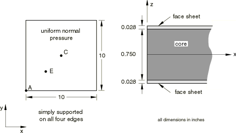

# 4.9.3 R0031(3): Three-layer sandwich shell under normal pressure loading

**Products: **Abaqus/Standard  Abaqus/Explicit  

### Elements tested

S4R    S8R    SC6R    SC8R    

### Problem description

**Mesh: **

One-quarter model with a 4  4 mesh of composite S8R elements in Abaqus/Standard, an 8  8 mesh of composite S4R elements in Abaqus/Explicit, and an 8  8 mesh of continuum shell elements in Abaqus/Standard. Two types of continuum shell models are provided: (1) a single composite element and (2) three single-layer elements stacked in the thickness direction.

**Material: **

Face sheets:  = 1.0  107 psi,  = 4.0  106 psi,  = 0.3,  = 1.875  106 psi,  = 1.875  106 psi,  = 1.875  106 psi

Core:  = 10.0 psi,  = 10.0 psi,  = 0,  = 10.0 psi,  = 3.0E4 psi,  = 1.2E4 psi. The thickness moduli in continuum shell models are chosen sufficiently high to avoid pinching effects, which are neglected in the analytical solution.

**Boundary conditions: **

Simply supported on all four edges. The continuum shell models use an equation constraint to provide an equivalent midsurface constraint.

**Loading: **

Uniform normal pressure of 100 psi.

### Reference solution

This is a test recommended by the National Agency for Finite Element Methods and Standards (U.K.): Test R0031/3 from NAFEMS publication R0031, “Composites Benchmarks,” February 1995.

### Results and discussion

The results are given in [Table 4.9.3--1](ch04s09anf83.md#table-r00313-std) and [Table 4.9.3--2](ch04s09anf83.md#table-r00313-exp). The values enclosed in parentheses are percentage differences with respect to the reference solution. The displacements reported for the stacked continuum shell model are the average displacements of the bottom and top skins.

**Table 4.9.3–1** Abaqus/Standard analysis.
| Model |  at C |  at C |  at C |  at E |
| --- | --- | --- | --- | --- |
| NAFEMS | 0.123 | 34449 | 13350 | 5068 |
| S8R | 0.122 (0.6%) | 35307 (2.5%) | 13802 (3.4%) | 5236 (3.3%) |
| Composite SC6R | --0.120 (--2.4%) | 34687 (0.7%) | 13675 (1.8%) | --5132 (2.5%) |
| Stacked SC6R | --0.129 (4.8%) | 35382 (2.7%) | 13745 (1.3%) | --5219 (3.0%) |
| Composite SC8R | --0.122 (--0.8%) | 35312 (2.5%) | 13805 (0.9%) | --5237 (3.3%) |
| Stacked SC8R | --0.131 (6.5%) | 36118 (5.7%) | 13900 (4.1%) | --5312 (4.8%) |

**Table 4.9.3–2** Abaqus/Explicit analysis.
| Model |  at C |  at C |  at C |  at E |
| --- | --- | --- | --- | --- |
| NAFEMS | 0.123 | 34449 | 13932 | 5068 |
| S4R | 0.135 (9.8%) | 36272 (5.3%) | 13287 (5.8%) | 5696 (12.3%)* |

*Nodal stress value obtained by averaging integration point stress values of all adjoining elements.

### Input files

##### **Abaqus/Standard input files**

[nco3s8rx.inp](../eif/nco3s8rx.inp)

S8R elements.

[r313_std_sc6r_composite.inp](../eif/r313_std_sc6r_composite.inp)

Composite SC6R analysis.

[r313_std_sc6r_stacked.inp](../eif/r313_std_sc6r_stacked.inp)

Stacked SC6R analysis.

[r313_std_sc8r_composite.inp](../eif/r313_std_sc8r_composite.inp)

Composite SC8R analysis.

[r313_std_sc8r_stacked.inp](../eif/r313_std_sc8r_stacked.inp)

Stacked SC8R analysis.

##### **Abaqus/Explicit input file**

[r313shl.inp](../eif/r313shl.inp)

S4R elements.

