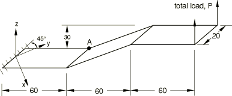
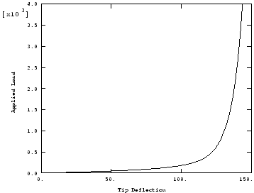
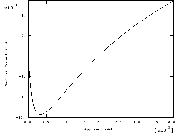

# 4.10.1 3DNLG-1: Elastic large deflection response of a Z-shaped cantilever under an end load

**Product: **Abaqus/Standard  

### Elements tested

B31    B31H    B32    B32H    B33    B33H    

S4    S4R    

SC6R    SC8R    

### Problem description

**Model: **

Uniform thickness (*t* = 1.7).

**Material: **

Linear elastic, Young's modulus = 2.05  105, Poisson's ratio = 0.3.

**Boundary conditions: **

All degrees of freedom restrained at built-in end.

**Loading: **

Concentrated end load (*P* = 4000).

### Reference solution

This is a test recommended by the National Agency for Finite Element Methods and Standards (U.K.): Test 3DNLG-1 from NAFEMS Publication R0024 “A Review of Benchmark Problems for Geometric Non-linear Behaviour of 3D Beams and Shells (SUMMARY).”

The published results for this problem were obtained with Abaqus. Thus, a comparison of Abaqus and NAFEMS results is not an independent verification of Abaqus. The NAFEMS study includes results from other sources for comparison that may provide a basis for verification of this problem.

### Results and discussion

Displacements converge faster than stresses. Even though the displacements seem to have converged, the lower-order elements need more refined meshes (compared to the higher-order elements) before the stresses are observed to converge. Stresses are most accurate at the integration points within the element. When stress values are extrapolated from the integration points to the nodes and then averaged, the stress values calculated may not capture the peak values if a stress gradient is present. Since the higher-order elements (B32, B32H, B33, and B33H) use linear extrapolation within an element, a stress gradient in an element may be captured adequately when extrapolating stresses to the nodes. However, constant extrapolation is used for linear elements (B31, B31H, S4, S4R, and SC8R), which results in slow convergence of nodal stress values. Higher mesh refinement near stress gradients is needed for such elements.

| Tip Displacement |
| --- |
| Element Type | Number of Elements | Applied Load |
| 104.5 | 1263.0 | 4000.0 |
| B31 | 72 | 80.42 | 133.1 | 143.5 |
| B31H | 72 | 80.42 | 133.1 | 143.5 |
| B32 | 9 | 80.42 | 133.1 | 143.4 |
| B32H | 9 | 80.42 | 133.1 | 143.4 |
| B33 | 9 | 80.42 | 133.1 | 143.4 |
| B33H | 9 | 80.42 | 133.1 | 143.4 |
| S4 | 1 72 | 80.42 | 133.1 | 143.5 |
| S4R | 1 72 | 80.42 | 133.1 | 143.5 |
| SC6R | 2 72 1 | 80.56 | 133.1 | 143.5 |
| SC8R | 1 72 1 | 79.28 | 133.1 | 143.5 |

| Moment at A |
| --- |
| Element Type | Number of Elements | Applied Load |
| 104.5 | 1263.0 | 4000.0 |
| B31 | 72 | 8333 | 5510 | 9921 |
| B31H | 72 | 8333 | 5509 | 9922 |
| B32 | 9 | 8308 | 4963 | 10742 |
| B32H | 9 | 8308 | 4962 | 10743 |
| B33 | 9 | 8316 | 4982 | 10659 |
| B33H | 9 | 8317 | 4983 | 10661 |
| S4 | 1 72 | 8334 | 5510 | 9934 |
| S4R | 1 72 | 8334 | 5510 | 9934 |
| SC6R | 2 72 1 | --8315 | --5481 | 9831 |
| SC8R | 1 72 1 | --8333 | --5507 | 9939 |

### Response predicted by Abaqus (element B32)

### Input files

[n3g1x33x_b31.inp](../eif/n3g1x33x_b31.inp)

B31 elements.

[n3g1x33x_b31h.inp](../eif/n3g1x33x_b31h.inp)

B31H elements.

[n3g1x33x_b32.inp](../eif/n3g1x33x_b32.inp)

B32 elements.

[n3g1x33x_b32h.inp](../eif/n3g1x33x_b32h.inp)

B32H elements.

[n3g1x33x_b33.inp](../eif/n3g1x33x_b33.inp)

B33 elements.

[n3g1x33x_b33h.inp](../eif/n3g1x33x_b33h.inp)

B33H elements.

[n3g1x33x_s4.inp](../eif/n3g1x33x_s4.inp)

S4 elements.

[n3g1x33x_s4r.inp](../eif/n3g1x33x_s4r.inp)

S4R elements.

[nlg1_std_sc6r.inp](../eif/nlg1_std_sc6r.inp)

SC6R elements.

[nlg1_std_sc8r.inp](../eif/nlg1_std_sc8r.inp)

SC8R elements.

