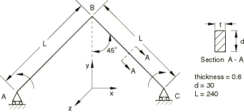
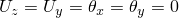
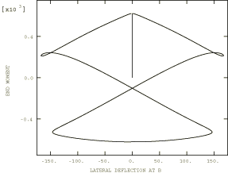
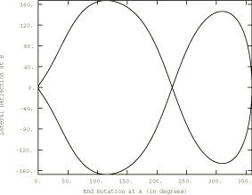

# 4.10.3 3DNLG-3: Elastic lateral buckling of a right angle frame under in-plane end moments

**Product: **Abaqus/Standard  

### Elements tested

B31    B31H    B32    B32H    

### Problem description

**Material: **

Young's modulus = 7.1240  104, Poisson's ratio = 0.31.

**Boundary conditions: **

Symmetry on plane *x* = 0 (). Only *x*-translation and *z*-rotation at end *A* ().

**Loading: **

i) Prescribe *z*-rotation at end *A* from 0 to 2 using an arc length solution procedure. ii) Unload the applied rotation. iii) To overcome the initial singularity, apply a perturbation load  ( = 0.01). This load is subsequently reduced to a negligible value ( = 1.0  107) or zero once the singularity is overcome. The perturbation load is an order of magnitude larger than the load used by NAFEMS, which ensures that the structure initially buckles into the desired mode, regardless of mesh size or element used.

### Reference solution

This is a test recommended by the National Agency for Finite Element Methods and Standards (U.K.): Test 3DNLG-3 from NAFEMS Publication R0024 “A Review of Benchmark Problems for Geometric Non-linear Behaviour of 3D Beams and Shells (SUMMARY).”

The published results of this problem were obtained with Abaqus. Thus, a comparison of Abaqus and NAFEMS results is not an independent verification of Abaqus. The NAFEMS study includes results from other sources for comparison that may provide a basis for verification of this problem.

### Results and discussion

Elements B32 and B32H use a mesh with 21 nodes (10 elements) to model half of the frame using symmetry, and elements B31 and B31H use a mesh of 41 nodes (40 elements).

The reaction moment at A and the tip lateral deflection at B are given at different rotations of end A, making comparison of the response of different elements difficult. This problem tests the automatic arc length (RIKS) algorithm as well as the large-rotation formulation of the beam elements. The “increment size” (more appropriately, arc length) varies throughout an analysis and will be different for each mesh or element used. In addition, the RIKS algorithm allows the analysis to be terminated only after a user-defined load or nodal displacement (or rotation) value is exceeded. Thus, the results from an analysis with different elements or meshes usually cannot be compared at arbitrary points in the deformation history. If results are desired at specific points along the deformation path, a limit can be set on the arc length to give output at closely spaced loading increments, or interpolation of the analysis data can be used to obtain approximate analysis results at intermediate loading values. In this problem, tight arc length tolerances are not needed to resolve the buckling behavior of the structure accurately.

| Abaqus Solution |
| --- |
| Element | Applied | End A | Tip B Lateral |
| Type | Rotation (deg.) at A | Moment | Deflection |
| B31 | 123.8 | 221.8 | 166.6 |
|  | 311.3 | 529.8 | 146.3 |
|  | 359.9 | 633.6 | 7.49 |
| B31H | 118.2 | 216.8 | 167.3 |
|  | 315.0 | 534.8 | 145.8 |
|  | 359.8 | 632.8 | 7.97 |
| B32 | 122.3 | 220.4 | 166.8 |
|  | 311.4 | 529.0 | 146.4 |
|  | 359.9 | 619.5 | 3.19 |
| B32H | 128.7 | 226.5 | 165.3 |
|  | 310.4 | 527.8 | 146.4 |
|  | 359.9 | 623.8 | 3.28 |

### Response predicted by Abaqus (element B32)

### Input files

There are two analysis files for each element tested. Two files are needed since the removal of the perturbation load requires a general static step following the initial RIKS step, and a RIKS analysis must be the last step in an analysis.

[n3g3x331_b31.inp](../eif/n3g3x331_b31.inp)

B31 elements, analysis 1.

[n3g3x331_b31h.inp](../eif/n3g3x331_b31h.inp)

B31H elements, analysis 1.

[n3g3x331_b32.inp](../eif/n3g3x331_b32.inp)

B32 elements, analysis 1.

[n3g3x331_b32h.inp](../eif/n3g3x331_b32h.inp)

B32H elements, analysis 1.

[n3g3x332_b31.inp](../eif/n3g3x332_b31.inp)

B31 elements, analysis 2.

[n3g3x332_b31h.inp](../eif/n3g3x332_b31h.inp)

B31H elements, analysis 2.

[n3g3x332_b32.inp](../eif/n3g3x332_b32.inp)

B32 elements, analysis 2.

[n3g3x332_b32h.inp](../eif/n3g3x332_b32h.inp)

B32H elements, analysis 2.

