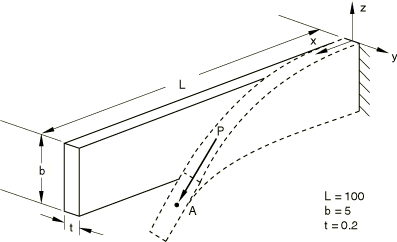
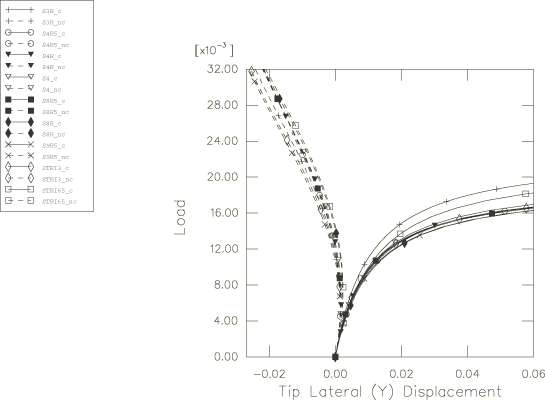

# 4.10.4 3DNLG-4: Lateral torsional buckling of an elastic cantilever subjected to a transverse end load

**Product: **Abaqus/Standard  

### Elements tested

S3R    S4    S4R    S4R5    S8R    S8R5    S9R5    

STRI3    STRI65    

SC6R    SC8R    

### Problem description

**Material: **

Young's modulus = 1.0  104, Poisson's ratio = 0.0.

**Boundary conditions: **

All degrees of freedom restrained at built-in end.

**Loading: **

a) Conservative load: apply concentrated nodal force *P* using an arc length procedure. In one test the conservative load is applied with a distributed edge traction instead of a nodal force.  = 0.017. Terminate when *y*-displacement at *A* exceeds 0.06. b) Nonconservative load: apply concentrated nodal follower force *P* using an arc length procedure. In one test the nonconservative load is applied with a distributed edge traction instead of a nodal force. The continuum shell models for the nonconservative load case include two conventional shell elements (with a reduced stiffness) overlaid on the continuum shell element mesh to activate the rotational degrees of freedom for the follower force.  = 0.032. There is an initial out-of-plane imperfection (*y*-coordinate) in the mesh.

### Reference solution

This is a test recommended by the National Agency for Finite Element Methods and Standards (U.K.): Test 3DNLG-4 from NAFEMS Publication R0024 “A Review of Benchmark Problems for Geometric Non-linear Behaviour of 3D Beams and Shells (SUMMARY).”

The published results of this problem were obtained with Abaqus. Thus, a comparison of Abaqus and NAFEMS results is not an independent verification of Abaqus. The NAFEMS  study includes results from other sources for comparison that may provide a basis for verification of this problem.

### Results and discussion

Mesh refinement is needed to evaluate the accuracy of some of the elements; however, the imperfection is specified at a number of discrete points that serve as the nodal positions of the original mesh used by NAFEMS. Refining the mesh introduces a change in the geometry since the imperfection is not known at points other than the nodal positions of the original mesh. Therefore, results are reported using the same nodal spacing for all element types (the same nodal spacing with the omission of one center node per element is used in the S8R and S8R5 meshes).

The results for the continuum shell models, not depicted in the figure, show similar load-displacement results as for the conventional shell element models.

The results for the edge traction loading, not depicted in the figure, show nearly identical results as for the nodal loads.

### Response predicted by Abaqus

### Input files

#### Conservative loading case:

[n3g4x541_s3r.inp](../eif/n3g4x541_s3r.inp)

S3R elements.

[n3g4x541_s4.inp](../eif/n3g4x541_s4.inp)

S4 elements.

[n3g4x541_s4r.inp](../eif/n3g4x541_s4r.inp)

S4R elements.

[n3g4x541_s4r_edld.inp](../eif/n3g4x541_s4r_edld.inp)

S4R elements, loaded with a distributed edge traction.

[n3g4x541_s4r5.inp](../eif/n3g4x541_s4r5.inp)

S4R5 elements.

[n3g4x541_s8r.inp](../eif/n3g4x541_s8r.inp)

S8R elements.

[n3g4x541_s8r5.inp](../eif/n3g4x541_s8r5.inp)

S8R5 elements.

[n3g4x541_s9r5.inp](../eif/n3g4x541_s9r5.inp)

S9R5 elements.

[n3g4x541_stri3.inp](../eif/n3g4x541_stri3.inp)

STRI3 elements.

[n3g4x541_stri65.inp](../eif/n3g4x541_stri65.inp)

STRI65 elements.

[nlg4_std_sc6r_1.inp](../eif/nlg4_std_sc6r_1.inp)

SC6R elements.

[nlg4_std_sc8r_1.inp](../eif/nlg4_std_sc8r_1.inp)

SC8R elements.

#### Nonconservative loading case:

[n3g4x542_s3r.inp](../eif/n3g4x542_s3r.inp)

S3R elements.

[n3g4x542_s4.inp](../eif/n3g4x542_s4.inp)

S4 elements.

[n3g4x542_s4r.inp](../eif/n3g4x542_s4r.inp)

S4R elements.

[n3g4x542_s4r_edld.inp](../eif/n3g4x542_s4r_edld.inp)

S4R elements, loaded with a distributed edge traction.

[n3g4x542_s4r5.inp](../eif/n3g4x542_s4r5.inp)

S4R5 elements.

[n3g4x542_s8r.inp](../eif/n3g4x542_s8r.inp)

S8R elements.

[n3g4x542_s8r5.inp](../eif/n3g4x542_s8r5.inp)

S8R5 elements.

[n3g4x542_s9r5.inp](../eif/n3g4x542_s9r5.inp)

S9R5 elements.

[n3g4x542_stri3.inp](../eif/n3g4x542_stri3.inp)

STRI3 elements.

[n3g4x542_stri65.inp](../eif/n3g4x542_stri65.inp)

STRI65 elements.

[nlg4_std_sc6r_2.inp](../eif/nlg4_std_sc6r_2.inp)

SC6R elements.

[nlg4_std_sc8r_2.inp](../eif/nlg4_std_sc8r_2.inp)

SC8R elements.

