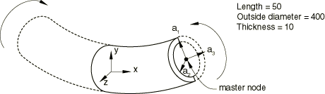
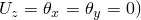
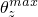
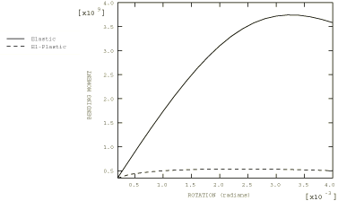

# 4.10.8 3DNLG-8: Collapse of a straight pipe segment under pure bending

**Product: **Abaqus/Standard  

### Elements tested

S3    S3R    S4    S4R    S4R5    S8R    S8R5    S9R5    

STRI3    STRI65    

### Problem description

Elastic and elastic-plastic cases of a beam under pure bending are tested. Nonlinear multipoint constraints and section ovalization are also tested.

**Model: **

A quarter model is used because of symmetry.

**Material: **

Young's modulus = 1.93  105, Poisson's ratio = 0.26, plastic (isotropic hardening). 

| Equiv. Stress | Equiv. Plastic Strain |
| --- | --- |
| 272 | 0.0 |
| 346 | 0.00473 |
| 379 | 0.01264 |
| 404 | 0.02836 |
| 424 | 0.0491 |

**Boundary conditions: **

Symmetry on plane *z* = 0 (; symmetry on plane *x* = 0 (; symmetry on rotated plane: i) Shell nodes must remain in rotated plane (Nonlinear MPC). ii) The *z*-rotation of shell nodes in the rotated plane must be the same as the master node (Linear MPC). iii) The component of rotation about the local -axis must be zero (Nonlinear MPC). The master node is constrained to move on the *x*-axis only.

**Loading: **

*Z*-rotation applied to pipe end ( = 0.004).

### Reference solution

This is a test recommended by the National Agency for Finite Element Methods and Standards (U.K.): Test 3DNLG-8 from NAFEMS Publication R0024 “A Review of Benchmark Problems for Geometric Non-linear Behaviour of 3D Beams and Shells (SUMMARY).”

The published results of this problem were obtained with Abaqus. Thus, a comparison of Abaqus and NAFEMS results is not an independent verification of Abaqus. The NAFEMS study includes results from other sources for comparison that may provide a basis for verification of this problem.

### Results and discussion

In the following table, the end moments for the elastic and elastic-plastic cases are reported at three rotation values of the master node. All the meshes have the same nodal spacing.

| Element |  = 0.0012 |  = 0.0024 |  = 0.004 |
| --- | --- | --- | --- |
|  | Moment 109 | Moment 109 | Moment 109 |
|  | Elastic | Plastic | Elastic | Plastic | Elastic | Plastic |
| S3/S3R | 2.056 | 0.5146 | 3.488 | 0.5402 | 3.704 | 0.5066 |
| S4 | 2.032 | 0.5088 | 3.452 | 0.5350 | 3.676 | 0.5042 |
| S4R | 2.020 | 0.5080 | 3.436 | 0.5332 | 3.664 | 0.5024 |
| S4R5 | 2.018 | 0.5078 | 3.420 | 0.5334 | 3.578 | 0.5008 |
| S8R | 2.054 | 0.5116 | 3.448 | 0.5380 | 3.568 | 0.5024 |
| S8R5 | 2.054 | 0.5118 | 3.452 | 0.5380 | 3.582 | 0.5030 |
| S9R5 | 2.054 | 0.5118 | 3.452 | 0.5380 | 3.582 | 0.5030 |
| STRI3 | 2.056 | 0.5144 | 3.474 | 0.5390 | 3.662 | 0.5036 |
| STRI65 | 2.054 | 0.5122 | 3.452 | 0.5388 | 3.592 | 0.5046 |

### Response predicted by Abaqus

Essentially identical moment-rotation curves (at the master node) are obtained for all test cases. The response predicted using S8R5 elements is shown below.

### Input files

#### Elasticity:

[n3g8xf31.inp](../eif/n3g8xf31.inp)

S3/S3R elements.

[n3g8xf31.f](../eif/n3g8xf31.f)

User subroutine [`MPC`](../sub/sub-link.md#sub-xsl-mpc) used in n3g8xf31.inp.

[n3g8xe41.inp](../eif/n3g8xe41.inp)

S4 elements.

[n3g8xe41.f](../eif/n3g8xe41.f)

User subroutine [`MPC`](../sub/sub-link.md#sub-xsl-mpc) used in n3g8xe41.inp.

[n3g8xf41.inp](../eif/n3g8xf41.inp)

S4R elements.

[n3g8xf41.f](../eif/n3g8xf41.f)

User subroutine [`MPC`](../sub/sub-link.md#sub-xsl-mpc) used in n3g8xf41.inp.

[n3g8x541.inp](../eif/n3g8x541.inp)

S4R5 elements.

[n3g8x541.f](../eif/n3g8x541.f)

User subroutine [`MPC`](../sub/sub-link.md#sub-xsl-mpc) used in n3g8x541.inp.

[n3g8x681.inp](../eif/n3g8x681.inp)

S8R elements.

[n3g8x681.f](../eif/n3g8x681.f)

User subroutine [`MPC`](../sub/sub-link.md#sub-xsl-mpc) used in n3g8x681.inp.

[n3g8x581.inp](../eif/n3g8x581.inp)

S8R5 elements.

[n3g8x581.f](../eif/n3g8x581.f)

User subroutine [`MPC`](../sub/sub-link.md#sub-xsl-mpc) used in n3g8x581.inp.

[n3g8x591.inp](../eif/n3g8x591.inp)

S9R5 elements.

[n3g8x591.f](../eif/n3g8x591.f)

User subroutine [`MPC`](../sub/sub-link.md#sub-xsl-mpc) used in n3g8x591.inp.

[n3g8x631.inp](../eif/n3g8x631.inp)

STRI3 elements.

[n3g8x631.f](../eif/n3g8x631.f)

User subroutine [`MPC`](../sub/sub-link.md#sub-xsl-mpc) used in n3g8x631.inp.

[n3g8x561.inp](../eif/n3g8x561.inp)

STRI65 elements.

[n3g8x561.f](../eif/n3g8x561.f)

User subroutine [`MPC`](../sub/sub-link.md#sub-xsl-mpc) used in n3g8x561.inp.

#### Elastoplasticity:

[n3g8xf32.inp](../eif/n3g8xf32.inp)

S3/S3R elements.

[n3g8xf32.f](../eif/n3g8xf32.f)

User subroutine [`MPC`](../sub/sub-link.md#sub-xsl-mpc) used in n3g8xf32.inp.

[n3g8xe42.inp](../eif/n3g8xe42.inp)

S4 elements.

[n3g8xe42.f](../eif/n3g8xe42.f)

User subroutine [`MPC`](../sub/sub-link.md#sub-xsl-mpc) used in n3g8xe42.inp.

[n3g8xf42.inp](../eif/n3g8xf42.inp)

S4R elements.

[n3g8xf42.f](../eif/n3g8xf42.f)

User subroutine [`MPC`](../sub/sub-link.md#sub-xsl-mpc) used in n3g8xf42.inp.

[n3g8x542.inp](../eif/n3g8x542.inp)

S4R5 elements.

[n3g8x542.f](../eif/n3g8x542.f)

User subroutine [`MPC`](../sub/sub-link.md#sub-xsl-mpc) used in n3g8x542.inp.

[n3g8x682.inp](../eif/n3g8x682.inp)

S8R elements.

[n3g8x682.f](../eif/n3g8x682.f)

User subroutine [`MPC`](../sub/sub-link.md#sub-xsl-mpc) used in n3g8x682.inp.

[n3g8x582.inp](../eif/n3g8x582.inp)

S8R5 elements.

[n3g8x582.f](../eif/n3g8x582.f)

User subroutine [`MPC`](../sub/sub-link.md#sub-xsl-mpc) used in n3g8x582.inp.

[n3g8x592.inp](../eif/n3g8x592.inp)

S9R5 elements.

[n3g8x592.f](../eif/n3g8x592.f)

User subroutine [`MPC`](../sub/sub-link.md#sub-xsl-mpc) used in n3g8x592.inp.

[n3g8x632.inp](../eif/n3g8x632.inp)

STRI3 elements.

[n3g8x632.f](../eif/n3g8x632.f)

User subroutine [`MPC`](../sub/sub-link.md#sub-xsl-mpc) used in n3g8x632.inp.

[n3g8x562.inp](../eif/n3g8x562.inp)

STRI65 elements.

[n3g8x562.f](../eif/n3g8x562.f)

User subroutine [`MPC`](../sub/sub-link.md#sub-xsl-mpc) used in n3g8x562.inp.

