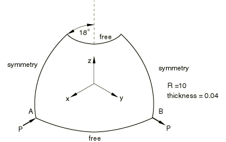
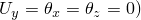
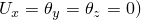
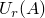
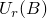
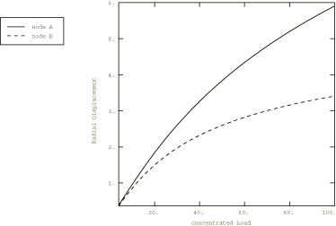

# 4.10.9 3DNLG-9: Large elastic deflection of a pinched hemispherical shell

**Product: **Abaqus/Standard  

### Elements tested

S3    S3R    S4    S4R    S4R5    S8R    S8R5    S9R5    

STRI3    STRI65    

SC6R    SC8R    

### Problem description

**Material: **

Young's modulus = 6.825  107, Poisson's ratio = 0.3.

**Boundary conditions: **

Symmetry on plane *y* = 0 (, symmetry on plane *x* = 0 (,  at *A* to prevent rigid body motion.

**Loading: **

Inward and outward diametrical point loads (*P* = 100).

### Reference solution

This is a test recommended by the National Agency for Finite Element Methods and Standards (U.K.): Test 3DNLG-9 from NAFEMS Publication R0024 “A Review of Benchmark Problems for Geometric Non-linear Behaviour of 3D Beams and Shells (SUMMARY).”

The published results of this problem were obtained with Abaqus. Thus, a comparison of Abaqus and NAFEMS results is not an independent verification of Abaqus. The NAFEMS study includes results from other sources for comparison that may provide a basis for verification of this problem.

### Results and discussion

The following table shows the radial displacements at points *A* and *B* at three load levels. All the meshes have the same nodal spacing.

| Element | *P* = 40 | *P* = 60 | *P* = 100 |
| --- | --- | --- | --- |
|  |  |  |  |  |  |  |
| S4R | 3.26 | 2.32 | 4.34 | 2.82 | 5.90 | 3.41 |
| S4 | 3.21 | 2.30 | 4.26 | 2.79 | 5.80 | 3.37 |
| S4R5 | 3.28 | 2.33 | 4.36 | 2.83 | 5.95 | 3.43 |
| S8R | 3.16 | 2.23 | 4.13 | 2.67 | 5.47 | 3.19 |
| S8R5 | 3.23 | 2.32 | 4.30 | 2.81 | 5.83 | 3.40 |
| S9R5 | 3.23 | 2.32 | 4.30 | 2.81 | 5.83 | 3.40 |
| S3/S3R | 3.12 | 2.27 | 4.15 | 2.76 | 5.67 | 3.34 |
| STRI3 | 3.16 | 2.29 | 4.20 | 2.79 | 5.76 | 3.37 |
| STRI65 | 3.13 | 2.27 | 4.16 | 2.75 | 5.63 | 3.31 |
| SC6R | --3.06 | 2.21 | --4.03 | 2.66 | --5.42 | 3.21 |
| SC8R | --3.25 | 2.30 | --4.29 | 2.78 | --5.80 | 3.35 |

### Response predicted by Abaqus

Similar load-displacement curves are obtained for all test cases. The response predicted using S4R elements is shown below. The curve for node A is for the negative displacement and load values.

### Input files

[n3g9xf3x.inp](../eif/n3g9xf3x.inp)

S3/S3R elements.

[n3g9xe4x.inp](../eif/n3g9xe4x.inp)

S4 elements.

[n3g9xf4x.inp](../eif/n3g9xf4x.inp)

S4R elements.

[n3g9x54x.inp](../eif/n3g9x54x.inp)

S4R5 elements.

[n3g9x68x.inp](../eif/n3g9x68x.inp)

S8R elements.

[n3g9x58x.inp](../eif/n3g9x58x.inp)

S8R5 elements.

[n3g9x59x.inp](../eif/n3g9x59x.inp)

S9R5 elements.

[n3g9x63x.inp](../eif/n3g9x63x.inp)

STRI3 elements.

[n3g9x56x.inp](../eif/n3g9x56x.inp)

STRI65 elements.

[nlg9_std_sc6r.inp](../eif/nlg9_std_sc6r.inp)

SC6R elements.

[nlg9_std_sc6r_sgs.inp](../eif/nlg9_std_sc6r_sgs.inp)

SC6R elements using [*SHELL GENERAL SECTION](../key/key-link.md#usb-kws-mshellgensect).

[nlg9_std_sc8r.inp](../eif/nlg9_std_sc8r.inp)

SC8R elements.

[nlg9_std_sc8r_stackdir_sphori.inp](../eif/nlg9_std_sc8r_stackdir_sphori.inp)

SC8R elements with STACK DIRECTION=ORIENTATION and a spherical orientation system.

