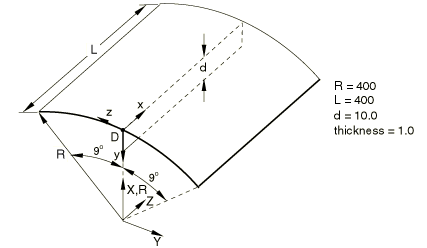
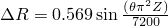
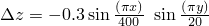
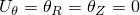
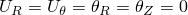
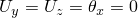
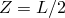
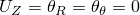
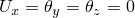
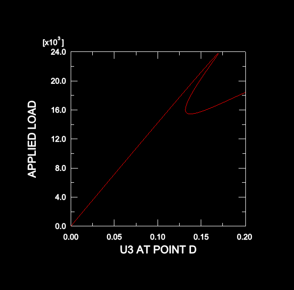

# 4.10.10 3DNLG-10: Elastic-plastic behavior of a stiffened cylindrical panel under compressive end load

**Product: **Abaqus/Standard  

### Elements tested

S3    S3R    S4    S4R    S4R5    S8R    S8R5    S9R5    

STRI3    STRI65    

### Problem description

**Model: **

There is an initial imperfection in both the cylindrical panel and the stiffener. 

Cylindrical panel: , where 9  9 and 0  200.

Stiffener: , where 0  200 and 0  10.

**Material: **

Young's modulus = 2.1  105, Poisson's ratio = 0.3, yield stress = 350.

**Boundary conditions: **

Tangential symmetry along edges 1 and 2 at  = 9 (). Simply supported at end *A* for panel: (), for stiffener: (). Symmetry at  for panel: (), for stiffener: ().

**Loading: **

Compressive, evenly distributed edge load. The RIKS algorithm is used to increment the load until the global *z*-displacement at point *D* exceeds 0.2.

### Reference solution

This is a test recommended by the National Agency for Finite Element Methods and Standards (U.K.): Test 3DNLG-10 from NAFEMS Publication R0024 “A Review of Benchmark Problems for Geometric Non-linear Behaviour of 3D Beams and Shells (SUMMARY).”

The published results of this problem were obtained with Abaqus. Thus, a comparison of Abaqus and NAFEMS results is not an independent verification of Abaqus. The NAFEMS study includes results from other sources for comparison that may provide a basis for verification of this problem.

### Results and discussion

In the following table, limit points 1 and 2 correspond to the peak and local minimum, respectively, of the load-displacement curve. To produce results comparable to those for S8R5/S9R5, the first-order elements require a finer mesh with half the nodal spacing in the curved direction of the panel. The limit loads for the thick shell element S8R are noticeably higher than others in this thin shell application, even when a fine mesh with the same nodal spacing as that used for the first-order elements is generated.

| Element | Limit point 1 | Limit point 2 |
| --- | --- | --- |
|  | End load |  at D | End load |  at D |
| S3/S3R | 23357 | 0.167 | 15622 | 0.138 |
| S4 | 23505 | 0.168 | 15097 | 0.135 |
| S4R | 23621 | 0.168 | 15126 | 0.136 |
| S4R5 | 23540 | 0.168 | 15074 | 0.136 |
| S8R | 25318 | 0.180 | 16964 | 0.146 |
| S8R5 | 23764 | 0.169 | 15453 | 0.138 |
| S9R5 | 23789 | 0.170 | 15460 | 0.138 |
| STRI3 | 22993 | 0.165 | 14809 | 0.134 |
| STRI65 | 22534 | 0.161 | 15048 | 0.133 |

### Response predicted by Abaqus

Similar load-displacement curves are obtained for all the test cases. The response predicted using S8R5 elements is shown below.

### Input files

[n3g10f3x.inp](../eif/n3g10f3x.inp)

S3/S3R elements.

[n3g10e4x.inp](../eif/n3g10e4x.inp)

S4 elements.

[n3g10f4x.inp](../eif/n3g10f4x.inp)

S4R elements.

[n3g1054x.inp](../eif/n3g1054x.inp)

S4R5 elements.

[n3g1068x.inp](../eif/n3g1068x.inp)

S8R elements.

[n3g1058x.inp](../eif/n3g1058x.inp)

S8R5 elements.

[n3g1059x.inp](../eif/n3g1059x.inp)

S9R5 elements.

[n3g1063x.inp](../eif/n3g1063x.inp)

STRI3 elements.

[n3g1056x.inp](../eif/n3g1056x.inp)

STRI65 elements.

