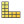

# 40.1 Understanding the role of the Visualization module

The Visualization module provides graphical display of finite element models and results. It obtains model information from the current model database or model and result information from an output database. You can control what information is placed in the output database by modifying output requests in the Step module. (For more information, see ["What is an output request?," Section 14.4.1](pt03ch14s04s01.md).) You can view data from a model database using a contour plot or a symbol plot; you can view model and results data from an output database by producing any of the plots described in this section.

** [Undeformed shape](pt05ch43s01.md)**

An undeformed shape plot displays the initial shape or the base state of your model.

** [Deformed shape](pt05ch43s02.md)**

A deformed shape plot displays the shape of your model according to the values of a nodal variable such as displacement.

** [Contours](pt05ch44s01.md)**

For an output database, a contour plot displays the values of an analysis variable such as stress or strain at a specified step and frame of your analysis. For a model in the current model database, a contour plot displays the value of a load, a predefined field, or an interaction at a selected step of your model. The Visualization module represents the values as customized colored lines, colored bands, or colored faces on your model.

** [Symbols](pt05ch45s01.md)**

For an output database, a symbol plot displays the magnitude and direction of a particular vector or tensor variable at a specified step and frame of your analysis. For a model in the current model database, a symbol plot displays the magnitude and direction of a load, a predefined field, or an interaction at a specified step of your model. The Visualization module represents the values as symbols (for example, arrows) at locations on your model. 

** [Material orientations](pt05ch46s01.md)**

A material orientation plot displays the material directions of elements in your model at a specified step and frame of your analysis. The Visualization module represents the material directions as material orientation triads at the element integration points.

** [X--Y data](pt05ch47s01.md)**

An *X–Y* plot is a two-dimensional graph of one variable versus another.

** [Time history animation](pt05ch49s01s01.md)**

Time history animation displays a series of plots in rapid succession, giving a movie-like effect. The individual plots vary according to actual result values over time.

** [Scale factor animation](pt05ch49s01s02.md)**

Scale factor animation displays a series of plots in rapid succession, giving a movie-like effect. The individual plots vary in the scale factor applied to a particular deformation.

** [Harmonic animation](pt05ch49s01s03.md)**

Harmonic animation displays a series of plots in rapid succession, giving a movie-like effect. The individual plots vary according to the angle applied to the complex number results being displayed.

Additional capabilities include:

**[Visualizing diagnostic information](pt05ch41s01.md)**

Diagnostic information helps you determine the causes of nonconvergence in a model. You can view information for each stage of the analysis and use Abaqus/CAE to highlight problematic areas on the model in the viewport.

**[Probing models, model plots, and X--Y plots](pt05ch51s01.md)**

Probing displays model data and analysis results as you move the cursor around a model or a model plot; probing an *X–Y* plot displays the coordinates of graph points. You can write this information to a file.

**[Results plotting along a path](pt05ch48s01.md)**

A path is a line you define by specifying a series of points through your model. You can view results along the path in the form of an *X–Y* plot.

**[Stress linearization](pt05ch52s01.md)**

Stress linearization is the separation of stresses through a section into constant membrane and linear bending stresses. You specify the section as a path through your model, and the Visualization module displays the linearized stresses in the form of an *X–Y* plot.

**[Cutting through your model](pt07ch80s01.md)**

View cuts allow you to slice through a model so that you can visualize the interior or selected sections of the model. You can define planar, cylindrical, or spherical view cuts. In addition, you can define a view cut along a constant contour variable value.

**[X--Y and field output reporting](pt05ch54s01.md)**

An *X–Y* report is a tabular listing of *X*- and *Y*-data values; a field output report is a tabular listing of field output values.

**[Visualizing the plies in a composite layup](pt05ch53.md)**

A ply stack plot is a graphical representation of the plies in a composite layup. The image shows the plies in the layup along with details of each ply, such as its fiber orientation, thickness, and the reference plane. You can also create a ply stack plot in the Property module while you are creating a composite layup.

**[Plot customization](pt05ch55s01.md)**

The Visualization module provides numerous options that you can use to customize your plots. 

