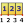

# 43.6 Superimposing deformed and undeformed model plots

You can combine the deformed and undeformed model shapes in a single plot. Combining the shapes provides a context for displaying and interpreting the contours, symbols, or material orientations. An example of superimposed model shapes is shown in [Figure 43--1](pt05ch43hla02.md#viw-superim-online).

**Figure 43–1** Deformed shape superimposed on the undeformed shape.

 To produce a superimposed plot, select ****Plot*****Contours, Symbols, or Material Orientations*****On Both Shapes**** from the main menu bar or use the , , and  tools in the toolbox. To superimpose the undeformed and deformed shapes without contours, symbols, or material orientations or to display any combination of plot types for the same results, use the  tool and select all of the desired plot types from the toolbox (for more information, see ["Displaying multiple plot states," Section 55.6](pt05ch55s06.md)).

**To customize the superimposed plot:**

1. From the main menu bar, select ****Options****Superimpose**** to customize the appearance of the undeformed shape. **Tip:**You can also customize the undeformed plot shape using the  tool in the toolbox.
2. Click the following tabs to modify the options: - **Basic**: Choose render style and edge visibility. - **Color & Style**: Control model edge color and style, model face color, edge style, and edge thickness. - **Labels**: Control element, face, and node labels and node symbols. - **Normals**: Control element and surface normals. - **Other**: The **Other** page contains the following tabs: - **Scaling**: Control model scaling and shrinking. - **Translucency**: Control shaded and filled render style translucency. - **Offset**: Control the offset between the undeformed and deformed shapes. For more detailed information on customizing the display characteristics of your plots, see [Chapter 55, "Customizing plot display](pt05ch55.md)." Abaqus/CAE uses the superimpose plot options in place of the common plot options to display the undeformed plot in the viewport.
3. To customize the similar options for the deformed shape, select ****Options****Common**** or use the  tool in the toolbox.
4. If contours, symbols, or material orientations are active, use the associated plot state--dependent options to customize the display of both the undeformed and the deformed plot.
5. Click **Apply** in each options dialog box to implement your changes in the viewport.

Your superimposed plot options changes are saved for the duration of the session and will affect the undeformed shape in all subsequent plots where both model shapes are displayed.
For information on related topics, click any of the following items:- ["Producing an undeformed shape plot," Section 43.4](pt05ch43s03.md)
- ["Producing a deformed shape plot," Section 43.5](pt05ch43s04.md)
- ["Overview of common plot options," Section 43.3](pt05ch43hla01.md)
- [Chapter 55, "Customizing plot display](pt05ch55.md)"

