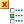

# 45.5.1 Customizing symbol plot arrows

You can customize the arrow color, maximum arrow length, arrow shaft thickness, and arrowhead appearance for symbol plot vector and tensor arrows. When you customize arrow color for nodal vector symbols, you can select a single color for all arrows in the plot or display arrows with different colors depending on their length. You can use either the size of the model or the size of the screen as the basis for calculations of maximum arrow length. 

For tensor symbol plots of element output variables, arrows are typically displayed with three different colors. 

**To customize the arrow appearance:**

1. Locate the vector or tensor **Color & Style** options. Select ****Options****Symbol**** from the main menu bar or click  in the toolbox; then click the **Color & Style** tab in the dialog box that appears. - Click the **Vector** tab if you are creating a vector symbol plot. - Click the **Tensor** tab if you are creating a tensor symbol plot. The options for the symbol type of your choice appear.
2. To display all arrows in the plot with a single color, select **Uniform**, then do one of the following: - For a vector plot, click the **Uniform Color** sample , and select the color in which you want the variable or variable component arrows to appear. (For more information, see ["Customizing colors," Section 3.2.9](pt01ch03s02s09.md).) - For plotting all principal components in a tensor plot, click the color samples labeled **Maximum principal**, **Mid principal**, and **Minimum principal**; and select the colors in which you want each arrow type to appear. - For plotting all direct components in a tensor plot, click the color samples labeled **11**, **22**, and **33**; and select the colors in which you want each arrow type to appear. - For plotting only one principal or direct component, click the color sample labeled **Color**, and select the color in which you want the component arrows to appear.
3. To display all arrows in the plot using colors that correspond to their length, select **Spectrum**. You can choose one of the predefined color spectrums from the **Spectrum Name** list or define a new spectrum; for more information on selecting and defining a color spectrum, see ["Customizing contour colors," Section 44.5.10](pt05ch44s02hlb10.md), and ["Creating a new color spectrum," Section 44.5.11](pt05ch44s02hlb11.md). You can also drag the **Number of intervals** slider to change the number of intervals available for coloring the various arrows in the symbol plot; for more information about contour interval selection, see ["Customizing contour intervals," Section 44.5.12](pt05ch44s02hlb12.md).
4. Drag the **Size** slider to change the arrow length. The arrow size ranges from 0 to 30; the default arrow size is 6. Your selection determines the size of the arrow representing the largest vector or tensor value in the plot. All other vector and tensor arrows in the plot will be scaled to that size. **Note:**Abaqus/CAE maintains one size setting for both vectors and tensors; you cannot change the size of one independently of the other.
5. From the **Basis** options, select **Screen size** or **Model size** as the basis for calculations of maximum arrow length. If you select **Screen size**, Abaqus/CAE resizes the arrows as you change the size of the viewport; and if you select **Model size**, Abaqus/CAE resizes the arrows as you zoom in and out.
6. Click the arrow next to the **Thickness** field, and select the arrow shaft thickness of your choice.
7. Click the arrow next to the **Arrowhead** field, and select the arrowhead design of your choice.
8. If you are creating a tensor plot, customize the locations of the tensor arrows so that they are displayed at the **Integration point**, the **Centroid**, or the **Nodal** values for your model.
9. If desired, you can display a smaller subset of the arrows in a symbol plot to clarify the presentation of a plot with many arrows. Drag the **Symbol density** slider to a value between **High** and **Low**.
10. Click **Apply** to implement your changes. The symbol plot vector or tensor arrows in the current viewport change to reflect your settings. By default, your changes are saved for the duration of the session and will affect all subsequent symbol plots. If you want to retain your changes for subsequent sessions, save them to a file. For more information, see ["Saving customizations for use in subsequent sessions," Section 55.1.1](pt05ch55s01s01.md).

For information on related topics, click any of the following items:- ["Customizing colors," Section 3.2.9](pt01ch03s02s09.md)
- ["Customizing symbol plot appearance," Section 45.5](pt05ch45s02.md)

