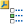

# 46.4.1 Customizing material orientation plot triads

You can customize the color, length, thickness, and arrowhead appearance of the material orientation plot triad axes. You can also suppress the appearance of one or more of the triad axes; and for results with composite sections, you can display results using either the material orientation of the entire layup or one of its individual plies. 

**To customize the triad appearance:**

1. Select ****Options****Material Orientation**** from the main menu bar or click  in the toolbox. The triad options appear.
2. Toggle on the buttons to the left of each of the axes to display or suppress them.
3. Click on the color samples to select the color or colors of your choice for the visible triad axes in the plot.
4. Drag the **Size** slider to increase or decrease the length of the axes in the material orientation triads in your plot. Axis length ranges from 0 to 30; the default length is 6. **Note:**You can specify an axis length value larger than 30 by using the Abaqus Scripting Interface. See ["Using the Python interpreter," Section 4.3 of the Abaqus Scripting User's Guide](../cmd/cmd-link.md#cmd-int-pyt-intro-interpreter).
5. From the **Basis** options, select **Screen size** or **Model size** as the basis for calculations of axis length in material orientation triads. If you select **Screen size**, Abaqus/CAE resizes the triads as you change the size of the viewport; and if you select **Model size**, Abaqus/CAE resizes the triads as you zoom in and out.
6. Click the arrow next to the **Thickness** field, and select the axis thickness of your choice.
7. Click the arrow next to the **Arrowhead** field, and select the arrowhead design of your choice.
8. If desired, you can display a smaller subset of the material orientation triads to clarify the presentation of a plot with many triads. Drag the **Symbol density** slider to a value between **High** and **Low**.
9. If your results include field output from the SORIENT output variable and output from elements with composite sections, specify the material orientation you want to use. Select **Ply** to display each ply with its own material orientation, or select **Layup** to display the entire composite layup using the orientation specified in the composite layup definition.
10. Click **Apply** to implement your changes. The material orientation plot triads in the current viewport change to reflect your settings. By default, your changes are saved for the duration of the session and will affect all subsequent material orientation plots. If you want to retain your changes for subsequent sessions, save them to a file. For more information, see ["Saving customizations for use in subsequent sessions," Section 55.1.1](pt05ch55s01s01.md).

For information on related topics, click any of the following items:- ["Customizing colors," Section 3.2.9](pt01ch03s02s09.md)
- [Chapter 55, "Customizing plot display](pt05ch55.md)"

