# 1.1.1 Axisymmetric analysis of bolted pipe flange connections

**Product: **Abaqus/Standard  

A bolted pipe flange connection is a common and important part of many piping systems. Such connections are typically composed of hubs of pipes, pipe flanges with bolt holes, sets of bolts and nuts, and a gasket. These components interact with each other in the tightening process and when operation loads such as internal pressure and temperature are applied. Experimental and numerical studies on different types of interaction among these components are frequently reported. The studies include analysis of the bolt-up procedure that yields uniform bolt stress (Bibel and Ezell, 1992), contact analysis of screw threads (Fukuoka, 1992; Chaaban and Muzzo, 1991), and full stress analysis of the entire pipe joint assembly (Sawa et al., 1991). To establish an optimal design, a full stress analysis determines factors such as the contact stresses that govern the sealing performance, the relationship between bolt force and internal pressure, the effective gasket seating width, and the bending moment produced in the bolts. This example shows how to perform such a design analysis by using an economical axisymmetric model and how to assess the accuracy of the axisymmetric solution by comparing the results to those obtained from a simulation using a three-dimensional segment model. In addition, several three-dimensional models that use multiple levels of substructures are analyzed to demonstrate the use of substructures with a large number of retained degrees of freedom. Finally, a three-dimensional model containing stiffness matrices is analyzed to demonstrate the use of the matrix input functionality.

### Geometry and model

The bolted joint assembly being analyzed is depicted in [Figure 1.1.1--1](ch01s01aex01.md#sxmpipeflange-schematic). The geometry and dimensions of the various parts are taken from Sawa et al. (1991), modified slightly to simplify the modeling. The inner wall radius of both the hub and the gasket is 25 mm. The outer wall radii of the pipe flange and the gasket are 82.5 mm and 52.5 mm, respectively. The thickness of the gasket is 2.5 mm. The pipe flange has eight bolt holes that are equally spaced in the pitch circle of radius 65 mm. The radius of the bolt hole is modified in this analysis to be the same as that of the bolt: 8 mm. The bolt head (bearing surface) is assumed to be circular, and its radius is 12 mm.

The Young's modulus is 206 GPa and the Poisson's ratio is 0.3 for both the bolt and the pipe hub/flange. The gasket is modeled with either solid continuum or gasket elements. When continuum elements are used, the gasket's Young's modulus, *E*, equals 68.7 GPa and its Poisson's ratio, , equals 0.3.

When gasket elements are used, a linear gasket pressure/closure relationship is used with the effective “normal stiffness,” 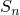, equal to the material Young's modulus divided by the thickness so that 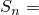 27.48 GPa/mm. Similarly a linear shear stress/shear motion relationship is used with an effective shear stiffness, 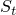, equal to the material shear modulus divided by the thickness so that 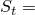 10.57 GPa/mm. The membrane behavior is specified with a Young's modulus of 68.7 GPa and a Poisson's ratio of 0.3. Sticking contact conditions are assumed in all contact areas: between the bearing surface and the flange and between the gasket and the hub. Contact between the bolt shank and the bolt hole is ignored.

The finite element idealizations of the symmetric half of the pipe joint are shown in [Figure 1.1.1--2](ch01s01aex01.md#sxmpipeflange-axisym) and [Figure 1.1.1--3](ch01s01aex01.md#sxmpipeflange-3dmodel), corresponding to the axisymmetric and three-dimensional analyses, respectively. The mesh used for the axisymmetric analysis consists of a mesh for the pipe hub/flange and gasket and a separate mesh for the bolts. In [Figure 1.1.1--2](ch01s01aex01.md#sxmpipeflange-axisym) the top figure shows the mesh of the pipe hub and flange, with the bolt hole area shown in a lighter shade; and the bottom figure shows the overall mesh with the gasket and the bolt in place.

For the axisymmetric model second-order elements with reduced integration, CAX8R, are used throughout the mesh of the pipe hub/flange. The gasket is modeled with either CAX8R solid continuum elements or GKAX6 gasket elements. Contact between the gasket and the pipe hub/flange is modeled with contact pairs between surfaces defined on the faces of elements in the contact region or between such element-based surfaces and node-based surfaces. In an axisymmetric analysis the bolts and the perforated flange must be modeled properly. The bolts are modeled as plane stress elements since they do not carry hoop stress. Second-order plane stress elements with reduced integration, CPS8R, are employed for this purpose. The contact surface definitions, which are associated with the faces of the elements, account for the plane stress condition automatically. To account for all eight bolts used in the joint, the combined cross-sectional areas of the shank and the head of the bolts must be calculated and redistributed to the bolt mesh appropriately using the area attributes for the solid elements. The contact area is adjusted automatically.

[Figure 1.1.1--4](ch01s01aex01.md#sxmpipeflange-xsects) illustrates the cross-sectional views of the bolt head and the shank. Each plane stress element represents a volume that extends out of the *x*–*y* plane. For example, element *A* represents a volume calculated as (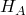)  (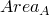). Likewise, element *B* represents a volume calculated as (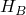)  (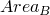). The sectional area in the *x*–*z* plane pertaining to a given element can be calculated as 

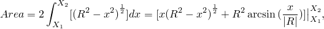

where *R* is the bolt head radius, 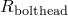, or the shank radius, 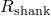 (depending on the element location), and  and  are *x*-coordinates of the left and right side of the given element, respectively.

If the sectional areas are divided by the respective element widths, 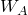 and 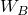, we obtain representative element thicknesses. Multiplying each element thickness by eight (the number of bolts in the model) produces the thickness values that are found in the solid section definition.

Sectional areas that are associated with bolt head elements located on the model's contact surfaces are used to calculate the surface areas of the nodes used in defining the node-based surfaces of the model. Referring again to [Figure 1.1.1--4](ch01s01aex01.md#sxmpipeflange-xsects), nodal contact areas for a single bolt are calculated as follows: 

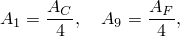

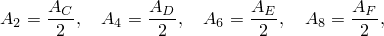

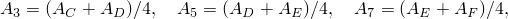

where  through 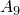 are contact areas that are associated with contact nodes 1–9 and  through 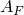 are sectional areas that are associated with bolt head elements *C*–*F*. Multiplying the above areas by eight (the number of bolts in the model) provides the nodal contact areas found in the contact property definitions.

A common way of handling the presence of the bolt holes in the pipe flange in axisymmetric analyses is to smear the material properties used in the bolt hole area of the mesh and to use inhomogeneous material properties that correspond to a weaker material in this region. General guidelines for determining the effective material properties for perforated flat plates are found in ASME Section VIII Div 2 Article 4–9. For the type of structure under study, which is not a flat plate, a common approach to determining the effective material properties is to calculate the elasticity moduli reduction factor, which is the ratio of the ligament area in the pitch circle to the annular area of the pitch circle. In this model the annular area of the pitch circle is given by  6534.51 mm2, and the total area of the bolt holes is given by 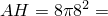 1608.5 mm2. Hence, the reduction factor is simply 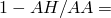 0.754. The effective in-plane moduli of elasticity, 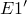 and 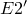, are obtained by multiplying the respective moduli, 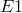 and 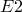, by this factor. We assume material isotropy in the *r*–*z* plane; thus, 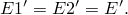 The modulus in the hoop direction, 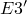, should be very small and is chosen such that 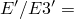 106. The in-plane shear modulus is then calculated based on the effective elasticity modulus: 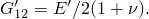 The shear moduli in the hoop direction are also calculated similarly but with  set to zero (they are not used in an axisymmetric model). Hence, we have 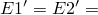 155292 MPa, 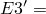 0.155292 MPa, 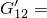 59728 MPa, and 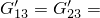 0.07765 MPa. These orthotropic elasticity moduli are specified using engineering constants for the bolt hole part of the mesh.

The mesh for the three-dimensional analysis without substructures, shown in [Figure 1.1.1--3](ch01s01aex01.md#sxmpipeflange-3dmodel), represents a 22.5 segment of the pipe joint and employs second-order brick elements with reduced integration, C3D20R, for the pipe hub/flange and bolts. The gasket is modeled with C3D20R elements or GK3D18 elements. The top figure shows the mesh of the pipe hub and flange, and the bottom figure shows both the gasket and bolt (in the lighter color). Contact is modeled by the interaction of contact surfaces defined by grouping specific faces of the elements in the contacting regions. For three-dimensional contact where both the master and slave surfaces are deformable, the small-sliding contact pair formulation must be used to indicate that small relative sliding occurs between contacting surfaces. No special adjustments need be made for the material properties used in the three-dimensional model because all parts are modeled appropriately.

Four different meshes that use substructures to model the flange are tested. A first-level substructure is created for the entire 22.5 segment of the flange shown in [Figure 1.1.1--3](ch01s01aex01.md#sxmpipeflange-3dmodel), while the gasket and the bolt are meshed as before. The nodes on the flange in contact with the bolt cap form a node-based surface, while the nodes on the flange in contact with the gasket form another node-based surface. These node-based surfaces will form contact pairs with the master surfaces on the bolt cap and on the gasket, which are defined using the surface definition options. The retained degrees of freedom on the substructure include all three degrees of freedom for the nodes in these node-based surfaces as well as for the nodes on the 0 and 22.5 faces of the flange. Appropriate boundary conditions are specified at the substructure usage level.

A second-level substructure of 45 is created by reflecting the first-level substructure with respect to the 22.5 plane. The nodes on the 22.5 face belonging to the reflected substructure are constrained in all three degrees of freedom to the corresponding nodes on the 22.5 face belonging to the original first-level substructure. The half-bolt and the gasket sector corresponding to the reflected substructure are also constructed by reflection. The retained degrees of freedom include all three degrees of freedom of all contact node sets and of the nodes on the 0 and 45 faces of the flange. MPC-type CYCLSYM is used to impose cyclic symmetric boundary conditions on these two faces.

A third-level substructure of 90 is created by reflecting the original 45 second-level substructure with respect to the 45 plane and by connecting it to the original 45 substructure. The remaining part of the gasket and the bolts corresponding to the 45–90 sector of the model is created by reflection and appropriate constraints. In this case it is not necessary to retain any degrees of freedom on the 0 and 90 faces of the flange because this 90 substructure will not be connected to other substructures and appropriate boundary conditions can be specified at the substructure creation level.

The final substructure model is set up by mirroring the 90 mesh with respect to the symmetry plane of the gasket perpendicular to the *y*-axis. Thus, an otherwise large analysis ( 750,000 unknowns) when no substructures are used can be solved conveniently ( 80,000 unknowns) by using the third-level substructure twice. The sparse solver is used because it significantly reduces the run time for this model.

Finally, a three-dimensional matrix-based model is created by replacing elements for the entire 22.5 segment of the flange shown in [Figure 1.1.1--3](ch01s01aex01.md#sxmpipeflange-3dmodel) with stiffness matrices, while the gasket and the bolt are meshed as before. Contact between the flange and gasket and the flange and bolt cap is modeled using node-based slave surfaces just as for the substructure models. Appropriate boundary conditions are applied as in the three-dimensional model without substructures.

### Loading and boundary conditions

The only boundary conditions are symmetry boundary conditions. In the axisymmetric model  0 is applied to the symmetry plane of the gasket and to the bottom of the bolts. In the three-dimensional model  0 is applied to the symmetry plane of the gasket as well as to the bottom of the bolt. The 0 and 22.5 planes are also symmetry planes. On the 22.5 plane, symmetry boundary conditions are enforced by invoking suitable nodal transformations and applying boundary conditions to local directions in this symmetry plane. These transformations are implemented using a local coordinate system definition. On both the symmetry planes, the symmetry boundary conditions  0 are imposed everywhere except for the dependent nodes associated with the C BIQUAD MPC and nodes on one side of the contact surface. The second exception is made to avoid overconstraining problems, which arise if there is a boundary condition in the same direction as a Lagrange multiplier constraint associated with the rough friction specification.

In the models where substructures are used, the boundary conditions are specified depending on what substructure is used. For the first-level 22.5 substructure the boundary conditions and constraint equations are the same as for the three-dimensional model shown in [Figure 1.1.1--3](ch01s01aex01.md#sxmpipeflange-3dmodel). For the 45 second-level substructure the symmetry boundary conditions are enforced on the 45 plane with the constraint equation 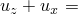 0. A transform could have been used as well. For the 90 third-level substructure the face 90 is constrained with the boundary condition  0.

For the three-dimensional model containing matrices, nodal transformations are applied for symmetric boundary conditions. Entries in the stiffness matrices for these nodes are also in local coordinates.

A clamping force of 15 kN is applied to each bolt by associating the pre-tension node with a pre-tension section. The pre-tension section is identified by means of a surface definition. The pre-tension is then prescribed by applying a concentrated load to the pre-tension node. In the axisymmetric analysis the actual load applied is 120 kN since there are eight bolts. In the three-dimensional model with no substructures the actual load applied is 7.5 kN since only half of a bolt is modeled. In the models using substructures all half-bolts are loaded with a 7.5 kN force. For all of the models the pre-tension section is specified about halfway down the bolt shank.

Sticking contact conditions are assumed in all surface interactions in all analyses and are simulated with rough friction and no-separation contact.

### Results and discussion

All analyses are performed as small-displacement analyses.

[Figure 1.1.1--5](ch01s01aex01.md#sxmpipeflange-normsol) shows a top view of the normal stress distributions in the gasket at the interface between the gasket and the pipe hub/flange predicted by the axisymmetric (bottom) and three-dimensional (top) analyses when solid continuum elements are used to model the gasket. The figure shows that the compressive normal stress is highest at the outer edge of the gasket, decreases radially inward, and changes from compression to tension at a radius of about 35 mm, which is consistent with findings reported by Sawa et al. (1991). The close agreement in the overall solution between axisymmetric and three-dimensional analyses is quite apparent, indicating that, for such problems, axisymmetric analysis offers a simple yet reasonably accurate alternative to three-dimensional analysis.

[Figure 1.1.1--6](ch01s01aex01.md#sxmpipeflange-normgas) shows a top view of the normal stress distributions in the gasket at the interface between the gasket and the pipe hub/flange predicted by the axisymmetric (bottom) and three-dimensional (top) analyses when gasket elements are used to model the gasket. Close agreement in the overall solution between the axisymmetric and three-dimensional analyses is also seen in this case. The gasket starts carrying compressive load at a radius of about 40 mm, a difference of 5 mm with the previous result. This difference is the result of the gasket elements being unable to carry tensile loads in their thickness direction. This solution is physically more realistic since, in most cases, gaskets separate from their neighboring parts when subjected to tensile loading. Removing the no-separation contact from the gasket/flange contact surface definition in the input files that model the gasket with continuum elements yields good agreement with the results obtained in [Figure 1.1.1--6](ch01s01aex01.md#sxmpipeflange-normgas) (since, in that case, the solid continuum elements in the gasket cannot carry tensile loading in the gasket thickness direction).

The models in this example can be modified to study other factors, such as the effective seating width of the gasket or the sealing performance of the gasket under operating loads. The gasket elements offer the advantage of allowing very complex behavior to be defined in the gasket thickness direction. Gasket elements can also use any of the small-strain material models provided in Abaqus including user-defined material models. [Figure 1.1.1--7](ch01s01aex01.md#sxmpipeflange-isogas) shows a comparison of the normal stress distributions in the gasket at the interface between the gasket and the pipe hub/flange predicted by the axisymmetric (bottom) and three-dimensional (top) analyses when isotropic material properties are prescribed for gasket elements. The results in [Figure 1.1.1--7](ch01s01aex01.md#sxmpipeflange-isogas) compare well with the results in [Figure 1.1.1--5](ch01s01aex01.md#sxmpipeflange-normsol) from analyses in which solid and axisymmetric elements are used to simulate the gasket.

[Figure 1.1.1--8](ch01s01aex01.md#sxmpipeflange-zlinestress) shows the distribution of the normal stresses in the gasket at the interface in the plane  0. The results are plotted for the three-dimensional model containing only solid continuum elements and no substructures, for the three-dimensional model with matrices, and for the four models containing the substructures described above.

An execution procedure is available to combine model and results data from two substructure output databases into a single output database. For more information, see ["Combining output from substructures," Section 3.2.22 of the Abaqus Analysis User's Guide](../usb/usb-link.md#usb-int-dsubstructurecombineproc).

This example can also be used to demonstrate the effectiveness of the quasi-Newton nonlinear solver. This solver utilizes an inexpensive, approximate stiffness matrix update for several consecutive equilibrium iterations, rather than a complete stiffness matrix factorization each iteration as used in the default full Newton method. The quasi-Newton method results in an increased number of less expensive iterations, and a net savings in computing cost.

### Input files

[boltpipeflange_axi_solidgask.inp](../eif/boltpipeflange_axi_solidgask.inp)

Axisymmetric analysis containing a gasket modeled with solid continuum elements.

[boltpipeflange_axi_node.inp](../eif/boltpipeflange_axi_node.inp)

Node definitions for boltpipeflange_axi_solidgask.inp and boltpipeflange_axi_gkax6.inp.

[boltpipeflange_axi_element.inp](../eif/boltpipeflange_axi_element.inp)

Element definitions for boltpipeflange_axi_solidgask.inp.

[boltpipeflange_3d_solidgask.inp](../eif/boltpipeflange_3d_solidgask.inp)

Three-dimensional analysis containing a gasket modeled with solid continuum elements.

[boltpipeflange_axi_gkax6.inp](../eif/boltpipeflange_axi_gkax6.inp)

Axisymmetric analysis containing a gasket modeled with gasket elements.

[boltpipeflange_3d_gk3d18.inp](../eif/boltpipeflange_3d_gk3d18.inp)

Three-dimensional analysis containing a gasket modeled with gasket elements.

[boltpipeflange_3d_substr1.inp](../eif/boltpipeflange_3d_substr1.inp)

Three-dimensional analysis using the first-level substructure (22.5 model).

[boltpipeflange_3d_substr2.inp](../eif/boltpipeflange_3d_substr2.inp)

Three-dimensional analysis using the second-level substructure (45 model).

[boltpipeflange_3d_substr3_1.inp](../eif/boltpipeflange_3d_substr3_1.inp)

Three-dimensional analysis using the third-level substructure once (90 model).

[boltpipeflange_3d_substr3_2.inp](../eif/boltpipeflange_3d_substr3_2.inp)

Three-dimensional analysis using the third-level substructure twice (90 mirrored model).

[boltpipeflange_3d_gen1.inp](../eif/boltpipeflange_3d_gen1.inp)

First-level substructure generation data referenced by boltpipeflange_3d_substr1.inp and boltpipeflange_3d_gen2.inp.

[boltpipeflange_3d_gen2.inp](../eif/boltpipeflange_3d_gen2.inp)

Second-level substructure generation data referenced by boltpipeflange_3d_substr2.inp and boltpipeflange_3d_gen3.inp.

[boltpipeflange_3d_gen3.inp](../eif/boltpipeflange_3d_gen3.inp)

Third-level substructure generation data referenced by boltpipeflange_3d_substr3_1.inp and boltpipeflange_3d_substr3_2.inp.

[boltpipeflange_3d_node.inp](../eif/boltpipeflange_3d_node.inp)

Nodal coordinates used in boltpipeflange_3d_substr1.inp, boltpipeflange_3d_substr2.inp, boltpipeflange_3d_substr3_1.inp, boltpipeflange_3d_substr3_2.inp, boltpipeflange_3d_cyclsym.inp, boltpipeflange_3d_gen1.inp, boltpipeflange_3d_gen2.inp, and boltpipeflange_3d_gen3.inp.

[boltpipeflange_3d_cyclsym.inp](../eif/boltpipeflange_3d_cyclsym.inp)

Same as file boltpipeflange_3d_substr2.inp except that CYCLSYM type MPCs are used.

[boltpipeflange_3d_missnode.inp](../eif/boltpipeflange_3d_missnode.inp)

Same as file boltpipeflange_3d_gk3d18.inp except that the option to generate missing nodes is used for gasket elements.

[boltpipeflange_3d_isomat.inp](../eif/boltpipeflange_3d_isomat.inp)

Same as file boltpipeflange_3d_gk3d18.inp except that gasket elements are modeled as isotropic using the [*MATERIAL](../key/key-link.md#usb-kws-mmaterial) option.

[boltpipeflange_3d_ortho.inp](../eif/boltpipeflange_3d_ortho.inp)

Same as file boltpipeflange_3d_gk3d18.inp except that gasket elements are modeled as orthotropic and the [*ORIENTATION](../key/key-link.md#usb-kws-morientation) option is used.

[boltpipeflange_axi_isomat.inp](../eif/boltpipeflange_axi_isomat.inp)

Same as file boltpipeflange_axi_gkax6.inp except that gasket elements are modeled as isotropic using the [*MATERIAL](../key/key-link.md#usb-kws-mmaterial) option.

[boltpipeflange_3d_usr_umat.inp](../eif/boltpipeflange_3d_usr_umat.inp)

Same as file boltpipeflange_3d_gk3d18.inp except that gasket elements are modeled as isotropic with user subroutine [`UMAT`](../sub/sub-link.md#sub-xsl-umat).

[boltpipeflange_3d_usr_umat.f](../eif/boltpipeflange_3d_usr_umat.f)

User subroutine [`UMAT`](../sub/sub-link.md#sub-xsl-umat) used in boltpipeflange_3d_usr_umat.inp.

[boltpipeflange_3d_solidnum.inp](../eif/boltpipeflange_3d_solidnum.inp)

Same as file boltpipeflange_3d_gk3d18.inp except that solid element numbering is used for gasket elements.

[boltpipeflange_3d_matrix.inp](../eif/boltpipeflange_3d_matrix.inp)

Three-dimensional analysis containing matrices and a gasket modeled with solid continuum elements.

[boltpipeflange_3d_stiffPID4.inp](../eif/boltpipeflange_3d_stiffPID4.inp)

Matrix representing stiffness of a part of the flange segment for three-dimensional analysis containing matrices.

[boltpipeflange_3d_stiffPID5.inp](../eif/boltpipeflange_3d_stiffPID5.inp)

Matrix representing stiffness of the remaining part of the flange segment for three-dimensional analysis containing matrices.

[boltpipeflange_3d_qn.inp](../eif/boltpipeflange_3d_qn.inp)

Same as file boltpipeflange_3d_gk3d18.inp except that the quasi-Newton nonlinear solver is used.

### References

Bibel,  G. D., and R. M. Ezell, “An Improved Flange Bolt-Up Procedure Using Experimentally Determined Elastic Interaction Coefficients,” Journal of Pressure Vessel Technology, vol. 114, pp. 439–443, 1992.

Chaaban,  A., and U. Muzzo, “Finite Element Analysis of Residual Stresses in Threaded End Closures,” Transactions of ASME, vol. 113, pp. 398–401, 1991.

Fukuoka,  T., “Finite Element Simulation of Tightening Process of Bolted Joint with a Tensioner,” Journal of Pressure Vessel Technology, vol. 114, pp. 433–438, 1992.

Sawa,  T., N. Higurashi, and H. Akagawa, “A Stress Analysis of Pipe Flange Connections,” Journal of Pressure Vessel Technology, vol. 113, pp. 497–503, 1991.

### Figures

**Figure 1.1.1–1** Schematic of the bolted joint. All dimensions in mm.

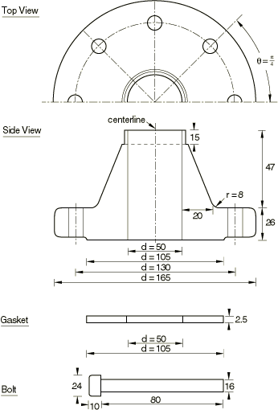

**Figure 1.1.1–2** Axisymmetric model of the bolted joint.

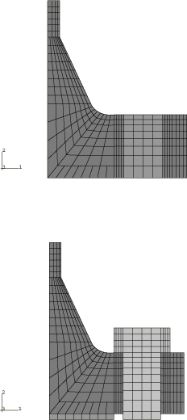

**Figure 1.1.1–3** 22.5 segment three-dimensional model of the bolted joint.

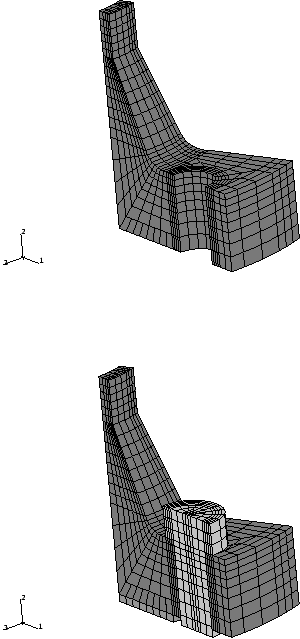

**Figure 1.1.1–4** Cross-sectional views of the bolt head and the shank.

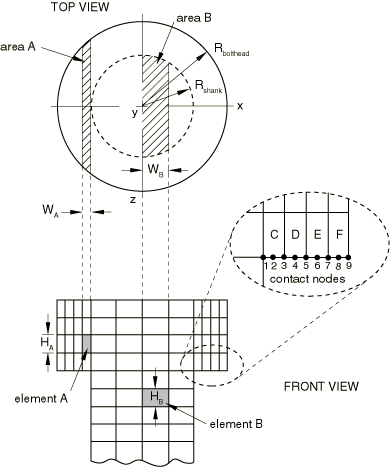

**Figure 1.1.1–5** Normal stress distribution in the gasket contact surface when solid elements are used to model the gasket: three-dimensional versus axisymmetric results.

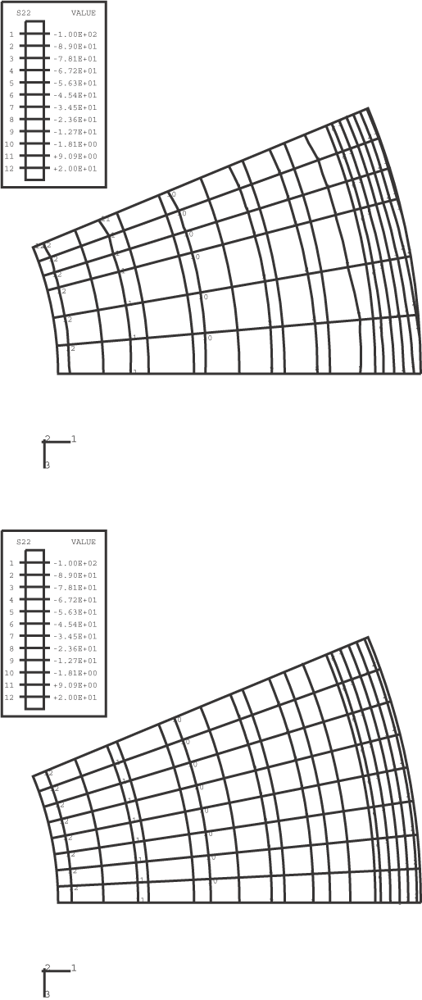

**Figure 1.1.1–6** Normal stress distribution in the gasket contact surface when gasket elements are used with direct specification of the gasket behavior: three-dimensional versus axisymmetric results.

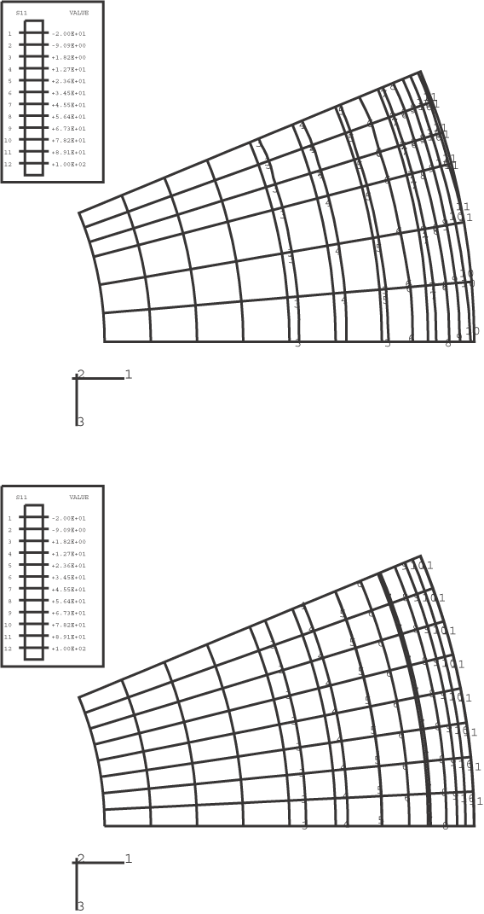

**Figure 1.1.1–7** Normal stress distribution in the gasket contact surface when gasket elements are used with isotropic material properties: three-dimensional versus axisymmetric results.

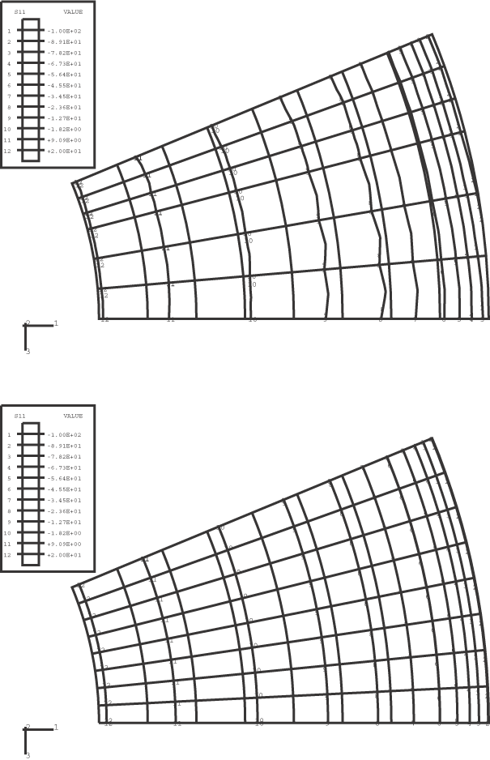

**Figure 1.1.1–8** Normal stress distribution in the gasket contact surface along the line  0 for the models with and without substructures.

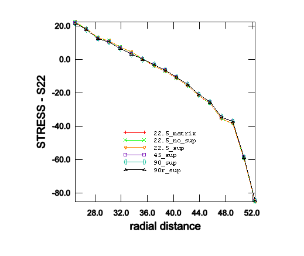

