# 1.1.2 薄壁弯头在面内弯曲和内压下的弹塑性失稳

**产品：** Abaqus/Standard   

弯头用于管道系统，因为它们比直管更容易椭圆化，从而为热膨胀和其他对系统施加较大位移的载荷提供灵活性。椭圆化是管道壁弯曲成椭圆形（即非圆形）构型。因此，弯头表现为壳体而非梁体。直管段不易椭圆化，因此基本上表现为梁体。因此，即使在纯弯曲情况下，弯头与相邻直管段之间也会产生复杂的相互作用；弯头在直管段中引起一些椭圆化，而这些直管段又倾向于使弯头 stiffen。这种相互作用可以在弯头中产生显著的轴向弯曲应变梯度，特别是在弯头非常灵活的情况下。本示例通过分析一个实验结果已被报道的测试弯头（Sobel 和 Newman，1979），提供了对壳单元和弯头单元建模此类效果的验证。还包括使用 ELBOW31B 型单元（包含椭圆化但忽略应变轴向梯度）的弯头和直管段的梁单元的分析。这提供了一个比较解，其中忽略弯头与相邻直管之间的相互作用。分析预测了弯头两侧相当大旋转下的响应，以研究管道可能的失稳，特别是内压对该失稳的影响。

### 几何和模型

研究中使用的弯头构型如[图 1.1.2-1](ch01s01aex02.md#sxmelbow-geom)所示。它是一个具有弯头系数

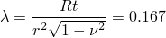

和半径比 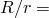 3.07 的薄壁弯头，因此 Dodge 和 Moore（1972）的柔度系数为 10.3。（弯头的柔度系数是弯头段弯曲柔度与相同尺寸直管弯曲柔度的比值，适用于小位移和弹性响应。）这是一个极其灵活的案例，因为管道壁非常薄。

为了演示整体矩-转角行为相对于网格的收敛性，分析了[图 1.1.2-2](ch01s01aex02.md#sxmelbow-models)中所示的两个壳单元网格。由于载荷仅涉及面内弯曲，假定响应对系统中间平面对称，因此在壳单元模型中只需建模系统的一半。使用 S8R5 单元类型，因为测试表明这是 Abaqus 中最具成本效益的壳单元（使用 S9R5、STRI65 和 S8R 单元类型的本示例输入文件包含在 Abaqus 版本中）。弯头单元网格用一到两个 ELBOW32 或 ELBOW31 单元替换较粗壳单元模型中的每个轴向划分，并使用 4 或 6 个傅里叶模态来模拟管道周围的变形。在所有分析中，通过管道壁使用七个积分点。这通常足以在预期基本单调应变的情况下准确建模截面中屈服过程的进展。

在实验中，系统的端部刚性连接到刚性板。这些边界条件可以容易地为 ELBOW 单元和壳单元模型中的固定端建模。对于壳单元模型的旋转端，壳单元节点必须使用运动耦合约束约束到代表端板运动的梁节点，如下所述。

材料假定为各向同性弹塑性，遵循 Sobel 和 Newman（1979）报道的室温下 304 不锈钢的测量响应。由于所有分析给出的结果比实验测量的响应更 stiff，且网格收敛测试（结果如下讨论）表明网格相对于系统整体响应是收敛的，因此该应力-应变模型可能高估了材料的实际强度。

### 载荷

管道上的载荷有两个组成部分：由内压（具有封闭端条件）组成的"死"载荷，以及施加到系统端部的"活"面内弯矩。压力在初始步骤中施加到模型，然后在第二步分析中保持恒定，同时弯矩增加。压力值范围为 0.0 至 3.45 MPa（500 lb/in2），这是设计感兴趣的范围内。与封闭端条件相关的等效端力作为跟随力施加，因为它随端平面的运动而旋转。

### 运动边界条件

系统的固定端假定为完全嵌入式。加载端固定到一个非常刚性的板中。对于 ELBOW 单元模型，此条件由应用于该节点的 `NODEFORM` 边界条件表示。在壳单元模型中，这个刚性板由单个节点表示，端部的壳单元节点通过使用运动耦合约束并指定壳单元节点的所有自由度约束到该单个节点的运动来连接到它。

### 结果和讨论

在[图 1.1.2-3](ch01s01aex02.md#sxmelbow-mr-converge)中比较了各种分析模型预测的矩-转角响应以及在零内压下测量的实验响应。该图显示，两个壳模型给出非常相似的结果，比实验测量的失稳弯矩高约 15%。6模态 ELBOW 单元模型比壳模型更 stiff，而 4个傅里叶模态的模型则过于 stiff。这清楚地表明，对于这个非常灵活的系统，弯头的椭圆化过于局部化，即使 6模态 ELBOW 表示也无法提供准确的结果。

由于我们知道壳模型相对于离散是收敛的，与实验测量响应相比过度 stiff 的最可能解释是分析中使用的材料模型太强。Sobel 和 Newman（1979）指出，本分析中使用和测量的应力-应变曲线（[图 1.1.2-1](ch01s01aex02.md#sxmelbow-geom)）的 0.2% 偏移屈服比《核系统材料手册》中室温下 304 不锈钢的值高 20%，这表明应力-应变曲线测量使用的钢锭可能取自制造中较强的部分。如果是这样，它表明所测试的弯头在强度特性上相当不均匀，尽管其制造过程中采取了谨慎措施。我们得出结论，在实际案例中无法消除这种程度的不一致性，此类分析结果的设计使用必须考虑到这一点。

[图 1.1.2-4](ch01s01aex02.md#sxmelbow-mr-pressure) 比较了在 0 和 3.45 MPa（500 lb/in2）内压下开启和关闭弯矩的矩-转角响应，并显示了大位移效应的强烈影响。如果大位移效应不重要，开启和关闭弯矩将产生相同的响应。然而，即使跨弯头组件有 1 相对旋转，开启和关闭弯矩也相差约 12%；有 2 相对旋转时，差异约为 17%。这种程度的相对旋转通常不会被认为是大的；在本案例中，与椭圆化的耦合使几何非线性变得重要。随着旋转增加，关闭弯矩加载情况显示失稳，而开启弯矩曲线则没有。在两种情况下，内压对结果都有显著影响，这对于这种薄壁管道来说是预期的。直管与弯头之间相互作用程度在外壁应变分布中得到了很好的说明，如[图 1.1.2-5](ch01s01aex02.md#sxmelbow-straindist)所示。应变等值线在弯曲段末端略微不连续，因为这些截面的壳厚度发生变化。

[图 1.1.2-6](ch01s01aex02.md#sxmelbow-momresults) 显示了本示例和 ["Uniform collapse of straight and curved pipe segments," Section 1.1.5 of the Abaqus Benchmarks Guide](../bmk/bmk-link.md#bmk-anl-unifcollapsepipe) 的结果摘要。该图显示了内压函数的面内弯曲下关闭弯矩的失稳值。压力对失稳的强烈影响是显而易见的。此外，还显示了在忽略直段和弯曲段之间相互作用的情况下分析弯头的效果："均匀弯曲"结果是通过在弯曲处使用 ELBOW31B 型单元和在直段使用梁（B31）单元获得的。直/弯头相互作用的重要性是显而易见的。在这种情况下，忽略相互作用的简化分析是保守的（因为它始终给出较低的失稳弯矩值），但不能认为这种保守是理所当然的。Sobel 和 Newman（1979）的分析也忽略了相互作用，与这里获得的结果非常一致。

为了比较，还显示了 Goodall（1978）的小位移极限分析结果，以及他的大位移弹塑性下界（Goodall，1978a）。从这个比较也可以看出大位移效应的 主要重要性。

使用 ELBOW31 单元的模型获得的详细结果如[图 1.1.2-7](ch01s01aex02.md#sxmelbow-miseslength) 到[图 1.1.2-9](ch01s01aex02.md#sxmelbow-oval)所示。[图 1.1.2-7](ch01s01aex02.md#sxmelbow-miseslength) 显示了沿管道系统长度的 Mises 应力变化。长度沿管道中心线从加载端开始测量。该图比较了元件内表面和外表面（分别为截面点 1 和 7）内弧（积分点 1）的应力分布。[图 1.1.2-8](ch01s01aex02.md#sxmelbow-misescirc) 显示了位于模型弯曲段两个单元（451 和 751）周围的 Mises 应力变化；结果针对单元的内表面（截面点 1）。[图 1.1.2-9](ch01s01aex02.md#sxmelbow-oval) 显示了单元 451 和 751 的椭圆化。图中包含了一个非椭圆化的圆形横截面以便比较。从图中可以看到，位于弯曲段中心的单元 751 经历了最严重的椭圆化。这三个图是用弯头单元后处理程序 `felbow.f`（["Creation of a data file to facilitate the postprocessing of elbow element results: FELBOW," Section 15.1.6](ch15s01aex159.md)）生成的，该程序用 FORTRAN 编写。后处理程序 `felbow.C`（["A C++ version of FELBOW," Section 10.15.6 of the Abaqus Scripting User's Guide](../cmd/cmd-link.md#cmd-odb-intro-felbow-cpp)）和 `felbow.py`（["An Abaqus Scripting Interface version of FELBOW," Section 9.10.12 of the Abaqus Scripting User's Guide](../cmd/cmd-link.md#cmd-odb-intro-felbow-pyc)）分别用 C++ 和 Python 编写，也可用于生成[图 1.1.2-8](ch01s01aex02.md#sxmelbow-misescirc)和[图 1.1.2-9](ch01s01aex02.md#sxmelbow-oval)等图的数据。用户必须确保输出变量被写入输出数据库以使用这两个程序。

### 壳到实体子模型

使用壳到实体子模型技术分析了一个特定案例。此问题验证了双曲面情况下的插值方案。使用 C3D27R 单元在管道弯头部分周围创建了实体子模型，跨越 40 角。更精细的子模型网格在厚度方向有 3 个单元，在圆柱体半周上有 10 个单元，沿弯头长度有 10 个单元。两端由 S8R 单元组成的全局壳模型驱动。静态子模型分析的时间尺度对应于全局 Riks 分析中的弧长。子模型结果与壳模型非常一致。穿过子模型的横截面上的总力和总矩被写入结果（`.fil`）文件。

### 壳到实体耦合

包含了一个使用 Abaqus 中壳到实体耦合功能的模型。这样的模型可用于仔细研究弯头中的应力和应变场。整个弯头用 C3D20R 单元网格划分，直管段用 S8R 单元网格划分（见[图 1.1.2-10](ch01s01aex02.md#sxmelbow-shell2solid)）。在[图 1.1.2-10](ch01s01aex02.md#sxmelbow-shell2solid)中所示的每个壳到实体界面上，在实体网格边缘上定义基于单元的表面，在壳网格边缘上定义基于边缘的表面。壳到实体耦合约束与这些表面结合使用，以耦合壳和实体网格。

在每个管道段的末端定义基于边缘的表面。这些表面通过分布式耦合约束耦合到在管道中心定义的参考节点。载荷和固定边界条件应用于参考点。使用此方法的优点是管道横截面积可以自由变形；因此，末端的椭圆化不受约束。壳到实体耦合模型的矩-转角响应与[图 1.1.2-4](ch01s01aex02.md#sxmelbow-mr-pressure)中显示的结果非常一致。

### 输入文件

在以下所有输入文件中（[elbowcollapse_elbow31b_b31.inp](../eif/elbowcollapse_elbow31b_b31.inp)、[elbowcollapse_s8r5_fine.inp](../eif/elbowcollapse_s8r5_fine.inp) 和 [elbowcolpse_shl2sld_s8r_c3d20r.inp](../eif/elbowcolpse_shl2sld_s8r_c3d20r.inp) 除外），应用压力载荷的步骤已被注释掉。要在任何给定分析中包含内压的影响，请取消注释相应输入文件中的步骤定义。

[elbowcollapse_elbow31b_b31.inp](../eif/elbowcollapse_elbow31b_b31.inp)

ELBOW31B 和 B31 单元模型。

[elbowcollapse_elbow31_6four.inp](../eif/elbowcollapse_elbow31_6four.inp)

带 6 个傅里叶模态的 ELBOW31 模型。

[elbowcollapse_elbow32_6four.inp](../eif/elbowcollapse_elbow32_6four.inp)

带 6 个傅里叶模态的 ELBOW32 模型。

[elbowcollapse_s8r.inp](../eif/elbowcollapse_s8r.inp)

S8R 单元模型。

[elbowcollapse_s8r5.inp](../eif/elbowcollapse_s8r5.inp)

S8R5 单元模型。

[elbowcollapse_s8r5_fine.inp](../eif/elbowcollapse_s8r5_fine.inp)

更细的 S8R5 单元模型。

[elbowcollapse_s9r5.inp](../eif/elbowcollapse_s9r5.inp)

S9R5 单元模型。

[elbowcollapse_stri65.inp](../eif/elbowcollapse_stri65.inp)

STRI65 单元模型。

[elbowcollapse_submod.inp](../eif/elbowcollapse_submod.inp)

使用 C3D27R 单元的子模型。

[elbowcolpse_shl2sld_s8r_c3d20r.inp](../eif/elbowcolpse_shl2sld_s8r_c3d20r.inp)

使用 S8R 和 C3D20R 单元的壳到实体耦合模型。

### 参考文献

Dodge, W. G., and S. E. Moore, "Stress Indices and Flexibility Factors for Moment Loadings on Elbows and Curved Pipes," Welding Research Council Bulletin, no.179, 1972.

Goodall, I. W., "Lower Bound Limit Analysis of Curved Tubes Loaded by Combined Internal Pressure and In-Plane Bending Moment," Research Division Report RD/B/N4360, Central Electricity Generating Board, England, 1978.

Goodall, I. W., "Large Deformations in Plastically Deforming Curved Tubes Subjected to In-Plane Bending," Research Division Report RD/B/N4312, Central Electricity Generating Board, England, 1978a.

Sobel, L. H., and S. Z. Newman, "Elastic-Plastic In-Plane Bending and Buckling of an Elbow: Comparison of Experimental and Simplified Analysis Results," Westinghouse Advanced Reactors Division, Report WARD-HT-94000-2, 1979.

### 图

**图 1.1.2-1** MLTF 弯头：几何和测量材料响应。

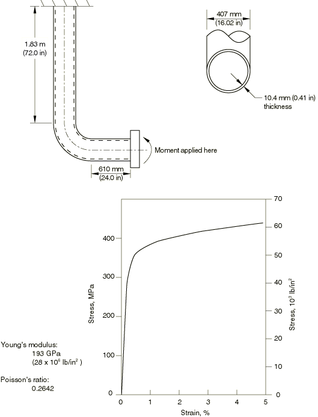

**图 1.1.2-2** 弯头/管道相互作用研究模型。

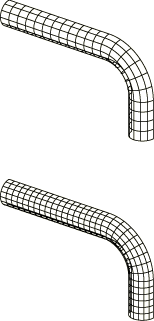

**图 1.1.2-3** 矩-转角响应：网格收敛研究。

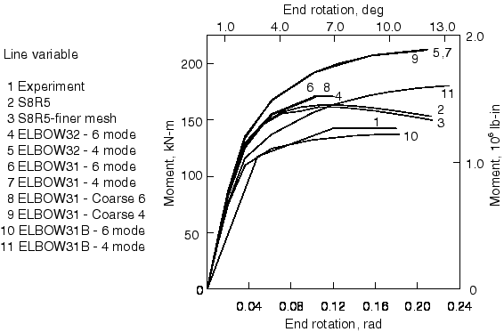

**图 1.1.2-4** 矩-转角响应：压力依赖性。

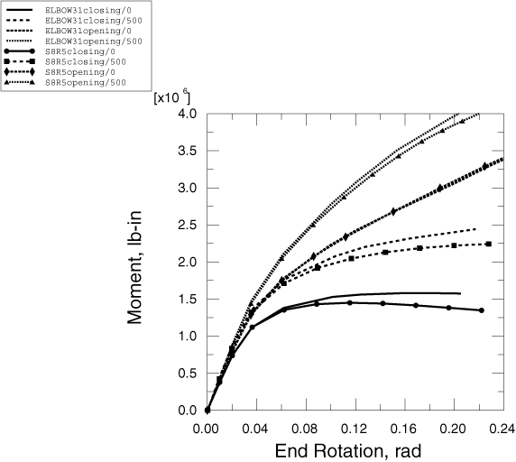

**图 1.1.2-5** 外表面应变分布：关闭弯矩情况。

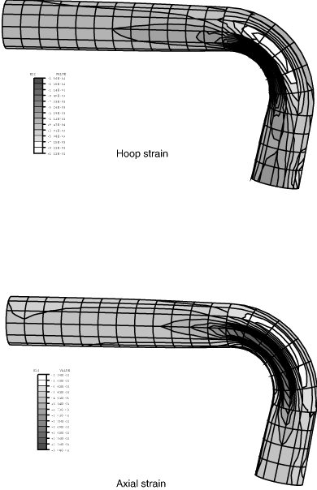

**图 1.1.2-6** 弯头的面内弯曲，弹塑性失稳弯矩结果。

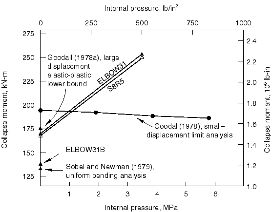

**图 1.1.2-7** 沿管道系统长度的 Mises 应力分布。

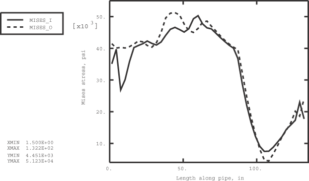

**图 1.1.2-8** 单元 451 和 751 周长的 Mises 应力分布。

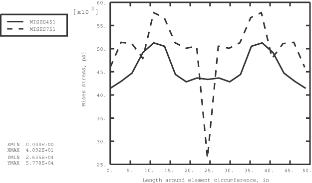

**图 1.1.2-9** 单元 451 和 751 的椭圆化。

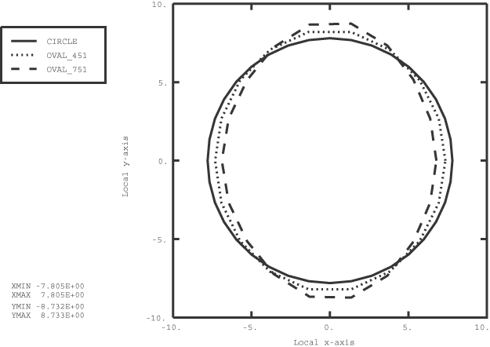

**图 1.1.2-10** 壳到实体耦合模型研究。

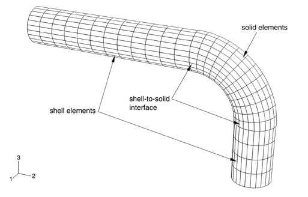

