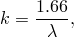
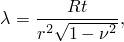
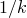
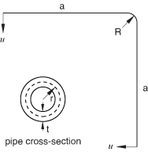
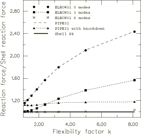
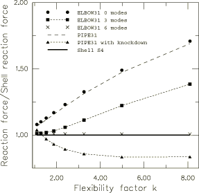
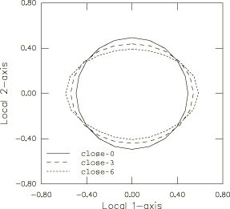
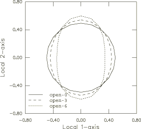
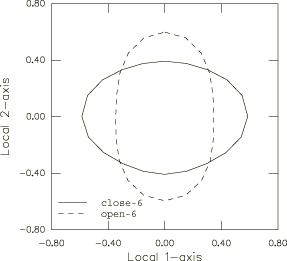

# 1.1.3 线性弹性管道在面内弯曲下的参数化研究


**产品：** Abaqus/Standard  Abaqus/Explicit   

弯头用于管道系统，因为它们比直管更容易椭圆化，从而为热膨胀和其他对系统施加较大位移的载荷提供灵活性。椭圆化是管道壁弯曲成椭圆形（即非圆形）构型。因此，弯头表现为壳体而非梁体。本示例展示了弯头单元（["Pipes and pipebends with deforming cross-sections: elbow elements," Section 29.5.1 of the Abaqus Analysis User's Guide](../usb/usb-link.md#usb-elm-eelbows)）在椭圆化引起的横截面变形显著时准确建模初始圆形管道和弯头非线性响应的能力。它还提供了一些关于在弯头单元中包含足够数量的傅里叶模态以准确捕获椭圆化的重要性指南。此外，本示例说明了在尝试以特别方式使用简单梁单元的"柔度折减系数"来捕获大位移分析中椭圆化效应时的缺点。包含了在 Abaqus/Explicit 中涉及管道单元的类似分析。

### 几何和模型

研究中使用的管道构型如[图 1.1.3-1](ch01s01aex03.md#sxmelbowtest-geom)所示。它是一个由两个直管段连接 90 弯头的简单模型。直管长度为 25.4 cm（10.0 英寸），弯曲段半径为 10.16 cm（4.0 英寸），管道段外半径为 1.27 cm（0.5 英寸）。管道的壁厚在参数化研究中从 0.03175 cm 到 0.2032 cm（0.0125 英寸到 0.08 英寸）变化，如下所述。管道材料假定为各向同性线弹性，杨氏模量为 194 GPa（28.1  106 psi），泊松比为 0.0。假定管道的直段足够长，以至于结构末端的翘曲可以忽略。

分析了两种载荷条件。第一种情况如[图 1.1.3-1](ch01s01aex03.md#sxmelbowtest-geom)所示，在结构两端施加单位内向位移。此载荷条件具有使管道向自身闭合的效果。在第二种情况下，施加的单位位移的方向是向外的，使管道打开。两种情况都被认为是大位移/小应变分析。

执行了比较不同单元类型（壳、弯头和管道）在一系列柔度系数 *k* 下的结果的参数化研究。如 Dodge 和 Moore（1972）所定义的，弯头的柔度系数是弯头段弯曲柔度与相同尺寸直管弯曲柔度的比值，假设小位移和弹性响应。当内（表压）压力为零时（如本研究所假设的），*k* 可以近似为



其中



*R* 是弯曲段的弯曲半径，*r* 是管道的平均半径，*t* 是管道壁厚， 是泊松比。柔度系数的变化是通过改变管道壁厚引入的。

管道用三种不同单元类型建模：S4 壳单元、ELBOW31 弯头单元和 PIPE31 管道单元。S4 壳单元模型由相对精细的网格组成，沿圆周有 40 个单元，沿长度有 75 个单元。这个网格被认为足够精细以准确捕获管道的真实响应，尽管没有执行网格收敛研究。使用壳网格进行了两次分析：一次使用恒定阻尼系数的自动稳定（见 ["Automatic stabilization of static problems with a constant damping factor" in "Solving nonlinear problems," Section 7.1.1 of the Abaqus Analysis User's Guide](../usb/usb-link.md#usb-anl-anonlineareqns-stabilize)），一次使用自适应自动稳定（见 ["Adaptive automatic stabilization scheme" in "Solving nonlinear problems," Section 7.1.1 of the Abaqus Analysis User's Guide](../usb/usb-link.md#usb-anl-anonlineareqns-stabilize-adaptive)）。管道和弯头单元网格沿长度由 75 个单元组成；这些单元类型的分析不使用自动稳定。

使用具有恒定阻尼系数的自动稳定的壳单元模型的结果被作为参考解。管道末端的反力用于评估管道和弯头单元的有效性。此外，还比较了弯头单元模型预测的管道横截面的椭圆化值。

弯头单元分别用 0、3 和 6 个傅里叶模态进行测试。一般来说，随着使用的模态数量增加，弯头单元精度提高，但计算成本也相应增加。除了标准管道单元外，还使用特殊的柔度折减系数对管道单元进行测试。柔度折减系数（Dodge 和 Moore，1972）是基于线性半解析结果对弯曲刚度的修正。它们被应用于简单梁单元，以尝试捕获椭圆化的整体效应。折减系数通过将真实厚度按柔度系数缩放来实现于 PIPE31 单元中；这等同于将管道单元的惯性矩按  缩放。

### 结果和讨论

使用具有恒定阻尼系数的自动稳定的壳单元模型的结果被作为参考解。使用相同网格的自适应自动稳定方案获得了非常相似的结果。

[图 1.1.3-2](ch01s01aex03.md#sxmelbowtest-close) 显示了由于内向位移引起的各种分析模型的末端反力。结果相对于壳模型获得的结果进行了归一化。使用 6 个傅里叶模态的 ELBOW31 单元模型的结果与整个研究考虑的柔度系数范围内的参考解显示出极好的一致性。其余四个模型在所有 *k* 值下通常表现出过度刚性的响应。使用柔度折减系数的 PIPE31 单元模型在整个柔度系数范围内显示出相对恒定的约 20% 误差。没有折减系数的 0模态 ELBOW31 单元模型和 PIPE31 单元模型在所有 *k* 值下产生非常相似的结果。

[图 1.1.3-3](ch01s01aex03.md#sxmelbowtest-open) 显示了由于外向单位位移引起的各种分析模型的归一化末端反力。同样，使用 6 模态 ELBOW31 单元模型的结果与参考壳解比较良好。0模态和 3模态 ELBOW31 以及没有柔度折减系数的 PIPE31 单元模型表现出过度刚性的响应。具有折减系数的 PIPE31 单元模型在 *k* = 1.5 附近有一个过渡区域，其中响应从过于刚性变为过于柔性。Abaqus/Explicit 中管道单元的结果与 Abaqus/Standard 中获得的结果一致。

[图 1.1.3-4](ch01s01aex03.md#sxmelbowtest-ovalc) 和[图 1.1.3-5](ch01s01aex03.md#sxmelbowtest-ovalo) 说明了所包含傅里叶模态数量（0、3 和 6）对弯头单元在本研究考虑的两种载荷情况下准确建模弯头中椭圆化能力的影响。根据定义，0模态模型不能椭圆化，这解释了其刚性响应。3模态和 6模态模型在两种载荷情况下都显示出显著的椭圆化。[图 1.1.3-6](ch01s01aex03.md#sxmelbowtest-ovaloc) 比较了 6模态模型在打开和关闭变形状态下的椭圆化。它清楚地说明了当管道两端向内位移（关闭模式）时，管道横截面的高度变小，从而降低了管道的整体刚度；当管道两端向外位移时，情况相反：管道横截面的高度变大，从而增加了管道的刚度。这三个图是用弯头单元后处理程序 `felbow.f`（["Creation of a data file to facilitate the postprocessing of elbow element results: FELBOW," Section 15.1.6](ch15s01aex159.md)）生成的，该程序用 FORTRAN 编写。后处理程序 `felbow.C`（["A C++ version of FELBOW," Section 10.15.6 of the Abaqus Scripting User's Guide](../cmd/cmd-link.md#cmd-odb-intro-felbow-cpp)）和 `felbow.py`（["An Abaqus Scripting Interface version of FELBOW," Section 9.10.12 of the Abaqus Scripting User's Guide](../cmd/cmd-link.md#cmd-odb-intro-felbow-pyc)）分别用 C++ 和 Python 编写，也可用于生成这些图的数据。用户必须确保输出变量被写入输出数据库以使用这两个程序。

### 参数化研究

本示例中研究的管道和弯头单元的性能可以使用 Abaqus 的 Python 脚本功能方便地进行参数化分析（["Scripting parametric studies," Section 20.1.1 of the Abaqus Analysis User's Guide](../usb/usb-link.md#usb-scr-pscriptparstudies)）。我们执行一个参数化研究，其中为上述讨论的三种单元类型（S4、ELBOW31 和 PIPE31）中的每种自动执行八次分析；这些参数化研究对应于从 0.03175 cm 到 0.2032 cm（0.0125 英寸到 0.08 英寸）的壁厚值。

Python 脚本文件 [elbowtest.psf](../eif/elbowtest.psf) 用于执行参数化研究。函数 `customTable`（如下所示）是高级 Python 脚本的示例（Lutz 和 Ascher，1999），用于 [elbowtest.psf](../eif/elbowtest.psf)。这种高级脚本通常不是必需的，但在这种情况下，像 *k* 这样的因变量不能作为数据列包含在 XYPLOT 文件中。`customTable` 旨在通过从参数化研究获取 XYPLOT 文件并将其转换为反力与柔度系数（*k*）的新文件来克服此限制。

```
###############################################################
#
def customTable(file1, file2):
    for line in file1.readlines():
        print line
        nl = string.split(line,',')

        disp = float(nl[0])
        bend_radius = float(nl[1])
        wall_thick  = float(nl[2])
        outer_pipe_radius = float(nl[3])
        poisson = float(nl[4])
        rf = float(nl[6])

        mean_rad = outer_pipe_radius - wall_thick/2.0
        k = bend_radius*wall_thick/mean_rad**2
        k = k/sqrt(1.e0 - poisson**2)
        k = 1.66e0/k

        outputstring = str(k) + ', ' + str(rf) + '\n'
        file2.write(outputstring)
#
#############################################################
```

### 输入文件

[elbowtest_shell.inp](../eif/elbowtest_shell.inp)

S4 模型。

[elbowtest_shell_stabil_adap.inp](../eif/elbowtest_shell_stabil_adap.inp)

具有自适应稳定的 S4 模型。

[elbowtest_elbow0.inp](../eif/elbowtest_elbow0.inp)

带 0 个傅里叶模态的 ELBOW31 模型。

[elbowtest_elbow3.inp](../eif/elbowtest_elbow3.inp)

带 3 个傅里叶模态的 ELBOW31 模型。

[elbowtest_elbow6.inp](../eif/elbowtest_elbow6.inp)

带 6 个傅里叶模态的 ELBOW31 模型。

[elbowtest_pipek.inp](../eif/elbowtest_pipek.inp)

带柔度折减系数的 PIPE31 模型。

[elbowtest_pipek_xpl.inp](../eif/elbowtest_pipek_xpl.inp)

Abaqus/Explicit 中带柔度折减系数的 PIPE31 模型。

[elbowtest_pipe.inp](../eif/elbowtest_pipe.inp)

不带柔度折减系数的 PIPE31 模型。

[elbowtest_pipe_xpl.inp](../eif/elbowtest_pipe_xpl.inp)

Abaqus/Explicit 中不带柔度折减系数的 PIPE31 模型。

[elbowtest.psf](../eif/elbowtest.psf)

参数化研究的 Python 脚本文件。

### 参考文献

Dodge, W. G., and S. E. Moore, "Stress Indices and Flexibility Factors for Moment Loadings on Elbows and Curved Pipes," Welding Research Council Bulletin, no.179, 1972.

Lutz, M., and D. Ascher, *Learning Python, *O'Reilly, 1999.

### 图

**图 1.1.3-1** 带有内向规定末端位移的管道几何。



**图 1.1.3-2** 归一化末端反力：关闭位移情况。



**图 1.1.3-3** 归一化末端反力：打开位移情况。



**图 1.1.3-4** 0、3 和 6 个傅里叶模态的 ELBOW31 横截面椭圆化：关闭位移情况。



**图 1.1.3-5** 0、3 和 6 个傅里叶模态的 ELBOW31 横截面椭圆化：打开位移情况。



**图 1.1.3-6** 6 个傅里叶模态的 ELBOW31 横截面椭圆化：打开和关闭位移情况。




