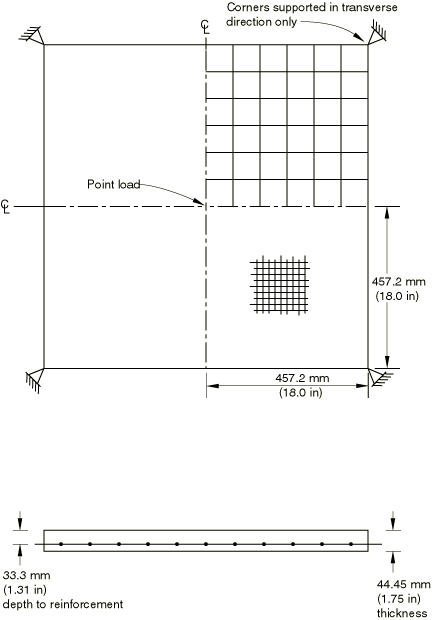
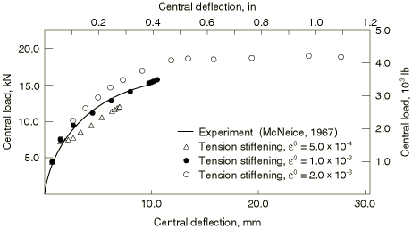
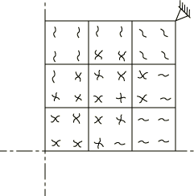
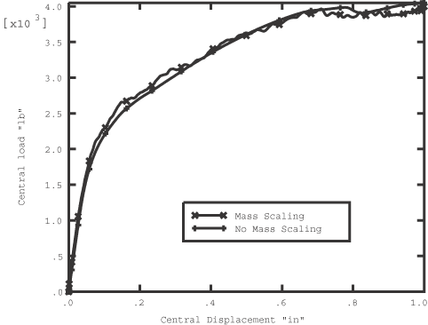
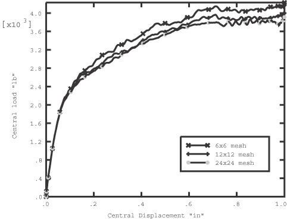
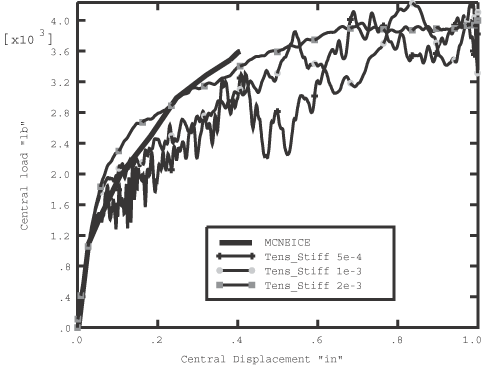
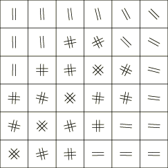

# 1.1.5 混凝土板失稳

**产品：** Abaqus/Standard  Abaqus/Explicit   

本问题检验了弥散裂缝模型（["Concrete smeared cracking," Section 23.6.1 of the Abaqus Analysis User's Guide](../usb/usb-link.md#usb-mat-cconcrete)）和脆性裂缝模型（["Cracking model for concrete," Section 23.6.2 of the Abaqus Analysis User's Guide](../usb/usb-link.md#usb-mat-ccracking)）在钢筋混凝土结构分析中的应用。问题的几何形状在[图 1.1.5-1](ch01s01aex05.md#exxmcneice-geom)中定义。方形板在其四个角部沿横向方向支撑，并在其中心受点载荷。板在 75% 深度处沿两个方向配筋。配筋率（钢体积/混凝土体积）在每个方向为 8.5  103。板由 McNeice（1967）进行实验测试，并被许多研究者分析，包括 Hand 等（1973）、Lin 和 Scordelis（1975）、Gilbert 和 Warner（1978）、Hinton 等（1981）和 Crisfield（1982）。

### 几何建模

对称条件允许我们对板进行四分之一建模。对于 Abaqus/Standard 分析，使用 8 节点壳单元的 3  3 网格。没有进行网格收敛研究，但分析结果与实验数据之间的合理一致性表明，网格足以预测具有可用精度的整体响应参数。在 Abaqus/Explicit 中使用三种不同网格来评估结果对网格细化的敏感性：S4R 单元的粗糙 6  6 网格、中等 12  12 网格和精细 24  24 网格。沿混凝土厚度使用九个积分点以确保充分建模塑性和失效的发展。两向配筋使用单轴配筋（钢筋）层建模。在网格的两个边缘施加对称边界条件，角点在横向上约束。

### 材料属性

材料数据在[表 1.1.5-1](ch01s01aex05.md#table-slab-matprops)中给出。混凝土的材料属性来自 Gilbert 和 Warner（1978）。其中一些数据是假设值，因为实验使用的混凝土没有这些数据。假设值来自典型混凝土数据。在 Abaqus/Explicit 的裂缝模型中，混凝土的压行为假定为线弹性。这是一个合理的假设，因为这种情况——板在弯曲下受拉引起的裂缝——结构的行为由裂缝主导。

混凝土-钢筋相互作用的建模以及裂缝处的能量释放对于此类结构在混凝土开始裂缝后的响应至关重要。这些效应通过向纯混凝土模型添加"受拉刚化"来间接建模。此方法在["A cracking model for concrete and other brittle materials," Section 4.5.3 of the Abaqus Theory Guide](../stm/stm-link.md#stm-mat-cracking)；["Concrete smeared cracking," Section 23.6.1 of the Abaqus Analysis User's Guide](../usb/usb-link.md#usb-mat-cconcrete)；和["Cracking model for concrete," Section 23.6.2 of the Abaqus Analysis User's Guide](../usb/usb-link.md#usb-mat-ccracking)中描述。最简单的受拉刚化模型定义了混凝土裂缝失效后强度的线性损失。在本示例中，使用三个不同的失效后应变值（所有强度丧失的应变）：5  104、1  103 和 2  103，以说明受拉刚化参数对响应的影响。

由于响应由弯曲主导，它受裂缝平面法向的材料行为控制。材料在裂缝平面的剪切行为不重要。因此，剪切保留的选择对结果没有显著影响。在 Abaqus/Explicit 中，剪切保留在与受拉刚化耗尽的裂缝开口值相同的值时耗尽。在 Abaqus/Standard 中使用完全剪切保留，因为它提供了更有效的数值解。

### 解决方案控制

由于预期响应中有相当大的非线性，包括混凝土裂缝时可能出现的不稳定状态，在 Abaqus/Standard 分析中使用带自动增量的改进 Riks 方法。对于 Riks 方法，载荷数据和解决方案参数仅用于给出初始载荷增量的估计。在这种情况下，向四分之一模型施加 1112 N（250 lb）的初始载荷是合理的，总初始载荷为 4448 N（1000 lb）。这可以通过指定 22241 N（5000 lb）的载荷和 0.05 的初始时间增量（总时间周期为 1.0）来完成。当中心位移达到 25.4 mm（1 in）时分析终止。

由于 Abaqus/Explicit 是一个动态分析程序，而在这种情况下我们需要静态解，因此板必须足够慢地加载以消除任何显著的惯性效应。板通过施加从 0 到 2.0 in/秒线性增加的速度在其中心加载，使中心在 1 秒内总共位移 1 英寸。这个非常慢的加载速率确保准静态解；然而，它在计算上很昂贵。这个分析所需的 CPU 时间可以通过两种方式减少：可以增量增加加载速率，直到判断进一步增加加载速率不再导致准静态解，或者可以使用质量缩放（见["Explicit dynamic analysis," Section 6.3.3 of the Abaqus Analysis User's Guide](../usb/usb-link.md#usb-anl-aexpdynamic)）。这两种方法是等效的。这里使用质量缩放来演示当与脆性裂缝模型结合使用时这种方法的有效性。通过将混凝土和钢筋的密度增加 100 倍来进行质量缩放，从而将分析稳定时间增量增加 10 倍，并在使用原始慢加载速率的同时将计算时间减少相同的量。[图 1.1.5-4](ch01s01aex05.md#exxmcneice-resp-scale) 显示了使用 12  12 网格有和无质量缩放的分析的板载荷-挠度响应。使用的质量缩放对结果没有显著影响；因此，所有后续分析都使用质量缩放进行。

### 结果和讨论

每个分析的结果在以下章节中讨论。

#### Abaqus/Standard 结果

数值和实验结果在[图 1.1.5-2](ch01s01aex05.md#sxmslab-response)中以板中心载荷与挠度的形式进行比较。该图中受拉刚化假设的强烈影响非常明显。在失效后应变 103 时拉伸强度丧失的受拉刚化分析与实验显示出最佳一致性。此分析从设计角度提供了有用的信息。混凝土中的失效模式如[图 1.1.5-3](ch01s01aex05.md#sxmslab-crackpattern)所示，说明了板下表面在中心挠度为 7.6 mm（0.3 in）时预测的裂缝模式。

#### Abaqus/Explicit 结果

[图 1.1.5-5](ch01s01aex05.md#exxmcneice-resp-refine) 显示了使用 2  103 的受拉刚化值时三种不同网格密度的板的载荷-挠度响应。由于粗糙网格预测的极限载荷略高于中网格和细网格，且中网格和细网格分析的极限载荷非常接近，因此受拉刚化研究仅使用中网格进行。

数值（12  12 网格）结果与三种不同受拉刚化值的实验结果在[图 1.1.5-6](ch01s01aex05.md#exxmcneice-resp-stiff)中进行比较。显然，使用的受拉刚化越少，载荷-挠度响应越软。介于最高和中间值之间的受拉刚化值似乎与实验结果最匹配。最低的受拉刚化值导致混凝土中更突然的裂缝，因此响应往往比更高的受拉刚化值更具动态性。

[图 1.1.5-7](ch01s01aex05.md#exxmcneice-crackpattern) 显示了中网格板下表面数值预测的裂缝模式。

### 输入文件

##### **Abaqus/Standard 输入文件**

[collapseconcslab_s8r.inp](../eif/collapseconcslab_s8r.inp)

S8R 单元。

[collapseconcslab_s9r5.inp](../eif/collapseconcslab_s9r5.inp)

S9R5 单元。

[collapseconcslab_postoutput.inp](../eif/collapseconcslab_postoutput.inp)

[*POST OUTPUT](../key/key-link.md#usb-kws-hpostoutput) 分析。

##### **Abaqus/Explicit 输入文件**

[mcneice_1.inp](../eif/mcneice_1.inp)

粗糙（6  6）网格；受拉刚化 = 2  103。

[mcneice_2.inp](../eif/mcneice_2.inp)

中等（12  12）网格；受拉刚化 = 2  103。

[mcneice_3.inp](../eif/mcneice_3.inp)

精细（24  24）网格；受拉刚化 = 2  103。

[mcneice_4.inp](../eif/mcneice_4.inp)

中等（12  12）网格；受拉刚化 = 1  103。

[mcneice_5.inp](../eif/mcneice_5.inp)

中等（12  12）网格；受拉刚化 = 5  104。

[mcneice_6.inp](../eif/mcneice_6.inp)

中等（12  12）网格；受拉刚化 = 2  103；无质量缩放。

### 参考文献

Crisfield, M. A., "Variable Step-Length for Nonlinear Structural Analysis," Report 1049, Transport and Road Research Lab., Crowthorne, England, 1982.

Gilbert, R. I., and R. F. Warner, "Tension Stiffening in Reinforced Concrete Slabs," Journal of the Structural Division, American Society of Civil Engineers, vol. 104, ST12, pp. 1885-1900, 1978.

Hand, F. D., D. A. Pecknold, and W. C. Schnobrich, "Nonlinear Analysis of Reinforced Concrete Plates and Shells," Journal of the Structural Division, American Society of Civil Engineers, vol. 99, ST7, pp. 1491-1505, 1973.

Hinton, E., H. H. Abdel Rahman, and O. C. Zienkiewicz, "Computational Strategies for Reinforced Concrete Slab Systems," International Association of Bridge and Structural Engineering Colloquium on Advanced Mechanics of Reinforced Concrete, pp. 303-313, 1981.

Lin, C-S., and A. C. Scordelis, "Nonlinear Analysis of Reinforced Concrete Shells of General Form," Journal of the Structural Division, American Society of Civil Engineers, vol. 101, pp. 523-238, 1975.

McNeice, A. M., "Elastic-Plastic Bending of Plates and Slabs by the Finite Element Method," Ph.D. Thesis, London University, 1967.

### 表

**表 1.1.5-1** McNeice 板的材料属性。
| **混凝土属性：** |  |
| --- | --- |
|  |
| 属性取自 Gilbert 和 Warner（1978）论文中可用的数据。 |
| 带有 * 的属性不可用，是假设值。 |
|  |
| 杨氏模量 | 28.6 GPa (4.15 106 lb/in2) |
| 泊松比 | 0.15 |
|  |
| 单轴压缩值： |  |
|  |
| 屈服应力 | 20.68 MPa (3000 lb/in2)* |
| 失效应力 | 37.92 MPa (5500 lb/in2) |
| 失效时的塑性应变 | 1.5 103* |
| 单轴拉伸与压缩失效应力比 | 8.36 102 |
| 双轴与单轴压缩失效应力比 | 1.16* |
| 裂缝失效应力 | 459.8 lb/in2 (3.17 MPa) |
| 密度（质量缩放前） | 2.246 104 lb s2/in4 (2400 kg/m3) |
| "受拉刚化"假定为应力线性下降至零，在应变 5 104、应变 10 104 或应变 20 104 时。 |
|  |
| **钢筋属性：** |  |
|  |
| 杨氏模量 | 200 GPa (29 106 lb/in2) |
| 屈服应力 | 345 MPa (50 103 lb/in2) |
| 密度（质量缩放前） | 7.3 104 lb s2/in4 (7800 kg/m3) |

### 图

**图 1.1.5-1** McNeice 板。

**图 1.1.5-2** McNeice 板载荷-挠度响应，Abaqus/Standard。

**图 1.1.5-3** 板下表面裂缝模式，Abaqus/Standard。

**图 1.1.5-4** McNeice 板载荷-挠度响应，Abaqus/Explicit；质量缩放的影响。

**图 1.1.5-5** McNeice 板载荷-挠度响应，Abaqus/Explicit；网格细化的影响。

**图 1.1.5-6** McNeice 板载荷-挠度响应，Abaqus/Explicit；受拉刚化的影响。

**图 1.1.5-7** 板下表面裂缝模式，Abaqus/Explicit。

