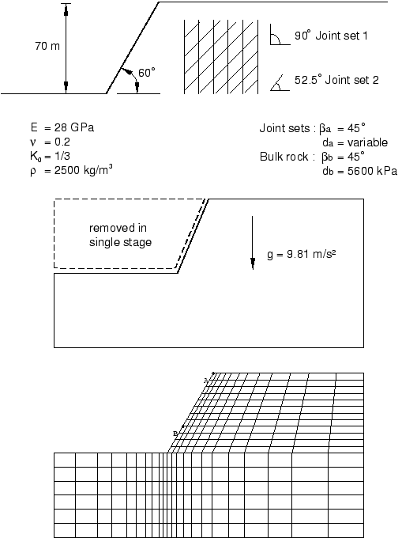
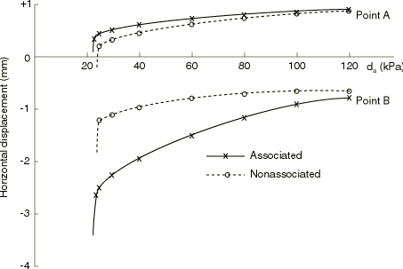
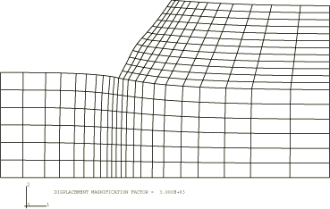
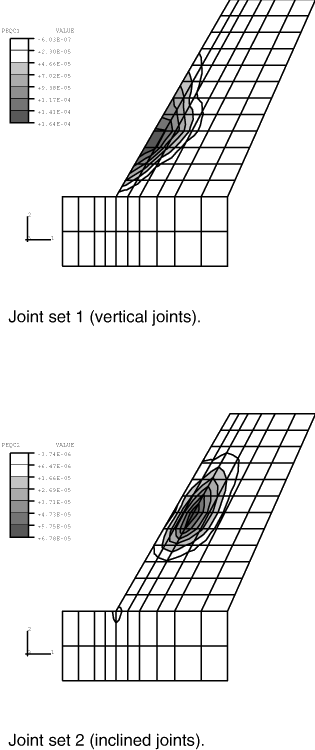
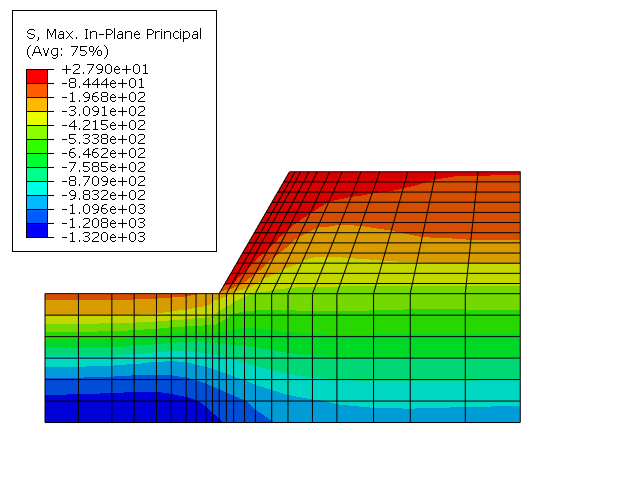
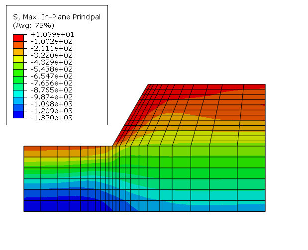

# 1.1.6 节理岩石边坡稳定性

**产品：** Abaqus/Standard   

本示例说明了在岩土工程应用中节理材料模型的使用。我们检验了部分节理岩体的开挖稳定性，留下一个倾斜路堤。选择此问题主要作为验证案例，因为它已被 Barton（1971）和 Hoek（1970）使用极限平衡方法研究过，以及 Zienkiewicz 和 Pande（1977）使用有限元模型研究过。本示例还扩展到使用带和不带受拉截止功能的 Mohr-Coulomb 塑性模型研究相同几何的开挖土壤介质的边坡稳定性。

### 几何和模型

分析的平面应变模型连同开挖几何和材料属性如[图 1.1.6-1](ch01s01aex06.md#sxmrock-geom)所示。岩体包含两组弱面：一组垂直节理和一组倾斜节理。我们从非零应力状态开始。在这个问题中，这包括随深度线性增加的垂直应力以平衡岩石重量，以及由构造效应引起的水平应力：这种应力在岩土工程中相当常见。" active"载荷"由代表开挖的材料移除组成。很明显，对于不同的初始应力状态，系统的响应将不同。这说明了岩土工程中国非线性分析的必要性——系统对外部"载荷"的响应取决于该加载序列开始时系统的状态（并且，扩展到加载序列）。我们不能再像在线性分析中那样考虑叠加载荷情况。

实际岩土开挖涉及一系列步骤，在每个步骤中移除部分物质质量。在此过程中可以插入衬砌或挡土墙。因此，岩土问题需要在创建和使用有限元模型时具有通用性：模型本身，而不仅仅是其响应，随时间变化——原始模型的某些部分消失，而其他原本不存在的组件被添加。本示例在某种程度上是学术性的，因为我们没有遇到这种程度的复杂性。相反，按照先前作者使用本示例的方式，我们假设整个开挖同时发生。

### 解决方案控制

节理材料模型包括节理开口/闭合功能。当节理打开时，材料假定为对穿过节理系统的直接应变没有弹性刚度。正因为如此，而且由于不同节理组合可能在任何给定时间屈服，整体解的收敛性预计是非单调的。在这种情况下，通常建议自动设置时间增量参数，以防止在解可能看起来发散时过早终止平衡迭代过程。

当接近开挖过程结束时，自动增量算法显著减少载荷增量，表明边坡失效的开始。在此类分析中，指定最小时间步长以避免无生产力的迭代是有用的。

对于非关联流动情况，应使用非对称方程求解器。这对于获得可接受的收敛率是必不可少的，因为非关联流动塑性具有非对称刚度矩阵。

### 结果和讨论

在这个问题中，我们通过一系列具有不同节理粘聚力值的解来检验节理粘聚力对边坡失稳的影响，同时保持所有其他参数不变。[图 1.1.6-2](ch01s01aex06.md#sxmrock-disp) 显示了当在边坡顶部（[图 1.1.6-1](ch01s01aex06.md#sxmrock-geom)中的 A 点）和边坡三分之一处的点（[图 1.1.6-1](ch01s01aex06.md#sxmrock-geom)中的 B 点）的粘聚力降低时水平位移的变化。此图表明，对于关联流动情况，如果粘聚力小于 24 kPa，边坡将失稳；对于非关联流动情况，如果粘聚力小于 26 kPa。这些与 Barton 使用其极限平衡计算中的平面失效假设计算的 26 kPa 值比较良好。Barton 的计算还包括"受拉裂缝"（类似于无抗拉强度的节理开口），就像我们的计算中一样。Hoek 计算边坡失稳的粘聚力值为 24 kPa。虽然他还做了平面失效假设，但他没有包括受拉裂缝。这可能是他的计算值低于 Barton 的原因。Zienkiewicz 和 Pande 假定节理的抗拉强度为粘聚力的十分之一，并计算关联流动失稳所需粘聚力为 23 kPa，非膨胀流动为 25 kPa。

[图 1.1.6-3](ch01s01aex06.md#sxmrock-deformconfig) 显示了非关联流动情况开挖后的变形构型，并清楚说明了失稳预期发生的方式。[图 1.1.6-4](ch01s01aex06.md#sxmrock-fric-contours) 显示了非关联流动情况下每个节理系统摩擦滑动的大小。几个节理在边坡顶部附近打开。

使用 Mohr-Coulomb 塑性模型的土壤边坡稳定性研究为两种情况进行：一种不带受拉截止，另一种包括受拉截止功能。受拉截止功能限制了土壤在受拉时的应力承载能力。可以看到，没有受拉截止时的最大主应力（见[图 1.1.6-5](ch01s01aex06.md#mcslopestability)的等值线图）高于有受拉截止时的极限最大主应力（见[图 1.1.6-6](ch01s01aex06.md#mctcslopestability)），这是预期的。有了受拉截止，还观察到在最大主应力区域出现受拉等效塑性应变 PEEQT。在这种情况下，还可以看到，在粘聚力失效面上，等效塑性应变 PEEQ 高于没有受拉截止的情况。没有显示等效塑性应变的等值线图。

### 输入文件

[jointrockstabil_nonassoc_30pka.inp](../eif/jointrockstabil_nonassoc_30pka.inp)

非关联流动情况问题；粘聚力 = 30 kPa。

[jointrockstabil_assoc_25kpa.inp](../eif/jointrockstabil_assoc_25kpa.inp)

关联流动情况；粘聚力 = 25 kPa。

[mc_slopestabil.inp](../eif/mc_slopestabil.inp)

边坡稳定性分析，Mohr-Coulomb 塑性不带受拉截止

[mctc_slopestabil.inp](../eif/mctc_slopestabil.inp)

边坡稳定性分析，Mohr-Coulomb 塑性带受拉截止

### 参考文献

Barton, N., "Progressive Failure of Excavated Rock Slopes,"* Stability of Rock Slopes*, Proceedings of the 13th Symposium on Rock Mechanics, Illinois, pp. 139-170, 1971.

Hoek, E., "Estimating the Stability of Excavated Slopes in Open Cast Mines," Trans. Inst. Min. and Metal., vol. 79, pp. 109-132, 1970.

Zienkiewicz, O. C., and G. N. Pande, "Time-Dependent Multilaminate Model of Rocks - A Numerical Study of Deformation and Failure of Rock Masses," International Journal for Numerical and Analytical Methods in Geomechanics, vol. 1, pp. 219-247, 1977.

### 图

**图 1.1.6-1** 节理岩石边坡问题。

**图 1.1.6-2** 随粘聚力变化的水平位移。

**图 1.1.6-3** 变形构型（非关联流动）。

**图 1.1.6-4** 摩擦滑动大小等值线（非关联流动）。

**图 1.1.6-5** 没有受拉截止时的最大主应力。

**图 1.1.6-6** 有受拉截止时的最大主应力。

