# 1.1.9 静水压力流体单元：空气弹簧建模

**产品：** Abaqus/Standard  Abaqus/Explicit   

空气弹簧是支撑和容纳压缩空气柱的橡胶或织物执行器。它们用作气动执行器和振动隔离器。与传统气缸不同，空气弹簧没有活塞、杆或动态密封。这使它们更适合处理偏心载荷和冲击。此外，空气弹簧比其他类型的隔离器灵活得多：空气弹簧的充气压力可以改变以补偿不同的载荷或高度，而不影响隔离效率。Dils（1992）提供了对空气弹簧各种实际用途的简要讨论。

本节讨论了帘线增强橡胶空气弹簧分析的两个示例。在 Abaqus/Standard 中进行静态分析，在 Abaqus/Explicit 中进行准静态分析。第一个示例是一个三维半对称模型，使用有限应变壳单元建模橡胶弹簧和钢筋建模橡胶膜中的多层钢增强。此外，使用基于单元的三维刚性表面来定义空气弹簧与横向金属珠之间的接触。帘线增强橡胶膜使用带钢钢筋的超弹性材料模型建模。

第二个示例是第一个模型的两维轴对称版本，使用复合轴对称有限应变壳单元建模帘线增强橡胶弹簧，并在接触定义中使用基于单元的轴对称刚性表面。该模型使用由薄正交弹性层夹在两个超弹性层之间的复合壳截面。正交层捕获三维模型中使用的钢筋定义的力学性能。

正交材料常数通过在三维模型的一个典型单元上执行简单测试获得。三维壳模型使用最初与轴对称壳模型中复合壳截面属性相同的钢筋材料属性。

为了比较，还包括了为轴对称和三维模型使用有限应变膜单元而不是有限应变壳单元来建模帘线增强橡胶弹簧的 Abaqus/Standard 输入文件。

在所有分析中，空气弹簧空腔使用基于表面的流体空腔功能建模（见["Surface-based fluid cavities: overview," Section 11.5.1 of the Abaqus Analysis User's Guide](../usb/usb-link.md#usb-anl-asurfacebasedcavityover)），空腔内的空气建模为满足理想气体定律的可压缩或"气动"流体。

### 几何和模型

空气弹簧的尺寸来自 Fursdon（1990）的论文。这个空气弹簧（[图 1.1.9-1](ch01s01aex09.md#exxairspring-schematic)）相当大，用于铁路转向架上的二级悬挂系统。然而，空气弹簧的形状与其他应用中使用的空气弹簧是典型的。空气弹簧的横截面如[图 1.1.9-2](ch01s01aex09.md#exxairspring-xsection)所示。空气弹簧呈环形，内半径为 200 mm，外半径为 400 mm。空气弹簧在模型中被理想化为由橡胶部件连接的两个圆形金属盘。下盘半径为 200 mm，上盘半径为 362.11 mm。圆盘最初同轴，相距 100 mm。橡胶部件呈双曲率和环形。橡胶在径向被约束在上盘圆周上的半径 55 mm 的圆形珠中。

在半对称、三维模型中，橡胶"软管"用 550 个 S4R 有限应变壳单元建模。软管上半球的网格比下半球更细化，因为在轮廓上盘attached的圆形珠的区域，橡胶膜经历了曲率的逆转。圆形珠使用轴对称、离散刚性表面建模。通过在此刚性表面与接触区域中（可变形）壳网格上定义的表面之间定义接触对来强制与橡胶的接触。金属盘相对于空气弹簧的橡胶部件假定为刚性。下金属盘使用边界条件建模，上盘作为刚性表面的一部分建模。橡胶膜和刚性表面的网格如[图 1.1.9-3](ch01s01aex09.md#exxairspring-membmesh)所示。

流体空腔使用基于表面的流体空腔功能建模（见["Surface-based fluid cavities: overview," Section 11.5.1 of the Abaqus Analysis User's Guide](../usb/usb-link.md#usb-anl-asurfacebasedcavityover)）。为了完全定义空腔并确保正确计算其体积，在三维模型中沿着空腔底部和顶部刚性盘边界定义表面单元，即使这些表面上不存在位移单元。由于 Abaqus 不提供二维表面单元，在轴对称模型中，用结构单元而不是表面单元来建模刚性盘边界。空腔参考节点 50000 有一个单一自由度，代表空腔内的压力。由于对称性，只建模了空腔边界的一半。将空腔参考节点放置在模型的对称平面 *y* = 0 上，以确保正确计算空腔体积。[图 1.1.9-4](ch01s01aex09.md#exxairspring-cavmesh) 显示了空气弹簧空腔的网格。

为了便于比较，两维轴对称模型使用与 180 模型相同的横截面网格细化。橡胶部件用 25 个 SAX1 壳单元建模。圆形珠用由 RAX2 刚性单元构成的基于单元的刚性表面建模。通过在此刚性表面与接触区域中（可变形）壳网格上定义的表面之间定义接触对来强制与软管的接触。同样，下刚性金属盘由边界条件建模，上刚性金属盘作为刚性体的一部分建模。橡胶膜和接触主表面的网格如[图 1.1.9-5](ch01s01aex09.md#exxairspring-asymmemb)所示，空腔网格如[图 1.1.9-6](ch01s01aex09.md#exxairspring-asymcav)所示。对于膜模型，SAX1 单元替换为 MAX1 或 MGAX1 单元。

### 对称边界条件和初始壳曲率

对称性被用于三维空气弹簧模型，平面 *y* = 0 成为对称平面。由于 S4R 壳单元是真正的曲壳单元，因此需要准确定义所建模表面的初始曲率，特别是在对称平面上。如果用户没有通过规定壳节点处表面的法向来提供此信息，Abaqus 将根据壳上周围节点的坐标估计法线方向。以这种方式计算的 法线在对称平面上将不准确：它们将有面外分量，这将导致 Abaqus/Standard 中的收敛困难和不准确的结果。为避免这些困难，为模型中的所有壳节点指定了方向余弦。

### 材料属性

空气弹簧橡胶部件的壁由对称放置的正负方向增强帘线层组成。实际部件的壁由几层这样的层组成。然而，对于所考虑的三维示例问题，空气弹簧壁被假定为具有单层 6 mm 厚的对称正负方向帘线的橡胶基体。帘线用壳单元中均匀间隔的偏钢筋建模。帘线假定由钢制成。橡胶建模为不可压缩 Mooney-Rivlin（超弹性）材料， = 3.2 MPa 和  = 0.8 MPa，钢建模为线性弹性材料，*E* = 210.0 GPa 和  = 0.3。

壳单元中的偏钢筋方向通过给出局部 1 轴与钢筋之间的角度来定义。默认局部 1 方向是全局 *x* 轴在壳表面上的投影（见["Conventions," Section 1.2.2 of the Abaqus Analysis User's Guide](../usb/usb-link.md#usb-int-iconventions)）。正是由于这个原因，并且为了使钢筋定义对所有单元统一，空气弹簧模型的旋转轴被选择为全局 *x* 轴。定义了两层钢筋，`PLSBAR` 和 `MNSBAR`，方向角分别为 18 和 -18。钢筋横截面积为 1 mm2，在壳表面上每 3.5 mm 间隔一根。

上述钢筋规范是简化的，有些不现实。制造空气弹簧使用的增强层位于具有均匀钢筋角度的初始圆柱形管中。然而，这些层从圆柱几何到环形几何的转换使空气弹簧具有可变的钢筋角度和钢筋间距，取决于从环形旋转轴的半径和初始钢筋角度（见 Fursdon，1990）。因此，更现实的模拟需要在空气弹簧模型中每个单元环有不同的钢筋定义。

在轴对称壳模型中，空气弹簧壁由三层复合壳截面建模。两个外层各厚 2.5 mm，由与 180 模型中使用的相同 Mooney-Rivlin 材料组成。中间"钢筋"层厚 1 mm，由正交弹性材料组成，捕获了三维空气弹簧模型中使用的正负方向钢筋定义的力学行为。

平面应力正交工程常数通过查看三维模型中典型单元（单元 14）在局部 1 和 2 方向承受单轴拉伸的响应获得。使用 1 mm 的壳厚度，这两项测试导致的平面内应力和应变状态为

| 测试 | 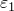 |  |  (MPa) |  (MPa) |
| --- | --- | --- | --- | --- | --- |
| 1 方向 | 1.00 102 | 8.75 102 | 2.48 101 | 2.41 105 |
| 2 方向 | 1.05 103 | 1.00 102 | 5.96 106 | 2.86 101 |

对于平面应力正交材料，平面内应力和应变分量彼此相关，如下所示：

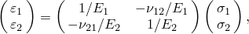

其中 、、 和  是工程常数。使用上述应力-应变关系和两个单轴测试的结果求解这些常数，得到

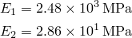

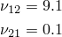

其余所需的工程常数——、 和 ——在钢筋层定义中不起作用。因此，它们被任意设置为等于橡胶的剪切模量，由  给出。

对于轴对称膜模型，主体材料选择具有与 180 模型和轴对称壳模型中使用的相同材料属性（Mooney-Rivlin 超弹性）。钢筋参数和材料属性选择为捕获轴对称壳模型中夹层钢层的初始材料属性。 principal材料方向在轴对称壳模型中不旋转（它们是默认的单元基方向——分别是经向和环向）。然而，由于钢筋的使用，它们在轴对称膜模型中随有限应变旋转。在轴对称膜模型中向钢筋施加初始应力。

在所有分析中，空气弹簧空腔内的空气被建模为分子量 0.044 kg 和摩尔热容 30 J/kg K 的理想气体。

### 载荷

在 Abaqus/Standard 模型中，空气弹簧首先在固定上盘的同时被加压至 506.6  103 kPa（5 atm）。此压力通过在空腔参考节点上规定自由度 8 的边界条件来施加。在这种情况下，空气体积自动调整以填充空腔。

在下一步中，移除对压力自由度规定的边界条件，从而用当前空气体积密封空腔。此外，在这一步中，移除对刚性体参考节点垂直位移自由度的边界条件，并代之以施加 150 kN 的向下载荷。

下一步是静态线性扰动过程。在轴对称模型中，考虑两个载荷情况：一个测试空腔压力可变（封闭空腔条件）时空气弹簧的轴向刚度，另一个测试其空腔压力固定时的轴向刚度。三维分析中的线性扰动步骤包含三个载荷情况，都处于可变空腔压力（封闭空腔）条件下：第一个测试空气弹簧的轴向刚度，第二个测试其横向刚度，第三个测试其在对称平面中摇摆运动的旋转刚度。

轴对称分析以一个通用步骤结束，其中通过将向下载荷增加至 240.0 kN 来压缩空气弹簧。三维分析以一个通用步骤结束，其中空气弹簧承受 20 mm 的横向位移。

Abaqus/Explicit 模型的载荷类似于 Abaqus/Standard 模型，只是线性扰动步骤除外。空气弹簧首先在固定上盘的同时被加压至 506.6  103 kPa（5 atm）。在下一步中，移除对压力自由度规定的边界条件，从而用当前空气体积密封空腔。此外，对于轴对称和三维模型，修改对刚性体参考节点垂直位移自由度的边界条件，以施加向下位移。这与 Abaqus/Standard 轴对称分析不同，后者施加的是力。由于空气弹簧被充压，施加力的突然变化会导致加速度的突然变化并引起低频瞬态响应。因此，瞬态效应减弱所需的模拟时间将非常长。因此，我们施加位移而不是力。在轴对称分析中，选择 75 mm 的向下位移，使得压力增加接近 Abaqus/Standard 轴对称分析第 4 步中看到的增加。在三维 Abaqus/Explicit 分析中，向下位移设置为 20 mm，以便将此步骤的结果与 Abaqus/Standard 三维分析第 4 步的结果进行比较。

### 结果和讨论

[图 1.1.9-7](ch01s01aex09.md#sxmairspring-asymdeform1) 和[图 1.1.9-8](ch01s01aex09.md#exxairspring-asymdeform1) 显示了轴对称壳模型在加压步骤结束时的变形形状图。比较此模型与 180 模型的结果以验证轴对称模型中用于钢筋增强的材料模型是有意义的。仔细观察节点位移表明，轴对称和三维模型的变形实际上相同。相应的 Abaqus/Standard 和 Abaqus/Explicit 模型的结果也几乎相同。此外，刚性体参考节点处的轴向反力对于轴对称模型为 156 kN，对于 180 模型（乘以 2 后）为 155 kN。轴对称模型预测的空腔体积为 8.22  102 m3，而 180 模型（同样乘以 2 后）为 8.34  102 m3。

空气弹簧的线性化刚度从 Abaqus/Standard 线性扰动载荷情况获得。刚度通过将刚性体参考节点处的相关反力除以相关位移来计算。对于轴对称模型，可变空腔压力条件下的轴向刚度为 826 kN/m；固定空腔压力条件下的轴向刚度为 134 kN/m。这两种情况之间轴向刚度的差异（6 倍）是由于轴向压缩过程中空腔压力的差异引起的。在可变空腔压力条件下，固定质量的流体（空气）被包含在体积正在减小的空腔中；因此，空腔压力增加。在固定空腔压力条件下，压力被规定为载荷情况的恒定值。对于 180 模型，在可变空腔压力下预测的刚度如下：轴向刚度为 821 kN/m，横向刚度为 3.31 MN/m，旋转刚度为 273 kN/m。

[图 1.1.9-9](ch01s01aex09.md#sxmairspring-asymdeform5) 显示了在第 4 步期间轴对称 Abaqus/Standard 空气弹簧模型压缩相关的系列变形形状图。作为比较，[图 1.1.9-10](ch01s01aex09.md#exxairspring-asymdeform2) 显示了在第 2 步期间轴对称 Abaqus/Explicit 模型压缩相关的系列变形形状图。[图 1.1.9-11](ch01s01aex09.md#sxmairspring-loadvdispasym) 显示了相应的载荷-挠度曲线。尽管在 Abaqus/Explicit 分析中刚性体的位移是在短时间周期内施加的（这在模型中引起了显著的惯性效应），但两种分析载荷-位移曲线的斜率仍然具有良好的 一致性。空气弹簧的响应只是略微非线性；因此，线性扰动载荷情况获得的轴向刚度与载荷-位移曲线斜率获得的结果之间具有良好的 一致性。[图 1.1.9-12](ch01s01aex09.md#sxmairspring-presvdisp) 显示了 Abaqus/Standard 分析第 4 步和 Abaqus/Explicit 分析第 2 步中空腔压力与刚性体向下位移的关系图。在此步骤期间，空腔内的表压增加了约 50%。这种压力增加显著影响空气弹簧结构的变形，不能作为外部施加的载荷在步骤中规定，因为它是未知量。[图 1.1.9-13](ch01s01aex09.md#sxmairspring-volvdisp) 显示了 Abaqus/Standard 分析第 4 步和 Abaqus/Explicit 分析第 2 步中空腔体积与刚性体向下位移的关系图。静态 Abaqus/Standard 分析和准静态 Abaqus/Explicit 分析的空腔压力和空腔体积结果几乎相同。轴对称膜模型的相应结果（未显示）也与上述结果良好一致。

[图 1.1.9-14](ch01s01aex09.md#sxmairspring-deform6) 显示了在第 4 步结束（对空气弹簧施加横向位移）时 180 Abaqus/Standard 模型的变形形状。[图 1.1.9-15](ch01s01aex09.md#exxairspring-deform6) 显示了 Abaqus/Explicit 分析第 2 步结束时 180 模型的相应变形形状。[图 1.1.9-16](ch01s01aex09.md#sxmairspring-loadvdisp) 显示了从这些步骤获得的载荷-位移曲线图。尽管存在由接触条件和网格粗糙度引起的一定量的噪声，但载荷-挠度曲线在 Abaqus/Explicit 中准静态进行的分析和 Abaqus/Standard 中静态进行的分析之间显示出良好的一致性。Abaqus/Explicit 分析以双精度运行以消除载荷-位移曲线中的一些噪声。

### 输入文件

[hydrofluidairspring_s4r.inp](../eif/hydrofluidairspring_s4r.inp)

使用壳单元的三维 Abaqus/Standard 模型。

[hydrofluidairspring_s4r_surf.inp](../eif/hydrofluidairspring_s4r_surf.inp)

使用壳单元和表面到表面接触的三维 Abaqus/Standard 模型。

[hydrofluidairspring_sax1.inp](../eif/hydrofluidairspring_sax1.inp)

使用壳单元的轴对称 Abaqus/Standard 模型。

[hydrofluidairspring_sax1_surf.inp](../eif/hydrofluidairspring_sax1_surf.inp)

使用壳单元和表面到表面接触的轴对称 Abaqus/Standard 模型。

[airspring_exp_s4r_surfcav.inp](../eif/airspring_exp_s4r_surfcav.inp)

使用壳单元的三维 Abaqus/Explicit 模型。

[airspring_exp_sax1_surfcav.inp](../eif/airspring_exp_sax1_surfcav.inp)

使用壳单元的轴对称 Abaqus/Explicit 模型。

[hydrofluidairspring_m3d4.inp](../eif/hydrofluidairspring_m3d4.inp)

使用膜单元的三维 Abaqus/Standard 模型。

[hydrofluidairspring_m3d4_surf.inp](../eif/hydrofluidairspring_m3d4_surf.inp)

使用膜单元和表面到表面接触的三维 Abaqus/Standard 模型。

[hydrofluidairspring_max1.inp](../eif/hydrofluidairspring_max1.inp)

使用钢筋增强膜单元的轴对称 Abaqus/Standard 分析。

[hydrofluidairspring_mgax1.inp](../eif/hydrofluidairspring_mgax1.inp)

使用带扭转的钢筋增强膜单元的轴对称 Abaqus/Standard 分析。

[airspring_s4r_gcont_surfcav.inp](../eif/airspring_s4r_gcont_surfcav.inp)

使用壳单元和一般接触的三维 Abaqus/Explicit 分析。

### 参考文献

Dils, M., "Air Springs vs. Air Cylinders," Machine Design, May 7, 1992.

Fursdon, P. M. T., "Modelling a Cord Reinforced Component with ABAQUS," 6th UK ABAQUS User Group Conference Proceedings, 1990.

### 图

**图 1.1.9-1** 帘线增强空气弹簧。

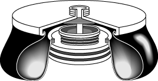

**图 1.1.9-2** 空气弹簧模型横截面。

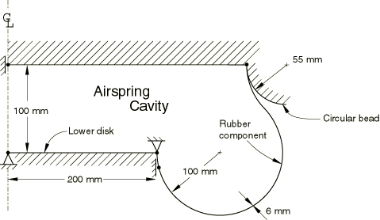

**图 1.1.9-3** 180 模型：橡胶膜和接触主表面的网格。

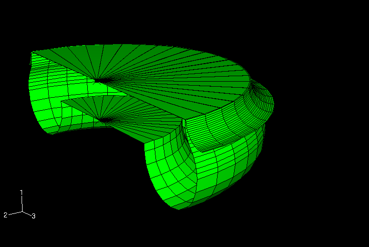

**图 1.1.9-4** 180 模型：空气弹簧空腔的网格。

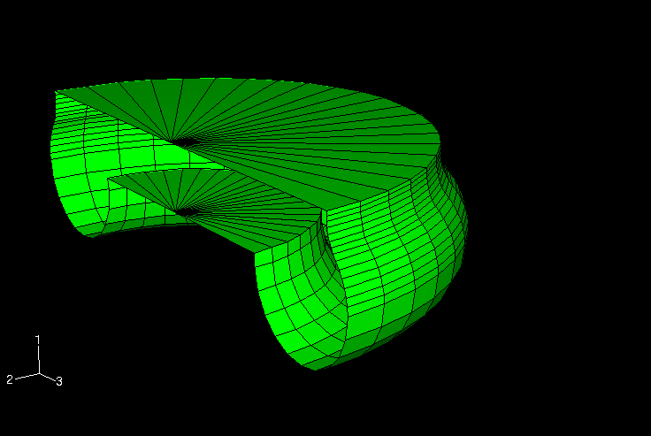

**图 1.1.9-5** 轴对称模型：橡胶膜和接触主表面的网格。

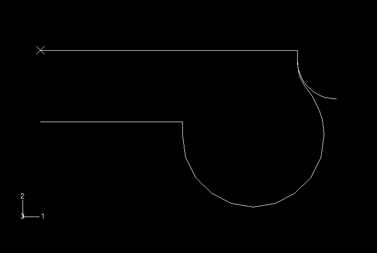

**图 1.1.9-6** 轴对称模型：空气弹簧空腔的网格。

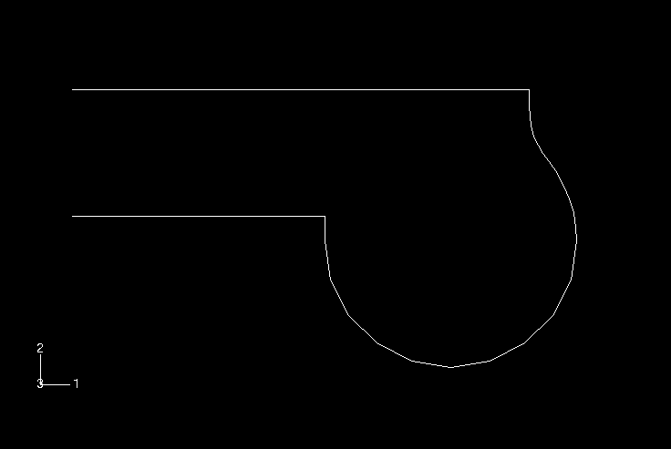

**图 1.1.9-7** 轴对称 Abaqus/Standard 模型：第 1 步结束时的变形构型。

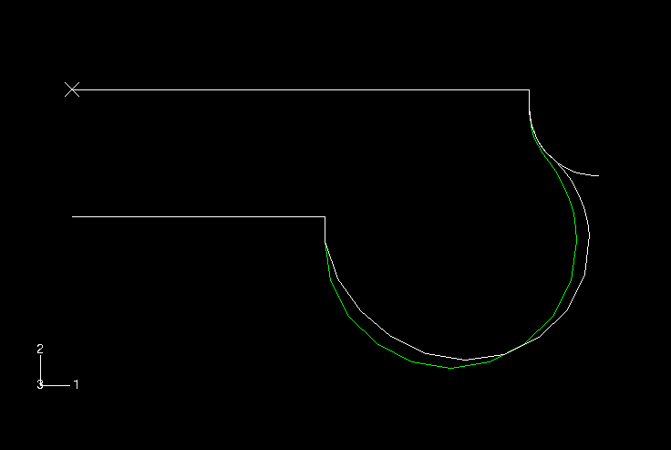

**图 1.1.9-8** 轴对称 Abaqus/Explicit 模型：第 1 步结束时的变形构型。

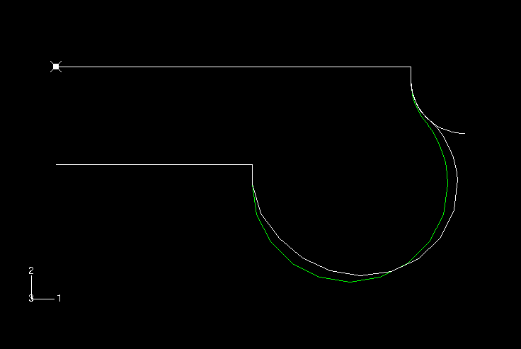

**图 1.1.9-9** 轴对称 Abaqus/Standard 模型：第 4 步期间的渐进变形构型。

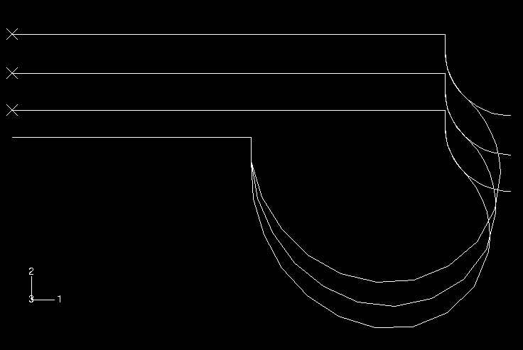

**图 1.1.9-10** 轴对称 Abaqus/Explicit 模型：第 2 步期间的渐进变形构型。

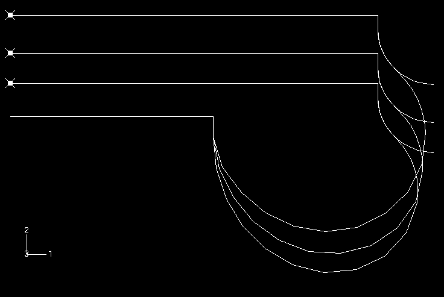

**图 1.1.9-11** 载荷-位移曲线（轴对称模型）。

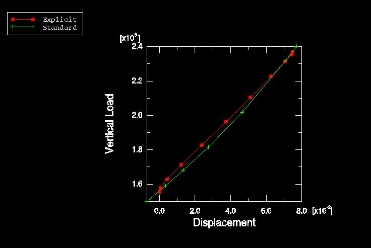

**图 1.1.9-12** 空腔压力与向下位移的关系（轴对称模型）。

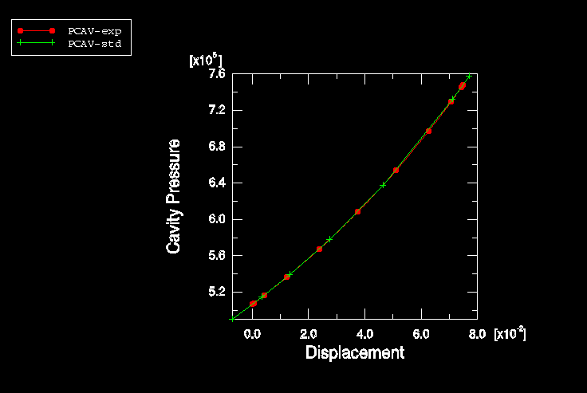

**图 1.1.9-13** 空腔体积与向下位移的关系（轴对称模型）。

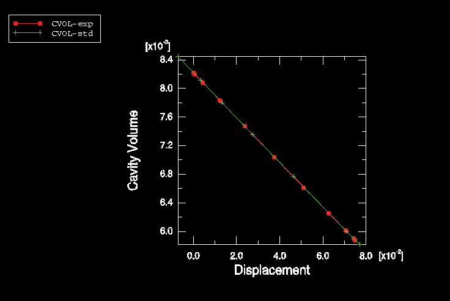

**图 1.1.9-14** 180 Abaqus/Standard 模型：第 4 步结束时的变形构型。

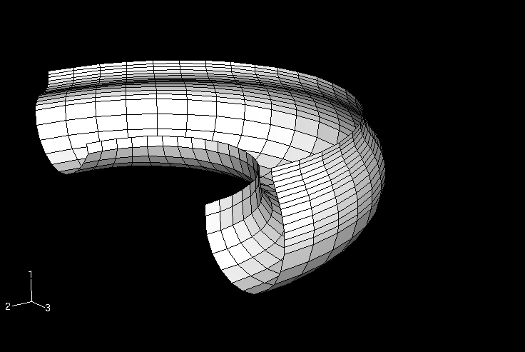

**图 1.1.9-15** 180 Abaqus/Explicit 模型：第 2 步结束时的变形构型。

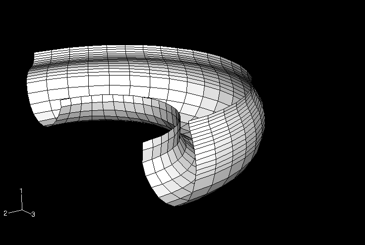

**图 1.1.9-16** 180 分析的载荷-位移曲线。

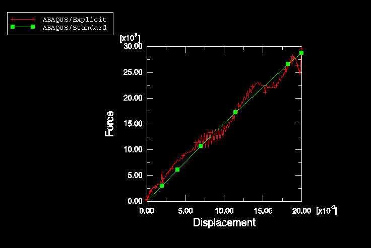

