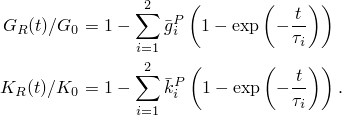
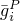
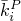
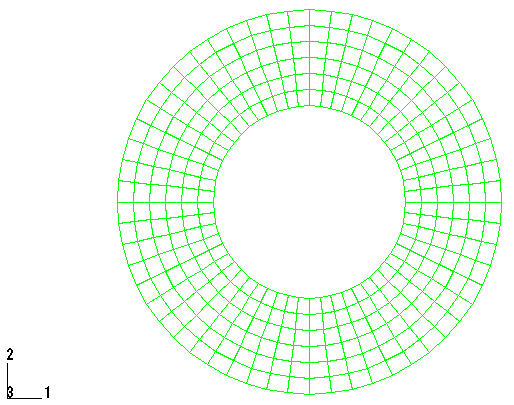
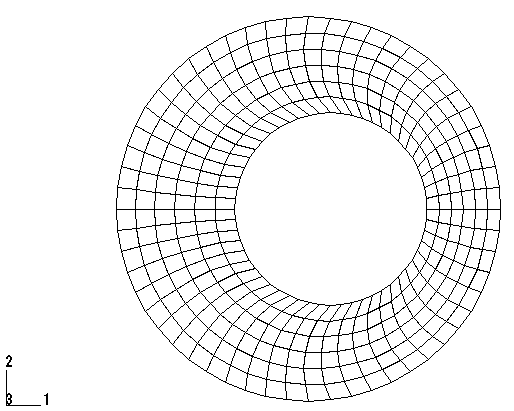
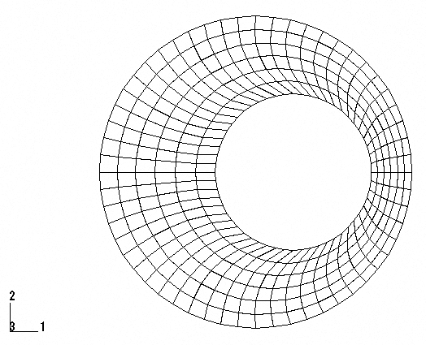
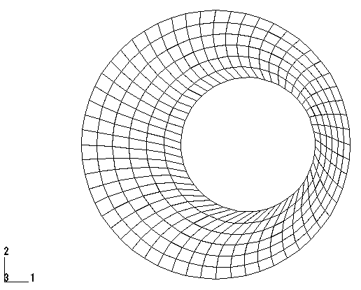
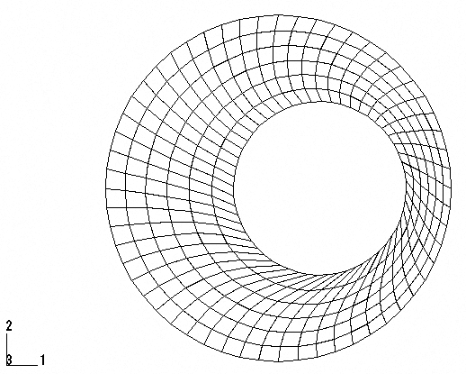
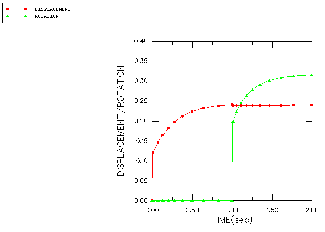

# 1.1.12 粘弹性衬套的瞬态载荷

**产品：** Abaqus/Standard

本示例演示了为时间相关材料模型积分提供的自动增量功能，以及在典型设计应用中将粘弹性材料模型与大应变超弹性结合使用。该结构是一个衬套，建模为空心粘弹性圆柱体。衬套外侧粘接到刚性固定体，内侧粘接到承受载荷的刚性轴。向轴施加静态预载，使内部轴偏离中心。保持此载荷足够长的时间以获得稳态响应。然后瞬时施加扭矩，并保持足够长的时间以达到稳态响应。我们计算衬套对这些事件的瞬态响应。

### 几何和模型

粘弹性衬套的内半径为 12.7 mm（0.5 in），外半径为 25.4 mm（1.0 in）。我们假定衬套足够长，足以发生平面应变变形。该问题使用一阶减缩积分单元（CPE4R）进行建模。网格是规则的，由 6 个径向单元组成，重复 56 次以覆盖圆周方向 360° 的范围。网格如图 [图 1.1.12-1](ch01s01aex12.md#sxmviscobushing-model) 所示。尚未进行网格收敛研究。

固定外部本体通过固定所有外节点的两个位移分量来建模。衬套内边界上的节点使用运动耦合约束连接到位于模型中心的节点。因此，该节点将内部轴定义为刚体。

### 材料

材料模型并非从任何特定物理材料定义的。

粘弹性材料的瞬时行为由超弹性属性定义。为此使用了多项式模型，其中 N=1（Mooney-Rivlin 模型），常数为 C₁ = 27.56 MPa（4000 psi），C₂ = 6.89 MPa（1000 psi），D₁ = 0.0029 MPa⁻¹（0.00002 psi⁻¹）。

粘性行为通过时间相关剪切模量 G(t) 和时间相关体积模量 K(t) 建模，每个都相对于相应的瞬时模量展开为 Prony 级数，

相对模量 G_i/Ge 和 K_i/Ke 以及时间常数 τ_i 为

| *i* |  |  |  秒 |
| --- | --- | --- | --- |
| 1 | 0.2 | 0.5 | 0.1 |
| 2 | 0.1 | 0.2 | 0.2 |

该模型导致初始瞬时杨氏模量为 206.7 MPa（30000 psi），泊松比为 0.45。它比剪切应力更快地松弛压力。

### 分析

分析分四个步骤完成。第一步是在 0.001 秒内使用静态过程（["Static stress analysis," Abaqus Analysis User's Guide 第 6.2.2 节](../usb/usb-link.md#usb-anl-astatic)）向模型中心的节点沿 *x* 方向施加 222.4 kN（50000 lb）的预载。静态过程不允许粘性材料行为，因此该响应是纯弹性的。在第二步中，载荷保持不变，材料使用准静态过程（["Quasi-static analysis," Abaqus Analysis User's Guide 第 6.2.5 节](../usb/usb-link.md#usb-anl-avisco)）允许蠕变 1 秒。由于 1 秒与材料时间常数相比是较长的时间，此时的解应该接近稳态。可以控制蠕变响应期间自动时间增量的精度。该精度容差是每个时间增量中蠕变应变增量允许误差的上限。它被选择为 5×10⁻⁴，与弹性应变相比很小。第三步是另一个静态步骤。这里载荷是在 0.001 秒内施加的 1129.8 N·m（10000 lb-in）的扭矩。第四步是另一个时间周期为 1 秒的准静态步骤。

### 结果和讨论

[图 1.1.12-2](ch01s01aex12.md#sxmviscobushing-deform-static) 到 [图 1.1.12-5](ch01s01aex12.md#sxmviscobushing-deform-hold2) 描述了每个步骤结束时衬套的变形形状。每个静态载荷都产生有限的变形量，在保持期间这些变形会大大扩展。[图 1.1.12-6](ch01s01aex12.md#sxmviscobushing-dispandrotate) 显示了衬套中心在 *x* 方向的位移及其随时间变化的旋转。

### 输入文件

[viscobushing.inp](../eif/viscobushing.inp)

分析输入数据。

### 图

**图 1.1.12-1** 粘弹性衬套的有限元模型。

**图 1.1.12-2** 水平静态载荷后的变形模型。

**图 1.1.12-3** 第一次保持期后的变形模型。

**图 1.1.12-4** 静态力矩载荷后的变形模型。

**图 1.1.12-5** 第二次保持期后的变形模型。

**图 1.1.12-6** 衬套中心的位移和旋转。

