# 1.1.13 厚板的压痕

**产品：** Abaqus/Explicit

本示例说明了自适应网格和畸变控制在深压痕问题中的应用。

### 问题描述

针对轴对称和三维几何分别求解深压痕问题，如图 [图 1.1.13-1](ch01s01aex13.md#exxaleindent-geom) 所示。每个模型由一个刚性冲头和一个可变形毛坯组成。冲头具有半圆形头部，半径为 100 mm。毛坯建模为可压碎泡沫，弹性响应如下（见 Schluppkotten，1999）：

|  7.5 MPa（杨氏模量）和 |
| --- |
|  0.0（弹性泊松比）。 |

各向同性硬化的材料参数如下

|  1.0（屈服强度比）和 |
| --- |
|  0.0（塑性泊松比）， |

密度为

|  60 kg/m³。 |

在两种情况下，冲头在垂直方向除外完全约束。当使用自适应网格时，通过将冲头压入毛坯 250 mm 的深度来进行深压痕，当使用畸变控制时压入 285 mm 的深度。使用平滑步幅幅值来规定冲头的位移，以产生准静态响应。

#### 案例 1：轴对称模型

毛坯使用 CAX4R 单元进行网格划分，尺寸为 300 × 300 mm。冲头使用平面分析表面与刚体约束结合建模为分析刚性表面。毛坯底部在 *x* 和 *z* 方向受到约束，在 *r*=0 处规定对称边界条件。

#### 案例 2：三维模型

分析了两个模型。对于一个模型，毛坯采用均匀网格划分；对于另一个模型，使用渐变网格。对于两个模型，毛坯使用 C3D8R 单元进行网格划分，尺寸为 600 × 300 × 600 mm。冲头使用三维旋转表面与刚体约束结合建模为分析刚性表面。毛坯底部完全约束。

### 自适应网格

对于每个模型，使用包含整个毛坯的单个自适应网格域。拉格朗日边界区域类型（默认值）用于定义两种模型中沿板底部的约束和二维中沿对称轴的约束。滑动边界区域（默认值）用于定义板上接触表面。为了在整个模拟过程中获得良好的网格，作为自适应网格域规范的一部分，将网格扫描次数增加到 3。对于渐变三维模型，指定了渐变平滑目标，以在执行自适应网格时保持网格的渐变。在自适应问题中保持网格渐变是一项强大的功能，允许将网格细化集中在应变梯度最高的区域。

### 畸变控制

与自适应网格技术相反，畸变控制不会尝试在整个分析过程中维持高质量网格，而是尝试防止在分析过程中发生负单元体积或其他过度畸变。通过使用畸变控制，当网格相对于应变梯度和压缩量较粗时，可以防止分析过早失败。对具有均匀网格划分毛坯的轴对称和三维模型测试畸变控制功能。

### 结果和讨论

[图 1.1.13-2](ch01s01aex13.md#exxaleindent-init-axisym) 到 [图 1.1.13-4](ch01s01aex13.md#exxaleindent-init-3d-graded) 显示了轴对称模型、三维均匀网格模型和三维渐变网格模型的初始构型。虽然这些图中未显示冲头，但它最初与板接触。[图 1.1.13-5](ch01s01aex13.md#exxaleindent-deform-asym) 显示了轴对称压痕的最终变形网格。网格算法试图最小化与冲头接触表面附近和远处的单元畸变。[图 1.1.13-6](ch01s01aex13.md#exxaleindent-deform-3d-uni) 和 [图 1.1.13-7](ch01s01aex13.md#exxaleindent-deform-3d-uni-cut) 分别显示了具有初始均匀网格的三维模型的整体变形网格和四分之一对称剖面图。即使在这种压痕深度下，单元在表面和整个板横截面上都看起来形状良好。

[图 1.1.13-8](ch01s01aex13.md#exxaleindent-deform-3d-graded) 和 [图 1.1.13-9](ch01s01aex13.md#exxaleindent-deform-3d-g-cut) 分别显示了具有初始渐变网格的三维情况整体板的变形网格和四分之一对称剖面图。具有渐变平滑目标的自适应网格在压痕过程中保持网格渐变，同时最小化单元畸变。在自适应问题中保持网格渐变是一项强大的功能，允许将网格细化集中在应变梯度最高的区域。渐变网格情况的等效塑性应变等值线图如图 [图 1.1.13-10](ch01s01aex13.md#exxaleindent-cntr-3d-graded) 所示。

[图 1.1.13-11](ch01s01aex13.md#exxaleindent-deform-asym-dis) 显示了使用畸变控制但无自适应网格的轴对称压痕的最终变形网格。[图 1.1.13-12](ch01s01aex13.md#exxaleindent-deform-3d-dis) 和 [图 1.1.13-13](ch01s01aex13.md#exxaleindent-deform-3d-dis-cut) 分别显示了使用畸变控制但无自适应网格的具有初始均匀网格的三维模型整体毛坯的变形网格和四分之一对称剖面图。畸变控制只是防止与冲头接触表面附近的单元畸变。没有畸变控制，两个分析在这种压痕深度下都会过早失败。

### 输入文件

[ale_indent_axi.inp](../eif/ale_indent_axi.inp)

使用自适应网格的案例 1。

[ale_indent_sph.inp](../eif/ale_indent_sph.inp)

使用自适应网格的均匀网格案例 2。

[ale_indent_gradedsph.inp](../eif/ale_indent_gradedsph.inp)

使用自适应网格的渐变网格案例 2。

[ale_indent_sphelset.inp](../eif/ale_indent_sphelset.inp)

案例 2 引用的外部文件。

[dis_indent_axi.inp](../eif/dis_indent_axi.inp)

使用畸变控制的案例 1。

[dis_indent_sph.inp](../eif/dis_indent_sph.inp)

使用畸变控制的均匀网格案例 2。

### 参考文献

Schluppkotten, J., *Investigation of the ABAQUS Crushable Foam Plasticity Model*, Internal report of BMW AG, 1999.

### 图

**图 1.1.13-1** 轴对称和三维模型几何。

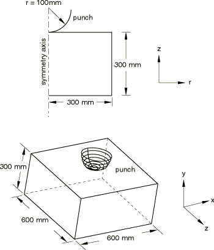

**图 1.1.13-2** 轴对称模型的初始构型。

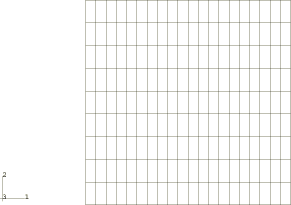

**图 1.1.13-3** 均匀网格三维模型的初始构型。

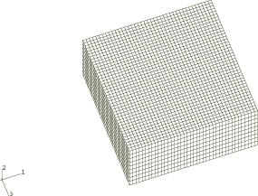

**图 1.1.13-4** 渐变网格三维模型的初始构型。

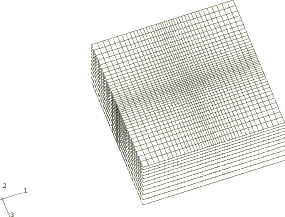

**图 1.1.13-5** 轴对称模型的变形构型。

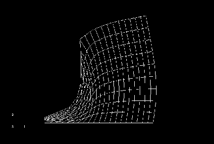

**图 1.1.13-6** 初始均匀网格三维模型的变形构型。

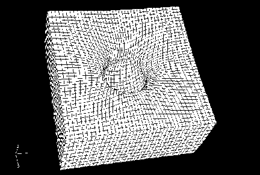

**图 1.1.13-7** 初始均匀网格三维模型变形构型的四分之一对称剖面图。

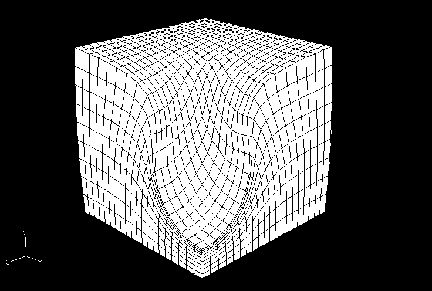

**图 1.1.13-8** 初始渐变网格三维模型的变形构型。

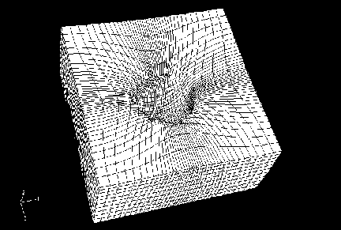

**图 1.1.13-9** 初始渐变网格三维模型变形构型的四分之一对称剖面图。

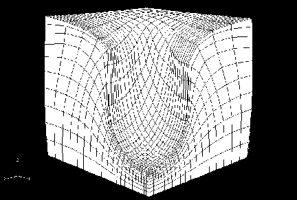

**图 1.1.13-10** 初始渐变网格三维模型的等效塑性应变等值线。

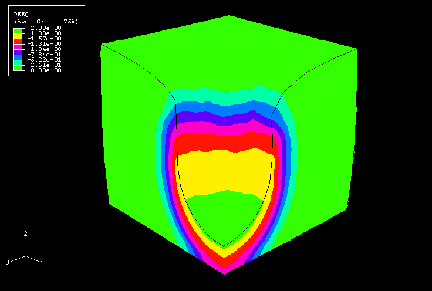

**图 1.1.13-11** 使用畸变控制的轴对称模型的变形构型。

**图 1.1.13-12** 使用畸变控制的初始均匀网格三维模型的变形构型。

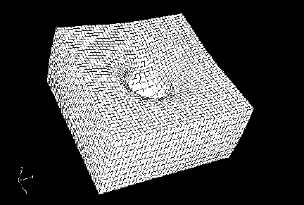

**图 1.1.13-13** 使用畸变控制的初始均匀网格三维模型变形构型的四分之一对称剖面图。

