# 1.1.14 层合复合板的损伤与失效

**产品：** Abaqus/Standard   Abaqus/Explicit

本示例演示了如何将复合层合材料的非线性材料行为指定为解相关变量的函数。Abaqus/Standard 中的用户子程序 [`USDFLD`](../sub/sub-link.md#sub-xsl-usdfld) 和 Abaqus/Explicit 中的 [`VUSDFLD`](../sub/sub-link.md#sub-xsl-vusdfld) 可用于修改标准线弹性材料行为（例如，包含损伤的影响），或改变 Abaqus 中非线性材料模型的行为。本示例中的材料模型包含损伤，导致非线性行为。它还包括各种失效模式，导致应力承载能力的突然丧失（Chang and Lessard，1989）。将分析结果与实验结果进行比较。

### 问题描述和材料行为

带有中心孔的复合板承受面内压缩。板由 24 层 T300/976 石墨-环氧树脂组成，铺层为 [(45/-45)]₂s。每层厚度为 0.1429 mm（0.005625 in）；因此，总板厚为 3.429 mm（0.135 in）。板长度为 101.6 mm（4.0 in），宽度为 25.4 mm（1.0 in），孔直径为 6.35 mm（0.25 in）。板在长度方向承受压缩载荷。板的厚度足以忽略板的面外位移。测量压缩载荷以及孔上方和下方两点之间（原始距离为 25.4 mm（1.0 in））的长度变化。板几何形状如图 [图 1.1.14-1](ch01s01aex14.md#sxmdmgplate-geom) 所示。

Chang 和 Lessard 详细描述了每层的材料行为。初始弹性层属性为：纵向模量 E₁ = 156512 MPa（22700 ksi），横向模量 E₂ = 12962 MPa（1880 ksi），剪切模量 G₁₂ = 6964 MPa（1010 ksi），泊松比 ν₁₂ = 0.23。材料在剪切中积累损伤，导致如下形式的非线性应力-应变关系

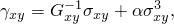

其中 G₀ 是（初始）层剪切模量，非线性由因子 β = 2.44108 MPa³（0.815 ksi³）表征。

层合复合材料的失效模式强烈依赖于几何、加载方向和层方向。通常，区分面内失效模式和横向失效模式（与层间剪切或剥离应力相关）。由于该复合材料承受面内载荷，只需考虑面内失效模式，可以对每层单独进行考虑。对于此处使用的单向层，可考虑五种失效模式：基体拉伸开裂、基体压缩、纤维断裂、纤维-基体剪切和纤维屈曲。除纤维断裂外，所有机制都可能导致层合复合材料的压缩失效。

层合板中的失效强度也取决于铺层配置。如果相邻层彼此正交，则铺层的有效失效强度最大。随着层间角度的减小，有效强度降低；如果层具有相同方向，则有效强度最小。（这称为层簇。）Chang 和 Lessard 获得了一些有效横向拉伸强度的经验公式；但是，在本模型中我们忽略这些影响。相反，我们使用 T300/976 层合板的以下强度属性：横向拉伸强度 X₂ = 102.4 MPa（14.86 ksi），层剪切强度 S = 106.9 MPa（15.5 ksi），基体压缩强度 Y_c = 253.0 MPa（36.7 ksi），纤维屈曲强度 X_c = 2707.6 MPa（392.7 ksi）。

强度参数可组合成多轴载荷的失效准则。在本分析的模型中考虑了四种不同的失效模式。

- **基体拉伸开裂** 可能由横向拉伸应力 σ₂ 和剪切应力 τ₁₂ 的组合引起。失效指数 I_MT 可以根据这些应力和强度参数 X₂ 和 S 来定义。当指数超过 1.0 时，假定发生失效。如果没有非线性材料行为，失效指数具有简单形式 I_MT = (σ₂/X₂)² + (τ₁₂/S)²。当考虑非线性剪切行为时，失效指数采用更复杂的形式。
- **基体压缩失效** 由横向压缩应力和剪切应力的组合引起。失效准则与基体拉伸开裂的形式相同：I_MC = (σ₂/Y_c)² + (τ₁₂/S)²。使用相同的失效指数，因为前两种失效机制不能同时在同一位置发生。在失效指数超过 1.0 后，层的横向刚度和泊松比都降至零。
- **纤维-基体剪切失效** 由纤维压缩和基体剪切的组合引起。失效准则与其他两个准则的形式基本相同：I_FMS = (σ₁/X_c)² + (τ₁₂/S)²。此机制可以与其他两个准则同时发生；因此，使用单独的失效指数。在失效指数超过 1.0 后，不再支持剪切应力，但纤维和横向方向上的直接应力继续得到支持。
- **纤维屈曲失效** 当纤维方向的最大压缩应力（σ₁）超过纤维屈曲强度 X_c 时发生，与其他应力分量无关：I_FB = σ₁/X_c。显然，除非剪切应力完全消失，否则纤维-基体剪切失效发生在纤维屈曲之前。然而，纤维屈曲可能继纤维剪切之后发生，因为只有在纤维-基体剪切失效后剪切刚度降低。层中的纤维屈曲是一种灾难性的失效模式。因此，在该失效指数超过 1.0 后，假定该点处的材料不能再承受任何载荷。

在本示例中，主要加载模式是剪切。因此，板的失效发生在纤维应力发展到纤维屈曲的水平之前，不需要考虑这种失效模式。

Chang 和 Lessard 假定失效发生后，失效方向上的应力立即降至零，这对应于无能量吸收的脆性失效。这种失效模型通常导致复合材料的即时、不稳定失效。这个假设不太现实：实际上，应力承载能力在失效发生后随应变增加而逐渐降低。因此，该模型可能无法很好地捕捉复合材料在失效开始后的行为。此外，应力承载能力的瞬时丧失也使得失效后分析结果强烈依赖于有限元网格的细化程度和所使用的有限元单元类型。

### 材料模型实现

为了模拟剪切非线性和失效模式（拉伸或压缩中的基体失效以及纤维-基体剪切失效），弹性属性被设定为线性依赖于三个场变量。第一个场变量表示基体失效指数，第二个表示纤维-基体剪切失效指数，第三个表示失效前的剪切非线性（损伤）。弹性材料属性对场变量的依赖性如[表 1.1.14-1](ch01s01aex14.md#table-dmgplate-matprops)所示。

为了考虑非线性，必须以不同形式表示非线性应力-应变关系：增量结束时的应力必须表示为应变的线性函数。最明显的方法是线性化非线性项，得到关系

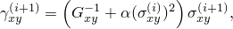

其中 i 表示增量号。这个关系可以反写为

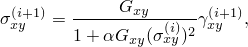

从而提供了一种定义有效剪切模量的算法。

然而，这种算法不是很合适，因为它在较高应变水平下不稳定，这很容易通过稳定性分析得到证明。考虑一个应变不变化的增量；即 Δεᵢ₊₁ = 0。设增量 i 处的应力相对于该增量的精确解 σᵢ 有一个小扰动：σᵢ = σᵢᵉˣᵃᵗ� + Δσᵢ。类似地，在增量 i+1 处，σᵢ₊₁ = σᵢ₊₁ᵉˣᵃᵗ�。为了使算法稳定，Δσᵢ₊₁ 不应大于 Δσᵢ。通过在有效剪切模量方程中代入 Δεᵢ₊₁ = 0 并关于 σᵢ 线性化来计算增量 i+1 中的扰动：

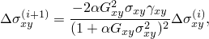

其中 Δεᵢ = εᵢ - εᵢ₋₁。如果

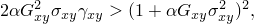

则增量 i+1 中的扰动大于增量 i 中的扰动。消除 Δεᵢ 后，可简化为表达式

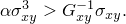

因此，当剪切应变的"非线性"部分大于"线性"部分时，就会发生不稳定。

为了获得更稳定的算法，我们将非线性应力-应变定律写为形式

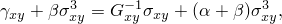

其中 α 是一个尚未确定的系数。以线性化形式，这导致更新算法

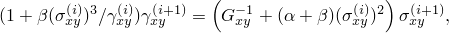

或者，以反形式，

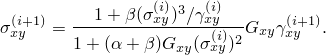

按照与原始更新算法相同的步骤，很容易推导出，如果 α = 1/2，则增量 i 中的小扰动 Δσᵢ 在增量 i+1 中降至零。因此，最优算法似乎是

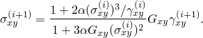

最后，这个关系用损伤参数 d 表示：

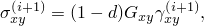

其中

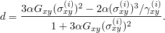

这个关系在用户子程序 `USDFLD` 和 `VUSDFLD` 中实现，损伤参数的值直接赋给用于定义弹性属性的第三个场变量。

失效指数根据增量开始时的应力使用前面讨论的表达式计算：

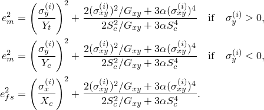

失效指数的值不直接赋给场变量：相反，它们作为解相关的状态变量存储。只有当失效指数的值超过 1.0 时，相应的用户定义场变量才被设置为 1.0。在失效指数超过 1.0 后，即使应力可能显著降低，相关的用户定义场变量仍继续保持值 1.0，这确保材料在受损后不会"愈合"。

### 有限元模型

板由 24 层 T300/976 石墨-环氧树脂组成，铺层为 [(45/-45)]₂s。我们没有单独建模每一层，而是将所有 45° 方向的层和所有 +45° 方向的层组合。因此，只需要分别建模两层：

1. 45° 方向的一层，厚度为 1.715 mm（0.0675 in）。
2. +45° 方向的一层，厚度为 1.715 mm（0.0675 in）。

相应的有限元模型由两层 CPS4 平面应力单元组成，厚度和属性如前所述。四分之一对称有限元模型如图 [图 1.1.14-1](ch01s01aex14.md#sxmdmgplate-geom) 所示。

使用用户定义场变量实现非线性材料行为是**显式的**：非线性基于增量开始时的状态。因此，在 Abaqus/Standard 分析中，用户必须确保时间增量足够小，这一点特别重要，因为 Abaqus/Standard 中的自动时间增量控制在 [`USDFLD`](../sub/sub-link.md#sub-xsl-usdfld) 中实现的显式非线性是无效的。如果使用自动时间增量，可以使用变量 `PNEWDT` 在子程序 [`USDFLD`](../sub/sub-link.md#sub-xsl-usdfld) 中控制最大时间增量。如果存在其他需要自动时间增量的非线性情况，此功能很有用。在本示例中，唯一重要的非线性是材料行为的结果。因此，固定时间增量可以有效使用。在 Abaqus/Explicit 分析中，稳定时间增量通常足够小以确保良好的精度。

### 结果和讨论

对于这个问题，Chang 和 Lessard 获得了实验载荷-位移结果。实验结果以及用 Abaqus/Standard 获得的数值结果如图 [图 1.1.14-2](ch01s01aex14.md#sxmdmgplate-curves) 所示。实验和数值结果在达到最大载荷点之前非常好的一致。之后，数值载荷-位移曲线急剧下降，而实验数据表明载荷或多或少保持恒定。Chang 和 Lessard 也展示了数值结果；它们的结果与 Abaqus 获得的结果一致，但未延伸到载荷下降的区域。该板中的主要失效模式是纤维/基体剪切：失效首先发生在约 12.15 kN（2700 lb）的载荷下，并以稳定方式继续发展，直到达到约 13.5 kN（3000 lb）的载荷。[图 1.1.14-3](ch01s01aex14.md#sxmdmgplate-distrib) 显示了在最大载荷点处 Abaqus/Standard 有限元模型中损伤的范围。在该图中，如果在至少三个积分点处发生了纤维/基体剪切失效，则对该单元进行着色。这些结果也与 Chang 和 Lessard 获得的结果显示出非常好的一致性。

如前所述，数值结果中急剧的载荷下降是由于失效准则超过后残余应力承载能力的缺乏。只有获得失效后的材料数据，才能达到更好的一致性。没有失效后数据，结果对网格和单元类型非常敏感，这通过将单元类型从 CPS4（完全积分）更改为 CPS4R（减缩积分）清楚地表明。结果在首次失效发生点之前几乎相同。在那之后，CPS4R 模型中的损伤比 CPS4 模型传播得更快，直到达到约 12.6 kN（2800 lb）的最大载荷。然后载荷迅速下降。

该问题也使用由 S4R 和 S4 单元组成的 Abaqus/Standard 模型进行分析。这些单元具有复合截面，有两层，每层厚度等于 CPS4 和 CPS4R 模型中平面应力单元的厚度。使用 S4R 和 S4 单元模型获得的结果与使用 CPS4R 单元模型获得的结果无法区分。

使用 CPS4R 单元模型通过 Abaqus/Explicit 获得的数值结果（未显示）与通过 Abaqus/Standard 获得的结果一致。

### 输入文件

##### **Abaqus/Standard 输入文件**

[damagefailcomplate_cps4.inp](../eif/damagefailcomplate_cps4.inp)

CPS4 单元。

[damagefailcomplate_cps4.f](../eif/damagefailcomplate_cps4.f)

damagefailcomplate_cps4.inp 中使用的用户子程序 [`USDFLD`](../sub/sub-link.md#sub-xsl-usdfld)。

[damagefailcomplate_node.inp](../eif/damagefailcomplate_node.inp)

节点定义。

[damagefailcomplate_element.inp](../eif/damagefailcomplate_element.inp)

单元定义。

[damagefailcomplate_cps4r.inp](../eif/damagefailcomplate_cps4r.inp)

CPS4R 单元。

[damagefailcomplate_cps4r.f](../eif/damagefailcomplate_cps4r.f)

damagefailcomplate_cps4r.inp 中使用的用户子程序 [`USDFLD`](../sub/sub-link.md#sub-xsl-usdfld)。

[damagefailcomplate_s4.inp](../eif/damagefailcomplate_s4.inp)

S4 单元。

[damagefailcomplate_s4.f](../eif/damagefailcomplate_s4.f)

damagefailcomplate_s4.inp 中使用的用户子程序 [`USDFLD`](../sub/sub-link.md#sub-xsl-usdfld)。

[damagefailcomplate_s4r.inp](../eif/damagefailcomplate_s4r.inp)

S4R 单元。

[damagefailcomplate_s4r.f](../eif/damagefailcomplate_s4r.f)

damagefailcomplate_s4r.inp 中使用的用户子程序 [`USDFLD`](../sub/sub-link.md#sub-xsl-usdfld)。

##### **Abaqus/Explicit 输入文件**

[damagefailcomplate_cps4r_xpl.inp](../eif/damagefailcomplate_cps4r_xpl.inp)

CPS4R 单元。

[damagefailcomplate_cps4r_xpl.f](../eif/damagefailcomplate_cps4r_xpl.f)

damagefailcomplate_cps4r_xpl.inp 中使用的用户子程序 [`VUSDFLD`](../sub/sub-link.md#sub-xsl-vusdfld)。

[damagefailcomplate_node.inp](../eif/damagefailcomplate_node.inp)

节点定义。

[damagefailcomplate_element.inp](../eif/damagefailcomplate_element.inp)

单元定义。

### 参考文献

Chang, F-K., and L. B. Lessard, "Damage Tolerance of Laminated Composites Containing an Open Hole and Subjected to Compressive Loadings: Part I—Analysis," Journal of Composite Materials, vol. 25, pp. 2–43, 1991.

### 表

**表 1.1.14-1** 弹性材料属性对场变量的依赖性。

| 材料状态 | 弹性属性 | FV1 | FV2 | FV3 |
| --- | --- | --- | --- | --- |
| 无失效 | E₁ | E₂ | ν₁₂ | G₁₂ | 0 | 0 | 0 |
| 基体失效 | E₁ | 0 | 0 | G₁₂ | 1 | 0 | 0 |
| 纤维/基体剪切 | E₁ | E₂ | 0 | 0 | 0 | 1 | 0 |
| 剪切损伤 | E₁ | E₂ | ν₁₂ | 0 | 0 | 0 | 1 |
| 基体失效和纤维/基体剪切 | E₁ | 0 | 0 | 0 | 1 | 1 | 0 |
| 基体失效和剪切损伤 | E₁ | 0 | 0 | 0 | 1 | 0 | 1 |
| 纤维/基体剪切和剪切损伤 | E₁ | E₂ | 0 | 0 | 0 | 1 | 1 |
| 所有失效模式 | E₁ | 0 | 0 | 0 | 1 | 1 | 1 |

### 图

**图 1.1.14-1** 板几何形状。

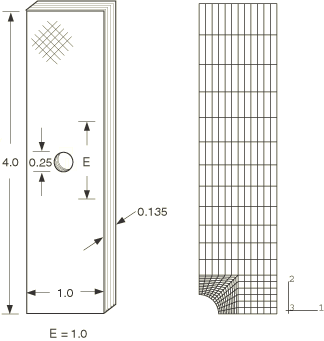

**图 1.1.14-2** 实验和数值（Abaqus/Standard）载荷-位移曲线。

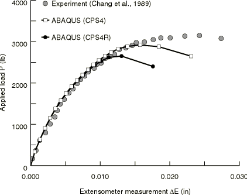

**图 1.1.14-3** 用 Abaqus/Standard 获得的最大载荷处材料损伤的分布。

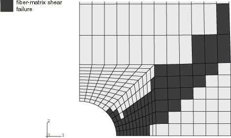
