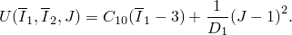
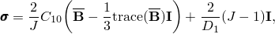
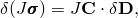
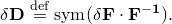
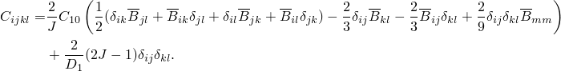
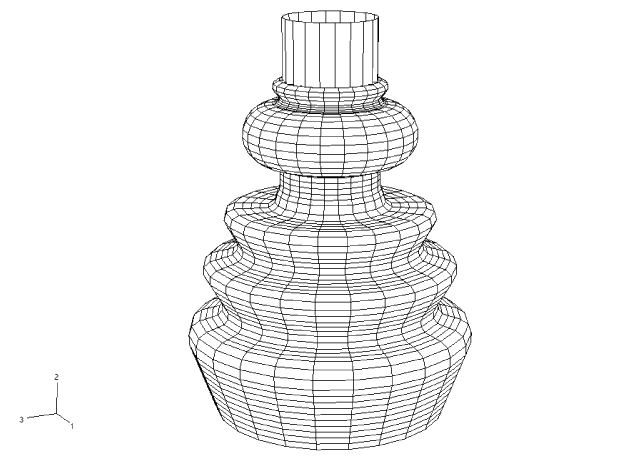
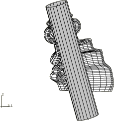
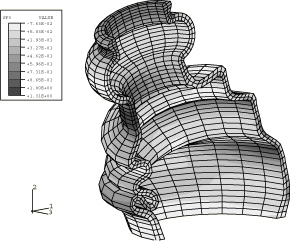

# 1.1.15 汽车防尘罩分析

**产品：** Abaqus/Standard

防尘罩用于保护汽车中的等速万向节和转向机构。这些柔性组件必须适应与转向机构角度偏转相关的运动。防尘罩的某些区域始终与内部金属轴接触，而其他区域在角度偏转期间与金属轴接触。此外，防尘罩也可能与自身接触，包括内部和外部。接触区域影响防尘罩的性能和寿命。

在本示例中，研究了由轴的典型角度运动引起的防尘罩变形。它提供了 Abaqus 中三维可变形体对可变形体接触和自接触中有限滑动能力的演示和验证。此问题还演示了如何使用 [`UMAT`](../sub/sub-link.md#sub-xsl-umat) 用户子程序对超弹性材料进行建模。

### 几何和模型

带内部轴的防尘罩如图 [图 1.1.15-1](ch01s01aex15.md#sxmbootseal-undeformed) 所示。防尘罩的波纹形状在一端紧紧夹住转向轴，另一端固定。橡胶密封件使用一阶混合砖单元建模，厚度方向使用两个单元，采用对称模型生成。密封件具有非均匀厚度，在固定端从最小 3.0 mm 到最大 4.75 mm 不等。内部轴被认为是刚性的，并被建模为分析刚性表面；轴的半径为 14 mm。刚体参考节点精确位于等速万向节的中心。

橡胶被建模为轻度可压碎的 Neo-Hookean（超弹性）材料，其中 D₁ = 0.752 MPa 和 D₂ = 0.026 MPa⁻¹。为了说明目的，包含了一个使用 Marlow 模型的输入文件；该模型使用通过使用 Neo-Hookean 模型运行单轴测试生成的单轴测试数据来定义。

在刚性轴和密封件内表面之间指定接触。在密封件的内表面和外表面上指定自接触。

### 载荷

防尘罩的安装和轴的角度偏转通过三步分析进行。防尘罩颈部处的内半径小于轴的半径，以便在密封件和轴之间提供紧密配合。在第一步中，解决初始干涉配合，对应于将防尘罩安装到轴上的装配过程。利用自动"收缩"配合方法。第二步通过在轴的刚体参考节点处指定 20° 的有限旋转来模拟轴的角度偏转。在第三步期间，角度偏转的轴围绕整个圆周移动，以演示算法的鲁棒性。

### Neo-Hookean 超弹性的用户子程序

在 Abaqus/Standard 中，用户子程序 [`UHYPER`](../sub/sub-link.md#sub-xsl-uhyper) 用于定义超弹性材料。然而，在这个问题中，我们说明使用用户子程序 [`UMAT`](../sub/sub-link.md#sub-xsl-umat) 作为定义超弹性材料的替代方法。特别是，我们考虑 Neo-Hookean 超弹性材料模型。Neo-Hookean 应变能密度函数的形式为

这里，I₁、I₂ 和 I₃ 是偏斜左 Cauchy-Green 变形张量 B̃ 的应变不变量。该张量定义为 B̃ = F̃·F̃ᵀ，其中 F̃ 是畸变梯度。["Hyperelastic material behavior," Abaqus Theory Guide 第 4.6.1 节](../stm/stm-link.md#stm-mat-hyperelastic) 包含这些量的详细解释。

Neo-Hookean 材料的本构方程为

其中 σ 是 Cauchy 应力。材料 Jacobian ∂τ/∂ε 由 Kirchhoff 应力的变分定义

其中 δd 是虚变形率，定义为

对于 Neo-Hookean 材料，D 的分量由下式给出

### 结果和讨论

[图 1.1.15-2](ch01s01aex15.md#sxmbootseal-deformed) 显示了模型的变形构型。轴的旋转导致防尘罩一侧拉伸和另一侧压缩。表面已在压缩侧进入自接触。[图 1.1.15-3](ch01s01aex15.md#sxmbootseal-contours) 显示了防尘罩中最大主应力的等值线。

使用固定和自动接触片进行分析时间的比较表明，两种分析大致在同一时间内完成。对于这种类型的问题，这是可以预期的，因为固定接触片的大小仅限于几个单元。对于使用固定接触片的情况，波前稍大，每次迭代需要更多内存和求解时间。然而，这对于使用自动接触片的情况形成新接触片和重新排序方程所需的时间被抵消。使用用户子程序 [`UMAT`](../sub/sub-link.md#sub-xsl-umat) 的模型获得的结果与使用内置 Abaqus 材料模型获得的结果相同。

### 输入文件

[bootseal.inp](../eif/bootseal.inp)

使用节点-表面接触的分析。

[bootseal_surf.inp](../eif/bootseal_surf.inp)

使用表面-表面接触的分析。

[bootseal_2d.inp](../eif/bootseal_2d.inp)

bootseal.inp 中对称模型生成的二维模型。

[bootseal_2d_surf.inp](../eif/bootseal_2d_surf.inp)

使用表面-表面接触的 bootseal.inp 中对称模型生成的二维模型。

[bootseal_umat.inp](../eif/bootseal_umat.inp)

使用用户子程序 [`UMAT`](../sub/sub-link.md#sub-xsl-umat) 的分析。

[bootseal_2d_umat.inp](../eif/bootseal_2d_umat.inp)

bootseal_umat.inp 中对称模型生成的二维模型。

[bootseal_umat.f](../eif/bootseal_umat.f)

Neo-Hookean 超弹性模型的 [`UMAT`](../sub/sub-link.md#sub-xsl-umat)。

[bootseal_marlow.inp](../eif/bootseal_marlow.inp)

使用 Marlow 超弹性模型的分析。

[bootseal_2d_marlow.inp](../eif/bootseal_2d_marlow.inp)

bootseal_marlow.inp 中对称模型生成的二维模型。

### 图

**图 1.1.15-1** 未变形模型。

**图 1.1.15-2** 一半模型的变形构型。

**图 1.1.15-3** 密封件中最大主应力的等值线。

