# 1.1.16 气密密封的压力渗透分析

**产品：** Abaqus/Standard

密封件是常见的结构组件，通常需要设计分析。Abaqus 可用于执行密封件的非线性有限元分析，并提供确定密封件性能所需的信息。载荷-挠度曲线、密封件变形和应力以及接触压力分布等信息很容易在这些分析中获得。Abaqus 允许在这些分析中考虑密封件与接触表面之间的压力渗透效应，使常规的密封件分析更加现实和准确。离合器密封件、螺纹连接器、车门密封件和气密密封件的分析是压力渗透效应重要的几个应用。

基于表面的压力渗透功能用于模拟接触表面之间的压力渗透。它通过使用压力渗透选项来调用，该选项在 ["Pressure penetration loading," Abaqus Analysis User's Guide 第 37.1.7 节](../usb/usb-link.md#usb-cni-apressurepenetration) 中描述。此功能用于模拟两个变形体之间的接头（例如，两个相互螺纹连接的组件之间）或变形体与刚性表面（如接头中使用的软垫圈）之间的接头在一端或多端暴露于流体或空气压力的情况。这种空气压力将渗入接头并加载形成接头的表面，直到达到表面的某个区域，其中相邻表面之间的接触压力超过在压力渗透选项上指定的临界值，切断进一步的渗透。

### 几何和模型

气密密封设计中的主要考虑是在提供密封的同时避免过大的闭合力。设计不良的气密密封件可以最大程度地减少关闭风扇整流罩门所需的努力，但可能无法防止泄漏并减少风噪。本示例中使用的模型是气密密封件的简化版本。它说明了如何使用 Abaqus 对压力渗透效应进行建模。

所建模的密封件是辊压成形密封件。首先开发密封件的轴对称模型，如图 [图 1.1.16-1](ch01s01aex16.md#sxmaircraftdoor-model) 所示。还开发了密封件的三维模型，只对密封件的 5 度部分进行离散化，如图 [图 1.1.16-2](ch01s01aex16.md#s3daircraftdoor-model) 所示。顶部水平刚性表面代表空气风扇整流罩门，底部水平刚性表面代表密封槽。辊压密封件厚度为 2.54 mm（0.1 in），高度为 74.66 mm（2.9 in）；其顶部和底部表面的内径分别为 508.5 mm（20 in）和 528.3 mm（20.8 in）。折叠金属夹部分粘接到密封件的顶部表面。金属夹的厚度为 0.48 mm（0.019 in）。

密封件的材料被认为是不可压缩的类橡胶材料。为了获得材料常数，使用 N=4 的应变能函数的 Ogden 形式来拟合单轴测试数据。金属夹由钢制成，杨氏模量为 206.8 GPa（3.0×10⁷ lb/in²），泊松比为 0.3。CAX4H 单元用于在轴对称模型中对密封件和金属夹进行建模，C3D8H 单元用于三维模型。接触对方法用于对金属夹顶部表面与代表风扇整流罩门的顶部刚性表面之间的接触进行建模，可能发生压力渗透的位置。接触对方法还用于对密封件与底部刚性表面之间、密封件与金属夹未粘接部分之间的接触以及密封件的自接触进行建模。接触表面之间的机械相互作用被认为是摩擦接触。因此，使用摩擦选项来指定摩擦系数。为了提高计算效率，由于这些单元的尺寸差异很大，因此为密封件与金属夹之间的接触表面指定了摩擦选项上的滑移容差（允许的最大弹性滑移与特征接触表面面尺寸的比值）。固定边界条件最初应用于顶部刚性表面的参考节点 5001 和底部刚性表面的参考节点 5002。密封件底部的垂直边缘受到约束，使其不能在 1 方向上移动。垂直边缘的底部节点 1 接触底部刚性表面并在 2 方向上保持固定。顶部刚性表面最初位于金属夹顶部表面上方 1.27 mm（0.05 in）处。

密封件和夹子未粘接部分在其所有内表面上受到空气压力加载，并由关闭空气风扇整流罩门产生的接触压力加载。两个非线性静态步骤，都包含大位移效应，用于模拟这些加载条件。

在第一步中，顶部刚性表面沿 *y* 方向向下移动 35.56 mm（1.4 in），模拟关闭风扇整流罩门。

在第二步中，由于密封件与顶部刚性表面之间的一些间隙已闭合，密封件的内表面承受 206.8 KPa（30.0 lb/in²）的均匀空气压力载荷。压力渗透在金属夹的顶部表面（`PPRES`），包括 31 个单元，和顶部刚性表面（`CFACE`）之间进行模拟。不需要在金属夹和密封件之间建模空气压力渗透，因为它们结合良好。

调用压力渗透选项来定义暴露于空气压力的节点、空气压力的大小和临界接触压力。表面 `PPRES` 在节点 597 处暴露于空气压力，压力大小为 206.8 KPa（30.0 lb/in²）。使用临界接触压力的默认值零，表明压力渗透仅在从属节点的接触丢失时发生。

### 结果和讨论

[图 1.1.16-3](ch01s01aex16.md#sxmaircraftdoor-defconfig-1) 和 [图 1.1.16-4](ch01s01aex16.md#sxmaircraftdoor-contstress-1) 显示了轴对称模型在步骤 1 结束时密封件的变形构型和接触压力等值线，[图 1.1.16-5](ch01s01aex16.md#s3daircraftdoor-contstress-1) 显示了三维模型的结果。观察到沿密封件表面存在非均匀接触压力。前五个从属节点处的接触压力为零。

渗透压力载荷在第二步期间施加。空气压力立即施加到与前五个从属节点关联的单元，因为那里的接触压力为零且满足压力渗透准则。对于轴对称模型，[图 1.1.16-6](ch01s01aex16.md#sxmaircraftdoor-defconfig-2-2) 到 [图 1.1.16-14](ch01s01aex16.md#sxmaircraftdoor-fluidpress-2-16) 捕获了渗透的扩展，显示了变形的密封件、接触压力分布以及对应于步骤 2 的载荷增量 2、10 和 16 的空气压力分布。对应于这三个增量施加到表面的压力分别为 1.296 KPa（0.188 lb/in²）、13.96 KPa（2.03 lb/in²）和 70.88 KPa（10.28 lb/in²）。对于三维模型，[图 1.1.16-15](ch01s01aex16.md#s3daircraftdoor-contstress-2-2) 到 [图 1.1.16-17](ch01s01aex16.md#s3daircraftdoor-contstress-2-14) 捕获了渗透的扩展，显示了对应于步骤 2 的载荷增量 2、6 和 14 的接触压力分布。

在第二步中增加的渗透压力载荷进一步降低接触压力，最终导致空气完全穿透密封件。密封件从空气风扇整流罩门处抬起，仅在最后一个从属节点 663 处保持接触，由于施加的边界条件和空气压力，那里的接触压力保持良好。对于轴对称模型，[图 1.1.16-18](ch01s01aex16.md#sxmaircraftdoor-defconfig-2-20) 到 [图 1.1.16-21](ch01s01aex16.md#sxmaircraftdoor-contstress-2-end) 捕获了密封密封件弱化的发展，显示了变形的密封件以及对应于载荷增量 20 和步骤 2 结束时的接触压力分布。对应于这两个增量施加到表面的压力分别为 112.3 KPa（16.28 lb/in²）和 206.8 KPa（30.0 lb/in²）。对于三维模型，[图 1.1.16-22](ch01s01aex16.md#s3daircraftdoor-contstress-2-19) 到 [图 1.1.16-23](ch01s01aex16.md#s3daircraftdoor-contstress-2-end) 捕获了密封密封件弱化的发展，显示了对应于载荷增量 19 和步骤 2 结束时的接触压力分布。

密封件在整个加载历史中的行为最好通过绘制空气渗透距离作为空气压力的函数来描述，如图 [图 1.1.16-24](ch01s01aex16.md#saircraftdoor-dist-fluidpress) 中针对轴对称和三维模型所示。很明显，空气渗入密封件仅在压力达到约 51.7 KPa（7.5 lb/in²）时才会加速。当压力为 82.7 KPa（12.0 lb/in²）时，空气完全穿透密封件，这大约等于海平面大气压的 80%。

此外，使用自适应自动稳定方案分析了相同的模型，该方案通过基于收敛历史自动调整阻尼因子来提高鲁棒性，同时对结果的影响非常小。发现当使用自适应稳定方案时，耗散的稳定化能量很小。

### 输入文件

[presspenairductseal.inp](../eif/presspenairductseal.inp)

气密密封的压力渗透模拟。

[presspenairductseal_stabil_adap.inp](../eif/presspenairductseal_stabil_adap.inp)

与 presspenairductseal.inp 相同，但带有自适应自动稳定。

[presspenairductseal_node.inp](../eif/presspenairductseal_node.inp)

密封件模型的节点定义。

[presspenairductseal_elem_metal.inp](../eif/presspenairductseal_elem_metal.inp)

密封件模型金属部分的单元定义。

[presspenairductseal_elem_rub.inp](../eif/presspenairductseal_elem_rub.inp)

密封件模型橡胶部分的单元定义。

[presspenairductseal_c3d8h.inp](../eif/presspenairductseal_c3d8h.inp)

气密密封的三维压力渗透模拟。

### 图

**图 1.1.16-1** 气密密封的轴对称模型。

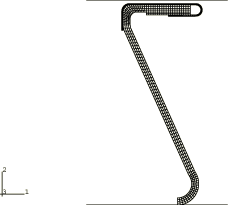

**图 1.1.16-2** 气密密封的三维模型。

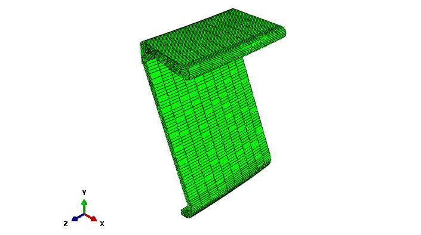

**图 1.1.16-3** 对于轴对称模型，步骤 1 结束时密封件的变形构型。

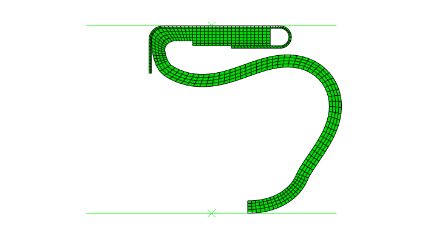

**图 1.1.16-4** 对于轴对称模型，步骤 1 结束时密封件中的接触应力等值线。

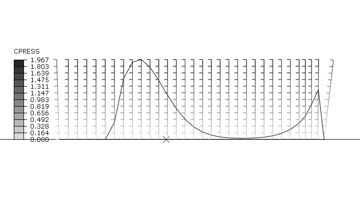

**图 1.1.16-5** 对于三维模型，步骤 1 结束时密封件的变形构型和接触应力等值线。

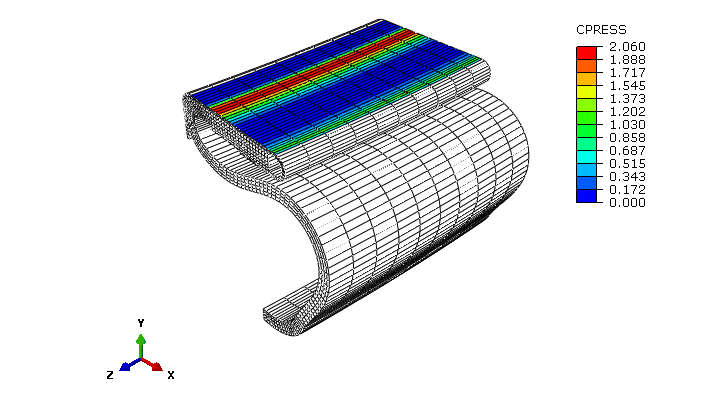

**图 1.1.16-6** 对于轴对称模型，步骤 2 增量 2 时密封件的变形构型。

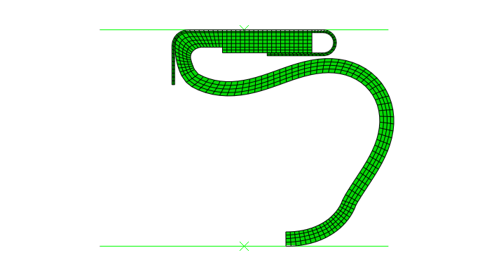

**图 1.1.16-7** 对于轴对称模型，步骤 2 增量 2 时密封件中的接触应力等值线。

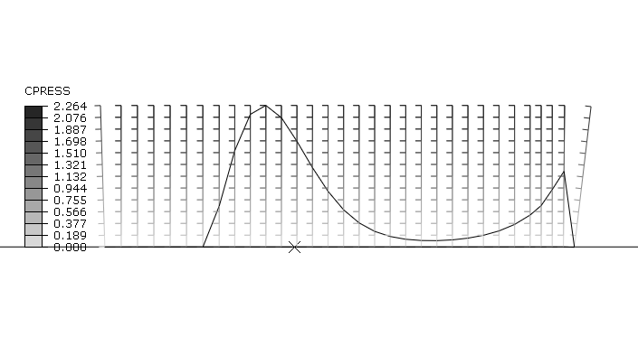

**图 1.1.16-8** 对于轴对称模型，步骤 2 增量 2 时密封件中的空气压力等值线。

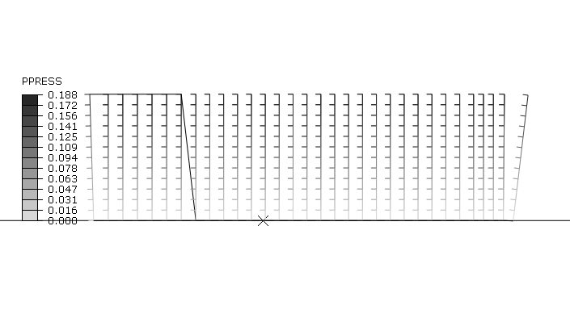

**图 1.1.16-9** 对于轴对称模型，步骤 2 增量 10 时密封件的变形构型。

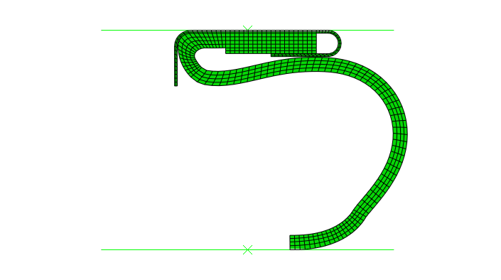

**图 1.1.16-10** 对于轴对称模型，步骤 2 增量 10 时密封件中的接触应力等值线。

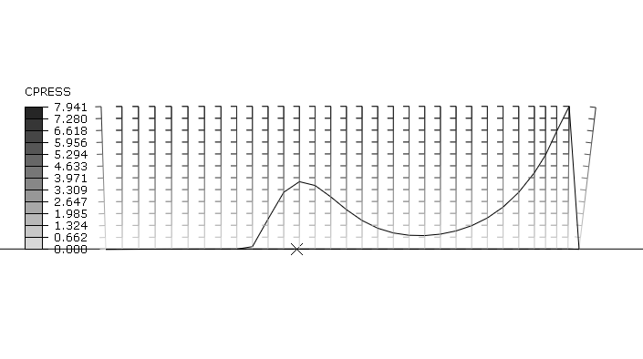

**图 1.1.16-11** 对于轴对称模型，步骤 2 增量 10 时密封件中的空气压力等值线。

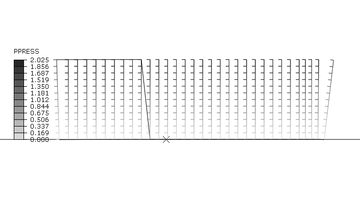

**图 1.1.16-12** 对于轴对称模型，步骤 2 增量 16 时密封件的变形构型。

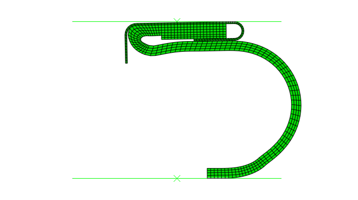

**图 1.1.16-13** 对于轴对称模型，步骤 2 增量 16 时密封件中的接触应力等值线。

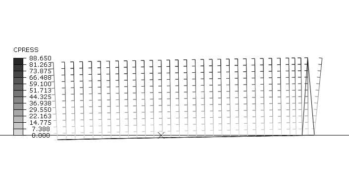

**图 1.1.16-14** 对于轴对称模型，步骤 2 增量 16 时密封件中的空气压力等值线。

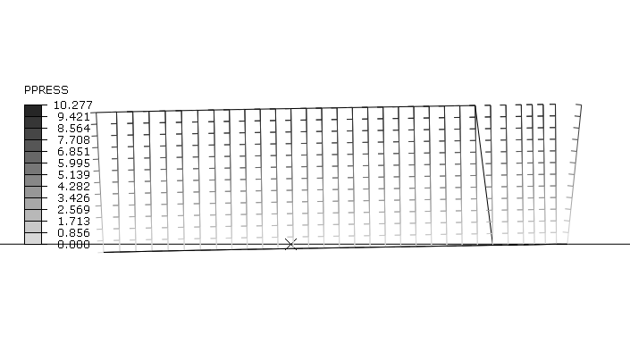

**图 1.1.16-15** 对于三维模型，步骤 2 增量 2 时密封件的变形构型和接触应力等值线。

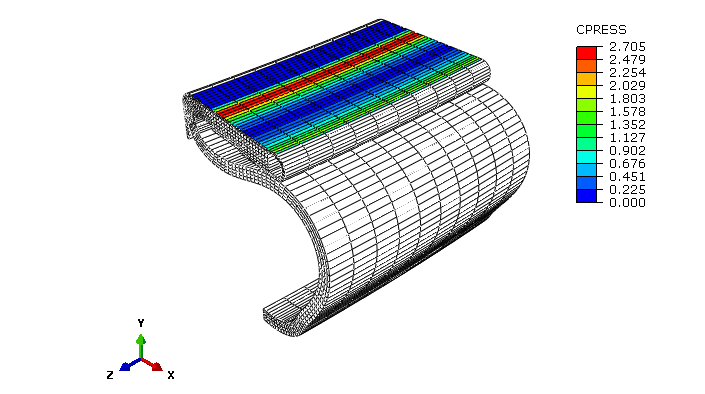

**图 1.1.16-16** 对于三维模型，步骤 2 增量 6 时密封件的变形构型和接触应力等值线。

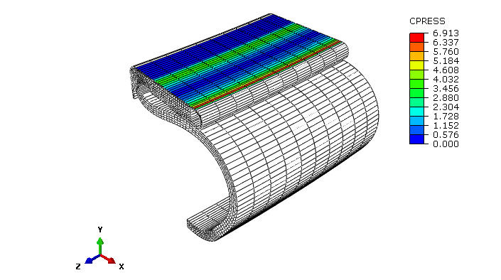

**图 1.1.16-17** 对于三维模型，步骤 2 增量 14 时密封件的变形构型和接触应力等值线。

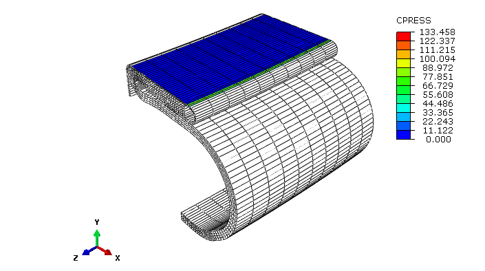

**图 1.1.16-18** 对于轴对称模型，步骤 2 增量 20 时密封件的变形构型。

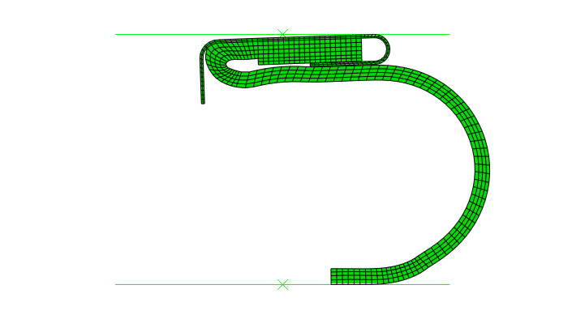

**图 1.1.16-19** 对于轴对称模型，步骤 2 增量 20 时密封件中的接触应力等值线。

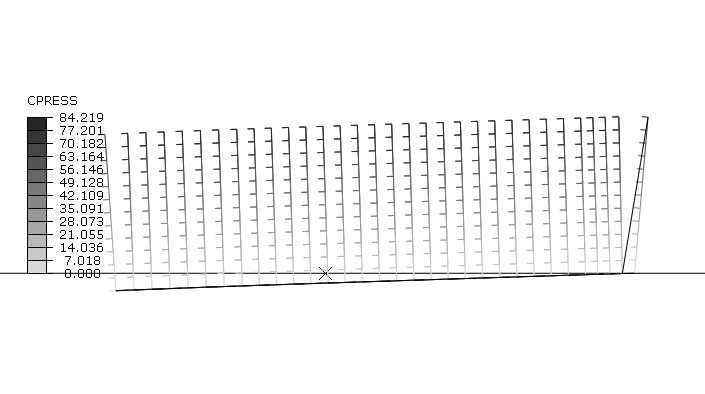

**图 1.1.16-20** 对于轴对称模型，步骤 2 结束时密封件的变形构型。

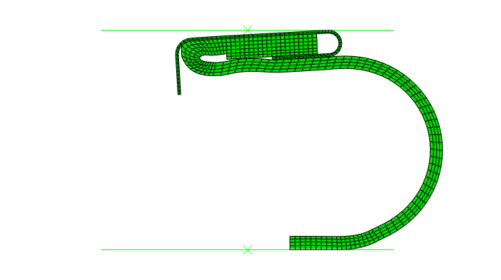

**图 1.1.16-21** 对于轴对称模型，步骤 2 结束时密封件中的接触应力等值线。

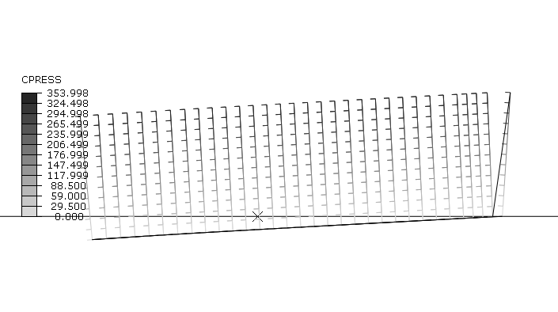

**图 1.1.16-22** 对于三维模型，步骤 2 增量 19 时密封件的变形构型和接触应力等值线。

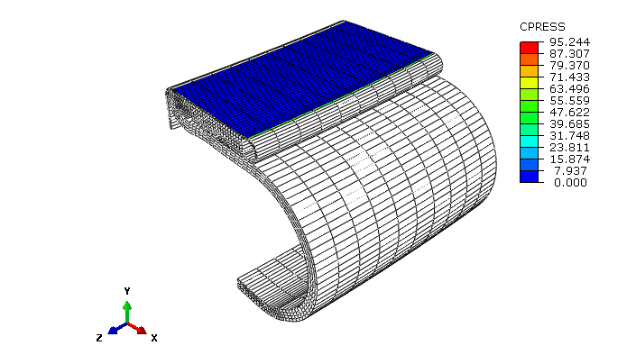

**图 1.1.16-23** 对于三维模型，步骤 2 结束时密封件的变形构型和接触应力等值线。

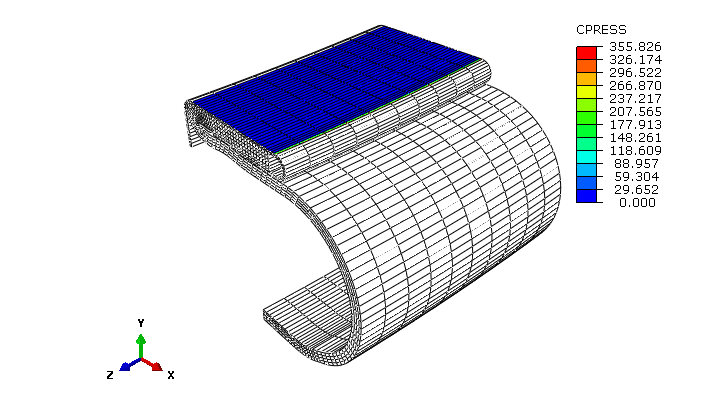

**图 1.1.16-24** 密封件中空气渗透距离与空气压力的关系

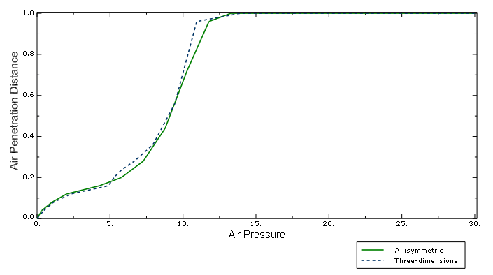
