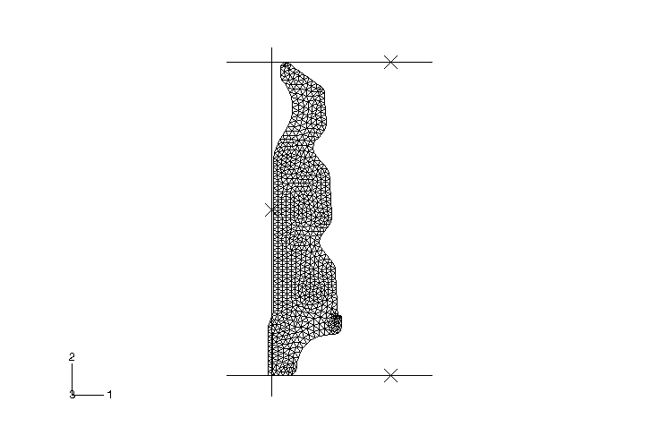
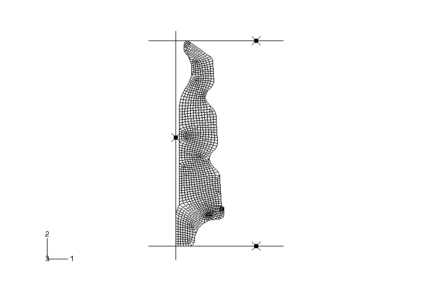
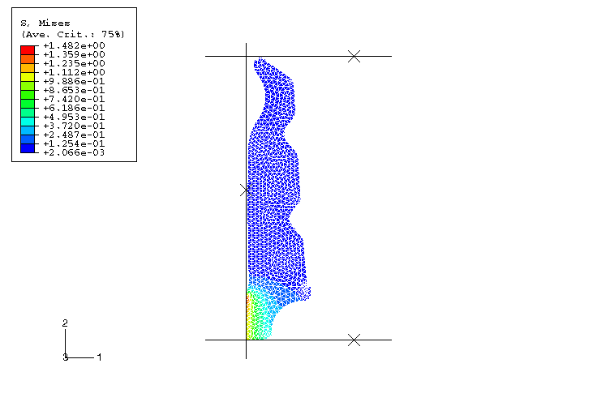
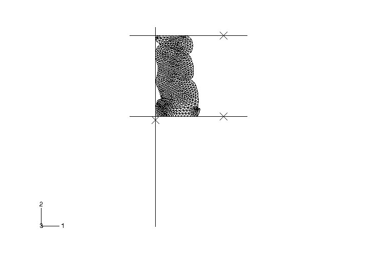
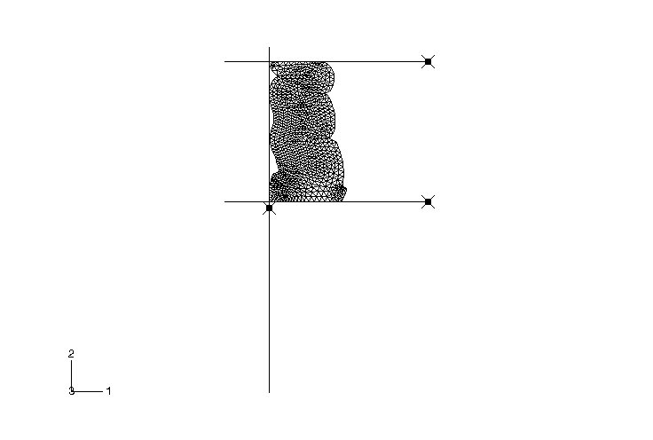
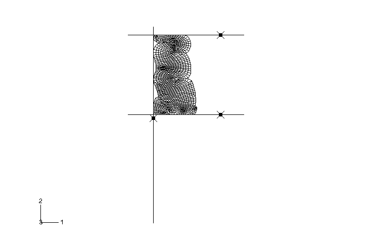
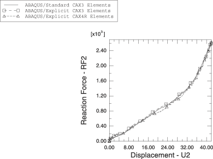

# 1.1.17 橡胶/泡沫组件中的自接触：缓冲块

**产品：** Abaqus/Standard   Abaqus/Explicit

Abaqus中的自接触功能通过两个来自汽车零部件行业的示例进行说明：本题以及下一题（讨论橡胶垫圈）。这些示例展示了Abaqus中用于大滑动分析的单面接触功能。会发生大幅变形并改变形状的组件可能会折叠，表面的不同部分会彼此接触。在这种情况下，在分析开始时很难预测可能发生接触的位置，因此也很难定义两个独立的表面来组成接触对。

缓冲块（有时称为"辅助弹簧"）是一种高可压缩性组件，用作车辆隔振系统的一部分。它通常位于连接车轮与车架的螺旋弹簧上方。由于其高可压缩性以及除完全压缩配置外所有配置下的低泊松比值，采用微孔材料制造。

缓冲块安装在一根直径大于缓冲块内径的心轴上（见图1.1.17-1）。分析的第一步解决这个过盈配合问题。缓冲块一端最初靠在一个固定的平坦刚性表面上；另一端使用另一个平坦刚性表面来模拟缓冲块的压缩。缓冲块的几何形状使其在三个不同位置折叠。在预期会发生自接触的位置定义单独的表面。这种建模技术产生经济的分析，因为接触搜索的范围是有限的。

### 几何与模型

缓冲块长76.0 mm（3.0 in），内径为20.0 mm（0.8 in）。建模为刚性表面的心轴直径为22.0 mm（0.9 in）。缓冲块采用超泡沫材料模型建模。可压缩的非线性弹性行为由应变能函数描述。使用自动网格生成器生成CAX3或CAX4R单元的网格。图1.1.17-1和图1.1.17-2分别显示了CAX3单元和CAX4R单元的初始网格。除了用于定义自接触的缓冲块表面部分外，还定义了额外的区域来模拟缓冲块与固定表面、缓冲块与心轴以及缓冲块与移动刚性表面之间的接触。所有表面都施加少量摩擦（库仑系数为0.05）。

### 结果与讨论

缓冲块分析是一个两步过程。第一步解决缓冲块内径与心轴之间的过盈。在Abaqus/Standard分析中使用自动"收缩"配合方法（参见《Abaqus分析用户指南》第39.1.2节"与Abaqus/Standard中接触建模相关的常见困难"）：计算的初始穿透被允许在步骤开始时存在，并在步骤结束时线性缩减为零。在Abaqus/Explicit分析中，过盈解决步骤以两种方式之一执行。在第一种方法中，心轴的定位使得在分析开始时缓冲块与心轴之间不存在接触或过度闭合。然后沿径向移动表示心轴的刚性表面，以模拟缓冲块因过盈配合而产生的压缩。在第二种方法中，将Abaqus/Standard的收缩配合解决方案导入Abaqus/Explicit。过盈步骤结束时Abaqus/Standard和Abaqus/Explicit预测的Mises应力的比较表明结果非常相似（见图1.1.17-3和图1.1.17-4）。

在第二步中，底面通过向表面的参考节点施加位移边界条件而将缓冲块压缩42.0 mm（1.7 in）。图1.1.17-5、图1.1.17-6和图1.1.17-7显示了缓冲块的最终变形形状；材料的极高可压缩性以及表面向自身的折叠是显而易见的。尽管在自接触表面的定义中使用了关于折叠发生位置的一般知识，但不需要精确知道表面将形成褶皱的位置。

Abaqus/Standard和Abaqus/Explicit对CAX3单元网格预测的最终变形形状相同（分别参见图1.1.17-5和图1.1.17-6）。当使用CAX4R单元时，Abaqus/Explicit预测了类似的形状（参见图1.1.17-7）。然而，使用CAX4R单元在Abaqus/Explicit中获得的结果表明，在左上折叠半径处发生了局部屈曲。这使得在Abaqus/Standard中使用CAX4R单元进行类似分析变得非常困难。由于这些单元的较刚性特性，CAX3分析中没有捕捉到局部屈曲。

底面的载荷-位移曲线如图1.1.17-8所示。使用Abaqus/Standard中的CAX3单元以及Abaqus/Explicit中的CAX3和CAX4R单元获得的结果非常相似。通过这些曲线可以看到缓冲块的能量吸收能力。

### 输入文件

[selfcontact_bump_std_cax3.inp](../eif/selfcontact_bump_std_cax3.inp)

使用CAX3单元的Abaqus/Standard缓冲块模型。

[selfcontact_bump_surf.inp](../eif/selfcontact_bump_surf.inp)

使用CAX3单元和面-面接触的Abaqus/Standard缓冲块模型。

[selfcontact_bump_std_imp_surf.inp](../eif/selfcontact_bump_std_imp_surf.inp)

使用CAX3单元和面-面接触的Abaqus/Standard缓冲块模型。此输入文件依赖于selfcontact_bump_surf.inp。

[selfcontact_bump_xpl_cax3.inp](../eif/selfcontact_bump_xpl_cax3.inp)

使用CAX3单元的Abaqus/Explicit缓冲块模型。

[selfcontact_bump_xpl_cax4r.inp](../eif/selfcontact_bump_xpl_cax4r.inp)

使用CAX4R单元的Abaqus/Explicit缓冲块模型。

[selfcontact_bump_std_resinter_cax4r.inp](../eif/selfcontact_bump_std_resinter_cax4r.inp)

使用CAX4R单元解决过盈配合的Abaqus/Standard缓冲块模型。

[selfcontact_bump_std_imp_cax3.inp](../eif/selfcontact_bump_std_imp_cax3.inp)

使用CAX3单元的Abaqus/Standard缓冲块模型；过盈配合解决方案从Abaqus/Standard导入。

[selfcontact_bump_xpl_imp_cax3.inp](../eif/selfcontact_bump_xpl_imp_cax3.inp)

使用CAX3单元的Abaqus/Explicit缓冲块模型；过盈配合解决方案从Abaqus/Standard导入。

[selfcontact_bump_xpl_imp_cax4r.inp](../eif/selfcontact_bump_xpl_imp_cax4r.inp)

使用CAX4R单元的Abaqus/Explicit缓冲块模型；过盈配合解决方案从Abaqus/Standard导入。

[selfcontact_bump_node_cax3.inp](../eif/selfcontact_bump_node_cax3.inp)

CAX3单元缓冲块模型的节点定义。

[selfcontact_bump_node_cax4r.inp](../eif/selfcontact_bump_node_cax4r.inp)

CAX4R单元缓冲块模型的节点定义。

[selfcontact_bump_element_cax3.inp](../eif/selfcontact_bump_element_cax3.inp)

CAX3单元缓冲块模型的单元定义。

[selfcontact_bump_element_cax4r.inp](../eif/selfcontact_bump_element_cax4r.inp)

CAX4R单元缓冲块模型的单元定义。

[selfcontact_bump_surfdef_cax3.inp](../eif/selfcontact_bump_surfdef_cax3.inp)

CAX3单元缓冲块模型的表面定义。

[selfcontact_bump_surfdef_cax4r.inp](../eif/selfcontact_bump_surfdef_cax4r.inp)

CAX4R单元缓冲块模型的表面定义。

### 图

**图 1.1.17–1** 使用CAX3单元的缓冲块初始网格（Abaqus/Standard）。

**图 1.1.17–2** 使用CAX4R单元的缓冲块初始网格（Abaqus/Explicit）。

**图 1.1.17–3** 使用Abaqus/Standard自动收缩配合选项解决过盈后缓冲块中的Mises应力。

**图 1.1.17–4** 使用Abaqus/Explicit解决过盈后缓冲块中的Mises应力。

**图 1.1.17–5** 压缩后的缓冲块网格（Abaqus/Standard；CAX3单元）。

**图 1.1.17–6** 压缩后的缓冲块网格（Abaqus/Explicit；CAX3单元）。

**图 1.1.17–7** 压缩后的缓冲块网格（Abaqus/Explicit；CAX4R单元）。

**图 1.1.17–8** 缓冲块载荷-位移曲线。

