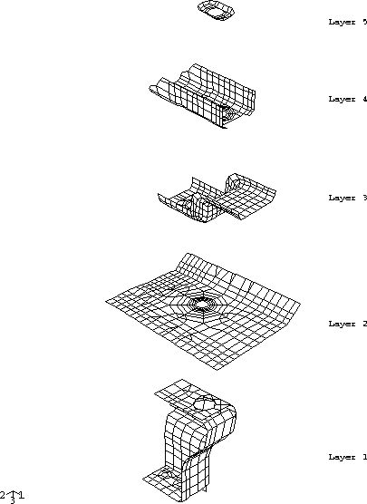
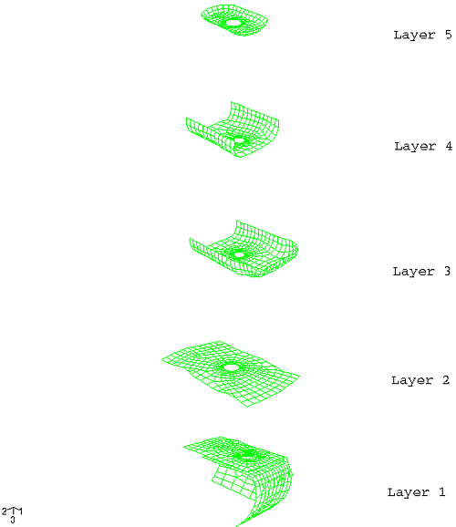
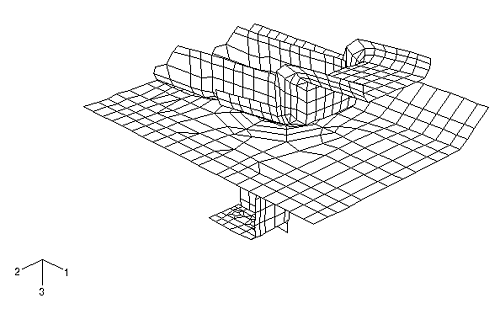
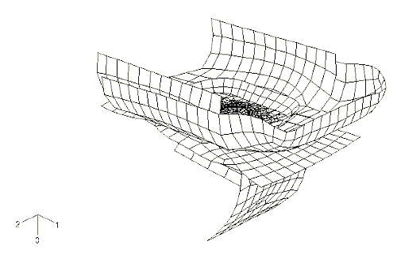
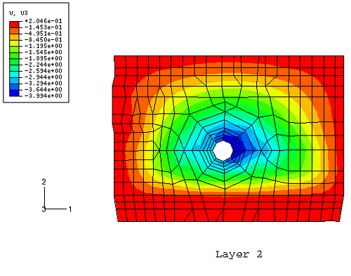
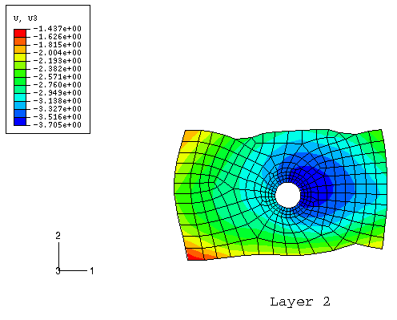

# 1.1.19 叠层钣金装配体的子模型分析

**产品：** Abaqus/Standard

在汽车工业中，通过机械紧固件（如螺栓或铆钉）堆叠并固定在一起的钣金冲压件被广泛使用。 examples include seat belt anchors and seating track assemblies. Abaqus中的子模型功能便于经济 yet detailed, prediction of the ultimate strength and integrity of such jointed assemblies. 首先对装配体进行全局模型分析，以捕获系统的整体变形。随后，使用该全局分析的位移结果来驱动关键关注区域的子模型区域的边界。子模型方法提供了比在单次分析中使用全局细化网格更经济的精确建模。

在对此类结构进行有限元分析时，壳单元通常用于表示钣金冲压件。每个壳的节点通常位于壳厚度的中平面。壳的厚度用于结构计算，但不计入接触计算。因此，由多层钣金冲压件组成的结构可能每一层板的节点都位于相同的空间平面。这种接近程度在子模型分析中造成不确定性，因为Abaqus将无法确定子模型与全局模型之间各层之间的正确对应关系。因此，Abaqus提供了一种功能，允许用户指定用于驱动子模型中特定节点集的全局模型的特定单元，这消除了不确定性。此功能在此示例问题中进行了演示。

### 几何与模型

全局模型由五个独立的金属冲压件组成，使用S4R和S3R壳单元进行网格划分。全局有限元模型的爆炸图如图1.1.19-1所示。冲压件通过沿3方向折叠配置而堆叠在一起。所有壳单元厚度为0.5 mm，所有节点位于每个壳的中表面。独立的网格通过贯穿每一层的大螺栓孔上相应周向节点之间的BEAM型MPC连接在一起。第1层底部小孔边缘上的节点在所有六个自由度上受到约束，表示与地面的连接点。第2层周向节点的平移自由度也受到约束，表示该板的远场边界条件。

多个表面定义用于模拟各个相邻层之间的接触。接触定义防止壳单元层之间不需要的穿透。使用小滑动接触公式。此问题中的大部分接触发生在相邻层之间，但第2层和第4层之间也有直接接触。为了避免过度约束，重要的是第4层上的任何点不能同时与第3层和第2层接触；因此，对从属表面使用基于节点的表面。这排除了接触应力的精确计算，但在此情况下这不重要，因为可以在子模型中获得更精确的接触应力。

所有五个冲压件均由钢制成，建模为弹塑性材料。弹性模量为207,000 MPa，泊松比为0.3，屈服应力为250 MPa。金属塑性定义包括中等应变硬化。

子模型冲压件是全局模型的截断版本，位于与全局模型相同的物理位置。在这种情况下，这些是关注高应力和接头潜在失效的区域。子模型使用比全局模型更细的网格进行离散化，以提供更高水平的精度。图1.1.19-2显示了子模型的爆炸图。因为子模型中的冲压件包含大螺栓孔，所以子模型包含与全局模型中类似方式的BEAM型MPC。

子模型具有多个表面定义和接触对，以避免一个冲压件穿透另一个。然而，子模型不包含基于节点的表面。接触在每一层中建模为基于单元的面-面接触。

子模型中的材料定义和壳厚度与全局模型中的相同。

### 结果与讨论

全局模型通过在第3层突出边缘上施加规定的边界条件来加载。该边缘在1方向上位移5.0 mm，在3方向上位移12.5 mm。图1.1.19-3显示了全局模型的变形形状。节点的位移被保存到结果文件中，供后续子模型分析使用。

子模型驱动节点使用子模型边界条件加载。子模型每一层的周向节点对应于全局几何的"切割"部分，由全局结果文件中的插值节点位移结果驱动。每个驱动节点集位于单独的壳层中。因此，子模型分析包含多个子模型，这些子模型指定要搜索的全局模型单元集，以获取驱动子模型驱动节点集的响应。例如，子模型第1层中的驱动节点（节点集 `L1BC`）由包含（全局）第1层单元的全局单元集（单元集 `LAYER1`）的结果驱动。第2-4层的驱动节点以类似方式指定。因为子模型第5层没有驱动节点，所以只需要四个子模型。

图1.1.19-4显示了子模型的变形形状。图1.1.19-5和图1.1.19-6分别显示了第2层全局模型和子模型的平面外位移等值线图。两种情况下的位移模式相似；但是，全局模型预测的最大位移比子模型预测的大约7.8%。

### 输入文件

[stackedassembly_s4r_global.inp](../eif/stackedassembly_s4r_global.inp)

S4R全局模型。

[stackedassembly_s4r_global_mesh.inp](../eif/stackedassembly_s4r_global_mesh.inp)

S4R全局模型的关键输入数据。

[stackedassembly_s4r_sub.inp](../eif/stackedassembly_s4r_sub.inp)

S4R子模型。

[stackedassembly_s4r_sub_mesh.inp](../eif/stackedassembly_s4r_sub_mesh.inp)

S4R子模型的关键输入数据。

### 图

**图 1.1.19–1** 全局模型爆炸图。

**图 1.1.19–2** 子模型爆炸图。

**图 1.1.19–3** 全局模型变形形状。

**图 1.1.19–4** 子模型变形形状。

**图 1.1.19–5** 第2层平面外位移，全局模型。

**图 1.1.19–6** 第2层平面外位移，子模型。

