# 1.1.21 循环热-机械载荷下气缸盖的直接循环分析

**产品：** Abaqus/Standard

疲劳和失效预测是评估产品性能的基础。本例展示了使用直接循环分析方法来获得可用于疲劳寿命计算的结果。

众所周知，诸如发动机中承受大幅温度波动和夹紧载荷的气缸盖等高负荷结构，可能会发生塑性变形。经过多次重复加载循环后，会有三种可能之一：弹性安定，此时低循环疲劳没有危险；塑性安定，导致稳定的塑性应变循环，此时将使用能量耗散准则来估计循环失效次数；以及塑性棘轮，此时设计被拒绝。获取此类结构响应的经典方法是反复施加周期性载荷直到获得稳定状态或发生塑性棘轮。这种方法可能非常昂贵，因为可能需要施加许多加载循环来获得稳态响应。为了避免与这种瞬态分析相关的大量数值计算费用，可以使用直接循环分析程序（如 Abaqus Analysis User's Guide 第6.2.6节"直接循环分析"中所述）直接计算结构的循环响应。

### 几何与模型

本例分析的气缸盖如图1.1.21-1所示。气缸盖（单缸）有三个阀口，每个阀口都嵌有阀座；两个阀导管；以及四个用于将气缸盖固定到发动机缸体的螺栓孔。

气缸盖主体由铝制成，室温下杨氏模量为70 GPa，屈服应力为62 MPa，泊松比为0.33，热膨胀系数为22.6×10⁻⁶/°C。本例中，废气汇聚的阀口附近区域承受从35°C最低值到300°C最高值的循环温度波动。当气缸盖加热到峰值温度时的温度分布如图1.1.21-2所示。在这种工作条件下，会观察到塑性变形以及蠕变变形。双层粘弹性-弹塑性模型最适合模拟在高温下具有显著时间相关行为以及塑性的材料响应，用于模拟铝气缸盖（见Abaqus Analysis User's Guide第23.2.11节"双层粘塑性"）。该材料模型由一个弹塑性网络与一个弹性粘性网络并联组成。弹塑性网络中使用具有运动硬化的Mises金属塑性模型，弹性粘性网络中使用具有应变硬化的幂律蠕变模型。由于铝的弹性粘塑性响应在这一温度范围内变化很大，因此指定了温度相关的材料特性。

两个阀导管由钢制成，杨氏模量为106 GPa，泊松比为0.35。阀导管紧密配合在气缸盖的两个阀口中，假定为弹性行为。两个组件之间的界面通过使用共享界面节点的匹配网格来建模。

三个阀座由钢制成，杨氏模量为200 GPa，泊松比为0.3。阀座过盈配合到气缸盖阀口中。这是通过在阀座表面节点和阀口表面节点之间定义径向约束方程来实现的，方程形式为../graphics/exa_eqn00193.gif，其中../graphics/exa_eqn00194.gif是阀口的径向位移，../graphics/exa_eqn00195.gif是阀座的径向位移，../graphics/exa_eqn00196.gif是参考节点。在分析的第一步中，向参考节点施加指定的位移，导致两个组件之间产生法向压力。假定阀座为弹性行为。

所有结构组件（气缸盖、阀导管和阀座）均使用三维连续体单元建模。该模型由19394个一阶砖单元（C3D8）和1334个一阶棱镜单元（C3D6）组成，共约80000个自由度。C3D6单元仅在复杂几何形状不允许使用C3D8单元的地方使用。

### 载荷与边界约束

载荷分两个分析步施加到装配体上。第一步使用线性多点方程约束和指定位移载荷将三个阀座过盈配合到相应的气缸盖阀口中（见上述说明）。为此使用静力分析程序。循环热载荷在第二步分析中施加。假定气缸盖通过四个螺栓孔牢固地固定到发动机缸体上，因此在整个模拟过程中，四个螺栓孔底部的节点在所有方向上都被固定。

循环热载荷通过进行独立的热分析来获得。在该分析中，施加三个热循环以获得稳态热循环。每个热循环包括两个步骤：加热气缸盖至最高工作温度，以及使用集中热通量和膜条件将其冷却至最低工作温度。最后两步（一个热循环）的节点温度被认为是稳态解，并存储在结果（.fil）文件中，供后续热-机械分析使用。最高温度出现在废气汇聚的阀口附近。该区域（节点50417）的温度作为稳态循环的时间函数如图1.1.21-3所示。

在力学分析的第二步中，施加从前一个热分析生成的循环节点温度。在该步中指定固定时间增量为0.25，载荷循环周期为30，导致一次迭代共有120个增量。傅里叶级数的项数和最大迭代次数分别为40和100。

为进行比较，还使用经典瞬态分析对相同模型进行了分析，该分析需要20个重复步骤才能使解稳定。在每个步骤中施加时间增量为0.25、载荷循环周期为30的循环温度载荷。

### 结果与讨论

气缸盖设计中的一个考虑因素是阀口附近的应力分布和变形。图1.1.21-4显示了直接循环分析中加载循环结束时（迭代75，增量120）气缸盖中的Mises应力分布。同一时刻直接循环分析中的总应变分布如图1.1.21-5所示。变形和应力在阀口附近最为严重，使该区域成为设计中的关键区域。图1.1.21-6至图1.1.21-16所示的结果在该区域（单元50152，积分点1）测量。图1.1.21-6、图1.1.21-7和图1.1.21-8分别显示了直接循环分析中迭代50、75和100期间，整个加载循环中全局1方向上应力分量、塑性应变分量和粘性应变分量的演变。应力与塑性应变的演化关系如图1.1.21-9所示（通过结合图1.1.21-6和图1.1.21-7获得）。类似地，应力与粘性应变的演化关系如图1.1.21-10所示（通过结合图1.1.21-6和图1.1.21-8获得）。应力-应变曲线的形状在迭代75后保持不变，一个周期内应力的峰值和平均值也是如此。然而，一个周期内塑性应变的平均值和粘性应变的平均值从一个迭代继续增长到下一个迭代，表明在阀口附近发生塑性棘轮。

使用经典瞬态方法在循环5、10和20期间获得的应力与塑性应变演化以及应力与粘性应变演化的类似结果分别如图1.1.21-11和图1.1.21-12所示。观察到塑性棘轮与直接循环方法预测的结果一致。直接循环分析迭代100期间获得的应力与塑性应变演化与瞬态方法循环20期间获得的结果的比较如图1.1.21-13所示。两种方法获得的应力与粘性应变演化的类似比较如图1.1.21-14所示。两种情况下的应力-应变曲线形状相似。

使用直接循环程序的一个优点是全局刚度矩阵仅需反转一次，而不是像Abaqus/Standard中经典方法那样，可以节省成本。在本例中，直接循环分析中导致塑性棘轮首次出现的总计算时间（75次迭代）约为瞬态分析（20个步骤）计算时间的70%。随着问题规模的增加，节省将更加显著。

通常可以通过使用较少项的傅里叶级数和/或较少的迭代增量来获得额外的成本节省。在本例中，如果选择20个而不是40个傅里叶项，直接循环分析中导致塑性棘轮首次出现的总计算时间（75次迭代）约为瞬态分析（20个步骤）计算时间的65%。此外，如果指定固定时间增量为0.735而不是0.25，导致一次迭代共有41个增量，则直接循环分析的总计算时间减少三分之一，且不影响结果的准确性。使用较少傅里叶项在迭代75期间获得的应力与塑性应变演化的比较如图1.1.21-15所示。使用较少傅里叶项获得的应力与粘性应变演化的类似比较如图1.1.21-16所示。两种情况下应力-应变曲线的形状和循环期间耗散的能量量相似，但使用较少傅里叶项的情况提供的应力结果精度较低。

使用直接循环方法代替经典方法的另一个优点是，可以通过将位移和残余系数与某些内部控制变量进行比较来自动预测塑性棘轮或稳定循环响应的可能性。无需可视化整个加载历史期间整个模型的详细结果，这进一步减少了与输出相关的数据存储和计算时间。对于本例，检查写入消息（.msg）文件的位移和残余系数可以清楚地表明傅里叶级数的常数项不稳定，因此发生塑性棘轮。

### 致谢

SIMULIA衷心感谢PSA Peugeot Citron和法国巴黎综合理工大学固体力学实验室在开发直接循环分析能力方面的合作，并提供了本例中使用的几何形状和材料特性。

### 输入文件

[dircyccylinderhead_heat.inp](../eif/dircyccylinderhead_heat.inp)

热分析的输入数据。

[dircyccylinderhead_heat_mesh.inp](../eif/dircyccylinderhead_heat_mesh.inp)

热分析的节点和单元定义。

[dircyccylinderhead_heat_sets.inp](../eif/dircyccylinderhead_heat_sets.inp)

热分析的节点集、单元集和表面定义。

[dircyccylinderhead_heat_load1.inp](../eif/dircyccylinderhead_heat_load1.inp)

热分析加热过程中的载荷定义。

[dircyccylinderhead_heat_load2.inp](../eif/dircyccylinderhead_heat_load2.inp)

热分析冷却过程中的载荷定义。

[dircyccylinderhead_dcm.inp](../eif/dircyccylinderhead_dcm.inp)

直接循环分析的输入数据。

[dircyccylinderhead_dcm_mesh.inp](../eif/dircyccylinderhead_dcm_mesh.inp)

直接循环分析的节点和单元定义。

[dircyccylinderhead_dcm_sets.inp](../eif/dircyccylinderhead_dcm_sets.inp)

直接循环分析的节点集和单元集定义。

[dircyccylinderhead_dcm_eqc.inp](../eif/dircyccylinderhead_dcm_eqc.inp)

直接循环分析的运动约束定义。

[dircyccylinderhead_dcm_ps.inp](../eif/dircyccylinderhead_dcm_ps.inp)

直接循环分析的后处理输出。

### 参考文献

Maitournam, H., B. Pommier, and J. J. Thomas, "Determination de la reponse asymptotique d'une structure anelastique sous chargement thermomecanique cyclique," C. R. Mecanique, vol. 330, pp. 703-708, 2002.

Maouche, N., H. Maitournam, and K. Dang Van, "On a new method of evaluation of the inelastic state due to moving contacts," Wear, pp. 139-147, 1997.

Nguyen-Tajan, T. M. L., B. Pommier, H. Maitournam, M. Houari, L. Verger, Z. Z. Du, and M. Snyman, "Determination of the stabilized response of a structure undergoing cyclic thermal-mechanical loads by a direct cyclic method," ABAQUS Users' Conference Proceedings, 2003.

### 图表

**图1.1.21-1** 气缸盖模型。

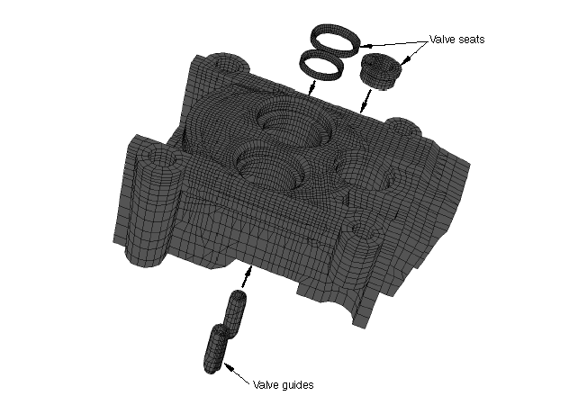

**图1.1.21-2** 气缸盖加热到峰值温度时的温度分布。

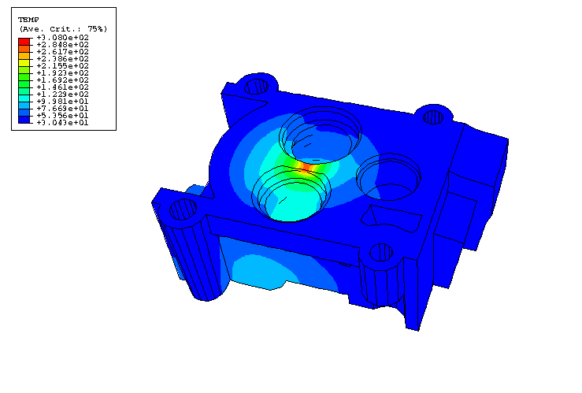

**图1.1.21-3** 节点50417作为稳态循环时间函数的温度。

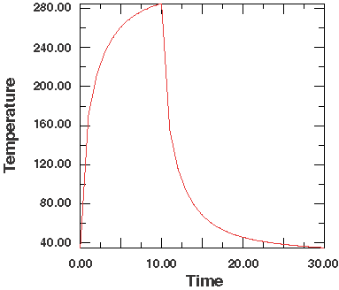

**图1.1.21-4** 直接循环分析中加载循环结束时（迭代75，增量120）气缸盖中的Mises应力分布。

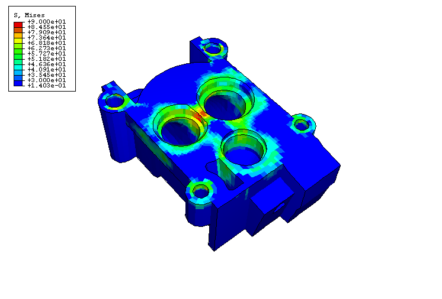

**图1.1.21-5** 直接循环分析中加载循环结束时（迭代75，增量120）气缸盖中的总应变分布。

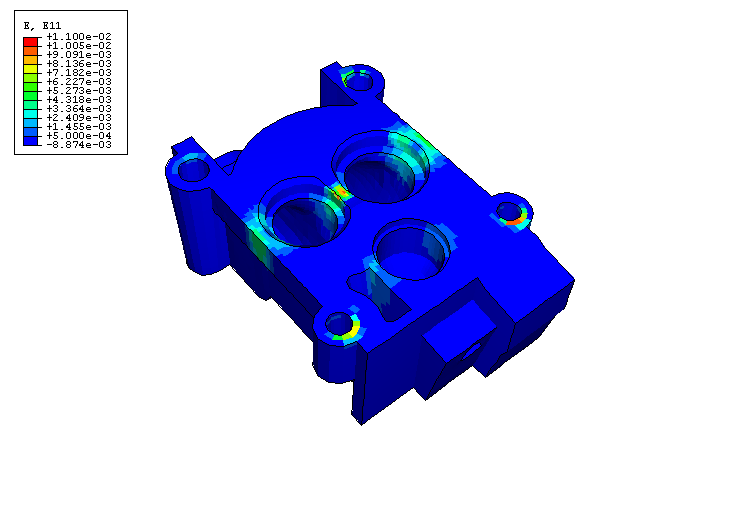

**图1.1.21-6** 直接循环分析中迭代50、75和100期间全局1方向上应力分量的演变。

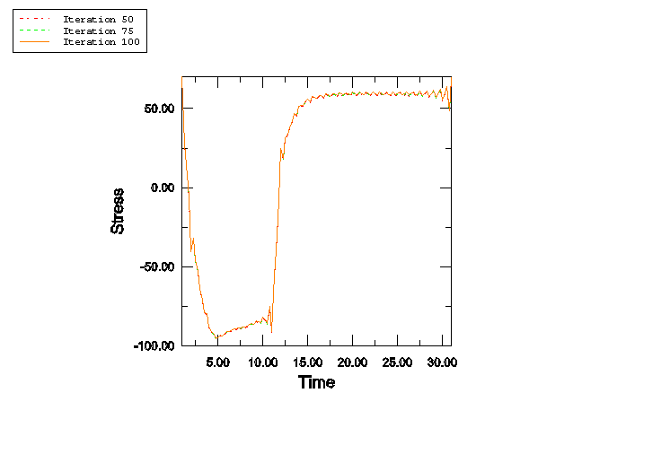

**图1.1.21-7** 直接循环分析中迭代50、75和100期间全局1方向上塑性应变分量的演变。

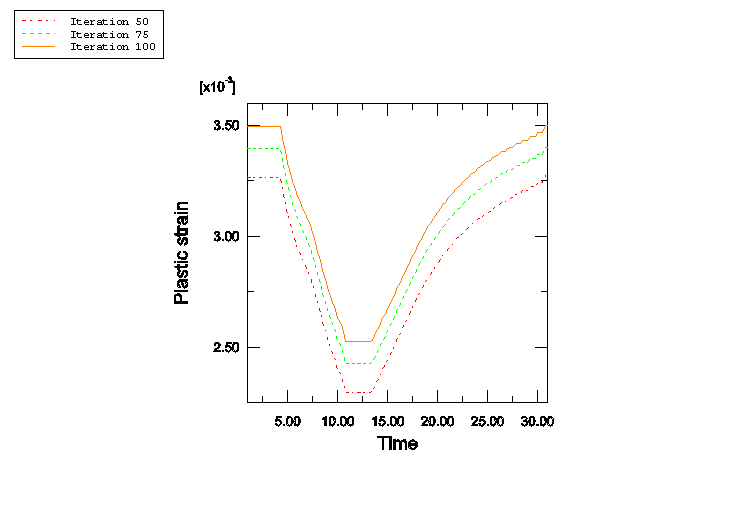

**图1.1.21-8** 直接循环分析中迭代50、75和100期间全局1方向上粘性应变分量的演变。

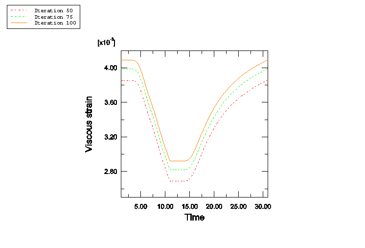

**图1.1.21-9** 直接循环分析中迭代50、75和100期间应力与塑性应变的演变。

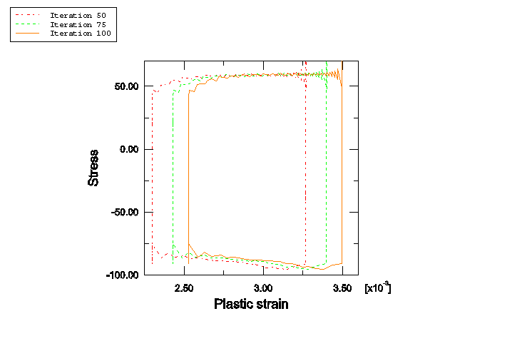

**图1.1.21-10** 直接循环分析中迭代50、75和100期间应力与粘性应变的演变。

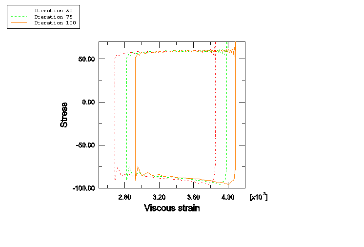

**图1.1.21-11** 瞬态分析中步骤5、10和20期间应力与塑性应变的演变。

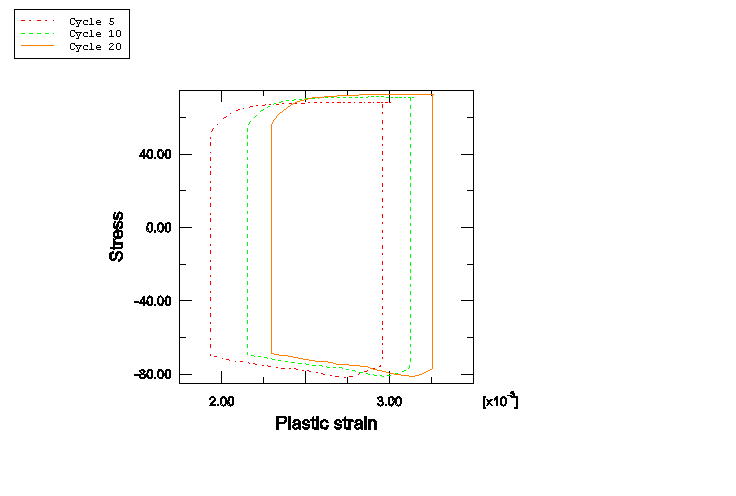

**图1.1.21-12** 瞬态分析中步骤5、10和20期间应力与粘性应变的演变。

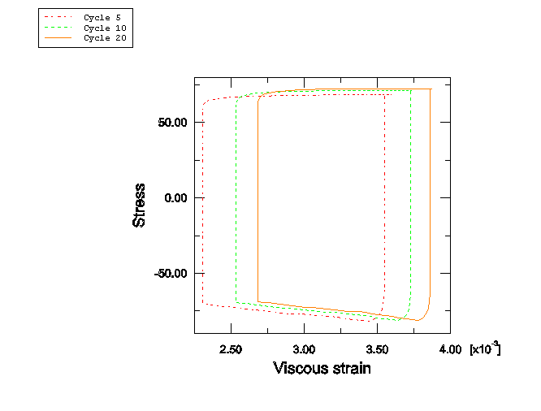

**图1.1.21-13** 直接循环分析和瞬态分析方法获得的应力与塑性应变演变的比较。

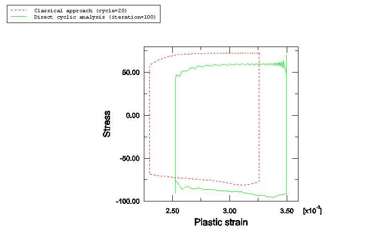

**图1.1.21-14** 直接循环分析和瞬态分析方法获得的应力与粘性应变演变的比较。

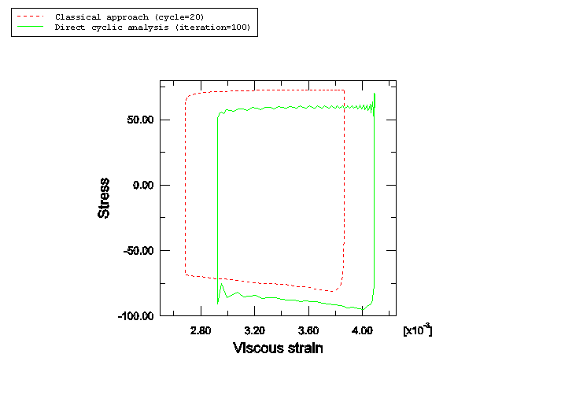

**图1.1.21-15** 直接循环分析中使用不同数量的傅里叶项在迭代75期间获得的应力与塑性应变演变的比较。

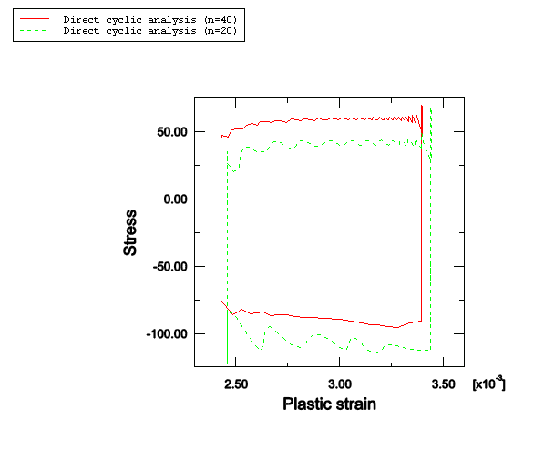

**图1.1.21-16** 直接循环分析中使用不同数量的傅里叶项在迭代75期间获得的应力与粘性应变演变的比较。

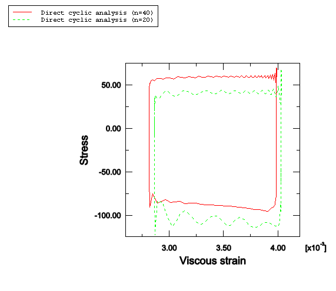