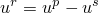
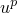
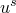

# 1.1.21 Direct cyclic analysis of a cylinder head under cyclic thermal-mechanical loadings

**Product: **Abaqus/Standard  

The prediction of fatigue and failure in structures is fundamental in assessing product performance. This example demonstrates the use of the direct cyclic analysis procedure to obtain results that can be used for fatigue life calculations. 

It is well known that a highly loaded structure, such as a cylinder head in an engine subjected to large temperature fluctuations and clamping loads, can undergo plastic deformations. After a number of repetitive loading cycles there will be one of three possibilities: elastic shakedown, in which case there is no danger of low-cycle fatigue; plastic shakedown, leading to a stabilized plastic strain cycle, in which case energy dissipation criteria will be used to estimate the number of cycles to failure; and plastic ratchetting, in which case the design is rejected. The classical approach to obtaining the response of such a structure is to apply the periodic loading repetitively to the structure until a stabilized state is obtained  or plastic ratchetting occurs. This approach can be quite expensive, since it may require application of many loading cycles to obtain the steady response. To avoid the considerable numerical expense associated with such a transient analysis, the direct cyclic analysis procedure, described in ["Direct cyclic analysis," Section 6.2.6 of the Abaqus Analysis User's Guide](../usb/usb-link.md#usb-anl-adirectcyclic), can be used to calculate the cyclic response of the structure directly.

### Geometry and model

The cylinder head analyzed in this example is depicted in [Figure 1.1.21--1](ch01s01aex21.md#sxmdircycmonocylinder-model). The cylinder head (which is a single cylinder) has three valve ports, each with an embedded valve seat; two valve guides; and four bolt holes used to secure the cylinder head to the engine block.

The body of the cylinder head is made from aluminum with a Young's modulus of 70 GPa, a yield stress of 62 MPa, a Poisson's ratio of 0.33, and a coefficient of thermal expansion of 22.6  10–6 per C at room temperature. In this example the region in the vicinity of the valve ports, where the hot exhaust gases converge, is subjected to cyclic temperature fluctuations ranging from a minimum value of 35C to a maximum value of 300C. The temperature distribution when the cylinder head is heated to its peak value is shown in [Figure 1.1.21--2](ch01s01aex21.md#sxmdircycmonocylinder-tempdist). Under such operating conditions plastic deformation, as well as creep deformation, is observed. The two-layer viscoelastic-elastoplastic model, which is best suited for modeling the response of materials with significant time-dependent behavior as well as plasticity at elevated temperatures, is used to model the aluminum cylinder head (see ["Two-layer viscoplasticity," Section 23.2.11 of the Abaqus Analysis User's Guide](../usb/usb-link.md#usb-mat-cviscous)). This material model consists of an elastic-plastic network that is in parallel with an elastic-viscous network. The Mises metal plasticity model with kinematic hardening is used in the elastic-plastic network, and the power-law creep model with strain hardening is used in the elastic-viscous network. Since the elastic-viscoplastic response of aluminum varies greatly over this range of temperatures, temperature-dependent material properties are specified.

The two valve guides are made of steel, with a Young's modulus of 106 GPa and a Poisson's ratio of 0.35. The valve guides fit tightly into two of the cylinder head valve ports and are assumed to behave elastically. The interface between the two components is modeled by using matched meshes that share nodes along the interface.

The three valve seats are made of steel, with a Young's modulus of 200 GPa and a Poisson's ratio of 0.3. The valve seats are press-fit into the cylinder head valve ports. This is accomplished by defining radial constraint equations of the form  between the nodes on the valve seat surface and the nodes on the valve port surface, where  is the radial displacement on the valve port,  is the radial displacement on the valve seat, and  is a reference node. During the first step of the analysis a prescribed displacement is applied to the reference node, resulting in normal pressures developing between the two components. The valve seats are assumed to behave elastically.

All of the structural components (the cylinder head, the valve guides, and the valve seats) are modeled with three-dimensional continuum elements. The model consists of 19394 first-order brick elements (C3D8) and 1334 first-order prism elements (C3D6), resulting in a total of about 80,000 degrees of freedom. The C3D6 elements are used only where the complex geometry precludes the use of C3D8 elements.

### Loading and boundary constraints

The loads are applied to the assembly in two analysis steps. In the first step the three valve seats are press-fit into the corresponding cylinder head valve port using linear multi-point equation constraints and prescribed displacement loadings as described above. A static analysis procedure is used for this purpose. The cyclic thermal loads are applied in the second analysis step. It is assumed that the cylinder head is securely fixed to the engine block through the four bolt holes, so the nodes along the base of the four bolt holes are secured in all directions during the entire simulation.

The cyclic thermal loads are obtained by performing an independent thermal analysis. In this analysis three thermal cycles are applied to obtain a steady-state thermal cycle. Each thermal cycle involves two steps: heating the cylinder head to the maximum operating temperature and cooling it to the minimum operating temperature using concentrated flux and film conditions. The nodal temperatures for the last two steps (one thermal cycle) are assumed to be a steady-state solution and are stored in a results (`.fil`) file for use in the subsequent thermal-mechanical analysis. The maximum value of the temperature occurs in the vicinity of the valve ports where the hot exhaust gases converge. The temperature in this region (node 50417) is shown in [Figure 1.1.21--3](ch01s01aex21.md#sxmdircycmonocylinder-temphist) as a function of time for a steady-state cycle. 

In the second step of the mechanical analysis cyclic nodal temperatures generated from the previous heat transfer analysis are applied. The direct cyclic procedure with a fixed time incrementation of 0.25 and a load cycle period of 30 is specified in this step, resulting in a total number of 120 increments for one iteration. The number of terms in the Fourier series and the maximum number of iterations are 40 and 100, respectively.

For comparison purposes the same model is also analyzed using the classical transient analysis, which requires 20 repetitive steps before the solution is stabilized. A cyclic temperature loading with a constant time incrementation of 0.25 and a load cycle period of 30 is applied in each step.

### Results and discussion

One of the considerations in the design of a cylinder head is the stress distribution and deformation in the vicinity of the valve ports. [Figure 1.1.21--4](ch01s01aex21.md#sxmdircycmonocylinder-sdist) shows the Mises stress distribution in the cylinder head at the end of a loading cycle (iteration 75, increment 120) in the direct cyclic analysis. The total strain distribution at the same time in the direct cyclic analysis is shown in [Figure 1.1.21--5](ch01s01aex21.md#sxmdircycmonocylinder-edist). The deformation and stress are most severe in the vicinity of the valve ports, making this region critical in the design. The results shown in [Figure 1.1.21--6](ch01s01aex21.md#sxmdircycmonocylinder-shist) through [Figure 1.1.21--16](ch01s01aex21.md#sxmdircycmonocylinder-s-ve-dc2) are measured in this region (element 50152, integration point 1). [Figure 1.1.21--6](ch01s01aex21.md#sxmdircycmonocylinder-shist), [Figure 1.1.21--7](ch01s01aex21.md#sxmdircycmonocylinder-pehist), and [Figure 1.1.21--8](ch01s01aex21.md#sxmdircycmonocylinder-vehist) show the evolution of the stress component, plastic strain component, and viscous strain component, respectively, in the global 1-direction throughout a complete load cycle during iterations 50, 75, and 100 in the direct cyclic analysis. The time evolution of the stress versus the plastic strain, shown in [Figure 1.1.21--9](ch01s01aex21.md#sxmdircycmonocylinder-s-pe-dc), is obtained by combining [Figure 1.1.21--6](ch01s01aex21.md#sxmdircycmonocylinder-shist) with [Figure 1.1.21--7](ch01s01aex21.md#sxmdircycmonocylinder-pehist). Similarly, the time evolution of the stress versus the viscous strain, shown in [Figure 1.1.21--10](ch01s01aex21.md#sxmdircycmonocylinder-s-ve-dc), is obtained by combining [Figure 1.1.21--6](ch01s01aex21.md#sxmdircycmonocylinder-shist) with [Figure 1.1.21--8](ch01s01aex21.md#sxmdircycmonocylinder-vehist). The shapes of the stress-strain curves remain unchanged after iteration 75, as do the peak and mean values of the stress over a cycle. However, the mean value of the plastic strain and the mean value of the viscous strain over a cycle continue to grow from one iteration to another iteration, indicating that the plastic ratchetting occurs in the vicinity of the valve ports.

Similar results for the evolution of stress versus plastic strain and the evolution of stress versus viscous strain during cycles 5, 10, and 20 obtained using the classical transient approach are shown in [Figure 1.1.21--11](ch01s01aex21.md#sxmdircycmonocylinder-s-pe-c) and [Figure 1.1.21--12](ch01s01aex21.md#sxmdircycmonocylinder-s-ve-c), respectively. The plastic ratchetting is observed to be consistent with that predicted using the direct cyclic approach. A comparison of the evolution of stress versus plastic strain obtained during iteration 100 in the direct cyclic analysis with that obtained during cycle 20 in the transient approach is shown in [Figure 1.1.21--13](ch01s01aex21.md#sxmdircycmonocylinder-s-pe). A similar comparison of the evolution of stress versus viscous strain obtained using both approaches is shown in [Figure 1.1.21--14](ch01s01aex21.md#sxmdircycmonocylinder-s-ve). The shapes of the stress-strain curves are similar in both cases.

One advantage of using the direct cyclic procedure, in which the global stiffness matrix is inverted only once, instead of the classical approach in Abaqus/Standard is the cost savings achieved. In this example the total computational time leading to the first occurrence of plastic ratchetting in the direct cyclic analysis (75 iterations) is approximately 70% of the computational time spent in the transient analysis (20 steps). The savings will be more significant as the problem size increases.

Additional cost savings for the solution can often be obtained by using a smaller number of terms in the Fourier series and/or a smaller number of increments in an iteration. In this example, if 20 rather than 40 Fourier terms are chosen, the total computational time leading to the first occurrence of plastic ratchetting in the direct cyclic analysis (75 iterations) is approximately 65% of the computational time spent in the transient analysis (20 steps). Furthermore, if a fixed time incrementation of 0.735 rather than 0.25 is specified, leading to a total number of 41 increments for one iteration, the total computational time in the direct cyclic analysis is reduced by a factor of three without compromising the accuracy of the results. A comparison of the evolution of stress versus plastic strain obtained using fewer Fourier terms during iteration 75 is shown in [Figure 1.1.21--15](ch01s01aex21.md#sxmdircycmonocylinder-s-pe-dc2). A similar comparison of the evolution of stress versus viscous strain obtained using fewer Fourier terms is shown in [Figure 1.1.21--16](ch01s01aex21.md#sxmdircycmonocylinder-s-ve-dc2). The shapes of the stress-strain curves and the amount of energy dissipated during the cycle are similar in both cases, although the case with fewer Fourier terms provides less accurate stress results.

Another advantage of using the direct cyclic approach instead of the classical approach is that the likelihood of plastic ratchetting or stabilized cyclic response can be predicted automatically by comparing the displacement and residual coefficients with some internal control variables. There is no need to visualize the detailed results for the whole model throughout the loading history, which leads to a further reduction of the data storage and computational time associated with output. For this example examination of the displacement and the residual coefficients written to the message (`.msg`) file makes it clear that the constant term in the Fourier series does not stabilize and, thus, plastic ratchetting occurs.

### Acknowledgements

SIMULIA gratefully acknowledges PSA Peugeot Citron and the Laboratory of Solid Mechanics of the Ecole Polytechnique (France) for their cooperation in developing the direct cyclic analysis capability and for supplying the geometry and material properties used in this example.

### Input files

[dircyccylinderhead_heat.inp](../eif/dircyccylinderhead_heat.inp)

Input data for the heat transfer analysis.

[dircyccylinderhead_heat_mesh.inp](../eif/dircyccylinderhead_heat_mesh.inp)

Node and element definitions for the heat transfer analysis.

[dircyccylinderhead_heat_sets.inp](../eif/dircyccylinderhead_heat_sets.inp)

Node set, element set, and surface definitions for the heat transfer analysis.

[dircyccylinderhead_heat_load1.inp](../eif/dircyccylinderhead_heat_load1.inp)

Loading definitions during the heating process for the heat transfer analysis.

[dircyccylinderhead_heat_load2.inp](../eif/dircyccylinderhead_heat_load2.inp)

Loading definitions during the cooling process for the heat transfer analysis.

[dircyccylinderhead_dcm.inp](../eif/dircyccylinderhead_dcm.inp)

Input data for the direct cyclic analysis.

[dircyccylinderhead_dcm_mesh.inp](../eif/dircyccylinderhead_dcm_mesh.inp)

Node and element definitions for the direct cyclic analysis.

[dircyccylinderhead_dcm_sets.inp](../eif/dircyccylinderhead_dcm_sets.inp)

Node set and element set definitions for the direct cyclic analysis.

[dircyccylinderhead_dcm_eqc.inp](../eif/dircyccylinderhead_dcm_eqc.inp)

Kinematic constraint definitions for the direct cyclic analysis.

[dircyccylinderhead_dcm_ps.inp](../eif/dircyccylinderhead_dcm_ps.inp)

Post output for the direct cyclic analysis.

### References

Maitournam,  H., B. Pommier, and J. J. Thomas, “Dtermination de la rponse asymptotique d'une structure anlastique sous chargement thermomcanique cyclique,” C. R. Mcanique, vol. 330, pp. 703–708, 2002.

Maouche,  N., H. Maitournam, and K. Dang Van, “On a new method of evaluation of the inelastic state due to moving contacts,” Wear, pp. 139–147, 1997.

Nguyen-Tajan,  T. M. L., B. Pommier, H. Maitournam, M. Houari, L. Verger, Z. Z. Du, and M. Snyman, “Determination of the stabilized response of a structure undergoing cyclic thermal-mechanical loads by a direct cyclic method,” ABAQUS Users' Conference Proceedings, 2003.

### Figures

**Figure 1.1.21–1** A cylinder head model.

**Figure 1.1.21–2** Temperature distribution when the cylinder head is heated to its peak value.

**Figure 1.1.21–3** Temperature at node 50417 as a function of time for a steady-state cycle.

**Figure 1.1.21–4** Mises stress distribution in the cylinder head at the end of a loading cycle (iteration 75, increment 120) in the direct cyclic analysis.

**Figure 1.1.21–5** Total strain distribution in the cylinder head at the end of a loading cycle (iteration 75, increment 120) in the direct cyclic analysis.

**Figure 1.1.21–6** Evolution of the stress component in the global 1-direction during iterations 50, 75, and 100 in the direct cyclic analysis.

**Figure 1.1.21–7** Evolution of the plastic strain component in the global 1-direction during iterations 50, 75, and 100 in the direct cyclic analysis.

**Figure 1.1.21–8** Evolution of the viscous strain component in the global 1-direction during iterations 50, 75, and 100 in the direct cyclic analysis.

**Figure 1.1.21–9** Evolution of the stress versus plastic strain during iterations 50, 75, and 100 in the direct cyclic analysis.

**Figure 1.1.21–10** Evolution of the stress versus viscous strain during iterations 50, 75, and 100 in the direct cyclic analysis.

**Figure 1.1.21–11** Evolution of the stress versus plastic strain during steps 5, 10, and 20 in the transient analysis.

**Figure 1.1.21–12** Evolution of the stress versus viscous strain during steps 5, 10, and 20 in the transient analysis.

**Figure 1.1.21–13** Comparison of the evolution of stress versus plastic strain obtained with the direct cyclic analysis and transient analysis approaches.

**Figure 1.1.21–14** Comparison of the evolution of stress versus viscous strain obtained with the direct cyclic analysis and transient analysis approaches.

**Figure 1.1.21–15** Comparison of the evolution of stress versus plastic strain obtained using different numbers of Fourier terms during iteration 75 in a direct cyclic analysis.

**Figure 1.1.21–16** Comparison of the evolution of stress versus viscous strain obtained using different numbers of Fourier terms during iteration 75 in a direct cyclic analysis.

