# 1.1.22 Erosion of material (sand production) in an oil wellbore

**Product: **Abaqus/Standard  

This example demonstrates the use of adaptive meshing and adaptive mesh constraints in Abaqus/Standard to model the large-scale erosion of material such as sand production in an oil well as oil is extracted. In Abaqus/Standard the erosion of material at the external surface is modeled by declaring the surface to be part of an adaptive mesh domain and by prescribing surface mesh motions that recede into the material. Abaqus/Standard will then remesh the adaptive mesh domain using the same mesh topology but accounting for the new location of the surface. All the material point and node point quantities will be advected to their new locations. This example also demonstrates the use of mesh-to-mesh solution mapping in a case where a new mesh topology is desired to continue the analysis beyond a certain stage.

### Problem description

The process of optimizing the production value of an oil well is complex but can be simplified as a balance between the oil recovery rate (as measured by the volumetric flow rate of oil), the sustainability of the recovery (as measured by the amount of oil ultimately recovered), and the cost of operating the well. In practice, achieving this balance requires consideration of the erosion of rock in the wellbore, a phenomenon that occurs when oil is extracted under a sufficiently high pressure gradient. This erosion phenomenon is generally referred to as “sand production.” Depending on the flow velocities the sand may accumulate in the well, affecting the sustainability of recovery, or it may get carried to the surface along with the oil. The sand in the oil causes erosion in the piping system and its components such as chokes and pipe bends, increasing the costs of operating the well. Excessive sand production is, therefore, undesirable and will limit oil recovery rates. A typical measure of these limits on recovery rates is the so-called “sandfree rate.” A sandfree rate might be based on direct damage caused by sand production or might be based on the cost of sand management systems that limit the damage of the sand. The former measure is called the maximum sandfree rate, or MSR. The latter measure is called the acceptable sandfree rate, or ASR. The ASR concept has become possible with the availability of many commercial sand management systems as well as new designs of piping components. The ASR concept has also engendered a need for predicting the sand production rates to properly choose and size the sand management systems and piping components. In this example we focus on measures that can be obtained from Abaqus to predict these rates.

### Geometry and model

The geometry of an oil well has two main components. The first is the wellbore drilled through the rock. The second component is a series of perforation tunnels that project perpendicular to the wellbore axis. These tunnels, which are formed by explosive shape charges, effectively increase the surface area of the wellbore for oil extraction. The perforation tunnels are typically arranged to fan out in a helical fashion around the wellbore, uniformly offset in both vertical spacing and azimuthal angle.

#### Three-dimensional model

The domain of the problem considered in the three-dimensional example is a 203 mm (8 in) thick circular slice of oil-bearing rock with both the wellbore and perforation tunnels modeled. The domain has a diameter of 10.2 m (400 in). The perforation tunnels emanate radially from the wellbore and are spaced 90 apart. Each perforation tunnel is 43.2 mm (1.7 in) diameter and 508 mm (20 in) long. The wellbore has a radius of 158.8 mm (6.25 in). Due to symmetry only a quarter of the domain that contains one perforation tunnel is modeled. [Figure 1.1.22--1](ch01s01aex22.md#examodel) shows the finite element model. The rock is modeled with C3D8P elements, and the well's casing is modeled with M3D4 elements.

#### Planar model

The planar model is a simplified version of the three-dimensional model, where the perforation tunnels and wellbore casing are neglected. The rock is modeled with CPE4P elements. The model domain consists of a quarter-symmetry square domain of length 10.2 m (400 in), with a single wellbore with a radius of 158.8 mm (6.25 in). [Figure 1.1.22--5](ch01s01aex22.md#examodel-planar) shows the finite element model. [Figure 1.1.22--6](ch01s01aex22.md#examodel-detail-planar) details the region near the wellbore.

### Material

A linear Drucker-Prager model with hardening is chosen for the rock, and the casing in the three-dimensional model is linear elastic.

### Loading

The loading sequence for a wellbore analysis generally includes
- establishing geostatic equilibrium, based on the overburden loading;
- simulation of material removal operations, including drilling the wellbore and forming the perforation tunnel; and
- applying a drawdown pressure in the wellbore to simulate pumping.

This sequence is modeled slightly differently in the three-dimensional and planar models.

#### Three-dimensional model

The analysis consists of five steps. First, a geostatic step is performed where equilibrium is achieved after applying the initial pore pressure, the initial stress, and the distributed load representing the soil above the perforation tunnel. The second step represents the drilling operation where the elements representing the wellbore and the perforation tunnel are removed using the element removal capability in Abaqus (see ["Element and contact pair removal and reactivation," Section 11.2.1 of the Abaqus Analysis User's Guide](../usb/usb-link.md#usb-anl-aelemremovrepl)). In the third step the boundary conditions are changed to apply the pore pressure on the face of the perforation tunnel. In the fourth step a steady-state soils analysis is carried out in which the pore pressure on the perforation tunnel surface is reduced to the desired drawdown pressure of interest. The fifth step consists of a soils consolidation analysis for four days during which the erosion occurs.

#### Planar model

The analysis consists of three steps. First, a geostatic step is performed where equilibrium is achieved after applying the initial pore pressure and the initial stress, representing an underbalanced state on the wellbore. The second step represents the drilling operation where the elements representing the wellbore are removed using the element removal capability, and the boundary conditions are changed to apply the pore pressure on the face of the perforation tunnel. The third step consists of a soils consolidation analysis for 32 hours during which the erosion occurs. As discussed below in ["Rezoning the planar model](ch01s01aex22.md#exa-sta-boreholeerosion-rezone),” this third step is interrupted in order to rezone the model.

### Erosion criterion

There are two main sources of eroded material in a well bore. One of the sources is volumetric and is due to the material that is broken up due to high stresses and transported by the fluid through the pores. The other source is surface based and is due to the material that is broken up by the hydrodynamic action of the flow on the surface. Depending on the properties of the oil-bearing strata and the flow velocities, one or the other may be the dominant source of eroded material. Development of equations describing the erosion in a well bore is an active research field. In this example we consider surface erosion only but choose a form for the erosion equation that has dependencies that are similar to those used by Papamichos and Stavropoulou for volumetric erosion. This approximation is reasonable because high stresses exist only in a very thin layer surrounding the well bore. The erosion equation is

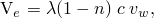

where 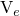 is the erosion velocity, 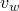 is the pore fluid velocity, *c* is the transport concentration, *n* is the porosity, and  is the so-called sand production coefficient.  depends on the equivalent plastic strain (). It is zero below a cutoff equivalent plastic strain (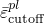), is equal to 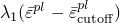, and is limited by a constant .

Both  and  must be determined experimentally. In this example 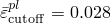, 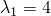, and 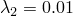. We choose 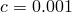 as recommended by Papamichos and Stavropoulo. These values are chosen to show visible erosion in a reasonably short analysis time. 

### Adaptive mesh domain

Erosion is modeled during the final step of each analysis. The erosion equation describes the velocity of material recession as a local function of solution quantities. Abaqus/Standard provides functionality through adaptive meshing for imposing this surface velocity, maintaining its progression normal to the surface as the surface moves, and adjusting subsurface nodes to account for large amounts of erosive material loss.

Erosion itself is described through a spatial adaptive mesh constraint, which is applied to all the nodes on the surface of the perforation tunnel. Adaptive mesh constraints can be applied only on adaptive mesh domains; in this example a sufficiently large extent of the finite element mesh near the wellbore and perforation tunnel surfaces is declared as the adaptive mesh domain. A cut section of the adaptive mesh domain for the three-dimensional model, including the perforation tunnel, is shown in [Figure 1.1.22--2](ch01s01aex22.md#exaadapt). The adaptive mesh domain for the planar model is the regular mesh near the wellbore (refer to [Figure 1.1.22--6](ch01s01aex22.md#examodel-detail-planar) and [Figure 1.1.22--8](ch01s01aex22.md#examodel-rezdetail-planar)). Identification of the adaptive mesh domain will result in smoothing of the near-surface mesh that is necessary to enable erosion to progress to arbitrary depths. All the nodes on the boundary of the adaptive mesh domain where it meets the regular mesh must be considered as Lagrangian to respect the adjacent nonadaptive elements.

A velocity adaptive mesh constraint is defined. The generality and solution dependence of the erosion equation are handled by describing the erosion equation in user subroutine [`UMESHMOTION`](../sub/sub-link.md#sub-xsl-umeshmotion) (see ["Defining ALE adaptive mesh domains in Abaqus/Standard," Section 12.2.6 of the Abaqus Analysis User's Guide](../usb/usb-link.md#usb-anl-aalestd)). User subroutine [`UMESHMOTION`](../sub/sub-link.md#sub-xsl-umeshmotion) is called at a given node for every mesh smoothing sweep. Mesh velocities computed by the Abaqus/Standard meshing algorithm for that node are passed into [`UMESHMOTION`](../sub/sub-link.md#sub-xsl-umeshmotion), which modifies them to account for the erosion velocities computed at that node. The modified velocities are determined according to the equation for , where local results are needed for , *n*, and . To obtain these values, we request results for output variables PEEQ, VOIDR, and FLVEL respectively, noting that void ratio is related to porosity by 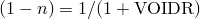. Since these output variables are all available at element material points, the utility routine `GETVRMAVGATNODE` is used to obtain results extrapolated to the surface nodes (see ["Obtaining material point information averaged at a node," Section 2.1.8 of the Abaqus User Subroutines Reference Guide](../sub/sub-link.md#sub-utl-ugetvrmavgatnode)).

### Rezoning the planar model

Rezoning, the process of creating a new mesh in the model's deformed configuration, is a useful technique in addressing element distortion in erosion problems.

The erosion model in this example is solution dependent in the sense that it defines an erosion velocity as a function of local values of equivalent plastic strain, PEEQ, and fluid velocity, FLVEL. Since these node-located results values are extrapolated from adjacent elements' material point results, using utility routine `GETVRMAVGATNODE`, the quality of the results used in the erosion model is dependent on local element quality. In practice, as elements near the surface deform, there is a tendency for instability in the erosion model.

This instability is mitigated by rezoning the model and providing a more regular mesh to continue the analysis. The rezoned model is created in Abaqus/CAE, and transfer of state variables occurs using mesh-to-mesh solution mapping in Abaqus/Standard. Rezoning occurs at 55,000 seconds (15.3 hours) into the 32-hour erosion analysis of the planar model.

#### Extracting two-dimensional profiles and remeshing using Abaqus/CAE

The rezoned model is created by extracting the two-dimensional profile of the deformed rock region from the output database for the original analysis. You perform this operation in Abaqus/CAE by entering commands into the command line interface at the bottom of the Abaqus/CAE main window. To extract the deformed geometry from the output database as an orphan mesh part, use the command `PartFromOdb`, which takes the following arguments:

| *name* | The name of the orphan mesh part to be created. |
| --- | --- |
| *odb* | The output database object returned from the command `openOdb`. |
| *instance* | The name of the part instance in the initial model in capital letters. |
| *shape* | Determines whether to import the part in its UNDEFORMED or DEFORMED shape. |

The command `PartFromOdb` returns a Part object that is passed to the command `Part2DGeomFrom2DMesh`. This command creates a geometric Part object from the orphan mesh imported earlier. It takes the following arguments:

| *name* | The name of the part to be created. |
| --- | --- |
| *part* | The part object returned from the command `PartFromOdb`. |
| *featureAngle* | A float specifying the angle (in degrees) between line segments that triggers a break in the geometry. |

Once the profile of the deformed part has been created, you will prepare an input file for the subsequent period in the erosion analysis as follows:
- Reestablish all attributes that relate to the geometry of the deformed part. These attributes include load and boundary condition definitions, and set and surface definitions.
- Remesh the part.
- Create a single consolidation step that completes the duration of your intended erosion period.
- Write out the new input file.

#### Mesh-to-mesh solution mapping in Abaqus/Standard

The interpolation technique used in solution mapping is a two-step process. First, values of all solution variables are obtained at the nodes of the old mesh by extrapolating the values from the integration points to the nodes of each element and averaging those values over all elements abutting each node. The second step is to locate each integration point in the new mesh with respect to the old mesh. The variables are then interpolated from the nodes of the element in the old mesh to the location in the new mesh. All solution variables are interpolated automatically in this way so that the solution can proceed on the new mesh. Whenever a model is mapped, it can be expected that there will be some discontinuity in the solution because of the change in the mesh. To address this discontinuity the rezone analysis includes a geostatic step, which reestablishes equilibrium before the erosion process continues in a following step.

### Results and discussion

The analysis scenarios and results differ between the three-dimensional and planar analyses.

#### Three-dimensional analysis

The consolidation analysis in which erosion takes place is run for a time period of four days to observe the initiation of sand production and predict its initial rate. [Figure 1.1.22--3](ch01s01aex22.md#exadef) shows the perforation tunnel at the end of four days where it is seen that the largest amount of material is eroded near the junction of the wellbore and perforation tunnel. Further away from the wellbore boundary the amount of erosion progressively decreases. This behavior is expected because there are high strains near the junction of the wellbore and perforation tunnel, and the erosion criterion is active only for values of the equivalent plastic strain above a threshold value.

The amount of the volume change due to erosion in an adaptive domain is available using the history output variable VOLC. The actual amount of the solid material eroded depends on the porosity of the rock and is obtained by multiplying VOLC by 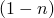. [Figure 1.1.22--4](ch01s01aex22.md#exavolc) shows the volume change of the sand produced in cubic inches over the time period of the consolidation step. As the material consolidates, the erosion rate slows down. The stresses in the perforation hole reduce and stabilize over the time period. From [Figure 1.1.22--4](ch01s01aex22.md#exavolc) it can be concluded that the stresses generated by the drawdown pressure, the fluid velocities, the wellbore and casing geometry, and the initial perforation tunnel geometry are such that this perforation tunnel will produce sand at a more stable rate as oil recovery continues; however, this rate could vary with further changes to the perforation tunnel caused by the erosion. At a design stage any of these parameters could be modified to limit the sand production rate. Many perforation tunnels emanate from a wellbore, and the total sand production from the wellbore will be the sum total of all the perforation tunnels.

#### Planar analysis

The underbalanced consolidation analysis in which erosion takes place is run for a time period of 32 hours to observe the initiation of sand production and predict its initial rate. [Figure 1.1.22--7](ch01s01aex22.md#exadef-planar) shows the wellbore at 15 hours, the end of the first analysis job. Based on this configuration a new mesh is created, as shown in [Figure 1.1.22--8](ch01s01aex22.md#examodel-rezdetail-planar). The final configuration of this model, representing 32 hours of erosion, is shown in [Figure 1.1.22--9](ch01s01aex22.md#exadef-rez-planar). As expected, the results show that erosion continues outward from the location of the maximum equivalent plastic straining. [Figure 1.1.22--10](ch01s01aex22.md#exavolc-planar) shows the total amount of sand produced, in cubic inches per inch of depth, over the time period of the consolidation step.

### Input files

[exa_erosion.inp](../eif/exa_erosion.inp)

Three-dimensional model of the oil wellbore perforation tunnel.

[exa_erosion_planar.inp](../eif/exa_erosion_planar.inp)

Planar model of the oil wellbore.

[exa_erosion_planar_rezone.inp](../eif/exa_erosion_planar_rezone.inp)

Rezone analysis of the planar model.

[exa_erosion.f](../eif/exa_erosion.f)

[`UMESHMOTION`](../sub/sub-link.md#sub-xsl-umeshmotion) user subroutine.

### Reference

Papamichos,  E., and M. Stavropoulou, “An Erosion-Mechanical Model for Sand Production Rate Prediction,” International Journal of Rock Mechanics and Mining Sciences, no.35, pp. 4–5, Paper No 090, 1998.

### Figures

**Figure 1.1.22–1** A cut section of the model showing the wellbore and perforation tunnel.

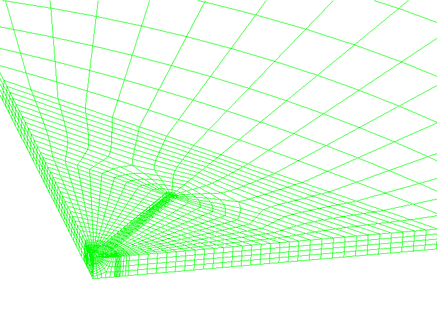

**Figure 1.1.22–2** Half-section of the adaptive mesh domain showing the wellbore face and the perforation tunnel.

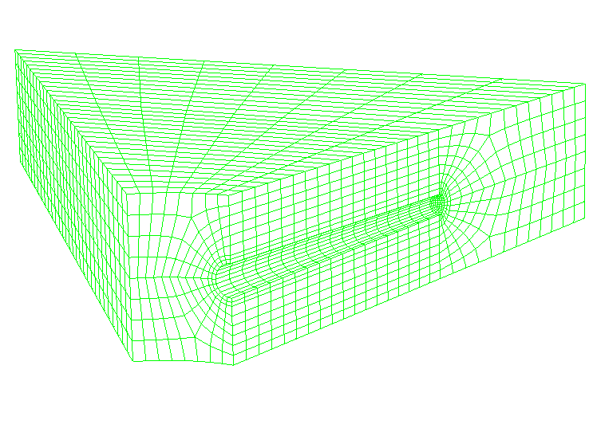

**Figure 1.1.22–3** Shape of the perforation tunnel after four days of erosion.

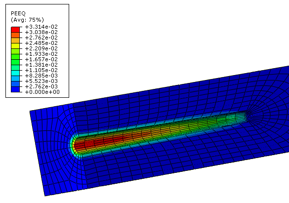

**Figure 1.1.22–4** Total sand production volume change in a single perforation tunnel indicating a stabilized rate as the consolidation continues.

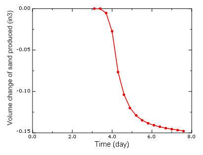

**Figure 1.1.22–5** Planar model mesh.

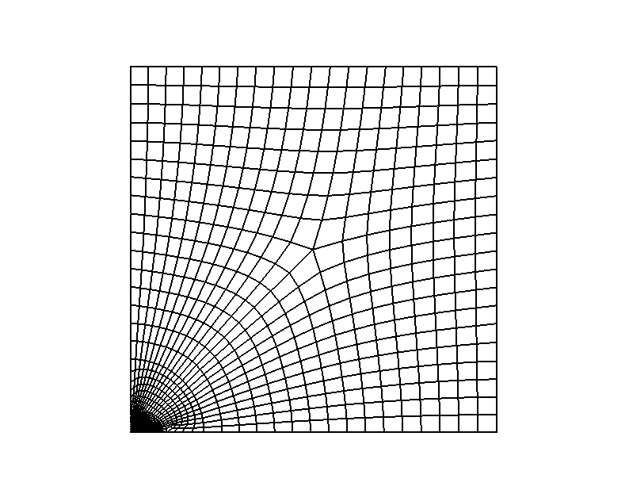

**Figure 1.1.22–6** Planar model mesh: wellbore region detail.

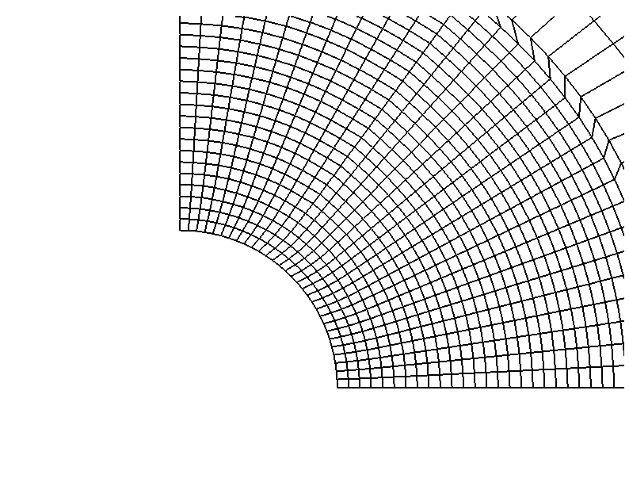

**Figure 1.1.22–7** Equivalent plastic strain distribution and eroded shape of the wellbore.

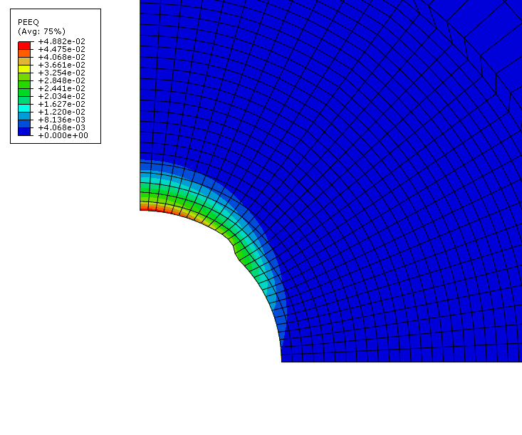

**Figure 1.1.22–8** Planar model mesh: wellbore region detail: rezone analysis.

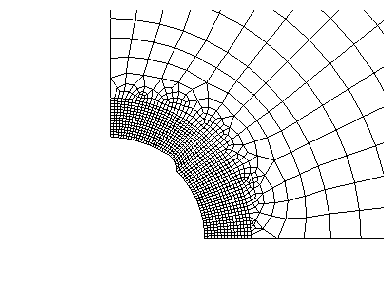

**Figure 1.1.22–9** Equivalent plastic strain distribution and eroded shape of the wellbore: rezone analysis.

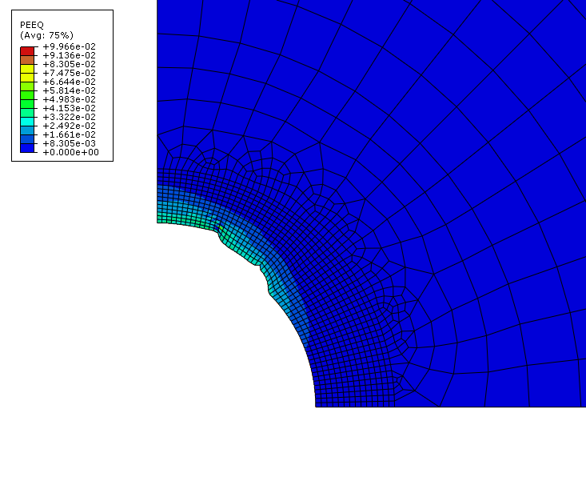

**Figure 1.1.22–10** Total sand production volume per unit of depth.

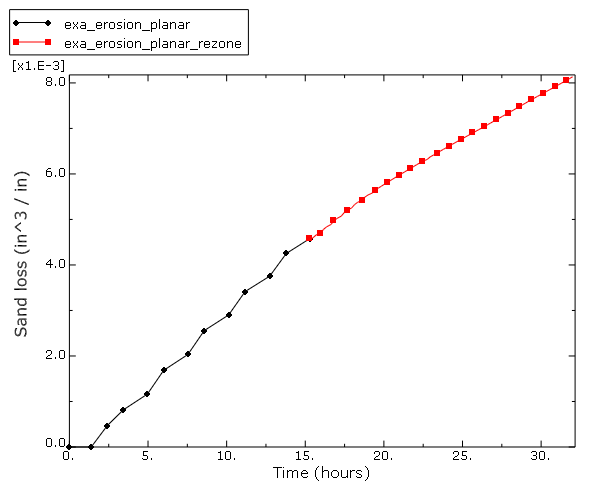

