# 1.1.23 Submodel stress analysis of pressure vessel closure hardware

**Product: **Abaqus/Standard  

### Objectives

This example demonstrates the use of surface-based submodeling as a technique to obtain solutions that are more accurate than those obtained using node-based submodeling in cases where:
- the submodel displacement field is expected to differ from the global model displacement field by a rigid translation and
- the geometry of the submodel differs from the global model in a region whose response is primarily load controlled.

This section details scenarios for each of these cases.

### Application description

This example examines the stress behavior of closure head standpipe structures in a nuclear reactor vessel closure assembly. The vessel assembly forms the pressure boundary surrounding the fuel core. This example considers the following loading conditions: 
- pre-tension load in the stud bolts,
- constant internal pressure, and
- loading due to the control rod drive mechanism (CDM) plug.

The loading conditions cover the most basic structural operation of a reactor vessel. The International System of units (SI) is used in the following sections to describe the model. The analysis itself is performed in English units. The model and analysis are derived from details of the Shippingport pressurized water reactor (1958).

### Geometry

The problem domain comprises a cylindrical vessel shell, a hemispherical bottom head, a dome-shaped closure head, and the closure and seal assembly, as shown in [Figure 1.1.23--1](ch01s01aex23.md#exa-sta-reactorwhole-wplug). The overall height of the vessel shell including the bottom head is 7650 mm (301 in). The bottom head has an inner radius of 1410 mm (55.5 in) and a thickness of 157 mm (6.18 in). The inlet nozzles on the bottom head are not considered in this example. The inner radius of the vessel shell is 1380  mm (54.5  in), and the thickness is 213 mm (8.40 in). The closure head has a height of 2330 mm (91.8 in), an inner radius of 1310 mm (51.5 in), and a thickness of 210 mm (8.25 in). 

The closure head includes eight standpipes with CDM plugs inserted in each. The standpipes have an inside diameter of 472 mm (12 in) and an outside diameter of 630 mm (16 in) and extend roughly 1000 mm (25 in) above the closure head. The CDM plugs have an outside diameter of 465 mm (11.8 in) and a flange diameter of 630 mm (16 in) and are 748 mm (19 in) tall. Each CDM plug sits in a closure head standpipe on a 404 mm (10.25 in) diameter ledge. 

The closure head is attached to the vessel shell by a seal and closure assembly. The assembly includes 40 stud bolts passing through the bolting flanges of the closure head and the vessel shell, each of which is restrained by two cap nuts (one on each end). Each stud bolt is 2290 mm (90 in) in length and has a diameter of 146 mm (5.75 in). The closure nuts are 304 mm (12 in) long with a thickness of 28.6 mm (1.13 in). To complete the closure assembly, an Omega seal is welded to the under surface of the closure head and top surface of the vessel shell. 

### Materials

All components are constructed of high-strength steel.

### Boundary conditions and loading

A pre-tension load of 2200 kN (5  106 lbf) is applied to each bolt. The inner surfaces of the head and the vessel shell are subject to a constant pressure of 1.38  107 Pa (2000 psi) from the water.

### Interactions

Contact occurs between
- the reactor vessel and closure head,
- the lower nuts and the reactor vessel bolting flange,
- the upper nuts and the closure head bolting flange, and
- the closure head standpipe and CDM plug.

#### Model terminology

This example illustrates the use of the submodeling technique in ways that are generalizations of the Abaqus user interface concept of a global model driving the response of a submodel. Specifically, some submodel analyses described in this section represent material domains that are adjacent to, rather than lying within, the domain considered in the initial analysis. To more clearly describe the models in this example, the term “source model” is used instead of “global model.” A source model is a model that provides solution results to a subsequent submodel analysis.

### Abaqus modeling approaches and simulation techniques

 The objective of the analyses in this example is an understanding of stresses in the region of the closure head standpipe.

### Summary of analysis cases

| Case 1Reactor closure analysis: reference solution | The stress distribution in the closure head is determined from a single, finely meshed model that includes closure head standpipe and CDM plug details. |
| --- | --- |
| Case 2Submodeling of the closure head standpipe region | A defeatured source model of the vessel assembly is analyzed first. Features excluded are the closure head standpipes and the CDM plugs. This model then drives a submodel with a more detailed representation of the closure head standpipe region. |
| Case 3Submodel application of CDM hardware loading | The CDM plug is analyzed separately as a source model. Boundary conditions are introduced on the CDM plug where it interacts with the closure head standpipe seating ledge to determine the surface traction characteristics at this interface. This model is then used to drive a submodel of the remaining vessel assembly. |

In the two submodel analysis cases the node-based submodeling technique, in which the submodel is driven with displacements, is compared to the surface-based submodeling technique, in which the submodel is driven with stresses. The three cases are discussed in more detail below.

### Case 1 Reactor closure analysis: reference solution

This reference case determines the stress response of the reactor vessel assembly when subjected to boltup and pressure loading using a single analysis. By comparison, the other modeling cases make use of submodeling. The reactor vessel assembly is cyclic-symmetric with respect to the axis of the cylindrical vessel body and only one-quarter of the whole assembly is modeled. The global geometry is shown in [Figure 1.1.23--2](ch01s01aex23.md#exa-sta-reactorsubmodel-globalgeometry).

### Analysis types

A static stress analysis is performed.

### Mesh design

The vessel is meshed with C3D20R elements, and the closure head is meshed with C3D10M elements. All other parts including the head, bolts, and Omega seal are meshed with C3D8R elements. The mesh is shown in [Figure 1.1.23--3](ch01s01aex23.md#exa-sta-reactorsubmodel-referencemesh).

### Material model

The elastic model is used in all models with a Young’s modulus of 2.07  1011 N/m2 (3.0  107 lbf/in2) and a Poisson’s ratio of 0.29. 

### Boundary conditions

Symmetric boundary conditions are applied to the two side surfaces of the vessel quarter. The nodes on the centerline are constrained separately and are free to move only along the vessel central axis. The node located at the center of the vessel bottom surface is pinned to give the model a statically determinant condition.

### Loads

A pre-tension load of 2200 kN (5  106 lbf) is applied to each stud bolt in the model. The inner surfaces of the head, the vessel body, and the nozzle are subject to a constant pressure of 1.38  107 Pa (2000 psi) from the water.

Bolting of the CDM plug to the closure head standpipe, defined as the CDM assembly, is simulated in this analysis by the application of a pair of concentrated loads acting through distributing coupling constraints. Refer to [Figure 1.1.23--4](ch01s01aex23.md#exa-sta-reactorsubmodel-standpipeloading) for identification of the loaded regions of each CDM assembly. For each CDM plug one coupling constraint acts on the top surface of the plug (region B). For each standpipe one coupling constraint acts across the top surface (region C). The reference node for each coupling constraint is positioned along the center axis of the CDM assembly so that vertical concentrated loads can be applied without generating overturning moments. A bolting force of 106 kN (2.4  105 lbf) for each CDM assembly is chosen as adequate to overcome the liftoff force due to the vessel internal pressure. This force is applied vertically in the up direction to the standpipe coupling constraint. A downward force is applied to the accompanying coupling constraint on the CDM plug, but this force is lessened by the amount of the pressure-generating liftoff force due to the operating pressure acting on region A (shown in [Figure 1.1.23--4](ch01s01aex23.md#exa-sta-reactorsubmodel-standpipeloading)), since the capping of this region is not considered explicitly in the model. Based on the diameter of region A, this pressure liftoff force equals 99 kN (2.26  105 lbf).

### Constraints

The Omega seal is tied to the flange surfaces of the vessel head and the vessel body. As mentioned above, distributing coupling constraints are applied to the CDM plugs and the closure head standpipes.

### Interactions

Small-sliding contact definitions are prescribed between
- the reactor vessel and closure head,
- the lower nuts and the reactor vessel bolting flange,
- the upper nuts and the closure head bolting flange, and
- the CDM plug and the accompanying seating ledge in the closure head.

### Analysis steps

The analysis is performed in a single static step with automatic stabilization to help establish the contact between the stud bolts, head, seal, and vessel. Results show that the static dissipation energy is minimal compared to the strain energy; therefore, its effect on the response can be neglected.

### Output requests

Default field and history output requests are specified in the step.

### Results and discussion

This case is provided as a reference. Submodel analysis results are compared to these results in the discussion of Case 2 and Case 3 below.

### Case 2 Submodel analysis of the closure head standpipe region

This case is representative of the most common submodel analysis approach: a global analysis of a coarse source model followed by a detailed submodel analysis representing a smaller region of the source model. Here, the coarse source model excludes details of the CDM plug and closure head standpipe as an illustration of a source model with significant defeaturing—a common motivation for subsequent submodel analysis. The submodel comprises a portion of the closure head and two CDM plugs, using a finer mesh and with feature details included. The relation between the source model and submodel is shown in [Figure 1.1.23--5](ch01s01aex23.md#exa-sta-reactorsubmodel-submodelboundary).

### Analysis types

A static stress analysis is performed.

### Mesh design

In the source model the vessel and closure head are meshed with C3D20R elements; all the other parts including the head, bolts, and Omega seal are meshed with C3D8R elements. The source model mesh is shown in [Figure 1.1.23--6](ch01s01aex23.md#exa-sta-reactorsubmodel-globalmesh).

For the submodel the CDM plug is meshed with C3D8R elements and the closure head is meshed with C3D10M elements. The submodel mesh is shown in [Figure 1.1.23--7](ch01s01aex23.md#exa-sta-reactorsubmodel-submodelmesh).

### Material model

The material model is the same as in Case 1.

### Boundary conditions

The source model boundary conditions reflect those applied in Case 1. Similarly, the submodel has symmetric boundary conditions applied to the two side surfaces of the closure head. In the node-based submodel analysis, submodel boundary conditions are applied to the submodel boundary. In the surface-based submodel analysis, a boundary condition is applied in the 2-direction on the coupling constraint for each CDM plug in the closure head to suppress the rigid body mode.

### Loads

The source model loads reflect those applied in Case 1 except for the bolting of the CDM plugs to the closure head, which is introduced in the submodel. 

 In the surface-based submodel analysis, submodel distributed loads are applied to the submodel boundary surface.

### Constraints

Distributing coupling constraints are applied to the CDM plugs and the closure head standpipes, as in Case 1.

### Interactions

Contact interactions are the same as in Case 1.

### Analysis steps

The global analysis of the source model is performed in a single static step with automatic stabilization to help establish the contact between the stud bolts, head, seal, and vessel. The submodel analysis is performed in a single static step.

### Output requests

Default field and history output requests are specified in the step.

### Results and discussion

Mises stress results are compared along paths in two regions in the closure head: 
- the first comparison is made along a ligament through the closure head shell, as shown in [Figure 1.1.23--8](ch01s01aex23.md#exa-sta-reactorsubmodel-ligamentpath); and
- the second comparison is made along a circular path in the vicinity of the CDM hardware seating ledge, as shown in [Figure 1.1.23--9](ch01s01aex23.md#exa-sta-reactorsubmodel-seatingpath).

By reviewing the stress distribution comparisons (discussed below), you can see that in this case, surface-based submodeling is superior to node-based submodeling for results lying within the main closure head shell. In the upper region of the standpipe, neither method provides adequate results indicating that the level of defeaturing in the source model is too great for an accurate submodel analysis of the standpipe region.

##### Closure head shell ligament

[Figure 1.1.23--10](ch01s01aex23.md#exa-sta-reactorsubmodel-case2xy1) compares the Mises stress distribution on the path shown in [Figure 1.1.23--8](ch01s01aex23.md#exa-sta-reactorsubmodel-ligamentpath) for the reference model, the node-based submodel solution, and the surface-based submodel solution. These results show that the surface-based submodel solution provides a more accurate stress distribution than the node-based submodel technique in this region. This result is consistent with the guidelines documented in ["Surface-based submodeling" in "Submodeling: overview," Section 10.2.1 of the Abaqus Analysis User's Guide](../usb/usb-link.md#usb-anl-asubmodeloverview-surface), namely that a surface-based solution is more accurate in cases where the environment is load controlled—the vessel pressurization dominates the closure head response in the shell region—and the submodel geometry differs from the source model geometry—the source model does not include the standpipe detail.

In practice, the classification of an analysis according to these guidelines, particularly the classification of load-controlled vs. displacement-controlled, is often not obvious nor is the reference solution available for comparison. Therefore, you should always compare measures of interest between the source model and the submodel on or near the submodel driven boundary and confirm that they show reasonable agreement. In this case the Mises stress is compared along a path, shown in [Figure 1.1.23--7](ch01s01aex23.md#exa-sta-reactorsubmodel-submodelmesh), cutting across the submodel driven boundary. In [Figure 1.1.23--11](ch01s01aex23.md#exa-sta-reactorsubmodel-case2xy0) the results comparison shows that the surface-based submodel solution provides a stress distribution on the submodel boundary that more closely matches that for the global solution of the source model. This plot also shows the reference solution, which shows better agreement with the surface-based submodel solution at the outer edge of the shell and better agreement with the node-based submodel solution at the inner edge of the shell. Hence, the agreement between global model and submodel stress distributions, while necessary, is not sufficient to confirm an adequate submodel solution at all locations. You must also use judgment as to whether geometric differences are too great between the source model and submodel.

##### Standpipe seating ledge

[Figure 1.1.23--12](ch01s01aex23.md#exa-sta-reactorsubmodel-case2xy2) compares the Mises stress distribution on the path shown in [Figure 1.1.23--9](ch01s01aex23.md#exa-sta-reactorsubmodel-seatingpath) for the reference model, the node-based submodel solution, and the surface-based submodel solution. The stress results near the seating ledge show that neither submodeling technique is clearly superior or provides adequate accuracy. This follows from the fact that the standpipe and seating ledge region did not appear at all in the source model analysis; the defeaturing was too severe in this case for an adequate submodel solution in this region.

This seating ledge stress comparison makes it clear that although a favorable comparison of results on the submodel boundary, as was done in [Figure 1.1.23--11](ch01s01aex23.md#exa-sta-reactorsubmodel-case2xy0), is necessary, it is not sufficient to ensure adequate submodel results in all locations in the model. In this case the seating ledge region was absent entirely from the defeatured source model, and you should not expect accurate results in this region.

### Case 3 Submodel application of CDM plug loading

This case represents an atypical use of submodeling in which the source model is associated with a small part of the structure and the submodel comprises most of the overall structure. Here, the source model focuses on the CDM plugs to predict how each of the CDM plugs loads the closure head.

The subsequent submodel analysis uses results from the source analysis for loading the remainder of the structure. The regions considered for the source model and submodel are shown in [Figure 1.1.23--13](ch01s01aex23.md#exa-sta-reactorsubmodel-plugonly).

### Mesh design

In the source model the CDM plug hardware is meshed with C3D8R elements. The source model mesh is shown in [Figure 1.1.23--13](ch01s01aex23.md#exa-sta-reactorsubmodel-plugonly). The geometry for the remaining structure is also shown in this figure to illustrate the plug positioning relative to the overall reactor assembly.

The submodel mesh is nearly identical to that shown in [Figure 1.1.23--3](ch01s01aex23.md#exa-sta-reactorsubmodel-referencemesh) for Case 1. The only difference is that the CDM plugs are excluded from the model in Case 3.

### Boundary conditions

The submodel analysis of the CDM plug source model simulates contact with the seating ledge with a boundary condition constraint on the plug seating surface.

### Loads

The loading follows that for Case 1 with the application of the loads split between the source model and submodel.

##### Source model analysis

The bolt load applied to the CDM plug is simulated through a downward concentrated force applied to a distributing coupling constraint reference node in each of the CDM plugs. The magnitude of this force is the bolting force of 106 kN (2.4  105 lbf) less the pressure generating liftoff force of 99 kN (2.26  105 lbf), for the reasons detailed in the Case 1 description.

##### Submodel analysis

A pre-tension load of 2200 kN (5  106 lbf) is applied to each stud bolt in the model. The inner surfaces of the head, the vessel body, and the nozzle are subject to a constant pressure of 1.38  107 Pa (2000 psi) from the water.

The bolt load applied to the standpipe is simulated through an upward concentrated force applied to a distributing coupling constraint reference node in each of the standpipes. The magnitude of this force is the bolting force of 106 kN (2.4  105 lbf) less the pressure generating liftoff force of 99 kN (2.26  105 lbf).

### Constraints

All constraint definitions are the same as in Case 1.

### Interactions

All interaction definitions are the same as in Case 1, except that the contact interaction between the CDM plug and the standpipe seating ledge is effected through submodel loads and boundary conditions.

### Run procedure

Run the analyses with the input files listed for Case 3 below.

### Results and discussion

Stress results are considered on the same paths defined for comparison of reference and submodel results in Case 2. The Mises stress distribution on these paths is compared in [Figure 1.1.23--14](ch01s01aex23.md#exa-sta-reactorsubmodel-case3xy1) and [Figure 1.1.23--15](ch01s01aex23.md#exa-sta-reactorsubmodel-case3xy2) for the two forms of submodeling and the reference solution.

These results show that in both the high-stressed region, shown in the ligament stress plot, and in the vicinity of the seating ledge, the surface-based submodeling approach provides a more accurate solution. The poor results for node-based submodeling follow from the fact that the assembly model—the submodel in this case—elongates along the vessel main axis. The CDM assembly region experiences this elongation as a rigid body translation. The standpipe seating ledge, however, is constrained in its movement by the submodel boundary conditions. These boundary conditions follow from the separate analysis of the CDM plug source model that does not consider the solution-dependent elongation of the vessel assembly.

### Discussion of results and comparison of cases

Case 2 and Case 3 illustrate situations where you may see improved accuracy when using the surface-based submodeling approach.

#### The effect of stiffness change on submodel analysis

In cases where the submodel stiffness matches that of the source model, you can expect, using reasonable modeling practices, that the submodel analysis will provide adequate results. In cases where the submodel stiffness differs, such as in Case 2, you must exercise caution in evaluating your submodel solution. Comparison of stress contours on the common boundary of the source model and submodel can aid you in determining if your solution is adequate. In the case of significant defeaturing, you should not rely on the submodeling analysis technique in any form for detailed stress response in areas absent from the source model, such as the closure head standpipe.

#### The effect of displacement discrepancies on submodel analysis

In cases where you expect that the submodel displacement solution will differ from the corresponding source model solution by only a rigid body motion, such as in Case 3, you can expect that a node-based submodeling approach will give incorrect results. In this case you can use the alternative surface-based submodeling of stresses and obtain improved solution accuracy.

### Files

##### **Case 1 Reactor closure analysis: reference solution**

[ReactorHead_reference.inp](../eif/ReactorHead_reference.inp)

Input file to analyze the reactor vessel closure assembly.

##### **Case 2 Submodeling of the closure head standpipe region**

[ReactorHead_global.inp](../eif/ReactorHead_global.inp)

Global analysis of the reactor vessel closure assembly source model with a defeatured closure head.

[ReactorHead_submodel_node.inp](../eif/ReactorHead_submodel_node.inp)

Closure head submodel analysis using node-based submodeling.

[ReactorHead_submodel_surface.inp](../eif/ReactorHead_submodel_surface.inp)

Closure head submodel analysis using surface-based submodeling.

##### **Case 3 Submodel application of CDM plug loading**

[ReactorHead_CDMdetail.inp](../eif/ReactorHead_CDMdetail.inp)

Global analysis of the CDM plug source model.

[ReactorHead_assembly_node.inp](../eif/ReactorHead_assembly_node.inp)

Reactor vessel closure assembly submodel analysis with CDM loading effected through node-based submodeling.

[ReactorHead_assembly_surface.inp](../eif/ReactorHead_assembly_surface.inp)

Reactor vessel closure assembly submodel analysis with CDM loading effected through surface-based submodeling.

### References

**Abaqus Analysis User's Guide**
- ["Submodeling: overview," Section 10.2.1 of the Abaqus Analysis User's Guide](../usb/usb-link.md#usb-anl-asubmodeloverview)
- ["Node-based submodeling," Section 10.2.2 of the Abaqus Analysis User's Guide](../usb/usb-link.md#usb-anl-asubmodeldisp)
- ["Surface-based submodeling," Section 10.2.3 of the Abaqus Analysis User's Guide](../usb/usb-link.md#usb-anl-asubmodelstress)

**Abaqus Keywords Reference Guide**
- [*BOUNDARY](../key/key-link.md#usb-kws-hboundary)
- [*DSLOAD](../key/key-link.md#usb-kws-hdsload)
- [*SUBMODEL](../key/key-link.md#usb-kws-msubmodel)

**Other**

- Naval Reactors Branch, Division of Reactor Development, United States Atomic Energy Commission, *The Shippingport Pressurized Water Reactor,* Reading, Massachusetts: Addison Wesley Publishing Company, 1958.

### Figures

**Figure 1.1.23–1** Reactor vessel assembly.

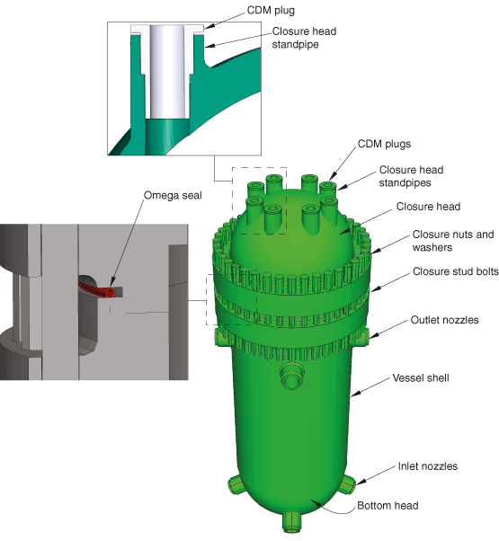

**Figure 1.1.23–2** Reactor vessel assembly model.

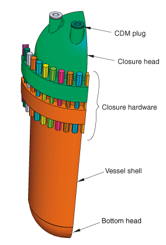

**Figure 1.1.23–3** Reference analysis mesh.

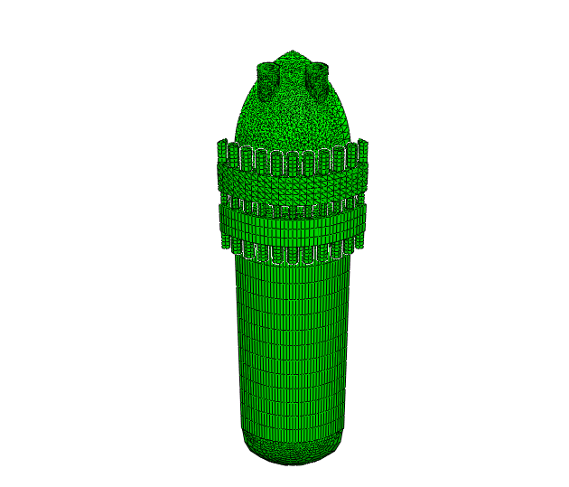

**Figure 1.1.23–4** Load application areas on the CDM plug and closure head standpipe.

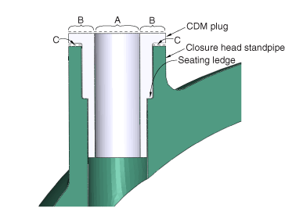

**Figure 1.1.23–5** Case 2 closure head submodel relation to the source model.

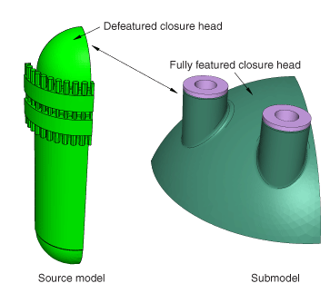

**Figure 1.1.23–6** Case 2 global analysis mesh with defeatured closure head.

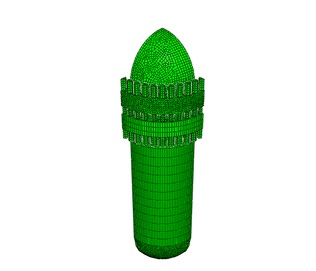

**Figure 1.1.23–7** Case 2 submodel analysis showing the mesh (left) and the path definition for stress comparison to the source model (right).

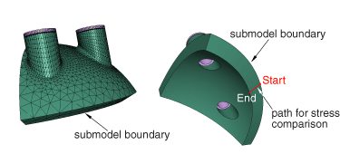

**Figure 1.1.23–8** Through-ligament path definition.

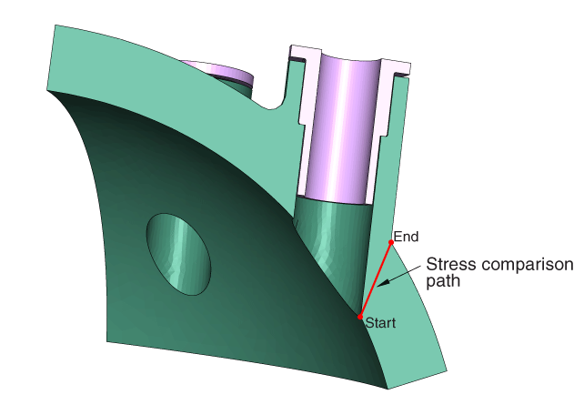

**Figure 1.1.23–9** Seating ledge path definition.

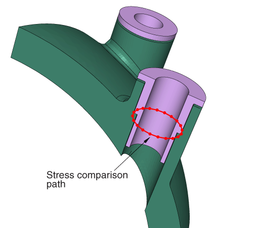

**Figure 1.1.23–10** Case 2 stress distribution comparison through the closure head ligament.

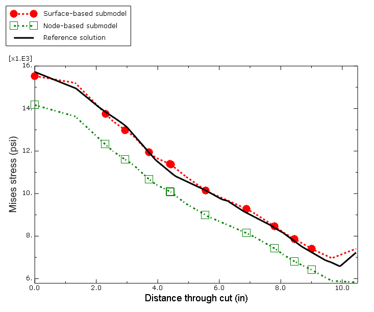

**Figure 1.1.23–11** Comparison of the closure head through-thickness Mises stress distribution at the location of the submodel boundary.

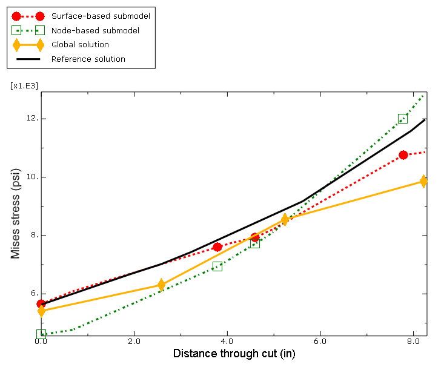

**Figure 1.1.23–12** Case 2 stress distribution comparison around the seating ledge.

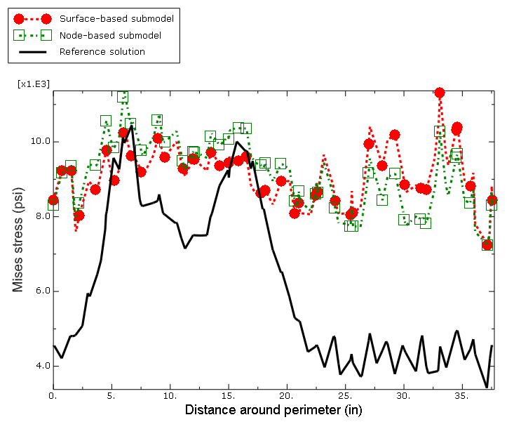

**Figure 1.1.23–13** Case 3 CDM plug analysis mesh.

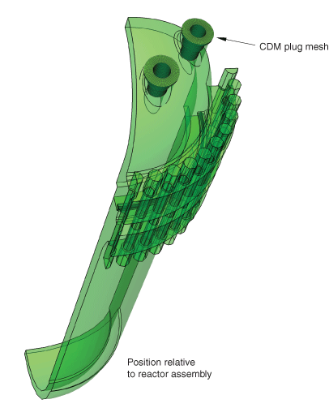

**Figure 1.1.23–14** Case 3 stress distribution comparison through the closure head ligament.

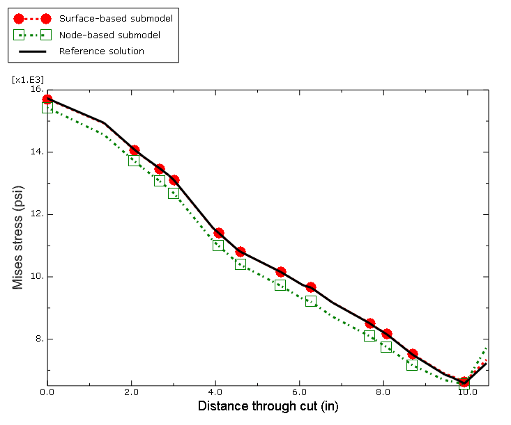

**Figure 1.1.23–15** Case 3 stress distribution comparison around the seating ledge.

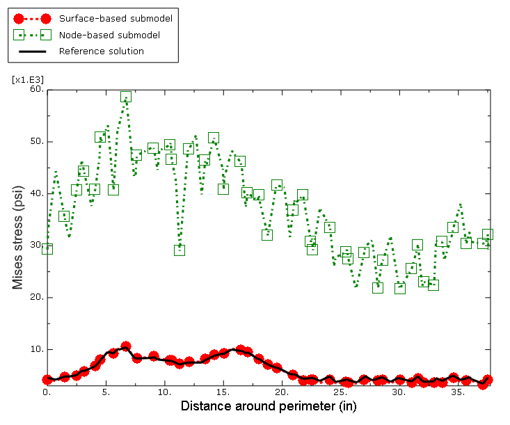

