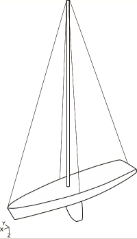
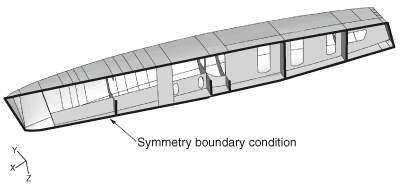
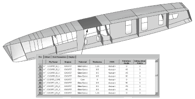
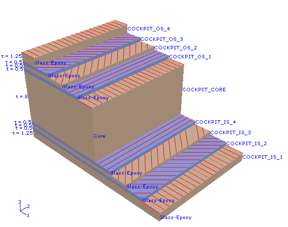
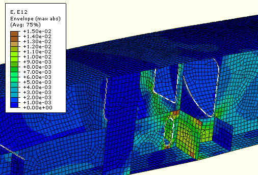
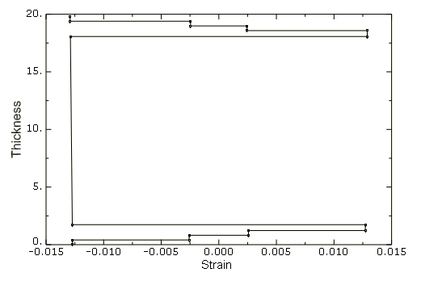

# 1.1.24 Using a composite layup to model a yacht hull

**Products: **Abaqus/Standard  Abaqus/CAE  Abaqus/Viewer  

### Objectives

This example problem demonstrates the following Abaqus features and techniques:
- importing the shell geometry of a yacht hull from an ACIS (`.sat`) file,
- creating a composite layup using Abaqus/CAE,
- applying plies in the layup to regions of the model,
- viewing a ply stack plot from a region of the model,
- viewing an envelope plot that shows the critical plies in each region of the model, and
- viewing an *X--Y* plot through the thickness of an element.

### Application description

Composite hulls are used routinely in the yacht industry. Composite materials allow manufacturers to create high-performance marine vessels that incorporate the complex hull shapes that engineers have derived from computational fluid dynamics analyses and from experimental testing. Composites also provide the strength, rigidity, and low mass that high-performance yachts require. However, incorporating many layers of material with varying orientations in a complex three-dimensional finite element model can be time consuming. The addition of local reinforcements complicates the process. These issues are described by Bosauder et al. (2006).

The composite layup capability in Abaqus/CAE simplifies the process of composites modeling by mirroring the procedure that manufacturers follow on the shop floor—stacking sheets of composite material in a region of a mold and aligning the material in a specified direction. The Abaqus/CAE composite layup editor allows you to easily add a ply, choose the region to which it is applied, specify its material properties, and define its orientation. You can also read the definition of the plies in a layup from data in a text file, which is convenient when the data are stored in a spreadsheet or are generated by a third-party tool. 

### Geometry

[Figure 1.1.24--1](ch01s01aex24.md#hullcomposite-model) shows the hull, mast, rigging, and keel of the yacht model. The geometry of the model is imported as a single part from an ACIS (`.sat`) file, as shown in [Figure 1.1.24--2](ch01s01aex24.md#hullcomposite-symmetry). The part models one half of the hull, and symmetric boundary conditions are applied. The hull represents a high-performance 20-meter yacht with reinforced bulkheads that stiffen the structure. The infrastructure above the deck does not play a role in modeling the performance of the hull and is not included in the model. 

Sets are created that correspond to the regions of the composite layup to which plies are applied.

### Materials

The model is partitioned into 27 regions. Each region contains plies of glass-epoxy cloth surrounding a Nomex core. Most regions contain nine plies—four glass-epoxy plies on either side of the Nomex core. However, additional plies are added to reinforce regions of high strain. Some bulkheads are reinforced with stringers made of glass-epoxy cloth with an effective Young's modulus of 128000 N/mm2. [Table 1.1.24--1](ch01s01aex24.md#exa-sta-glassepoxy) shows the material properties of the glass-epoxy cloth, and [Table 1.1.24--2](ch01s01aex24.md#exa-sta-nomex) shows the material properties of the Nomex core.

[Figure 1.1.24--3](ch01s01aex24.md#hullcomposite-layup) shows several rows of the composite layup table and illustrates how plies and material orientations are assigned to a region of the model. [Figure 1.1.24--4](ch01s01aex24.md#hullcomposite-plystackplot) shows a ply stack plot of the same region.

### Boundary conditions and loading

The center of the model is constrained to be symmetric about the *y*-axis, as shown in [Figure 1.1.24--2](ch01s01aex24.md#hullcomposite-symmetry). The following loads are applied:
- A hydrostatic pressure is applied to the hull. The pressure is modeled with an analytical field that increases the pressure linearly along the *z*-axis.
- Concentrated forces that model the tension from the sail rigging are applied to the front, rear, and side of the deck. The forces are applied along the *x*-axis of a datum coordinate system. Each coordinate system has an origin at the location of the load, and the *x*-axis orients the load toward the location of the top of the mast. The concentrated forces are transferred to the deck through distributing couplings.
- The load from the mast is applied at the base of the hull in the *z*-direction.
- The keel is modeled with a lumped mass attached to the hull through a kinematic coupling.
- An inertia relief load is applied at the center of the hull to bring the model into equilibrium after the loads are applied.

### Abaqus modeling approaches and simulation techniques

A single loading case is considered that uses a static analysis to study the effect of the loading on the composite layup.

### Mesh design

The model is meshed by Abaqus/CAE using the free meshing technique and quadrilateral-dominated elements. 

### Loads

- The tension load from the sail rigging is 5500 N at the front of the hull, 4000 N at the rear of the hull, and 7500 N at the side of the hull.
- The load from the mast is 17500 N.
- A lumped mass of 10 metric tons models the keel.

### Constraints

A kinematic coupling transfers the weight of the keel to the base of the hull, and three distributing couplings transfer the load from the rigging to the hull.

### Analysis steps

A single static load step is defined for the analysis; nonlinear effects are not included.

### Output requests

By default, Abaqus/CAE writes field output data from only the top and bottom section points of a composite layup, and no data are generated from the other plies. In this model, output is requested for all section points in all plies. This allows you to create an envelope plot of the entire model that indicates which plies in each region are carrying the highest strain.

### Results and discussion

[Figure 1.1.24--5](ch01s01aex24.md#hullcomposite-contour) shows an envelope plot of the in-plane shear strain (E12) in the middle of the hull. [Figure 1.1.24--6](ch01s01aex24.md#hullcomposite-xyplot) shows the through-thickness variation of this strain component.

### Files

You can use the Abaqus/CAE Python scripts to create the model and to run the analysis. You can also use the Abaqus/Standard input file to run the analysis.

[compositehull_model.py](../eif/compositehull_model.py)

Script to create the model using the geometry from compositehull_geometry.sat and the composite layup from compositehull_layup.txt.

[compositehull_geometry.sat](../eif/compositehull_geometry.sat)

ACIS file containing the geometry of the model.

[compositehull_layup.txt](../eif/compositehull_layup.txt)

A comma-separated text file defining the plies in the composite layup.

[compositehull_job.py](../eif/compositehull_job.py)

Script to analyze the model.

[compositehull_job.inp](../eif/compositehull_job.inp)

Input file to analyze the model.

### References

**Abaqus Analysis User's Guide**
- ["Shell elements," Section 29.6 of the Abaqus Analysis User's Guide](../usb/usb-link.md#usbeshell)

**Abaqus/CAE User's Guide**
- ["Creating composite layups," Section 12.4.4 of the Abaqus/CAE User's Guide](../usi/usi-link.md#usi-prp-editor-composite)
- [Chapter 23, "Composite layups," of the Abaqus/CAE User's Guide](../usi/usi-link.md#usi-adv-layups)

**Other**

- Bosauder, P., D. Campbell, and B. Jones, "Improvements in the Commercial Viability of Finite Element Analysis (FEA) for Accurate Engineering of Marine Structures," JEC conference, Paris, March 2006.

### Tables

**Table 1.1.24–1** Material properties of the glass-epoxy cloth.
| Variable | Value |
| --- | --- |
|  | 35000 N/mm2 |
|  | 7500 N/mm2 |
|  | 0.3 |
|  | 3600 N/mm2 |
|  | 3000 N/mm2 |
|  | 3000 N/mm2 |
|  | 1.5 10--9 metric tons/mm3 |

**Table 1.1.24–2** Material properties of the Nomex core.
| Variable | Value |
| --- | --- |
|  | 10 N/mm2 |
|  | 10 N/mm2 |
|  | 0.3 |
|  | 1 N/mm2 |
|  | 30 N/mm2 |
|  | 30 N/mm2 |
|  | 8.0 1011 metric tons/mm3 |

### Figures

**Figure 1.1.24–1** The yacht model.

**Figure 1.1.24–2** The symmetric model.

**Figure 1.1.24–3** Assigning plies in the layup table to a region of the model.

**Figure 1.1.24–4** A ply stack plot from the cockpit.

**Figure 1.1.24–5** Envelope plot of strain in the critical plies in the center of the hull.

**Figure 1.1.24–6** Strain (E12) across the thickness of an element.

