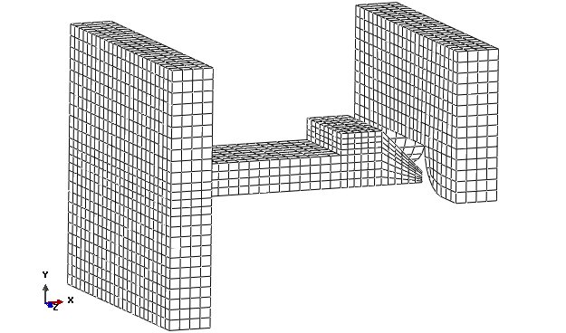
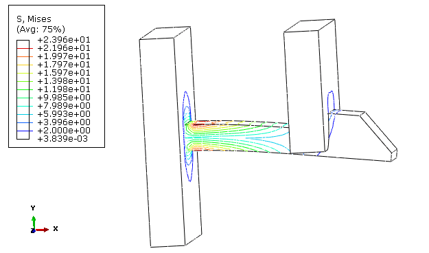
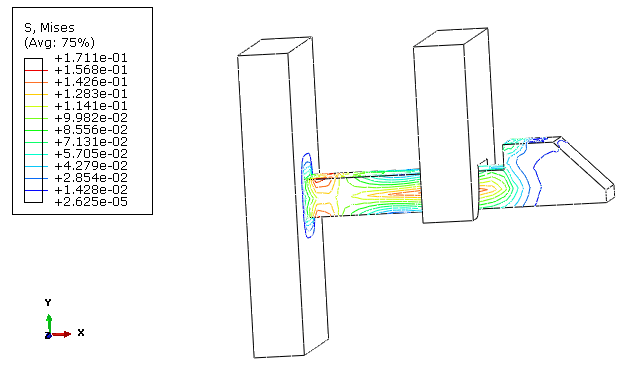
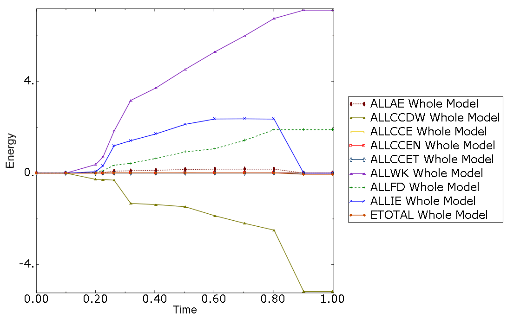
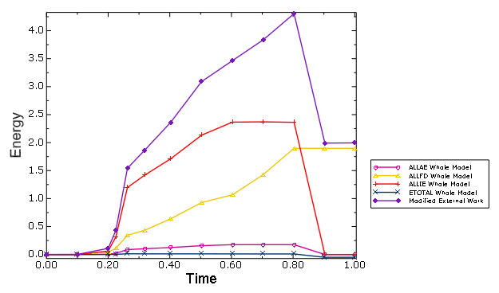
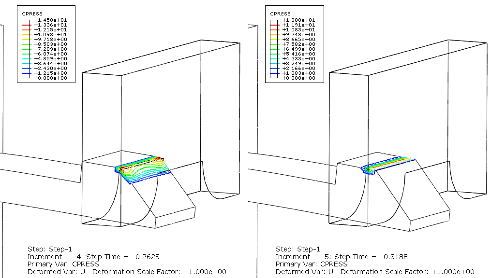
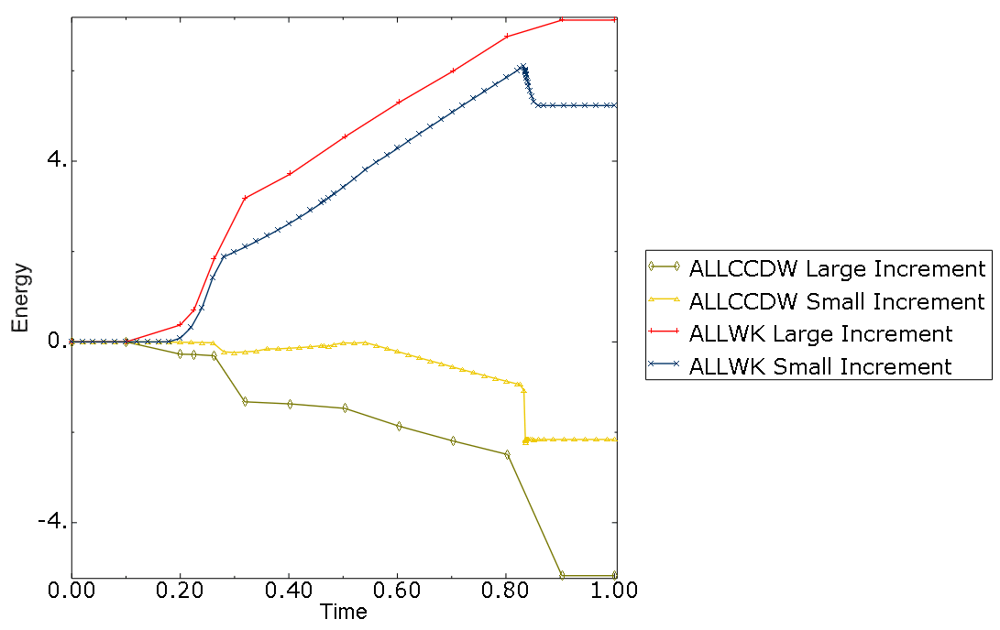
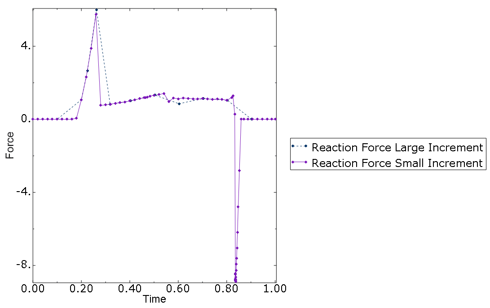
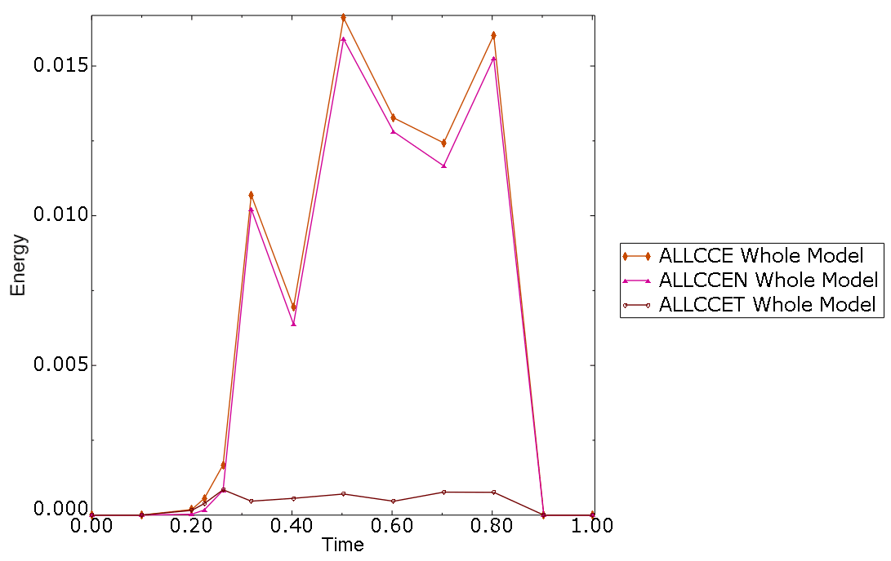

# 1.1.25 接触分析中的能量计算

**产品：** Abaqus/Standard

### 目标

本例说明了在静力非线性弹性、有限滑动、摩擦接触分析中使用能量输出，以考虑以下输出：
- 摩擦耗散，
- 弹性接触能量，其代表存储在接触约束的罚弹簧和"软化"接触约束中的能量；以及
- 接触力所做的其他能量输出变量未考虑到的剩余功。

### 应用描述

能量输出可以提供关于模型行为的宝贵洞察，并增加对数值精度的信心。在时间增量内接触界面上的大相对位移可能导致显著的能量贡献，这些贡献并不总是直观的。在本问题中，引入了与接触相关的能量输出变量，并与其他有意义的能量输出变量一起进行解释。

#### 问题设置

该模型代表一个夹紧的 snap arrowhead，当被指定的x位移推动时，通过墙壁中的开口。 C3D8R单元的几何和网格如图1.1.25-1所示。右侧墙壁的周长是固定的。图1.1.25-2显示了当箭头在穿过开口期间接触时结构明显弯曲的中间位置。图1.1.25-3显示在模拟结束时保留了一些应力，这与本构行为积分的一些不准确性有关。理想情况下，最终位置应完全无应力和应变。

### Abaqus建模方法和模拟技术

一般接触默认使用罚 enforcement 在法向接触方向施加接触约束。切向方向的摩擦约束也默认使用罚方法施加。可以将这种罚方法认为是当接触 active 时在模型中插入法向和切向弹簧。这种弹簧存储弹性能量，当接触打开时释放。法向接触约束弹性能量（ALLCCEN）和切向接触约束弹性能量（ALLCCET）代表模型中所有 active "接触弹簧"（或"罚弹簧"）能量的非负和。能量输出变量ALLCCE是它们的和：ALLCCE = ALLCCEN + ALLCCET。"软化"接触关系的使用（见Abaqus Analysis User's Guide第37.1.2节"接触压力-过盈关系"）也可能对ALLCCEN有能量贡献。与直接 enforce 的硬接触和Lagrange摩擦没有相关的接触约束弹性能量。

增量摩擦耗散（ALLFD）与增量ALLCCET一起代表摩擦接触力的物理增量功。在无摩擦问题中，ALLFD和ALLCCET都保持为零。

弹性接触能量输出变量（ALLCCEN、ALLCCET和ALLCCE）在每个时间增量以总形式计算。其他能量增量计算，每个增量的增量贡献添加到运行总和。

要理解接触约束不连续功（ALLCCDW）代表什么，首先考虑接触力在增量位移上的完整增量功，这可能产生对以下三个接触能量变量的增量贡献：
- 摩擦耗散（ALLFD）
- 存储在接触罚弹簧和"软化"接触约束中的可恢复能量（ALLCCE）
- 与接触相关的稳定化耗散（ALLCCSD），在本例中不存在

输出变量ALLCCDW accounts for 接触力所做的剩余功；即"完全接触功"等于ALLFD + ALLCCE + ALLCCSD – ALLCCDW。ALLCCDW可以为正或负，并且可能违反直觉。例如，无摩擦硬接触在物理上不能在界面上存储能量，因为法向接触力总是与增量切向位移正交。在数值上，这种接触约束可能具有与之相关的能量，如本例中非零ALLCCDW所示，如下所述。总能量平衡ETOTAL = ALLIE + ALLFD + ALLCCE – ALLWK – ALLCCDW。

### 结果与讨论

图1.1.25-4显示了本例中一套完整的非零能量输出变量。最重要的能量是外功（ALLWK）和接触约束不连续功（ALLCCDW）。在本例中这些输出变量具有不同的符号。如果外功被修改为ALLWK + ALLCCDW，主要能量将如图1.1.25-5所示。在整个模拟过程中，ALLWK和ALLCCDW的这种组合与摩擦耗散和弹性能量的组合大致平衡。

修改后的外功（ALLWK + ALLCCDW）通常在等于存储和耗散能量之和方面代表接触问题中的物理外功。考虑一个特定的接触约束，在一个增量中具有间隙距离../graphics/exa_eqn00211.gif，在下一个增量中成为具有接触力../graphics/exa_eqn00212.gif的闭合（见图1.1.25-6）。用于积分接触力所做功的梯形规则将平均力乘以相对增量运动。在这种情况下，对ALLCCDW的 resulting 贡献为负../graphics/exa_eqn00213.gif。这种能量贡献是非物理的，随着时间增量趋于零，它将在数值上消失。当接触打开时，类似的 behavior 会发生，符号反转。对ALLWK的数值积分在准确计算外力突然变化方面也是有限的。求和ALLWK和ALLCCDW通常会抵消各自的非物理能量贡献，对总能量平衡（ETOTAL）的净效应为零。

如果法向方向在也有接触表面相对运动的 time increment 期间发生变化，也可能发生非零增量ALLCCDW贡献。本例中ALLCCDW的第一次显著下降（见图1.1.25-4）发生在增量4到增量5之间，当时前壁边缘从倾斜箭头表面滑到顶部表面，如图1.1.25-7所示，导致接触约束法向方向的显著变化。

随着更精细的时间增量，ALLCCDW通常变小，如图1.1.25-8所示。所谓的 large time increments 允许的最大时间增量是 small time increments 的五倍。由于模型在分析最后阶段的行为，当箭头 snap 到无应力状态时，全局Newton迭代收敛更难以达到与小时间增量。在过程中，"head 的背面"触摸墙壁的后边缘，而对于大时间增量，完全避免这种触摸。这种差异反映在反应力X在小时间增量时变为负值（见图1.1.25-9）。

弹性接触能量如图1.1.25-10所示。它们与模型中的主要能量相比较小。如果ALLCCEN不小，可能需要增加接触罚刚度以提高解的准确性。如果ALLCCET不小，可能需要减小摩擦弹性或滑动容差以增加摩擦罚刚度。

理想情况下，ETOTAL应该完全恒定（在本例中为零），但实际上它只是近似恒定。这是由于应变能（ALLIE）由改进的梯形规则而非精确的梯形规则计算（由于显著的计算性能影响而未实现）造成的。这种行为在几何非线性问题中很常见，人们只能评估ETOTAL的变化与有意义的能量相比很小。

非零初始ETOTAL将（适当地）发生，例如，当指定初始应力时，使得ALLIE的初始值为正而其他能量最初为零。当为动态分析定义初始速度时，也会发生非零初始ETOTAL；在这种情况下，初始动能为正。

收敛容差也会影响能量结果，因为能量平衡取决于模型中内力和外力以及力矩的平衡。

### 输入文件

[snaparrow_gc.inp](../eif/snaparrow_gc.inp)

大时间增量分析的输入数据。

[snaparrow_gc2.inp](../eif/snaparrow_gc2.inp)

小时间增量分析的输入数据。

### 参考文献

**Abaqus Analysis User's Guide**
- "在Abaqus/Standard中定义一般接触相互作用，" Abaqus Analysis User's Guide第36.2.1节

### 图表

**图1.1.25-1** 初始位置。

**图1.1.25-2** 中间位置。

**图1.1.25-3** 最终位置。

**图1.1.25-4** 模型中的非零能量。

**图1.1.25-5** 具有修改外功的主要能量。

**图1.1.25-6** 一个接触点示例，说明对ALLCCDW的贡献。

**图1.1.25-7** 接触法向方向变化导致ALLCCDW显著增量变化；大时间增量。

**图1.1.25-8** 大和小时间增量的ALLCCDW和ALLWK。

**图1.1.25-9** 大和小时间增量的反应力X。

**图1.1.25-10** 接触弹性能量；大时间增量。

