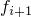
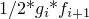

# 1.1.25 Energy computations in a contact analysis

**Product: **Abaqus/Standard  

### Objectives

This example illustrates using energy output in a static nonlinear elastic, finite-sliding, frictional contact analysis to account for the following output:
- frictional dissipation,
- elastic contact energy, which represents energies stored in penalty springs of contact constraints and "softened" contact constraints; and
- the remaining work done by contact forces that is not accounted for by other energy output variables.

### Application description

Energy output can provide valuable insight into model behavior and increase confidence in numerical accuracy. Large relative displacements on a contact interface within a time increment can lead to significant energy contributions that are not always intuitive. In this problem contact-related energy output variables are introduced and explained along with other meaningful energy output variables.

#### Problem setup

The model represents a clamped snapping arrowhead that passes through an opening under a wall when pushed by a prescribed *x*-displacement. The geometry and mesh of C3D8R elements are shown in [Figure 1.1.25--1](ch01s01aex25.md#snaparrow-initialposition). The perimeter of the right wall is fixed. [Figure 1.1.25--2](ch01s01aex25.md#snaparrow-intermediate) shows an intermediate position with the structure visibly bent when the arrowhead is in contact while passing through the opening. [Figure 1.1.25--3](ch01s01aex25.md#snaparrow-final) shows that some stress remains at the end of simulation, which is related to some inaccuracy in the integration of the constitutive behavior. Ideally, the final position should be totally stress and strain free.

### Abaqus modeling approaches and simulation techniques

General contact uses penalty enforcement of contact constraints in the normal contact direction by default. Frictional constraints in the tangential directions are also enforced by default with the penalty method. This penalty method can be thought of as inserting normal and tangential springs in the model while contact is active. Such springs store elastic energy that is released when contact opens up. The contact constraint elastic energy in the normal direction (ALLCCEN) and the contact constraint elastic energy in tangential directions (ALLCCET) represent nonnegative sums of the energies in all such active “contact springs” (or “penalty springs”) in the model. The energy output variable ALLCCE is their sum: ALLCCE = ALLCCEN + ALLCCET. The use of “softened” contact relationships (see ["Contact pressure-overclosure relationships," Section 37.1.2 of the Abaqus Analysis User's Guide](../usb/usb-link.md#usb-cni-anormalinteraction)) can also contribute energy to ALLCCEN. There is no contact constraint elastic energy associated with directly enforced hard contact and Lagrange friction.

The incremental frictional dissipation (ALLFD) together with incremental ALLCCET represents the physical incremental work of the frictional contact forces. Both ALLFD and ALLCCET remain zero in frictionless problems.

The elastic contact energy output variables (ALLCCEN, ALLCCET, and ALLCCE) are computed in total form every time increment. Other energies are computed incrementally, with the incremental contribution added to the running totals each increment.

To understand what the contact constraint discontinuity work (ALLCCDW) represents, first consider the full incremental work of contact forces on incremental displacements, which may produce incremental contributions to the following three contact energy variables:
- Frictional dissipation (ALLFD)
- Recoverable energy stored in contact penalty springs and "softened" contact constraints (ALLCCE)
- Stabilization dissipation associated with contact (ALLCCSD), not present in this example

Output variable ALLCCDW accounts for the remaining work done by contact forces; i.e., “full contact work” is equal to ALLFD + ALLCCE + ALLCCSD – ALLCCDW. ALLCCDW can be positive or negative, and it may be counterintuitive. For example, frictionless hard contact cannot physically store energy on the interface because normal contact forces are always orthogonal to incremental tangential displacements. Numerically, such contact constraints may have energy associated with them as demonstrated by nonzero ALLCCDW in this example, as discussed below. The total energy balance ETOTAL = ALLIE + ALLFD + ALLCCE – ALLWK – ALLCCDW. 

### Results and discussion

[Figure 1.1.25--4](ch01s01aex25.md#snaparrow-allenergies) shows a complete set of nonzero energy output variables for this example. The most significant energies are external work (ALLWK) and contact constraint discontinuity work (ALLCCDW). In this example these output variables have different signs. If the external work were modified to be ALLWK + ALLCCDW, the major energies would be as shown in [Figure 1.1.25--5](ch01s01aex25.md#snaparrow-allwork). This combination of ALLWK and ALLCCDW is approximately in balance with the combination of frictional dissipation and elastic energy throughout the simulation.

The modified external work (ALLWK + ALLCCDW) is often representative of the physical external work in contact problems in terms of being equal to the sum of the stored and dissipated energies. Consider a particular contact constraint having a gap distance, , in one increment and becoming closed with contact force, , in the next increment (see [Figure 1.1.25--6](ch01s01aex25.md#snaparrow-onepoint)). A trapezoidal rule for integrating the work done by the contact force multiplies the average force by the relative incremental motion. In this case the resulting contribution to ALLCCDW is negative . This energy contribution is nonphysical and would disappear in the numerics as the time increment tends to zero. When contact opens up, similar behavior happens with sign reversals. Numerical integration for ALLWK is also limited with respect to accounting accurately for sudden changes in external forces. Summing ALLWK and ALLCCDW often cancels the respective nonphysical energy contributions, and the net effect on the total energy balance (ETOTAL) is zero. 

A nonzero incremental ALLCCDW contribution can also occur if the normal direction changes during a time increment that also has relative motion between contact surfaces. The first significant drop in ALLCCDW for this example (see [Figure 1.1.25--4](ch01s01aex25.md#snaparrow-allenergies)) occurs from increment 4 to increment 5, when the leading wall edge slips from the inclined arrowhead surface to the top surface, as illustrated in [Figure 1.1.25--7](ch01s01aex25.md#snaparrow-allccdw), causing a significant change in the contact constraint normal direction.

With finer time incrementation, ALLCCDW generally becomes smaller, as demonstrated in [Figure 1.1.25--8](ch01s01aex25.md#snaparrow-allccdw-allwk). The maximum time increment allowed with so-called large time increments is five times larger than with small time increments. Convergence of global Newton iterations is more difficult to reach with small time increments because of the model behavior near the last stage of the analysis when the arrowhead snaps to the stress-free state. The “back of the head” touches the rear edge of the wall along the way, whereas with large time increments, this touching is avoided completely. The difference is reflected by the reaction force X becoming negative for small time increments (see [Figure 1.1.25--9](ch01s01aex25.md#snaparrow-reactionforce)).

Elastic contact energies are shown in [Figure 1.1.25--10](ch01s01aex25.md#snaparrow-smallenergies). They are small compared to the major energies in the model. If ALLCCEN is not small, contact penalty stiffness may need to be increased to improve solution accuracy. If ALLCCET is not small, the frictional elastic or slip tolerance may need to be decreased to increase the frictional penalty stiffness.

Ideally, ETOTAL should be exactly constant (in this example zero), but actually it is constant only approximately. The approximation is due to the fact that the recoverable strain energy (ALLIE) is computed by a modified trapezoidal rule, rather than an exact trapezoidal rule (which is not implemented due to dramatic computational performance implications). Such behavior is common in geometrically nonlinear problems, and one can only assess that the variation in ETOTAL is small compared to meaningful energies.

 Nonzero initial ETOTAL will (appropriately) occur, for example, when initial stress is specified, such that the initial value of ALLIE is positive while other energies are initially zero. Nonzero initial ETOTAL also occurs when initial velocities are defined for a dynamic analysis; in this case initial kinetic energy is positive. 

Convergence tolerances can also influence energy results because the energy balance depends on the balance of internal and external forces and moments in the model.

### Input files

[snaparrow_gc.inp](../eif/snaparrow_gc.inp)

Input data for the analysis with large time increments.

[snaparrow_gc2.inp](../eif/snaparrow_gc2.inp)

Input data for the analysis with small time increments.

### Reference

**Abaqus Analysis User's Guide**
- ["Defining general contact interactions in Abaqus/Standard," Section 36.2.1 of the Abaqus Analysis User's Guide](../usb/usb-link.md#usb-cni-acontactgeneralstd)

### Figures

**Figure 1.1.25–1** Initial position.

**Figure 1.1.25–2** Intermediate position.

**Figure 1.1.25–3** Final position.

**Figure 1.1.25–4** Nonzero energies in the model.

**Figure 1.1.25–5** Major energies with modified external work.

**Figure 1.1.25–6** One contact point example to illustrate contributions to ALLCCDW.

**Figure 1.1.25–7** Contact normal direction change causes significant incremental change in ALLCCDW; large time increment.

**Figure 1.1.25–8** ALLCCDW and ALLWK with large and small time increments.

**Figure 1.1.25–9** Reaction force X with large and small time increments.

**Figure 1.1.25–10** Contact elastic energies; large time increments.

