# 1.2.1 圆拱的突然翻转分析

**产品：** Abaqus/Standard  

在结构加载历史的某些阶段，响应可能是不稳定的，因此通常需要研究结构的屈曲后行为。本例中的两个模型展示了修正Riks方法的使用，该方法用于处理此类情况。该方法基于在由位移和比例加载参数定义的空间中沿静力平衡路径以固定增量前进。实际载荷值可能随着求解的进行而增加或减少。Abaqus中实现的修正Riks方法在["修正Riks算法，" Abaqus Theory Guide第2.3.2节](../stm/stm-link.md#stm-anl-modifiedriks)中有描述。

另外两个模型展示了粘性阻尼的使用。一个例子将粘性阻尼作为表面接触的特性来应用，这允许定义与表面之间相对速度成正比的"粘性"压力。该选项在Abaqus中的实现描述在["接触压力定义，" Abaqus Theory Guide第5.2.1节](../stm/stm-link.md#stm-ifc-contactpress)中。另一个例子对模型施加体积比例阻尼。该选项的实现描述在["求解非线性问题，" Abaqus Analysis User's Guide第7.1.1节的自动稳定部分](../usb/usb-link.md#usb-anl-anonlineareqns)中。

这里考虑三种独立的情况。第一种是承受压力载荷的夹支浅拱。Ramm（1981）和Sharafi and Popov（1971）给出了该案例的参考解。第二种是承受集中载荷的夹支-铰支圆拱的稳定性分析。DaDeppo和Schmidt（1975）给出了该问题的精确解析解。第三种情况是对浅拱问题的改进，其中端部不是夹支而是铰支，并且用刚性冲头压入拱。

### 模型和求解控制

浅圆拱如图[图1.2.1-1](ch01s02aex28.md#sxmsnapbuckle-circarch)所示。由于变形是对称的，只建立半个拱的模型。使用10个B21型单元（线性插值梁）。首先施加均匀压力使拱突然翻转。然后反转载荷，以便在移除压力时也能获得行为。

深圆拱如图[图1.2.1-2](ch01s02aex28.md#sxmsnapbuckle-hingedarch)所示。拱的一端夹支，另一端铰支。集中载荷施加在拱的顶点。拱承受极大的挠度但应变很小。由于边界条件不对称，拱将向铰支端倾斜然后坍塌。在大部分响应历史中拱几乎不可伸长。使用60个B31H型单元。由于混合单元最适合此类问题，因此使用混合单元。

使用求解控制设置非常严格的收敛容差，因为该问题包含多个平衡路径。如果不使用严格容差，响应可能会沿着与所示不同的路径进行。

在Riks过程中，无法指定实际载荷值的大小。相反，它们作为求解的一部分来计算，作为加载数据行上给出的载荷大小的"载荷比例因子"的乘积。用户规定的载荷大小仅用于定义方向并估计载荷初始增量的大小。该初始载荷增量是初始时间增量与时间周期的比值乘以加载选项中给出的载荷大小的乘积。用户可以通过指定最大载荷比例因子或节点最大位移（或两者）来终止Riks分析。当计算出的求解点超过这些限制中的任何一个时，分析将停止。在任何情况下，或者如果没有使用任何选项，分析将在超过步骤最大增量数时结束。

在这些突然翻转研究中，结构在完全突然翻转后可以承受增加的载荷。因此，通过指定最大载荷比例因子来方便地终止分析。

对于夹支浅拱，初始突然翻转发生在约1000（力/长度²单位）的压力下。因此，250（力/长度²单位）似乎是施加的第一个载荷增量的合理估计。因此，对于时间周期1.0和5000（力/长度²单位）的压力载荷，指定初始时间增量0.05。当载荷比例因子超过0.4时，分析将终止。

为了说明在多个步骤中使用Riks，包含了第二个步骤，在该步骤中移除拱上的压力，使其反弹回初始配置。在Riks分析的任何点上，实际载荷由给出，其中是前一步结束时的载荷，是在当前步骤中规定的载荷大小，是载荷比例因子。卸载拱，使得在初始时间增量中移除约0.15的压力。使用时间周期1.0中的初始时间增量0.05，为此重启步骤规定了载荷。此外，希望分析在所有载荷移除且拱返回其初始配置时结束。因此，在拱的中心设置位移阈值0.0。当超过此限制时分析终止。因为Abaqus必须获取初始Riks步骤结束时的载荷大小以开始下一步，所以跟随Riks步骤的任何步骤只能作为先前步骤的重启作业进行。

对于深夹支-铰支拱，初始突然翻转发生在约900（力单位）的载荷下。规定的载荷大小为100（力单位），最大载荷比例因子规定为9.5。

用刚性冲头压入的浅拱如图[图1.2.1-3](ch01s02aex28.md#sxmsnapbuckle-archwpunch)所示。分析使用与第一个问题相同的拱模型。然而，端部是铰支而不是夹支，并且通过冲头的位移施加载荷。铰支边界条件使问题比夹支情况更不稳定。在用拱中点的规定位移压入拱的初步分析中，表明力在突然翻转过程中会变为负。因此，如果用刚性冲头压入拱，Riks方法将无助于收敛，因为在突然翻转的时刻，拱与冲头分离，冲头的移动不再控制拱的位移。因此，引入接触阻尼以帮助收敛。表面接触的粘性阻尼添加与相对速度成正比的压力，以减缓拱与冲头的分离。

粘性阻尼间隙设置为10.0，间隙区间的分数设置为0.9；对于高达9.0的间隙，阻尼是恒定的。由于拱高4.0个单位，拱顶部从初始位置到最终突然翻转位置的行进距离为8.0个单位。这个距离显然大于分析过程中任何时候拱中部与冲头顶端之间的间隙。因此，在拱与冲头分离的整个期间，粘性阻尼都是有效的。

为了选择粘性阻尼系数，注意它被给出为压力/相对速度。通过将近似峰值力（10000.0）除以接触面积（1.0）来获得相关压力。通过将拱顶部行进的距离（从初始位置到翻转位置的8.0，可四舍五入为10.0）除以时间（约1.0，步骤的总时间）来获得相关速度。使用该值的一小部分（0.1%）作为粘性阻尼系数：

使用 =1.0，分析完成运行。当使用较小的值 =0.1进行另一次分析时，粘性阻尼不足以使分析通过突然翻转点。因此，确定阻尼系数1.0是合适的值。

对于用刚性冲头压缩的浅拱，也考虑了基于体积比例阻尼的自动稳定作为接触阻尼的替代方案。考虑了两种形式的自动稳定：一种使用默认选择的恒定阻尼因子（见["使用恒定阻尼因子的静态问题的自动稳定"-"求解非线性问题，" Abaqus Analysis User's Guide第7.1.1节](../usb/usb-link.md#usb-anl-anonlineareqns-stabilize)），另一种使用自适应阻尼因子（见["自适应自动稳定方案"-"求解非线性问题，" Abaqus Analysis User's Guide第7.1.1节](../usb/usb-link.md#usb-anl-anonlineareqns-stabilize-adaptive)）。

### 结果与讨论

夹支浅拱的结果如图[图1.2.1-4](ch01s02aex28.md#sxmsnapbuckle-loadvdispc)所示，其中拱顶部的向下位移与压力的关系。该算法在12个增量中获得此解，增量中最多为三次迭代。在12个增量结束时，拱顶部的位移约为7.5个长度单位。这代表了一次完整的突然翻转，因为拱的原始升高为4个长度单位。图[图1.2.1-5](ch01s02aex28.md#sxmsnapbuckle-deform-step1)和[图1.2.1-6](ch01s02aex28.md#sxmsnapbuckle-deform-step2)显示了该问题的一系列变形构型图。其他几位作者也检查了同样的情况，并获得了基本相同的解（见Ramm，1981，和Sharafi and Popov，1971）。

深夹支-铰支拱的结果如图[图1.2.1-7](ch01s02aex28.md#sxmsnapbuckle-loadvdisph)所示，其中拱顶部的位移与施加载荷的关系。图[图1.2.1-8](ch01s02aex28.md#sxmsnapbuckle-deform-h)显示了该问题的一系列变形构型图。拱在峰值载荷处不稳定坍塌。随后，随着载荷的增加，梁迅速变硬。Riks方法处理不稳定响应的能力从这个例子中可以很好地说明。

初步分析固定位移铰支浅拱的结果如图[图1.2.1-9](ch01s02aex28.md#sxmsnapbuckle-forcevdisp)所示，其中拱顶部的位移与该点反力的关系。该图显示了突然翻转过程中产生的负力。图[图1.2.1-10](ch01s02aex28.md#sxmsnapbuckle-deformwpunch)显示了一系列变形构型图，其中显示了拱与冲头分离的情况。图[图1.2.1-11](ch01s02aex28.md#sxmsnapbuckle-forcebetw)是冲头与铰支拱顶部之间力的图。在突然翻转之前，力是正的，当拱与冲头分离时，产生负的粘性力。一旦突然翻转完成，当冲头继续向下移动而与拱分离时，力降至零。当冲头接触拱时，再次产生正力。

当接触粘性阻尼被体积比例阻尼（具有恒定或自适应阻尼系数）取代时，会产生类似的结果。获得类似于[图1.2.1-10](ch01s02aex28.md#sxmsnapbuckle-deformwpunch)的一系列构型，其中在突然翻转过程中拱与冲头分离。在分析结束时，耗散的能量量与使用粘性阻尼选项耗散的能量量相似。

您可以使用**abaqus restartjoin**执行程序从重启分析创建的输出数据库中提取数据，并将数据追加到第二个输出数据库。有关更多信息，请参阅["连接重启分析的输出数据库（`.odb`）文件，" Abaqus Analysis User's Guide第3.2.21节](../usb/usb-link.md#usb-int-drestartjoinproc)。

### 输入文件

[snapbuckling_shallow_step1.inp](../eif/snapbuckling_shallow_step1.inp)

浅拱的初始分析步骤。

[snapbuckling_shallow_unload.inp](../eif/snapbuckling_shallow_unload.inp)

获取浅拱卸载响应的重启运行。

[snapbuckling_deep.inp](../eif/snapbuckling_deep.inp)

深拱。

[snapbuckling_shallow_midpoint.inp](../eif/snapbuckling_shallow_midpoint.inp)

通过中点固定位移加载的浅拱。

[snapbuckling_shallow_punch.inp](../eif/snapbuckling_shallow_punch.inp)

通过刚性冲头位移加载的浅拱。

[snapbuckling_b21h_deep.inp](../eif/snapbuckling_b21h_deep.inp)

用于深夹支-铰支拱分析的60个B21H型单元。

[snapbuckling_b32h_deep.inp](../eif/snapbuckling_b32h_deep.inp)

用于深夹支-铰支拱分析的30个B32H型单元。

[snapbuckling_restart1.inp](../eif/snapbuckling_restart1.inp)

在RIKS步骤期间snapbuckling_shallow_step1.inp的重启分析。

[snapbuckling_restart2.inp](../eif/snapbuckling_restart2.inp)

在RIKS步骤期间snapbuckling_restart1.inp的重启分析。这说明重启现有RIKS重启分析。

[snapbuckling_shallow_stabilize.inp](../eif/snapbuckling_shallow_stabilize.inp)

与snapbuckling_shallow_punch.inp相同，但表面接触粘性阻尼被[*STATIC](../key/key-link.md#usb-kws-hstatic), STABILIZE的体积比例阻尼取代。

[snapbuckling_shallow_stabilize_adap.inp](../eif/snapbuckling_shallow_stabilize_adap.inp)

与snapbuckling_shallow_punch.inp相同，但表面接触粘性阻尼被[*STATIC](../key/key-link.md#usb-kws-hstatic), STABILIZE, ALLSDTOL的自适应稳定取代。

### 参考文献

DaDeppo, D. A., and R. Schmidt, "Instability of Clamped-Hinged Circular Arches Subjected to a Point Load,"* Transactions of the American Society of Mechanical Engineers*, Journal of Applied Mechanics, pp. 894–896, Dec. 1975.

Ramm, E., "Strategies for Tracing the Nonlinear Response Near Limit Points," in *Nonlinear Finite Element Analysis in Structural Mechanics*, edited by W. Wunderlich, E. Stein and K. J. Bathe, Springer Verlag, Berlin, 1981.

Sharifi, P., and E. P. Popov, "Nonlinear Buckling Analysis of Sandwich Arches," Proc. ASCE, Journal of the Engineering Mechanics Division, vol. 97, pp. 1397–1412, 1971.

### 图表

**图1.2.1-1** 夹支浅圆拱。

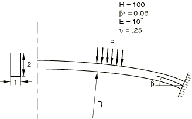

**图1.2.1-2** 深夹支-铰支拱。

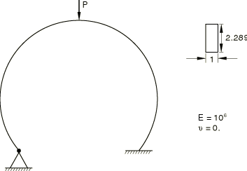

**图1.2.1-3** 带刚性冲头的铰支浅拱。

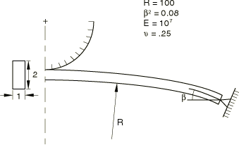

**图1.2.1-4** 夹支浅拱的载荷-位移曲线。

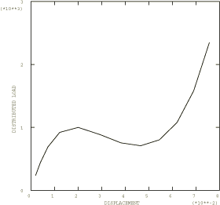

**图1.2.1-5** 夹支浅拱变形构型图-步骤1。

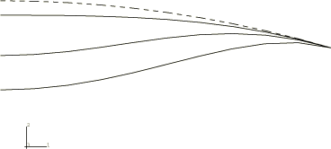

**图1.2.1-6** 夹支浅拱变形构型图-步骤2。

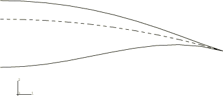

**图1.2.1-7** 深夹支-铰支拱的载荷-位移曲线。

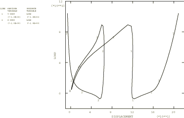

**图1.2.1-8** 深夹支-铰支拱的变形构型图。

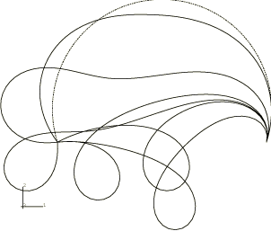

**图1.2.1-9** 固定位移铰支浅拱的力-位移曲线。

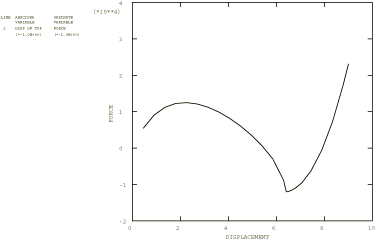

**图1.2.1-10** 带刚性冲头压入的铰支拱变形构型图。

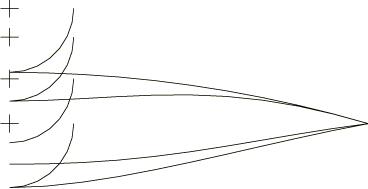

**图1.2.1-11** 冲头与铰支拱顶部之间的力。

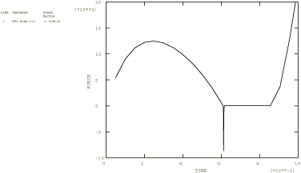

