# 1.2.2 层合复合壳：带圆孔圆柱面板的屈曲

**产品：** Abaqus/Standard  

本例说明了一种在航空航天工业中引起关注的分析类型。目标是确定典型壳体的强度，这些壳体用于形成飞机机身和火箭发动机的外表面。这类分析很复杂，因为这些壳体通常包含局部不连续性——筋和孔洞——它们可能引起可能导致复合材料分层的显著应力集中。在存在屈曲的情况下，这种分层可以传播通过结构导致失效。在本例中我们仅研究壳体的几何非线性行为：不分层或其他截面失效。如果可以从这里报告的分析中预测的应力中进行材料失效的可能性的一些估计，但没有在本例中包含此类评估。

该示例广泛使用了通用壳体截面中的材料取向来定义多层、各向异性的层合截面。壳体的各种取向选项在["各向异性层合板的分析，" Abaqus Benchmarks Guide第1.1.2节](../bmk/bmk-link.md#bmk-anl-anisoplate)中讨论。

通用壳体截面提供了两种定义层合截面的方法：定义每层的厚度、材料和取向，或直接定义等效截面属性。最后一种方法在层合板属性直接从实验或独立的前处理器获得时特别有用。本例在通用壳体截面定义中使用了这两种方法。或者，您可以使用壳体截面来分析模型；然而，由于材料行为是线性的，获得的解没有差异，计算成本会更高。

### 几何和模型

分析的结构如图[图1.2.2-1](ch01s02aex28.md#sxmlamshell-geom)所示，最初由Knight和Starnes（1984）进行了实验研究。测试试样是一个圆柱面板，底座为355.6 mm（14 in）见方，曲率半径为381 mm（15 in），因此面板覆盖了圆筒的55.6°弧。面板包含一个中心位于50.8 mm（2 in）直径的孔。壳体由16层单向石墨纤维和环氧树脂组成。每层厚度为0.142 mm（.0056 in）。层排列在对称的铺层顺序{45/90/0/0/90/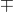45}度，重复两次。Stanley（1985）给出的标称正交各向异性弹性材料属性为

| = 135 kN/mm2 | (19.6 106 lb/in2), |
| --- | --- |
| 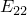= 13 kN/mm2 | (1.89 106 lb/in2), |
| 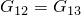= 6.4 kN/mm2 | (.93 106 lb/in2), |
| = 4.3 kN/mm2 | (0.63 106 lb/in2), |
| = 0.38, |  |

其中1方向沿纤维方向，2方向在层表面内垂直于纤维，3方向垂直于层表面。

面板底边完全夹支，顶边夹支但允许轴向运动，垂直边简支。考虑三种分析。第一种是线性（屈曲前）分析，面板承受0.8 mm（.0316 in）的均匀端部缩短。总轴向力和沿中截面的轴向力分布用于与Stanley（1985）获得的结果进行比较。第二种分析包括提取前五个屈曲模态的特征值。屈曲载荷和模态形状也与Stanley（1985）给出的进行比较。最后，进行非线性载荷-挠度分析以预测屈曲后行为，使用修正Riks算法。对于此分析，引入初始缺陷。缺陷基于第二种分析中提取的第四屈曲模态。这些结果与Stanley（1985）和Knight与Starnes（1984）的实验测量进行了比较。

Abaqus中使用的网格如图[图1.2.2-2](ch01s02aex28.md#sxmlamshell-mesh)所示。各向异性材料行为排除了任何对称假设，因此建立了整个面板的模型。4节点壳单元（类型S4R5）和9节点壳单元（类型S9R5）使用相同的网格；因此，9节点单元网格具有大约4倍于4节点单元网格的自由度。6节点三角形壳单元STRI65也使用了；它对二阶网格的每个四边形单元使用两个三角形。网格生成通过指定节点填充和节点映射来促进，如输入数据所示。在这个模型中，指定相对角度来定义每层内的材料取向，以及平面应力中的正交各向异性弹性，使得层合板属性的定义很简单。

本例中使用的壳体单元使用薄壳理论的近似，基于沿单元边缘的横向剪切应变的数值惩罚。这些单元并非普遍适用于复合材料的分析，因为横向剪切效应在这种情况下可能很显著，而这些单元并非为准确建模它们而设计。然而，这里的面板几何形状是薄壳；对称的铺层加上相对大量的层 tends to diminish the importance of transverse shear deformation on the response.

### 应力合力和广义应变之间的关系

壳体截面最容易通过给出层厚度、材料和取向来定义，在这种情况下Abaqus预先积分以获得截面刚度属性。然而，用户可以选择直接输入截面刚度属性，如下所述。

在Abaqus中，一层被视为平面应力中的正交各向异性薄片。主材料轴（见[图1.2.2-3](ch01s02aex28.md#sxmlamshell-typlamina)）是纵向，记为*L*；在层表面内垂直于纤维方向，记为*T*；垂直于层表面，记为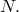。一般正交各向异性材料在主方向上的本构关系（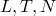)是

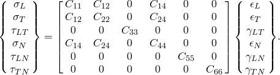

就定义正交各向异性弹性所需的数据而言，在Abaqus中指定弹性刚度矩阵中的项，这些是

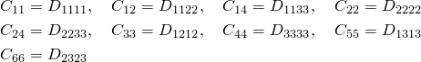

该矩阵是对称的，有9个独立常数。如果我们假设平面应力状态，那么被视为零。这给出

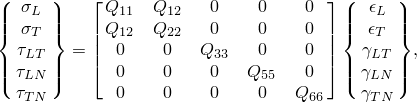

其中

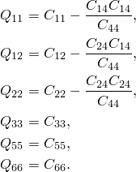

这些项与层合板中简单正交各向异性层通常给出的工程常数之间的对应关系是

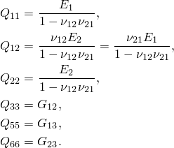

上面等式右边使用的参数是必须作为平面应力中正交各向异性弹性定义的一部分提供的。

如果（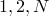）系统表示Abaqus默认选择的标准壳体基方向，则必须将局部刚度分量旋转到该系统以构建层合板对通用壳体截面刚度的贡献。由于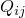表示四阶张量，在层合板的情况下，它们相对于Abaqus使用的标准壳体基方向成角度。因此，变换是

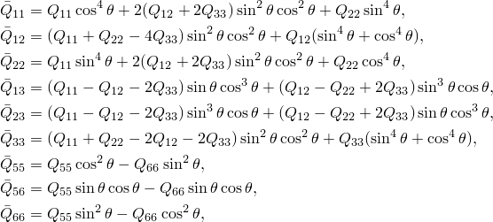

其中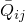是Abaqus使用的标准壳体基方向中的刚度系数。

Abaqus假设层合板是各层以不同方向排列的主方向的层压板。各层被认为是刚性粘合在一起的。给定层中单位长度法向基方向的截面力和弯矩合量可以基于此定义为

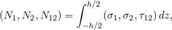

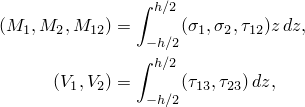

其中*h*是层的厚度。

这导致关系

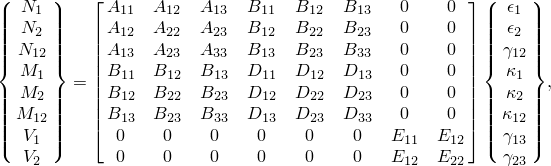

其中该截面刚度矩阵的分量由

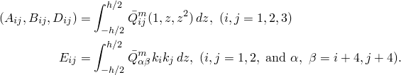

给出。这里*m*表示特定层。因此，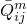取决于第*m*层的材料属性和纤维取向。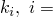 1,2参数是Whitney（1973）定义的剪切校正系数。如果铺层中有*n*层，我们可以将上述方程重写为对*n*层合板的积分求和。材料系数将采用形式

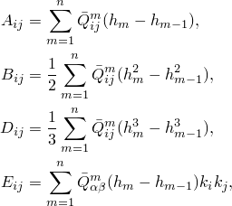

其中这些方程中的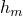和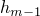表示第*m*层层合板由曲面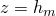和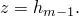限定。见[图1.2.2-4](ch01s02aex28.md#sxmlamshell-typlaminate)了解命名法。

这些方程定义了通用壳体截面中直接输入截面刚度矩阵方法所需的系数。只有、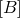和子矩阵是该选项所需的。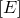中的三项（如果需要）作为横向剪切刚度的一部分定义。上述定义的截面力在法向壳体基方向上。

将这些方程应用于本例定义的层合板得出以下总体截面刚度：

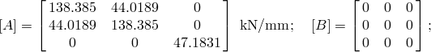

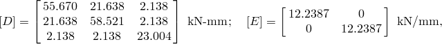

或

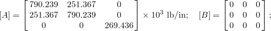

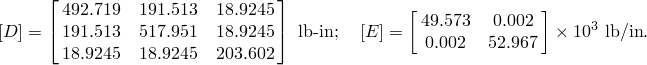

### 结果与讨论

将面板压缩0.803 mm（0.0316 in）所需的总轴向力对于S9R5单元网格为100.2 kN（22529 lb），对于S4R5单元网格为99.5 kN（22359 lb），对于STRI65单元网格为100.3 kN（22547 lb）。这些值与Stanley（1985）报告的100 kN（22480 lb）的结果非常接近。[图1.2.2-5](ch01s02aex28.md#sxmlamshell-disp-force)显示了面板中截面（位于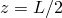）的位移构型和轴向力分布。有趣的是，轴向载荷几乎均匀分布在整个面板上，只有靠近孔的非常局部区域承受放大的应力水平。这表明对于这个线性分析，也可以通过向孔洞倾斜的较粗网格获得充分的结果。

分析的第二阶段是特征值屈曲预测。为了用Abaqus获得屈曲预测，运行特征值屈曲预测步骤。在该步骤中施加名义载荷值。所使用的大小没有任何意义，因为特征值屈曲是一个线性摄动过程：刚度矩阵和应力刚化矩阵在步骤开始时评估，没有施加任何此类载荷。特征值屈曲预测步骤计算特征值，乘以施加的载荷并添加到任何"基础状态"载荷，即为预测的屈曲载荷。还获得与特征值相关的特征向量。该过程在["特征值屈曲预测，" Abaqus Analysis User's Guide第6.2.3节](../usb/usb-link.md#usb-anl-aeigenbuckling)中有更详细的描述。

屈曲预测总结在[表1.2.2-1](ch01s02aex28.md#table-lamshell-bucklepredict)和[图1.2.2-6](ch01s02aex28.md#sxmlamshell-bucklemodes)中。Abaqus给出的屈曲载荷预测高于Stanley报告的。元素类型S4R5、S9R5和STRI65的网格给出的特征模态预测都是相同的，与Stanley报告的一致。Stanley提出了几个重要的观察结果，对Abaqus结果仍然有效：（1）特征值紧密分布；（2）尽管如此，模态形状在特征上差异很大；（3）第一屈曲模态与线性屈曲前解最为相似；（4）没有可用的对称性可用于计算效率。

在特征值屈曲分析之后，通过施加基于第四屈曲模态的缺陷进行非线性屈曲后分析。最大初始扰动为壳体厚度的10%。[图1.2.2-7](ch01s02aex28.md#sxmlamshell-response)中比较了S9R5网格、S4R5网格和STRI65网格的载荷与归一化位移曲线，以及实验结果和Stanley给出的结果。Abaqus单元的总体响应预测非常相似，尽管Stanley预测的一般行为有些不同。Abaqus结果显示峰值载荷略高于特征值提取预测的屈曲载荷，而Stanley的结果显示显著较低的峰值载荷。此外，Abaqus结果显示初始峰值后强度损失较少，随后很快再次出现正刚度。Abaqus结果和Stanley的结果都与实验观察到的峰值载荷后显著的强度损失不一致。Stanley将其归因于材料失效（大概是分层），这在他的分析或这些分析中没有建模。

[图1.2.2-8](ch01s02aex28.md#sxmlamshell-postbuckle)显示了面板在其屈曲后响应期间的变形构型。图中显示了S4R5的结果，但S9R5和STRI65的模式类似。响应最初相当对称；但是，随着临界载荷的接近，非对称凹痕发展并增长，大概解释了面板的强度损失。在屈曲后响应的后面阶段，可以看到另一个褶皱正在形成。

### 输入文件

[laminpanel_s9r5_prebuckle.inp](../eif/laminpanel_s9r5_prebuckle.inp)

9节点（单元类型S9R5）网格的屈曲前分析。

[laminpanel_s9r5_buckle.inp](../eif/laminpanel_s9r5_buckle.inp)

使用单元类型S9R5的特征值屈曲预测。

[laminpanel_s9r5_postbuckle.inp](../eif/laminpanel_s9r5_postbuckle.inp)

使用单元类型S9R5的非线性屈曲后分析。

[laminpanel_s4r5_prebuckle.inp](../eif/laminpanel_s4r5_prebuckle.inp)

使用单元类型S4R5的屈曲前分析。

[laminpanel_s4r5_buckle.inp](../eif/laminpanel_s4r5_buckle.inp)

使用单元类型S4R5的特征值屈曲预测。

[laminpanel_s4r5_postbuckle.inp](../eif/laminpanel_s4r5_postbuckle.inp)

使用单元类型S4R5的非线性屈曲后分析。

[laminpanel_s4r5_node.inp](../eif/laminpanel_s4r5_node.inp)

使用单元类型S4R5的屈曲后分析中所施加缺陷的节点坐标数据。

[laminpanel_s9r5_stri65_node.inp](../eif/laminpanel_s9r5_stri65_node.inp)

使用单元类型S9R5和STRI65的屈曲后分析中所施加缺陷的节点坐标数据。

[laminpanel_stri65_prebuckle.inp](../eif/laminpanel_stri65_prebuckle.inp)

使用单元类型STRI65的屈曲前分析。

[laminpanel_stri65_buckle.inp](../eif/laminpanel_stri65_buckle.inp)

使用单元类型STRI65的特征值屈曲预测。

[laminpanel_stri65_postbuckle.inp](../eif/laminpanel_stri65_postbuckle.inp)

使用单元类型STRI65的非线性屈曲后分析。

[laminpanel_s4_prebuckle.inp](../eif/laminpanel_s4_prebuckle.inp)

使用单元类型S4的屈曲前分析。

[laminpanel_s4_buckle.inp](../eif/laminpanel_s4_buckle.inp)

使用单元类型S4的特征值屈曲预测。

[laminpanel_s4_postbuckle.inp](../eif/laminpanel_s4_postbuckle.inp)

使用单元类型S4的非线性屈曲后分析。

### 参考文献

Knight,  N. F., and J. H. Starnes, Jr., "Postbuckling Behavior of Axially Compressed Graphite-Epoxy Cylindrical Panels with Circular Holes," presented at the 1984 ASME Joint Pressure Vessels and Piping/Applied Mechanics Conference, San Antonio, Texas, 1984.

Stanley,  G. M., *Continuum-Based Shell Elements, *Ph.D. Dissertation, Department of Mechanical Engineering, Stanford University, 1985.

Whitney, J. M., "Shear Correction Factors for Orthotropic Laminates Under Static Loads,"* Journal of Applied Mechanics*, Transactions of the ASME, vol. 40, pp. 302–304, 1973.

### 表格

**表1.2.2-1** 屈曲载荷预测汇总。
| 模态1 | Stanley | 107.0 kN (24054 lb) |
| --- | --- | --- |
| S9R5 | 113.4 kN (25501 lb) |
| S4R5 | 115.5 kN (25964 lb) |
| S4 | 114.3 kN (25696 lb) |
| STRI65 | 113.8 kN (25579 lb) |
| 模态2 | Stanley | 109.6 kN (24638 lb) |
| S9R5 | 117.6 kN (26429 lb) |
| S4R5 | 121.2 kN (27244 lb) |
| S4 | 116.5 kN (26196 lb) |
| STRI65 | 117.8 kN (26492 lb) |
| 模态3 | Stanley | 116.2 kN (26122 lb) |
| S9R5 | 120.3 kN (27049 lb) |
| S4R5 | 124.7 kN (28042 lb) |
| S4 | 124.1 kN (27889 lb) |
| STRI65 | 121.1 kN (27217 lb) |
| 模态4 | Stanley | 140.1 kN (31494 lb) |
| S9R5 | 147.5 kN (33161 lb) |
| S4R5 | 156.1 kN (35092 lb) |
| S4 | 152.3 kN (34247 lb) |
| STRI65 | 146.9 kN (33015 lb) |
| 模态5 | Stanley | 151.3 kN (34012 lb) |
| S9R5 | 171.3 kN (38512 lb) |
| S4R5 | 181.5 kN (40800 lb) |
| S4 | 184.2 kN (41413 lb) |
| STRI65 | 172.8 kN (38843 lb) |

### 图表

**图1.2.2-1** 带孔圆柱面板的几何形状。

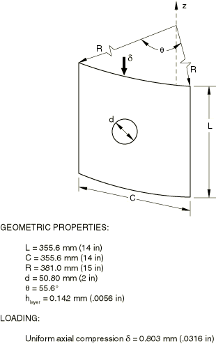

**图1.2.2-2** 带孔圆柱面板的网格。

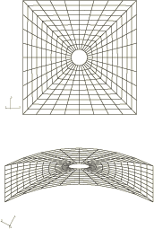

**图1.2.2-3** 典型层合板。

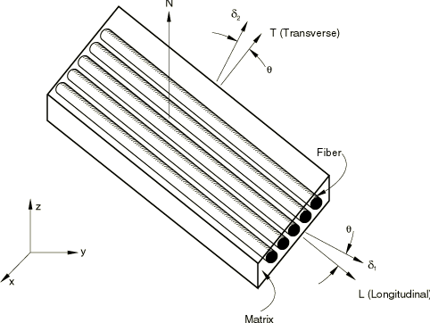

**图1.2.2-4** 典型层合层压板。

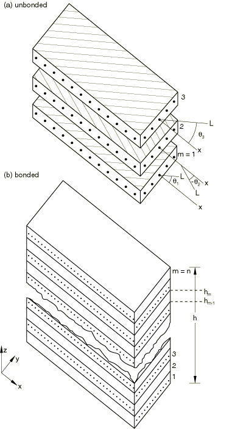

**图1.2.2-5** 位移形状和轴向力分布。

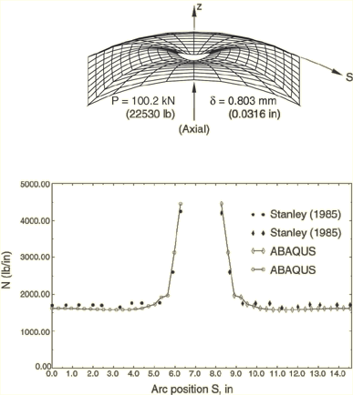

**图1.2.2-6** 屈曲模态，单元类型S4R5、S9R5和STRI65。

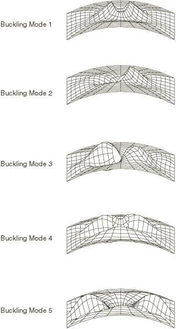

**图1.2.2-7** 载荷-位移响应。

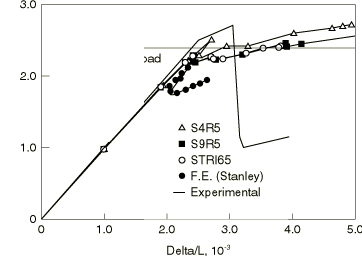

**图1.2.2-8** 屈曲后变形：10% h缺陷与S4R5。

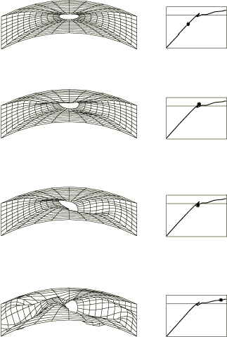

