# 1.2.3 带点焊柱的屈曲

**产品：** Abaqus/Standard   Abaqus/Explicit   Abaqus/CAE  

本例说明了通过点焊将两个槽形截面连接而成的钢柱的静态和动态坍塌。它旨在说明点焊的建模。["Mesh-independent fasteners," Abaqus Analysis User's Guide第35.3.4节](../usb/usb-link.md#usb-cni-afastener)讨论了Abaqus提供的网格无关点焊建模能力；而["Breakable bonds," Abaqus Analysis User's Guide第37.1.9节](../usb/usb-link.md#usb-cni-aspotweld)讨论了使用 bonds 和结合属性在Abaqus/Explicit中建模可断裂点焊。

### 问题描述

柱子由两个不同截面的柱子组成，一个是箱形截面，另一个是W形截面，用点焊焊接在一起（见[图1.2.3-1](ch01s02aex28.md#exxpillar-cmpd-config))。柱子的顶端连接到刚体，这使得通过操纵刚体参考节点来控制柱子的变形变得容易。箱形截面柱子与W形截面柱子用每侧五个点焊焊接在一起。

柱子均由铝镇静钢组成，假设其真应力与对数应变满足Ramberg-Osgood关系，

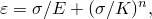

其中杨氏模量(*E*)为206.8 GPa，参考应力值(*K*)为0.510 GPa，加工硬化指数(*n*)为4.76。在当前的Abaqus分析中，Ramberg-Osgood关系使用弹性和塑性材料属性近似。假设材料在170.0 MPa的屈服应力下是线弹性的，屈服应力后的应力-应变曲线使用塑性材料属性定义为分段线性段。泊松比为0.3。

点焊在Abaqus/Standard和Abaqus/Explicit中都使用网格无关紧固件能力建模。使用具有CARTESIAN和CARDAN截面的连接器单元来定义可变形紧固件。或者，也可以使用BUSHING连接类型。包含连接器单元的单元集在网格无关紧固件中被引用。节点5203、15203、25203、35203和45203处的点焊都位于箱形柱的正*z*侧，节点5203位于柱子的底端，节点45203位于柱子的顶端（见[图1.2.3-2](ch01s02aex28.md#exxpillar-boxclmn-config))。节点5211、15211、25211、35211和45211处的点焊都位于箱形柱的负*z*侧，节点5211位于柱子的底端，节点45211位于柱子的顶端。箱形柱和W形柱的表面在网格无关紧固件中指定。点焊直径定义为.002 m。可变形行为在紧固件中使用连接器弹性建模，平移和旋转分量的弹性弹簧刚度为2×10¹¹ N/m。对于Abaqus/Explicit分析，使用连接器损伤行为建模点焊损伤和失效。使用基于力的耦合损伤起始准则，该准则使用同时包含连接器力和连接器力矩成分的连接器势函数。（有关使用的连接器势函数的详细说明，请参阅["耦合行为的连接器函数，" Abaqus Analysis User's Guide第31.2.4节](../usb/usb-link.md#usb-elm-econnderivedandpotential)。）当势函数的值超过2×10⁵ N时，损伤开始。允许损伤起始后的等效位移为1×10⁻⁷ m。一旦点焊中的损伤起始后等效位移达到此值，点焊将不再承受任何载荷。连续体和结构耦合能力都用于定义紧固件。

为了详细研究点焊失效和点焊的屈曲后行为，的问题也使用Abaqus/Explicit中可用的bond属性求解。箱形截面的柱子被定义为与W形截面的柱子接触的从表面。箱形柱子两侧的点焊具有不同的屈服力和屈曲后行为，以说明两种失效模型。对于点焊节点5203、15203、25203、35203和45203，在纯拉伸中引起点焊失效的力为3000 N，在纯剪切中为1800 N。一旦点焊开始失效，它们能够承受的最大力被认为在2.0 msec的时间段内随时间线性衰减，这说明了在给定时间段内强度完全丧失的建模。对于点焊节点5211、15211、25211、35211和45211，这些点焊失效的力在纯拉伸中为4000 N，在纯剪切中为2300 N。这些点焊根据损伤失效模型失效，该模型假设点焊能够承受的最大力随焊接节点与主表面之间的相对位移线性衰减。当总相对位移达到0.3 mm时，焊缝被定义为完全失效，这说明了基于能量吸收的点焊强度丧失建模。

包含一个Python脚本，用于在使用Abaqus/CAE中的脚本接口重现模型。该脚本创建并组装Abaqus/CAE部件，并使用离散紧固件来建模点焊。该脚本创建一个Abaqus/Standard模型，可以从Job模块提交进行分析。该脚本创建的离散紧固件与示例输入文件使用的基于网格的或基于点的紧固件相比有以下区别：
- 当您提交Abaqus/CAE作业进行分析时，该脚本生成的离散紧固件会在输入文件中生成耦合约束和分布式耦合约束，以及连接器单元。示例输入文件使用网格无关紧固件来使用连接器单元建模基于点的紧固件。
- 使用Abaqus/CAE创建离散紧固件时，必须定义影响半径。相比之下，示例输入文件允许Abaqus根据紧固件的几何属性、连接面的特征长度和所选的加权函数类型计算影响半径的默认值。
- 输入文件在柱子和刚体之间共享节点。为了获得类似的行为，Python脚本在柱子和刚体之间创建绑定约束。

 有关Abaqus/CAE中离散紧固件和基于点的紧固件之间区别的说明，请参阅["About fasteners," Abaqus/CAE User's Guide第29.1节](../usi/usi-link.md#usi-eng-fastener-overview)。

### 加载

柱子底部完全固定。在Abaqus/Standard分析中，柱子顶部的刚体参考节点沿*y*方向移动0.25 m，从而对其进行压缩加载，同时沿*z*方向位移.02 m使其略微剪切。同时，柱子的端部绕负*z*轴旋转0.785 rad，绕负*x*轴旋转0.07 rad。

在Abaqus/Explicit分析中，柱子顶部的刚体参考节点以25 m/sec的恒定速度沿*y*方向移动，从而对其进行压缩加载，同时沿*z*方向以2 m/sec的速度使其略微剪切。同时，柱子的端部绕负*z*轴以78.5 rad/sec的速度旋转，绕负*x*轴以7 rad/sec的速度旋转。通过规定连接到复合柱子顶端的刚体参考节点的速度来施加此加载。

分析进行10毫秒。

### 结果与讨论

网格无关点焊能力和基于接触的点焊能力预测柱子非常相似的变形模式和变形形状。[图1.2.3-3](ch01s02aex28.md#exxpillar-deform-5)显示了Abaqus/Explicit分析中5.0 msec后柱子的变形形状。[图1.2.3-4](ch01s02aex28.md#exxpillar-deform-10)显示了10.0 msec后柱子的变形形状。网格无关Abaqus/Explicit分析中的点焊承受损伤并失效。对于当前选择的连接器损伤模型参数，发现损伤始于箱形柱正侧的节点15203到45203的点焊，以及箱形柱负侧的节点15211到45211的点焊。然而，损伤起始后的等效位移足以导致仅节点15203、25203、15211和25211的点焊最终失效。[图1.2.3-9](ch01s02aex28.md#exxpillar-ctf3-std)说明了Abaqus/Standard分析中计算的与参考节点25203和25211关联的点焊中未损伤的连接器力CTF3。[图1.2.3-10](ch01s02aex28.md#exxpillar-ctf3-xpl)说明了Abaqus/Explicit分析中计算的与参考节点25203和25211关联的点焊中损伤的连接器力CTF3。当最终失效发生时，两个点焊中的力都降至零。

柱子点焊的失效和屈曲后行为也使用基于接触的点焊能力进行研究。[图1.2.3-5](ch01s02aex28.md#exxpillar-sptwld-posz)和[图1.2.3-6](ch01s02aex28.md#exxpillar-sptwld-negz)分别显示了柱子正*z*侧和负*z*侧所有点焊的状态。在这些图中，状态1.0表示焊缝完全完整，状态0.0表示焊缝完全失效。[图1.2.3-7](ch01s02aex28.md#exxpillar-loads-nd25203)显示了相对于失效载荷的点焊节点25203上的载荷。该相对值称为结合载荷，定义为点焊开始失效时为1.0，点焊断裂时为0.0。显示结合状态和结合载荷的图可能与特定平台的分析结果不匹配。这是因为接触力在此分析中显示出显著的噪声，可能因平台而异。当使用时间-失效模型时，点焊行为对达到结合强度的结合力中的任何峰值都非常敏感。当使用损伤失效模型时，点焊行为对结合力中的单独峰值较不敏感。[图1.2.3-8](ch01s02aex28.md#exxpillar-energies)显示了总动能、作用于模型的的总功、摩擦耗散的总能、内部能和总能平衡的时间历史。

### 输入文件

[pillar_fastener_xpl.inp](../eif/pillar_fastener_xpl.inp)

Abaqus/Explicit网格无关点焊分析的输入数据。

[pillar_fastener_structcoup_xpl.inp](../eif/pillar_fastener_structcoup_xpl.inp)

使用结构耦合的Abaqus/Explicit网格无关点焊分析的输入数据。

[pillar_fastener_std.inp](../eif/pillar_fastener_std.inp)

Abaqus/Standard网格无关点焊分析的输入数据。

[pillar_fastener_structcoup_std.inp](../eif/pillar_fastener_structcoup_std.inp)

使用结构耦合的Abaqus/Standard网格无关点焊分析的输入数据。

[pillar_fastener_smslide_std.inp](../eif/pillar_fastener_smslide_std.inp)

使用考虑壳体厚度的小滑动接触的Abaqus/Standard网格无关点焊分析的输入数据。

[pillar.inp](../eif/pillar.inp)

基于接触对的点焊分析的输入数据。

[pillar_gcont.inp](../eif/pillar_gcont.inp)

基于一般接触的点焊分析的输入数据。

[pillar_rest.inp](../eif/pillar_rest.inp)

用于测试带点焊的重启能力的输入数据。

[pillar_ds.inp](../eif/pillar_ds.inp)

使用双面表面能力的分析。

### Python脚本

[pillar_fastener_std.py](../eif/pillar_fastener_std.py)

使用Abaqus/CAE创建具有离散紧固件的模型的脚本。

### 图表

**图1.2.3-1** 复合柱的初始构型。

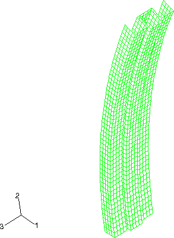

**图1.2.3-2** 显示点焊的箱形柱的初始构型。

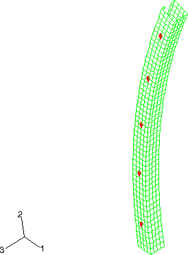

**图1.2.3-3** 5.0 msec时的变形形状。

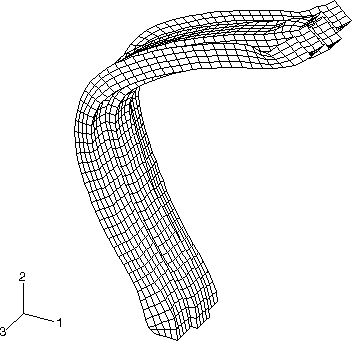

**图1.2.3-4** 10.0 msec时的变形形状。

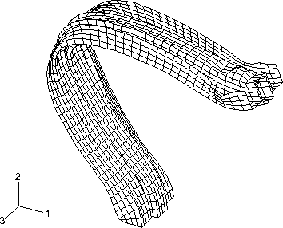

**图1.2.3-5** 柱子正*z*侧所有点焊状态的时间历史。

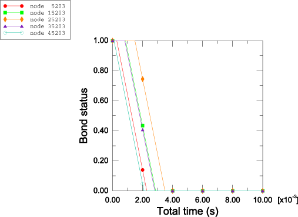

**图1.2.3-6** 柱子负*z*侧所有点焊状态的时间历史。

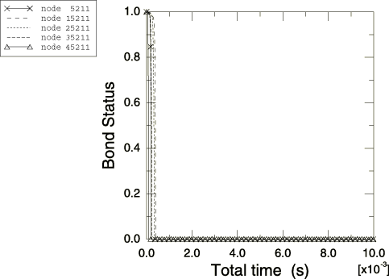

**图1.2.3-7** 点焊节点25203相对于失效载荷的载荷时间历史。

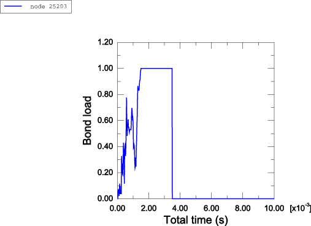

**图1.2.3-8** 总动能、摩擦耗散能、作用于模型的功、内部能和总能的时间历史。

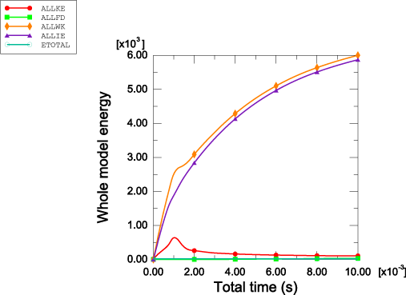

**图1.2.3-9** Abaqus/Standard中参考节点25203和25211处点焊的连接器力CTF3。

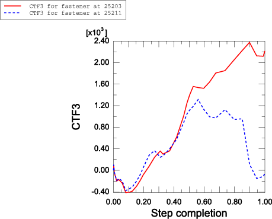

**图1.2.3-10** Abaqus/Explicit中参考节点25203和25211处点焊的连接器力CTF3。

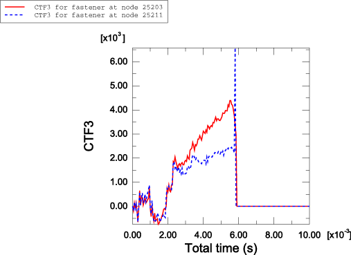

