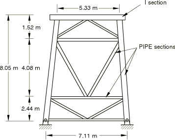
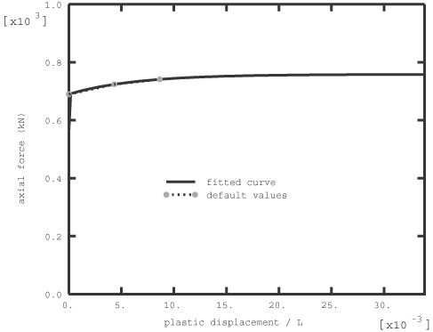
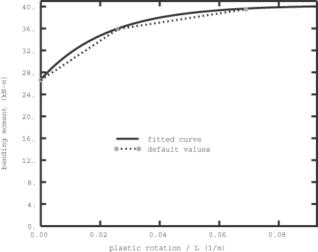
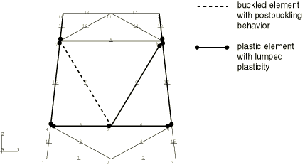
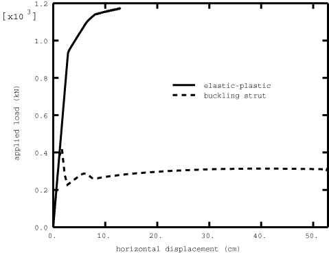

# 1.2.4 弹塑性K框架结构

**产品：** Abaqus/Standard  

本例说明了FRAME2D frame单元的使用。Frame单元（["Frame单元，" Abaqus Analysis User's Guide第29.4.1节](../usb/usb-link.md#usb-elm-eframe)）可用于建模框架结构单个成员的弹性、弹塑性和屈曲 strut 响应。弹性响应由Euler-Bernoulli梁理论定义。弹塑性响应通过集中在单元末端的非线性运动硬化塑性来建模，模拟塑性铰的形成。屈曲 strut 响应是对细长构件承受压缩时发生的高度非线性截面坍塌和材料屈服现象的简化表示。因此，frame单元可以是弹性的、弹塑性的表现为struts（有或无屈曲），或在分析过程中切换到strut行为和屈曲后行为。弹塑性和屈曲 strut 响应都是高度非线性响应的简化。它们旨在用单个有限单元来近似这些复杂响应，该单元表示连接之间的结构构件。对于需要更高求解精度的模型部分（如应力预测），应用梁单元进行细化。

本例中的几何形状是典型K-frame结构，用于海上结构等应用（见[图1.2.4-1](ch01s02aex28.md#sxmkframe-model))。进行推覆分析以确定结构在塑性铰形成或屈曲失效导致坍塌前能够承受的最大水平载荷。在推覆测试中，许多结构构件承受压缩载荷。承受压缩的细长构件通常因几何屈曲、截面坍塌和/或材料屈服而失效。屈曲 strut 响应（对这种压缩行为进行建模）在单独的分析中添加，以研究结构中关键构件的压缩失效影响。施加到结构顶部的恒载代表K-frame支撑的重量。推覆分析是载荷控制或位移控制测试。

### 几何和模型

该结构由19个结构连接之间的构件组成。每个有限单元建模一个框架构件。因此，使用了19个frame单元：17个具有不同属性的PIPE截面单元和2个（顶部平台）具有I截面的单元。元素的塑性响应根据材料的屈服应力计算，使用Abaqus提供的塑性默认值。（塑性响应的默认值基于细长钢构件的实验。关于默认值的详细信息，请参阅["Frame截面行为，" Abaqus Analysis User's Guide第29.4.2节](../usb/usb-link.md#usb-elm-eusingframesection)。）默认塑性响应包括轴向力的轻度硬化和弯矩的强硬化。[图1.2.4-2](ch01s02aex28.md#sxmkframe-axial)和[图1.2.4-3](ch01s02aex28.md#sxmkframe-bending)中显示了模型中典型单元的默认硬化响应。

444.8 kN（100,000 lb）的恒载施加到K-frame顶部，代表K-frame上方的结构部分。随后，顶部平台被水平加载或位移。载荷水平或施加的位移选择得足够大，以使整个结构因塑性铰形成而失效，从而失去承载能力。

研究了三种不同的模型。预期有极限载荷，因为分析的目的是确定结构何时失去整体刚度。为所有三种模型进行了大位移和小位移分析以进行比较。使用frame单元的大位移分析对大整体旋转有效但应变为小，因为frame单元假设应变为小。在第一种模型中，所有元素都使用弹塑性材料响应。在第二种模型中，检查所有PIPE截面单元的屈曲。ISO方程用作屈曲标准，屈曲后行为遵循默认的Marshall strut包络线。屈曲 strut 包络线根据材料的屈服应力和默认Marshall Strut理论计算。（关于默认屈曲 strut 包络线的详细信息，请参阅["Frame截面行为，" Abaqus Analysis User's Guide第29.4.2节](../usb/usb-link.md#usb-elm-eusingframesection)。）所有使用屈曲 strut 响应的frame构件都检查ISO标准以进行切换到strut算法。在第三种模型中，在第二种模型中切换到strut行为的构件（单元7）从分析开始就替换为具有屈曲 strut 响应的frame单元。为了继续通过响应的不稳定阶段，在弹塑性问题中使用Riks静力求解过程。为了减少求解迭代次数，在大位移弹塑性问题中使用求解控制，将最大解校正与最大增量解的比值设置为1.0，因为在塑性发生后位移增量非常小。

### 结果与讨论

结构被加载或位移到所有承载能力丧失的点。在具有弹塑性frame单元的第一种模型中，线性和非线性几何的结果按预期进行比较。也就是说，大位移分析的极限载荷在1141 kN（256,000 lb）处达到，而小位移分析中的载荷较高为1290 kN（291,000 lb）。两种情况下的塑性铰模式相同。

第二种模型使用切换算法。它表明单元7在任何单元形成塑性铰之前，在等于1.32 cm（0.52 in）的规定位移处首先违反ISO方程（屈曲）。该单元中的临界压缩力为–318 kN（–71,400 lb）。接下来，多个单元出现塑性，达到结构的极限容量。具有切换算法的frame单元以最准确的方式预测结构行为，因为检查模型中所有单元的屈曲可能性，高度压缩的构件自动切换到屈曲后行为（见[图1.2.4-4](ch01s02aex28.md#sxmkframe-switch)中的塑性和屈曲frame单元）。当结构不能再支撑水平加载时，线和非线性几何的塑性铰模式相同。接近极限载荷的载荷结果差异更大。

为了研究屈曲的影响，比较了第一和第三种（单元7从一开始就使用屈曲 strut 响应）模型（[kframe_loadcntrl_nlgeom.inp](../eif/kframe_loadcntrl_nlgeom.inp)和[kframe_dispcntrl_buckle_nlgeom.inp](../eif/kframe_dispcntrl_buckle_nlgeom.inp)）。大位移分析的载荷与水平挠度曲线如图[图1.2.4-5](ch01s02aex28.md#sxmkframe2)所示。与具有切换算法的模型类似，单元7首先屈曲。当其他构件变形并吸收屈曲构件不再承受的载荷时，结构恢复刚度，其他构件出现塑性。当七个构件形成塑性铰时，结构不能再支撑额外的水平加载。第三种模型中的极限载荷仅为无屈曲模型中极限载荷的约28%。切换算法和单元7使用屈曲 strut 响应的示例的载荷-位移曲线比较良好，未显示。

### 输入文件

[kframe_loadcntrl_nlgeom.inp](../eif/kframe_loadcntrl_nlgeom.inp)

载荷控制的弹塑性分析；大位移分析。

[kframe_loadcntrl.inp](../eif/kframe_loadcntrl.inp)

载荷控制的弹塑性分析；小位移分析。

[kframe_dispcntrl_switch_nlgeom.inp](../eif/kframe_dispcntrl_switch_nlgeom.inp)

具有切换算法和位移控制的弹塑性frame单元；大位移分析。

[kframe_dispcntrl_switch.inp](../eif/kframe_dispcntrl_switch.inp)

具有切换算法和位移控制的弹塑性frame单元；小位移分析。

[kframe_dispcntrl_buckle_nlgeom.inp](../eif/kframe_dispcntrl_buckle_nlgeom.inp)

弹塑性和屈曲 strut 响应与载荷控制；大位移分析。

[kframe_dispcntrl_buckle.inp](../eif/kframe_dispcntrl_buckle.inp)

弹塑性和屈曲 strut 响应与位移控制；小位移分析。

### 图表

**图1.2.4-1** 二维K-frame结构。

**图1.2.4-2** 具有PIPE截面的典型单元（模型中的单元7）轴向力的默认硬化响应。

**图1.2.4-3** 具有PIPE截面的典型单元（模型中的单元7）弯矩的默认硬化响应。

**图1.2.4-4** 具有切换算法的分析结果：具有塑性和屈曲单元的K-frame模型。

**图1.2.4-5** 弹塑性模型和包括屈曲 strut 响应的模型的载荷点水平位移。

