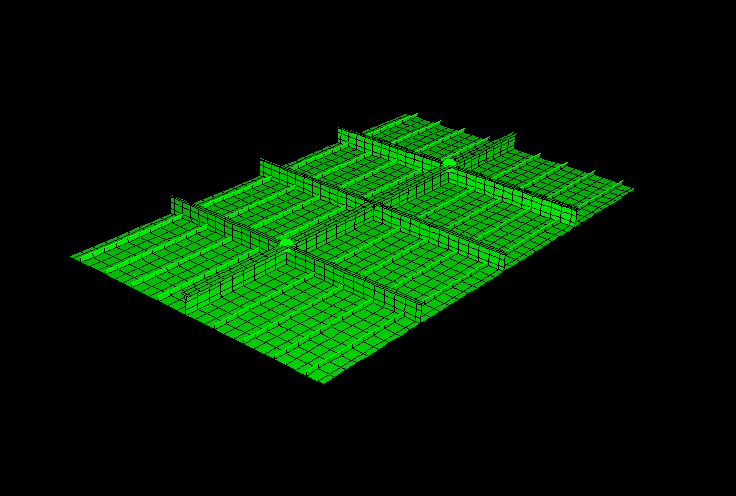
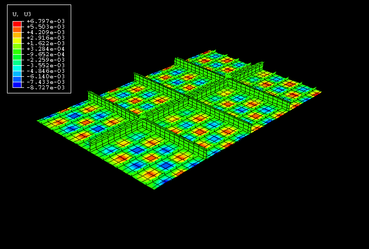
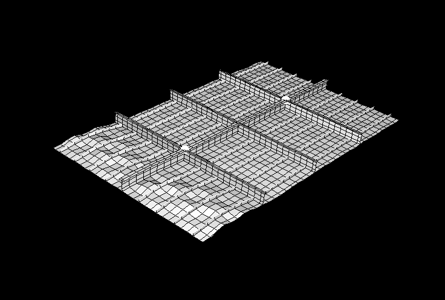
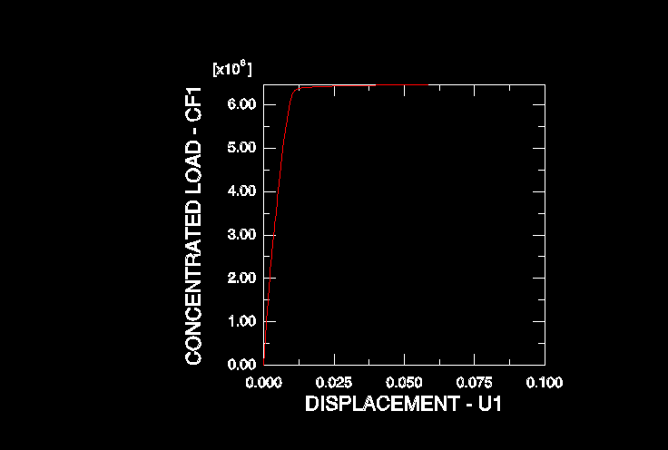
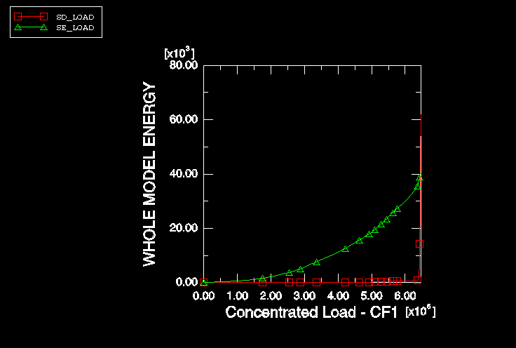
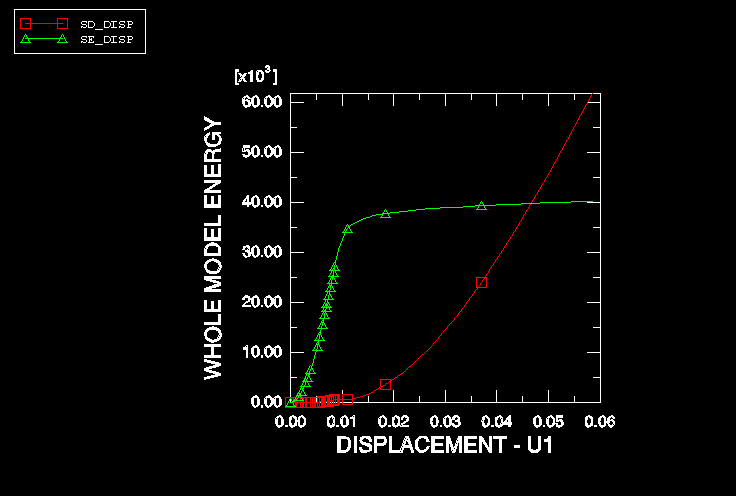
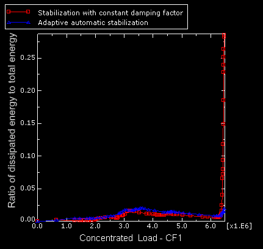

# 1.2.5 不稳定静态问题：承受压缩载荷的加筋板

**产品：** Abaqus/Standard  

本例演示了使用自动技术来稳定不稳定的静态问题。几何非线性静态问题可能因多种原因变得不稳定。接触问题中可能发生不稳定，要么是由于跳动，要么是由于预期防止刚体运动的接触最初未建立。局部不稳定也可能发生；它们可以是几何的（如局部屈曲）或材料的（如材料软化）。

该问题建模了承受平面内压缩载荷的加筋板结构，该载荷产生局部屈曲。结构通常按适当增加安全因子的服务载荷设计。然而，探索其在极端事故载荷下的行为通常很有意义。本例研究了海军建筑结构的一个子模型。它是一个矩形板，在两个主要方向上用梁加筋（[图1.2.5-1](ch01s02aex28.md#sxmstable-platemesh))。板在较长边缘具有对称边界条件，在较短边缘铰支。平面内载荷施加到其中一个铰支边，压缩板。还施加重力载荷。板在载荷下屈曲。屈曲最初局部发生在由加筋限定的每个部分内。在较高的载荷水平下，板在与施加载荷最近的一排部分经历整体屈曲。

标准分析程序通常提供结构开始屈曲的载荷。用户可能感兴趣的是结构额外的承载能力。这些信息可以转化为，例如，知道整体屈曲何时开始，或者损伤在结构中传播多远。在这种情况下，需要更复杂的分析技术。弧长方法（如Abaqus中可用的Riks方法）是适用于整体屈曲和屈曲后分析的全局载荷控制方法；当屈曲是局部的时候，它们效果不佳。另一种是动态分析问题或引入阻尼。在动态情况下，屈曲局部释放的应变能转化为动能；在阻尼情况下，该应变能被耗散。动态求解准静态问题通常是昂贵的。在本例中使用了Abaqus中的自动稳定能力，该能力对结构施加体积比例阻尼。

### 几何和模型

该模型由矩形板组成，长10.8 m（425.0 in），宽6.75 m（265.75 in），厚5.0 mm（0.2 in）。该板在纵向和横向都有多个加筋（[图1.2.5-1](ch01s02aex28.md#sxmstable-platemesh))。该板代表更大结构的一部分：两个纵向边具有对称边界条件，两个横向边具有铰支边界条件。此外，在两个主要加筋交叉点处的弹簧代表与结构其余部分的柔性连接。网格由板和较大加筋的S4壳单元以及剩余加筋的额外S3壳和B31梁单元组成。整个结构由相同的结构钢制成，初始流应力为235.0 MPa（34.0 ksi）。

为了在预期的屈曲时为数值解提供稳定性，将基于体积比例阻尼的自动稳定添加到模型中。考虑了两种形式的自动稳定：一种使用默认选择的恒定阻尼因子（见["使用恒定阻尼因子的静态问题的自动稳定"-"求解非线性问题，" Abaqus Analysis User's Guide第7.1.1节](../usb/usb-link.md#usb-anl-anonlineareqns-stabilize)），另一种使用自适应阻尼因子（见["自适应自动稳定方案"-"求解非线性问题，" Abaqus Analysis User's Guide第7.1.1节](../usb/usb-link.md#usb-anl-anonlineareqns-stabilize-adaptive)）。

### 结果与讨论

分析包括两个步骤。在第一步中，施加垂直于板面的重力载荷。在第二步中，将6.46×10⁶ N（1.45×10⁶ lbf）的纵向压缩载荷施加到板的一个铰支边。该边上的所有节点通过多点约束被迫等量移动。分析是准静态的，但预期屈曲。

最初，局部面外屈曲在整个板中以几乎棋盘格模式发展，发生在每个由加筋限定的部分内（[图1.2.5-2](ch01s02aex28.md#sxmstable-platelcbckl))。后来，整体屈曲沿着靠近施加载荷的部分前沿发展（[图1.2.5-3](ch01s02aex28.md#sxmstable-plateglbckl))。由施加载荷产生的位移演变非常平滑（[图1.2.5-4](ch01s02aex28.md#sxmstable-plateload)），并不反映结构中的早期局部不稳定。然而，当整体不稳定发展时，曲线几乎变平，表明承载能力完全丧失。检查模型的能量内容（[图1.2.5-5](ch01s02aex28.md#sxmstable-platenrgyl)和[图1.2.5-6](ch01s02aex28.md#sxmstable-platenrgyd))显示，当载荷增加时，耗散能量的量可以忽略不计。一旦载荷变平，应变能也变平（表明或多或少恒定的承载能力），而耗散能量急剧增加以吸收施加载荷所做的功。

[图1.2.5-7](ch01s02aex28.md#sxmstable-adapstab)显示了使用恒定阻尼因子与使用自适应阻尼因子获得的耗散能与总应变能之比。

### 致谢

SIMULIA感谢IRCN（法国）提供此示例。

### 输入文件

[unstablestatic_plate.inp](../eif/unstablestatic_plate.inp)

板模型。

[unstablestatic_plate_stabil_adap.inp](../eif/unstablestatic_plate_stabil_adap.inp)

具有自适应稳定的板模型。

[unstablestatic_plate_node.inp](../eif/unstablestatic_plate_node.inp)

板模型的节点定义。

[unstablestatic_plate_elem.inp](../eif/unstablestatic_plate_elem.inp)

板模型的单元定义。

### 图表

**图1.2.5-1** 加筋板初始网格。

**图1.2.5-2** 板局部屈曲。

**图1.2.5-3** 板整体屈曲。

**图1.2.5-4** 板载荷-位移曲线。

**图1.2.5-5** 耗散能和应变能随载荷的变化。

**图1.2.5-6** 耗散能和应变能随位移的变化。

**图1.2.5-7** 使用恒定阻尼因子和自适应稳定的耗散能与总应变能之比。

