# 1.3.1 Upsetting of a cylindrical billet: quasi-static analysis with mesh-to-mesh solution mapping (Abaqus/Standard) and adaptive meshing (Abaqus/Explicit)

**Products: **Abaqus/Standard  Abaqus/Explicit  Abaqus/CAE  

This example illustrates the use of the solution mapping capabilities of Abaqus/Standard and the adaptive meshing capabilities of Abaqus/Explicit in a metal forming application; the analysis results are compared with the results of Taylor (1981). The same problem is also analyzed using the coupled temperature-displacement elements in ["Upsetting of a cylindrical billet: coupled temperature-displacement and adiabatic analysis," Section 1.3.16](ch01s03aex47.md). Coupled temperature-displacement elements are included in this example only for solution mapping verification purposes; no heat generation occurs in these elements for this example. 

When the strains become large in a geometrically nonlinear analysis, the elements often become so severely distorted that they no longer provide a good discretization of the problem. When this occurs, it is necessary to map the solution onto a new mesh that is better designed to continue the analysis. In Abaqus/Standard the procedure is to monitor the distortion of the mesh—for example, by observing deformed configuration plots—and decide when the mesh needs to be mapped. When mesh distortion is so severe that a new mesh must be created, the new mesh can be generated using the mesh generation options in Abaqus/CAE. The output database is useful in this context since the current geometry of the model can be extracted from the data in the output database. Once a new mesh is defined, the analysis is continued by beginning a new problem using the solution from the old mesh at the point of mapping as initial conditions by specifying the step number and increment number at which the solution should be read from the previous analysis. Abaqus/Standard interpolates the solution from the old mesh onto the new mesh to begin the new problem. This technique provides considerable generality. For example, the new mesh might be more dense in regions of high-strain gradients and have fewer elements in regions that are moving rigidly—there is no restriction that the number of elements be the same or that element types agree between the old and new meshes. In a typical practical analysis of a manufacturing process, mesh-to-mesh solution mapping may have to be done several times because of the large shape changes associated with such a process.

Abaqus/Explicit has capabilities that allow automatic solution mapping using adaptive meshing. Therefore, the mapping process is easier since it is contained within the analysis and the user only has to decide how frequently remeshing should be done and what method to use to map the solution from the old mesh to the new mesh as the solution progresses. Abaqus/Explicit offers default choices for adaptive meshing that have been shown to work for a wide variety of problems. Finally, solution-dependent meshing is used to concentrate mesh refinement areas of evolving boundary curvature. This counteracts the tendency of the basic smoothing methods to reduce the mesh refinement near concave boundaries where solution accuracy is important.

### Geometry and model

The geometry is the standard test case of Lippmann (1979) and is defined in ["Upsetting of a cylindrical billet: coupled temperature-displacement and adiabatic analysis," Section 1.3.16](ch01s03aex47.md). It is a circular billet, 30 mm long, with a radius of 10 mm, compressed between two flat, rigid dies that are defined to be perfectly rough.

The mesh used to begin the analysis is shown in [Figure 1.3.1--1](ch01s03aex32.md#sxmcylbillet-undef). The finite element model is axisymmetric and includes the top half of the billet only since the middle surface of the billet is a plane of symmetry. In both the Abaqus/Standard and Abaqus/Explicit simulations, element type CAX4R is used: this is a 4-node quadrilateral with a single integration point and “hourglass control” to control spurious mechanisms caused by the fully reduced integration. The element is chosen here because it is relatively inexpensive for problems involving nonlinear constitutive behavior since the material calculations are only done at one point in each element. In addition, in the Abaqus/Standard simulations element types CGAX4R, CGAX4T, CAX4P, and CAX4I are also used to model the billet; in the Abaqus/Explicit simulations element type CAX6M is also used to model the billet.

The contact between the top and lateral exterior surfaces of the billet and the rigid die is modeled with a contact pair. The billet surface is specified as a surface definition in the model. The rigid die is modeled in a variety of different ways as described in [Table 1.3.1--1](ch01s03aex32.md#case-table). The mechanical interaction between the contact surfaces is assumed to be nonintermittent, rough frictional contact. Therefore, the contact property includes two additional specifications: rough friction to enforce a no-slip constraint between the two surfaces, and a no-separation contact pressure-overclosure relationship to ensure that separation does not occur once contact has been established. All the contact simulations in Abaqus/Standard use the node-to-surface formulation except one case where the surface-to-surface formulation is introduced.

[Table 1.3.1--1](ch01s03aex32.md#case-table) summarizes the different analysis cases that are studied. The column headings indicate whether the problem was analyzed using Abaqus/Standard and/or Abaqus/Explicit.

For Case 1 several different analyses are performed to compare the different section control options available in Abaqus/Explicit and to evaluate the effects of mesh refinement for the billet modeled with CAX4R elements. A coarse mesh (analysis COARSE_SS) and a fine mesh (analysis FINE_SS) are analyzed with the pure stiffness form of hourglass control. A coarse mesh (analysis COARSE_CS) is analyzed with the combined hourglass control. A coarse mesh (analysis COARSE_ENHS) and a fine mesh (analysis FINE_ENHS) are analyzed with the hourglass control based on the enhanced strain method. The default section controls, using the integral viscoelastic form of hourglass control, are tested on a coarse mesh (analysis COARSE) and a fine mesh (analysis FINE). Since this is a quasi-static analysis, the viscous hourglass control option should not be used. All other cases use the default section controls.

The Abaqus/Standard analyses for Case 1 compare the two hourglass control options and evaluate the effect of mesh refinement for the billet modeled with CAX4R elements. A coarse mesh (analysis COARSE_S) and a fine mesh (analysis FINE_S) are analyzed with the pure stiffness form of hourglass control. A coarse mesh (analysis COARSE_EH) and a fine mesh (analysis FINE_EH) are analyzed with hourglass control based on the enhanced strain method. A coarse mesh (analysis COARSE_EHG) with CGAX4R elements is also analyzed with hourglass control based on the enhanced strain method for comparison purposes.

No mesh convergence studies have been done, but the agreement with the results given in Lippmann (1979) suggests that the meshes used here are good enough to provide reasonable predictions of the overall force on the dies.

### Material

The material model assumed for the billet is that given in Lippmann (1979). Young's modulus is 200 GPa, Poisson's ratio is 0.3, and the density is 7833 kg/m3. A rate-independent von Mises elastic-plastic material model is used, with a yield stress of 700 MPa and a hardening slope of 0.3 GPa.

### Boundary conditions and loading

The kinematic boundary conditions are symmetry on the axis (nodes at 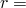 0, in node set `AXIS`, have  0 prescribed) and symmetry about  0 (all nodes at  0, in node set `MIDDLE`, have  0 prescribed). The node on the top surface of the billet that lies on the symmetry axis is not part of the node set `AXIS` to avoid overconstraint: the radial motion of this node is already constrained by a no slip frictional constraint (see ["Common difficulties associated with contact modeling in Abaqus/Standard," Section 39.1.2 of the Abaqus Analysis User's Guide](../usb/usb-link.md#usb-cni-acontacttrouble), and ["Common difficulties associated with contact modeling using contact pairs in Abaqus/Explicit," Section 39.2.2 of the Abaqus Analysis User's Guide](../usb/usb-link.md#usb-cni-aexpcontacttrouble)). 

In Abaqus/Standard the rigid die is displaced by 9 mm in the axial direction using a displacement boundary condition. In Abaqus/Explicit the -displacement of the rigid die is prescribed using a velocity boundary condition whose value is ramped up to a velocity of 20 m/s and then held constant until the die has moved a total of 9 mm. The total simulation time of the Abaqus/Explicit analysis is 0.55 millisec, and the loading rate is slow enough to be considered quasi-static. In both Abaqus/Standard and Abaqus/Explicit the radial and rotational degrees of freedom of the rigid die are constrained.

For all cases the analyses are done in two steps so that the first step can be stopped at a die displacement corresponding to 44% upsetting; the second step carries the analysis to 60% upsetting. In the Abaqus/Standard simulations the solution mapping analysis restarts from the end of the first step with a new mesh and proceeds until 60% upsetting is achieved.

### Mesh-to-mesh solution mapping in Abaqus/Standard

The interpolation technique used in solution mapping is a two-step process. First, values of all solution variables are obtained at the nodes of the old mesh by extrapolating the values from the integration points to the nodes of each element and averaging those values over all elements abutting each node. The second step is to locate each integration point in the new mesh with respect to the old mesh (this assumes all integration points in the new mesh lie within the bounds of the old mesh: warning messages are issued if this is not so, and new model solution variables at the integration point are set to zero). The variables are then interpolated from the nodes of the element in the old mesh to the location in the new mesh. All solution variables are interpolated automatically in this way so that the solution can proceed on the new mesh. Whenever a model is mapped, it can be expected that there will be some discontinuity in the solution because of the change in the mesh. If the discontinuity is significant, it is an indication that the meshes are too coarse or that the mapping should have been done at an earlier stage before too much distortion occurred.

### Extracting two-dimensional profiles and remeshing using Abaqus/CAE

The model is built and meshed using Abaqus/CAE. The solution mapping for the Abaqus/Standard analysis is done by extracting the two-dimensional profile of the deformed billet from the output; the user must enter commands into the command line interface at the bottom of the Abaqus/CAE main window. To extract the deformed geometry from the output database as an orphan mesh part, use the command `PartFromOdb`, which takes the following arguments:

| *name* | The name of the orphan mesh part to be created. |
| --- | --- |
| *odb* | The output database object returned from the command `openOdb`. |
| *instance* | The name of the part instance in the initial model in capital letters. |
| *shape* | Determines whether to import the part in its UNDEFORMED or DEFORMED shape. |

The command `PartFromOdb` returns a Part object that is passed to the command `Part2DGeomFrom2DMesh`. This command creates a geometric Part object from the orphan mesh imported earlier. It takes the following arguments:

| *name* | The name of the part to be created. |
| --- | --- |
| *part* | The part object returned from the command `PartFromOdb`. |
| *featureAngle* | A float specifying the angle (in degrees) between line segments that triggers a break in the geometry. |

Once the profile of the deformed part has been created, the user can switch to the Mesh module, remesh the part, and write out the new node and element definitions to be used in the mapping analysis. The Python script file [billet_rezone.py](../eif/billet_rezone.py) is included to demonstrate the process described above.

### Adaptive meshing in Abaqus/Explicit

Adaptive meshing consists of two fundamental tasks: creating a new mesh, and remapping the solution variables from the old mesh to the new mesh with a process called advection. A new mesh is created at a specified frequency for each adaptive mesh domain. The mesh is found by sweeping iteratively over the adaptive mesh domain and moving nodes to smooth the mesh. The process of mapping solution variables from an old mesh to a new mesh is referred to as an advection sweep. At least one advection sweep is performed in every adaptive mesh increment. The methods used for advecting solution variables to the new mesh are consistent; monotonic; (by default) accurate to the second order; and conserve mass, momentum, and energy. This example problem uses the default settings for adaptive mesh domains.

### Results and discussion

The following discussion focuses primarily on the results for Case 1, where the billet is modeled with CAX4R elements, the rigid die is modeled using an analytical rigid surface, and the pure stiffness hourglass control is used in Abaqus/Explicit. The deformed meshes at 44% billet upsetting (73.3% of the total die displacement) are shown in [Figure 1.3.1--2](ch01s03aex32.md#sxmcylbillet-std-def-44), [Figure 1.3.1--3](ch01s03aex32.md#sxmcylbillet-std-newmesh), and [Figure 1.3.1--4](ch01s03aex32.md#sxmcylbillet-xpl-def-44). The folding of the top outside surface of the billet onto the die is clearly visible. In Abaqus/Standard ([Figure 1.3.1--2](ch01s03aex32.md#sxmcylbillet-std-def-44)) severe straining and element distortion can be seen through the center of the specimen. At this point the Abaqus/Standard mesh is mapped. The new mesh for the mapped model is shown in [Figure 1.3.1--3](ch01s03aex32.md#sxmcylbillet-std-newmesh). [Figure 1.3.1--4](ch01s03aex32.md#sxmcylbillet-xpl-def-44) clearly indicates the benefits of adaptive meshing as the mesh used in Abaqus/Explicit has very little distortion. 

The final configurations at 60% billet upsetting are shown in [Figure 1.3.1--5](ch01s03aex32.md#sxmcylbillet-std-def-newmesh-60) and [Figure 1.3.1--6](ch01s03aex32.md#sxmcylbillet-xpl-def-60). Both the Abaqus/Standard and Abaqus/Explicit results compare well, and the meshes appear only slightly distorted. Similarily, the equivalent plastic strain magnitudes compare well ([Figure 1.3.1--7](ch01s03aex32.md#sxmcylbillet-std-newmesh-peeq-60) and [Figure 1.3.1--8](ch01s03aex32.md#sxmcylbillet-xpl-peeq-60)). 

[Figure 1.3.1--9](ch01s03aex32.md#sxmcylbillet-rfvsu) is a plot of upsetting force versus vertical displacement at the rigid surface reference node. The results of both the Abaqus/Standard and the Abaqus/Explicit analyses show excellent agreement with the rate-independent results obtained by Taylor (1981). Also worth noting is that the mapping in Abaqus/Standard does not appear to have a significant effect on the total upsetting force.

[Figure 1.3.1--10](ch01s03aex32.md#sxmcylbillet-rfvsu-hourglass) is a plot of upsetting force versus vertical displacement at the rigid surface reference node with the section control options identified in [Table 1.3.1--2](ch01s03aex32.md#table-upset-analopts). The curves obtained using CAX4R and CAX6M elements are very close and agree well with the rate-independent results obtained by Taylor (1981). The results from the COARSE_SS analysis are virtually the same as the results from the FINE analysis but at a much reduced cost; therefore, such analysis options are recommended for this problem. The results for all the other cases (which use the default section controls but different rigid surface models) are the same as the results for Case 1 using the default section controls.

### Input files

##### **Abaqus/Standard input files**

[billet_case1_std_coarse.inp](../eif/billet_case1_std_coarse.inp)

Original COARSE CAX4R mesh using STIFFNESS hourglass control.

[billet_coarse_nodes.inp](../eif/billet_coarse_nodes.inp)

Node definitions for original COARSE  mesh.

[billet_coarse_elem.inp](../eif/billet_coarse_elem.inp)

Element definitions for original COARSE  mesh.

[billet_case1_std_coarse_rez.inp](../eif/billet_case1_std_coarse_rez.inp)

Mapped COARSE CAX4R mesh.

[billet_coarse_nodes_rez.inp](../eif/billet_coarse_nodes_rez.inp)

Node definitions for mapped COARSE  mesh.

[billet_coarse_elem_rez.inp](../eif/billet_coarse_elem_rez.inp)

Element definitions for mapped COARSE  mesh.

[billet_case1_std_coarse_eh.inp](../eif/billet_case1_std_coarse_eh.inp)

Original COARSE CAX4R mesh using ENHANCED hourglass control.

[billet_case1_std_fine.inp](../eif/billet_case1_std_fine.inp)

Original FINE CAX4R mesh using STIFFNESS hourglass control.

[billet_case1_std_fine_rez.inp](../eif/billet_case1_std_fine_rez.inp)

Mapped FINE CAX4R mesh.

[billet_case1_std_fine_eh.inp](../eif/billet_case1_std_fine_eh.inp)

Original FINE CAX4R mesh using ENHANCED hourglass control.

[billet_case1_std_coarse_cax4i.inp](../eif/billet_case1_std_coarse_cax4i.inp)

Original COARSE CAX4I mesh.

[billet_case1_std_coarse_cax4i_surf.inp](../eif/billet_case1_std_coarse_cax4i_surf.inp)

Original COARSE CAX4I mesh using surface-to-surface contact formulation.

[billet_case1_std_coarse_cax4i_rez.inp](../eif/billet_case1_std_coarse_cax4i_rez.inp)

Mapped COARSE CAX4I mesh.

[billet_case1_std_coarse_cgax4r.inp](../eif/billet_case1_std_coarse_cgax4r.inp)

Original COARSE CGAX4R mesh.

[billet_case1_std_coarse_cgax_eh.inp](../eif/billet_case1_std_coarse_cgax_eh.inp)

Original COARSE CGAX4R mesh using ENHANCED hourglass control.

[billet_case1_std_coarse_cgax4r_rez.inp](../eif/billet_case1_std_coarse_cgax4r_rez.inp)

Mapped COARSE CGAX4R mesh.

[billet_case1_std_coarse_cgax4t.inp](../eif/billet_case1_std_coarse_cgax4t.inp)

Original COARSE CGAX4T mesh.

[billet_case1_std_coarse_cgax4t_rez.inp](../eif/billet_case1_std_coarse_cgax4t_rez.inp)

Mapped COARSE CGAX4T mesh.

[billet_case1_std_coarse_cax4p.inp](../eif/billet_case1_std_coarse_cax4p.inp)

Original COARSE CAX4P mesh.

[billet_case1_std_coarse_cax4p_rez.inp](../eif/billet_case1_std_coarse_cax4p_rez.inp)

Mapped COARSE CAX4P mesh.

[billet_rezone.py](../eif/billet_rezone.py)

Python script showing an example of the command usage to extract the geometric profile of the deformed mesh from an output database.

[billet_case2_std.inp](../eif/billet_case2_std.inp)

Original COARSE CAX4R mesh.

[billet_case2_std_rez.inp](../eif/billet_case2_std_rez.inp)

Mapped COARSE CAX4R mesh.

[billet_case3_std.inp](../eif/billet_case3_std.inp)

Original COARSE CAX4R mesh.

[billet_case3_std_rez.inp](../eif/billet_case3_std_rez.inp)

Mapped COARSE CAX4R mesh.

[billet_case6_std.inp](../eif/billet_case6_std.inp)

Original COARSE CAX4R mesh.

[billet_case6_std_rez.inp](../eif/billet_case6_std_rez.inp)

Mapped COARSE CAX4R mesh.

##### **Abaqus/Explicit input files**

[billet_case1_xpl_coarse.inp](../eif/billet_case1_xpl_coarse.inp)

COARSE CAX4R mesh using RELAX STIFFNESS hourglass control.

[billet_case1_xpl_coarse_ss.inp](../eif/billet_case1_xpl_coarse_ss.inp)

COARSE CAX4R mesh using STIFFNESS hourglass control.

[billet_case1_xpl_coarse_cs.inp](../eif/billet_case1_xpl_coarse_cs.inp)

COARSE CAX4R mesh using COMBINED hourglass control.

[billet_case1_xpl_coarse_enhs.inp](../eif/billet_case1_xpl_coarse_enhs.inp)

COARSE CAX4R mesh using ENHANCED hourglass control.

[billet_case1_xpl_fine.inp](../eif/billet_case1_xpl_fine.inp)

FINE CAX4R mesh using RELAX STIFFNESS hourglass control.

[billet_case1_xpl_fine_ss.inp](../eif/billet_case1_xpl_fine_ss.inp)

FINE CAX4R mesh using STIFFNESS hourglass control.

[billet_case1_xpl_fine_cs.inp](../eif/billet_case1_xpl_fine_cs.inp)

FINE CAX4R mesh using COMBINED hourglass control.

[billet_case1_xpl_fine_enhs.inp](../eif/billet_case1_xpl_fine_enhs.inp)

FINE CAX4R mesh using ENHANCED hourglass control.

[billet_case1_xpl_coarse_cax6m.inp](../eif/billet_case1_xpl_coarse_cax6m.inp)

COARSE CAX6M mesh using RELAX STIFFNESS hourglass control.

[billet_case1_xpl_fine_cax6m.inp](../eif/billet_case1_xpl_fine_cax6m.inp)

FINE CAX6M mesh using RELAX STIFFNESS hourglass control.

[billet_case2_xpl.inp](../eif/billet_case2_xpl.inp)

COARSE CAX4R mesh using RELAX STIFFNESS hourglass control.

[billet_case3_xpl.inp](../eif/billet_case3_xpl.inp)

COARSE CAX4R mesh using RELAX STIFFNESS hourglass control.

[billet_case4_xpl.inp](../eif/billet_case4_xpl.inp)

COARSE CAX4R mesh using RELAX STIFFNESS hourglass control.

[billet_case5_xpl.inp](../eif/billet_case5_xpl.inp)

COARSE CAX4R mesh using RELAX STIFFNESS hourglass control.

[billet_case6_xpl.inp](../eif/billet_case6_xpl.inp)

COARSE CAX4R mesh using RELAX STIFFNESS hourglass control.

[billet_case7_xpl.inp](../eif/billet_case7_xpl.inp)

COARSE CAX4R mesh using RELAX STIFFNESS hourglass control.

### References

Lippmann,  H., *Metal Forming Plasticity, *Springer-Verlag, Berlin, 1979.

Taylor,  L. M., “A Finite Element Analysis for Large Deformation Metal Forming Problems Involving Contact and Friction,” Ph.D. Thesis, U. of Texas at Austin, 1981.

### Tables

**Table 1.3.1–1** Cases describing the modeling of the rigid die.
| Case | Description | STD | XPL |
| --- | --- | --- | --- |
| 1 | The die is modeled as an analytical rigid surface using a planar analytical surface and a rigid body constraint. The rigid surface is associated with a rigid body by its specified reference node. | Yes | Yes |
| 2 | Axisymmetric rigid elements of type RAX2 are used to model the rigid die. | Yes | Yes |
| 3 | The die is modeled with RAX2 elements, as in Case 2. However, the die is assigned a mass by specifying point masses at the nodes of the RAX2 elements. | Yes | Yes |
| 4 | The rigid die is modeled with RAX2 elements, as in Case 2. The rigid elements are assigned a thickness and density values such that the mass of the die is the same as in Case 3. | No | Yes |
| 5 | The die is modeled with RAX2 elements, as in Case 2. In this case the thickness of the rigid elements is interpolated from the thickness specified at the nodes. The same thickness value is prescribed as in Case 4. | No | Yes |
| 6 | Axisymmetric shell elements of type SAX1 are used to model the die, and they are included in the rigid body definition. | Yes | Yes |
| 7 | The die is modeled with axisymmetric shell elements of type SAX1 and with axisymmetric rigid elements of type RAX2. The deformable elements are included in the rigid body definition. Both element types have the same thickness and density as in Case 4. | No | Yes |

**Table 1.3.1–2** Analysis options for Case 1 using CAX4R elements.
| Analysis Label | Mesh Type | Hourglass Control | Analysis Type |
| --- | --- | --- | --- |
| COARSE_SS | coarse | stiffness | XPL |
| FINE_SS | fine | stiffness | XPL |
| COARSE_CS | coarse | combined | XPL |
| COARSE | coarse | relax stiffness | XPL |
| FINE | fine | relax stiffness | XPL |
| COARSE_ENHS | coarse | enhanced | XPL |
| FINE_ENHS | fine | enhanced | XPL |
| COARSE_S | coarse | stiffness | STD |
| FINE_S | fine | stiffness | STD |
| COARSE_EH | coarse | enhanced | STD |
| FINE_EH | fine | enhanced | STD |
| COARSE_EHG | coarse | enhanced | STD |

### Figures

**Figure 1.3.1–1** Axisymmetric upsetting example: initial mesh.

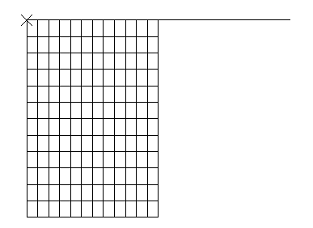

**Figure 1.3.1–2** Abaqus/Standard: Deformed configuration at 44% upset (original mesh).

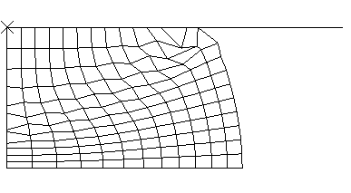

**Figure 1.3.1–3** Abaqus/Standard: New mesh at 44% upset.

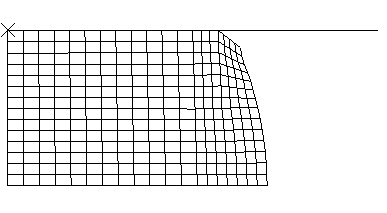

**Figure 1.3.1–4** Abaqus/Explicit: Deformed configuration at 44% upset (CAX4R elements).

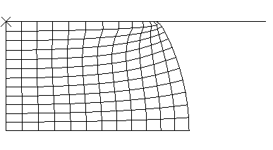

**Figure 1.3.1–5** Abaqus/Standard: New mesh at 60% upset.

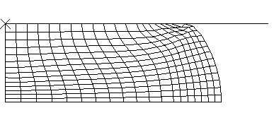

**Figure 1.3.1–6** Abaqus/Explicit: Deformed mesh at 60% upset (CAX4R elements).

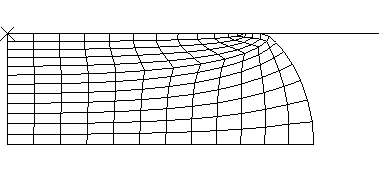

**Figure 1.3.1–7** Abaqus/Standard: Plastic strain of new mesh at 60% upset.

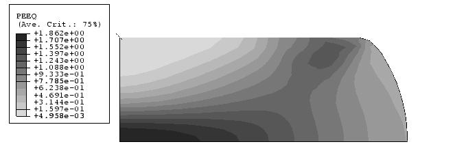

**Figure 1.3.1–8** Abaqus/Explicit: Plastic strain at 60% upset (CAX4R elements).

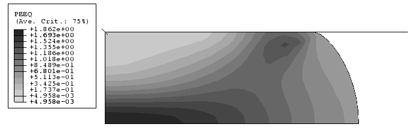

**Figure 1.3.1–9** Force-deflection response for cylinder upsetting. 

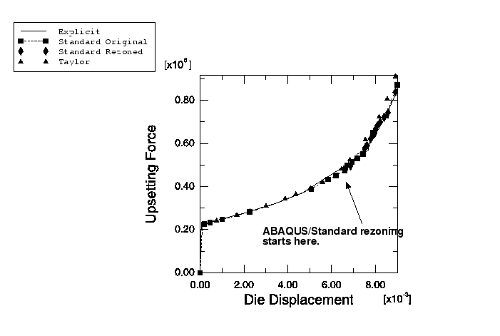

**Figure 1.3.1–10** Force-deflection response for cylinder upsetting. Comparison of Abaqus/Explicit hourglass controls.

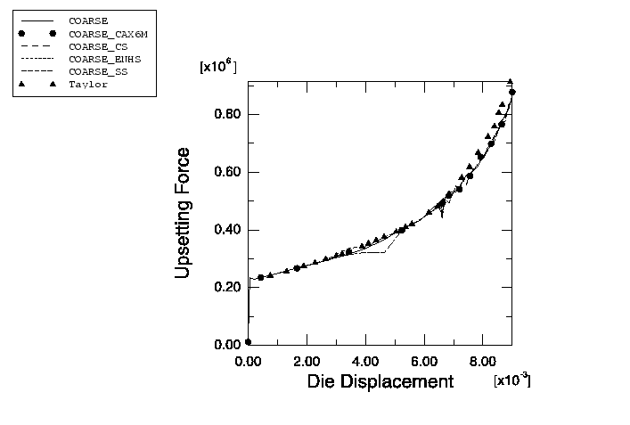

